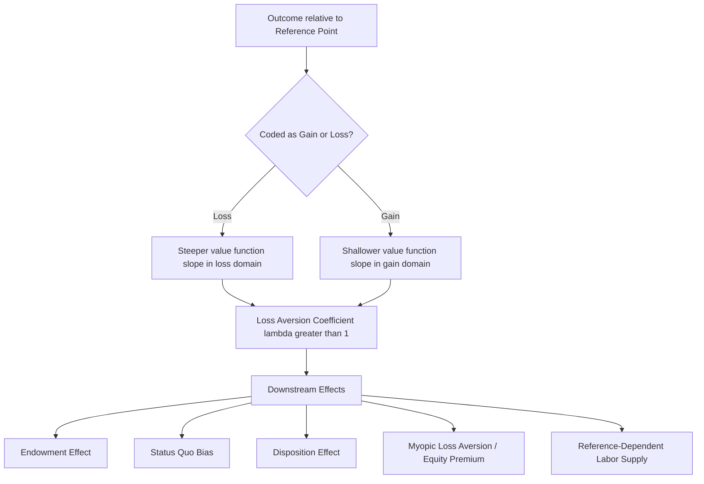

## Loss Aversion

### Definition and Relationship to Prospect Theory

Loss aversion is the empirical and theoretical principle that losses are psychologically more impactful than equivalently sized gains — that the pain of losing a given amount exceeds the pleasure of gaining the same amount. While loss aversion is one of three defining structural properties of the prospect theory value function (covered in the preceding topic, alongside diminishing sensitivity and reference dependence), it merits dedicated treatment because it has become, independently of the full prospect theory apparatus, the single most widely cited, applied, and — increasingly — most contested individual construct in behavioral economics. This entry treats loss aversion as a standalone phenomenon: its formal definition, its empirical measurement, its behavioral and economic downstream consequences, and the significant recent scholarly debate over its robustness and even its basic conceptual coherence.

### Formal Definition

Loss aversion, in its most general form, is defined as the property that the value function $v(\cdot)$ is steeper in the domain of losses than in the domain of gains around a reference point:

$$|v(-x)| > v(x) \quad \text{for all } x > 0$$

The most common point-estimate operationalization uses the ratio of the value function's slopes (or, in simplified linear form, simply the ratio of loss-domain to gain-domain sensitivity) at the reference point, denoted $\lambda$:

$$\lambda = \frac{-v(-x)}{v(x)}\Bigg|_{x \to 0^+}$$

Kahneman and Tversky's canonical 1992 estimate placed the median value at $\lambda \approx 2.25$, though — as discussed extensively below — this specific figure has been subject to considerable subsequent scrutiny and revision.

### The Original Demonstrations

**Kahneman and Tversky's initial evidence (1979, 1984).** The original prospect theory paper documented loss aversion primarily through simple gamble-choice patterns: for instance, most people reject a 50/50 gamble to win $150 or lose $100, even though its expected value is positive (+$25), because the subjective disutility of the potential $100 loss outweighs the subjective utility of the potential $150 gain — this specific gamble structure (a roughly 1.5:1 to 2:1 required win-to-loss ratio for gamble acceptance) became one of the standard experimental paradigms for eliciting an individual's implied loss aversion coefficient.

**The coffee mug endowment effect experiments (Kahneman, Knetsch, and Thaler, 1990).** In one of the most widely replicated behavioral economics experiments, participants were randomly given either a coffee mug (the "sellers") or nothing (the "buyers, and separately, "choosers"). Sellers, who now had the mug incorporated into their reference point, demanded a median selling price roughly twice as high as the median price buyers were willing to pay for an identical mug — a gap directly attributed to loss aversion, since sellers evaluated parting with the mug as a loss (weighted heavily by $\lambda$) while buyers evaluated acquiring it as a gain (weighted at baseline). A third group, "choosers," who were asked to choose between receiving the mug or an equivalent cash amount (without first owning the mug, so no loss framing applied), gave valuations much closer to the buyers' than the sellers', supporting the interpretation that the gap was driven by ownership/reference-point status rather than simply a difference in how the mug's value was framed in the question.

### Downstream Behavioral and Economic Applications

**The endowment effect**, covered more fully as a related topic, is the direct behavioral consequence of loss aversion combined with reference-point shifts following acquisition or ownership.

**Status quo bias**: because any change from a default or current state involves a loss component (what is relinquished) evaluated more heavily than the corresponding gain component (what is received), loss aversion predicts a systematic tilt toward maintaining defaults, extensively exploited (for prosocial ends, in the standard framing) in default-option nudge design, such as opt-out organ donation registries and automatic retirement-savings enrollment.

**The disposition effect** in investing (selling winners too early, holding losers too long) is a direct behavioral finance application, since realizing a loss requires "closing the mental account" at a loss, which loss aversion makes disproportionately painful relative to the pleasure of realizing an equivalent gain.

**Myopic loss aversion and the equity premium puzzle.** Richard Thaler, Amos Tversky, Kahneman, and Alan Schwartz (1997) proposed that the combination of loss aversion with frequent portfolio evaluation ("myopia," i.e., checking investment performance often) can explain why investors demand an equity risk premium substantially larger than standard risk-aversion-only models predict: frequent evaluation increases the likelihood of observing a short-term loss (even within a long-term winning position), and each observed short-term loss is disproportionately painful under loss aversion, making equities appear less attractive than a purely long-horizon, infrequent-evaluation investor would find them. This "myopic loss aversion" mechanism has been influential in explaining the equity premium puzzle (the empirical finding that historical stock returns have substantially exceeded bond returns by more than standard models calibrated to reasonable risk-aversion parameters predict) and has motivated applied recommendations (e.g., reducing the frequency of retirement account statement checking) in the retirement-savings behavioral finance literature.

**Labor supply and reference-dependent effort.** Colin Camerer, Linda Babcock, George Loewenstein, and Richard Thaler's (1997) study of New York City taxi drivers found evidence consistent with drivers setting a daily income reference target and working shorter hours on high-wage days (quickly hitting the target) and longer hours on low-wage days (working to avoid falling short of the target) — the opposite of the standard labor-supply prediction that higher hourly wages should induce more hours worked (via the substitution effect dominating in a simple model), interpreted as loss-averse behavior relative to a daily income reference point. This finding has itself been subject to methodological reanalysis and debate in subsequent labor economics literature regarding the robustness of the specific empirical pattern and alternative explanations. [Inference: the taxi-driver labor-supply literature specifically has an active methodological debate, and readers encountering this example should be aware the empirical robustness of the original finding has been contested in later re-examinations]

**Negotiation and concession behavior.** Loss aversion has been applied to explain why negotiators are often more resistant to making concessions once an offer has been anchored as part of their expected outcome (reference point), since retracting from an anchored position is coded as a loss, and why negotiations can stall when both parties perceive concessions as losses relative to their respective reference points, a dynamic sometimes termed "reactive devaluation" in the negotiation literature though the two concepts are analytically distinct.

**Marketing, pricing, and consumer behavior.** Loss aversion underlies widely used applied pricing and messaging strategies, including framing price increases as "losing a discount" rather than framing the base price as a gain, structuring rebates and cash-back offers as separate line items (gains, valued via the concave/diminishing-sensitivity portion of the value function) versus bundling fees into a single charge (to avoid separately salient losses), and free-trial-then-cancel subscription models that rely on the endowment effect and loss aversion to reduce cancellation rates once a service is "owned."

### Measurement Methods

**Direct gamble-choice elicitation.** The most common laboratory method presents subjects with a series of mixed gambles (a possible gain paired with a possible loss, each at stated probabilities, typically 50/50) and identifies the smallest gain-to-loss ratio at which the subject is willing to accept the gamble, which is then used to back out an implied $\lambda$.

**Willingness-to-pay/willingness-to-accept (WTP-WTA) gap elicitation.** Following the Kahneman-Knetsch-Thaler mug paradigm, the ratio of a seller's minimum acceptable price to a buyer's maximum willingness to pay for an identical good is used as an alternative behavioral proxy for loss aversion, though this measure conflates loss aversion with other potential contributing factors (e.g., strategic misrepresentation in stated valuations, or genuinely different reference-point-independent preferences) and is generally considered a noisier measure than direct gamble-based elicitation.

**Field and market-based estimation.** Later studies have attempted to estimate implied loss aversion coefficients from naturally occurring field data — including professional golfers' putting performance (studied by Devin Pope and Maurice Schweitzer, 2011, finding that golfers putt more accurately for par, avoiding a "loss" relative to par, than for birdie, an equivalent-distance putt for a "gain" relative to par), housing market list-price and selling-price behavior relative to purchase price (studied by David Genesove and Christopher Mayer, finding sellers reluctant to sell below their original purchase price, i.e., realize a nominal loss), and labor supply patterns (the taxi driver studies above) — with the general finding that field-derived loss aversion estimates are often smaller in magnitude, and considerably more context-dependent, than the canonical laboratory-derived $\lambda \approx 2.25$.

### The Contemporary Debate Over Loss Aversion's Robustness

**Meta-analytic heterogeneity.** Large-scale meta-analyses and systematic replication efforts conducted in the 2010s and 2020s (including work associated with the broader replication-crisis reassessment of behavioral economics findings) have found substantial heterogeneity in estimated $\lambda$ values across studies, populations, elicitation methods, and stakes — with a meaningful subset of studies finding $\lambda$ not reliably different from 1 (i.e., no detectable loss aversion) under certain conditions, particularly for very small stakes, for some non-monetary domains, or under specific elicitation formats designed to minimize procedural artifacts.

**The "loss aversion is not a robust phenomenon" critique.** A notable and influential 2018 paper by David Gal and Derek Rucker, titled provocatively, argued more fundamentally that the empirical evidence for loss aversion as a *general, domain-independent* psychological principle is considerably weaker and more mixed than its ubiquity in applied behavioral economics discourse would suggest, pointing to numerous studies finding null or reversed loss/gain asymmetries under specific conditions (e.g., some studies of the endowment effect specifically fail to replicate reliably, or find it substantially attenuated, outside the original mug-style paradigm) [Unverified: the Gal and Rucker position itself remains actively contested within the field rather than settled]. This critique prompted a substantial published response and rebuttal literature (including responses from Kahneman, Tversky's collaborators, and other behavioral economists) defending the overall robustness of loss aversion as a real, if context-and-magnitude-variable, phenomenon, while generally conceding that the specific numeric calibration ($\lambda \approx 2.25$) has been overextended as a universal constant in applied contexts where it was never rigorously validated.

**Current consensus state [Inference/Unverified nuance]**: As of the most recent literature available, the debate is not fully resolved, but a reasonable characterization of the emerging consensus is that the qualitative core of loss aversion (losses tend, on average and across most but not all contexts, to be weighted more heavily than equivalent gains) remains broadly supported, while the specific universal numeric coefficient, and the claim that loss aversion is a context-independent, always-present feature of human valuation, are now treated with substantially more caution than in earlier decades of applied behavioral economics writing and popular science communication.

### Distinguishing Loss Aversion from Related Constructs

- **Loss aversion vs. risk aversion**: Risk aversion (standard EUT concept) concerns a dislike of variance/uncertainty in outcomes generally; loss aversion concerns an asymmetry specifically between losses and gains relative to a reference point, and can coexist with risk-*seeking* behavior in the loss domain (as prospect theory's convex loss-domain value function predicts) — the two are conceptually and empirically distinct, though frequently conflated in informal discussion.
- **Loss aversion vs. the endowment effect**: The endowment effect is a specific behavioral *pattern* (WTA exceeding WTP for an owned good); loss aversion is the proposed underlying *psychological mechanism* for that pattern (among other patterns). Not all endowment-effect-like findings are necessarily best explained by loss aversion specifically, and alternative explanations (e.g., ownership-induced attachment, strategic bargaining behavior) have also been proposed in specific contexts.
- **Loss aversion vs. negativity bias**: Negativity bias, a broader construct from social and cognitive psychology, refers to the general tendency for negative information, events, or stimuli to have a greater psychological impact than positive ones across a wide range of judgment domains (not limited to monetary gains/losses relative to a reference point); loss aversion is sometimes framed as a specific economic-decision-making instance of this broader psychological tendency, though the two literatures developed largely independently.

### Illustrative Example

**Example**: A retailer testing two equivalent promotional structures — Promotion A frames a $5 checkout fee as standard pricing with no discount, while Promotion B frames the identical net price as a "$5 loyalty discount" that customers forfeit if they don't meet a minimum purchase threshold — finds that Promotion B produces measurably higher purchase completion rates at the threshold, consistent with loss aversion: framing the $5 as an already-anchored, about-to-be-lost discount (a loss if forfeited) generates stronger behavioral pull than framing the identical dollar amount as a simple fee (never coded as a loss relative to any prior reference point) or a standard gain-framed discount offer.

### Process Diagram

### Conceptual Diagram: Gain-Loss Asymmetry (svg_diagram)

<svg xmlns="http://www.w3.org/2000/svg" viewBox="0 0 700 320">
<text x="350" y="28" text-anchor="middle" font-size="17" font-weight="bold" fill="#1a1a1a">Loss Aversion: Equal Magnitude, Unequal Impact (svg_diagram)</text>
<line x1="80" y1="270" x2="620" y2="270" stroke="#333" stroke-width="2" />
<text x="350" y="300" text-anchor="middle" font-size="13" fill="#333">Magnitude of $100 change</text>
<text x="35" y="150" text-anchor="middle" font-size="13" fill="#333" transform="rotate(-90 35 150)">Psychological impact</text>
<rect x="180" y="190" width="100" height="80" fill="#38a169" />
<text x="230" y="180" text-anchor="middle" font-size="12" fill="#38a169">+$100 Gain</text>
<text x="230" y="285" text-anchor="middle" font-size="11" fill="#333">Value: +1 unit</text>
<rect x="420" y="90" width="100" height="180" fill="#c53030" />
<text x="470" y="80" text-anchor="middle" font-size="12" fill="#c53030">-$100 Loss</text>
<text x="470" y="285" text-anchor="middle" font-size="11" fill="#333">Value: -2.25 units</text>
<line x1="280" y1="230" x2="420" y2="180" stroke="#805ad5" stroke-width="1.5" stroke-dasharray="6,3" />
<text x="350" y="170" text-anchor="middle" font-size="11" fill="#805ad5" font-style="italic">lambda ratio</text>
</svg>

**Next Steps**

- The endowment effect: full experimental literature and boundary conditions
- Status quo bias and default-option nudge design
- Myopic loss aversion and the equity premium puzzle
- The disposition effect in investor trading behavior
- Reference point formation and expectations-based reference dependence (Kőszegi-Rabin)
- Replication-crisis reassessment of canonical behavioral economics findings
- Negativity bias in broader cognitive and social psychology
- Applied loss-aversion-based pricing and choice-architecture strategies