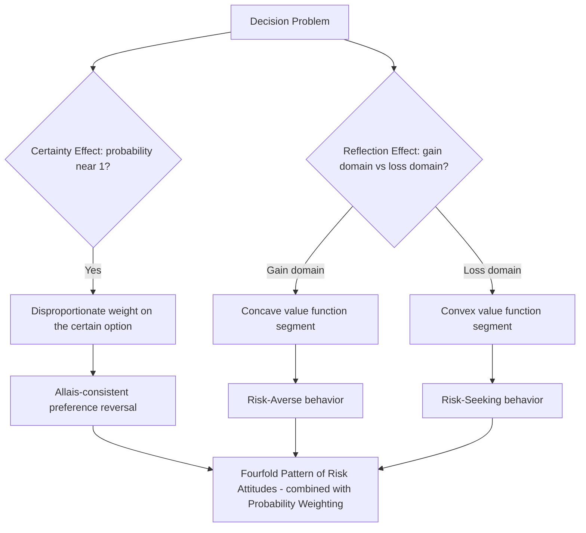

## The Certainty Effect and the Reflection Effect

### Two Related but Distinct Empirical Regularities

The certainty effect and the reflection effect are two of the core empirical phenomena that Daniel Kahneman and Amos Tversky identified in their 1979 prospect theory paper as direct violations of expected utility theory, and both were central to motivating specific structural features of the theory — the certainty effect primarily motivating the probability weighting function's shape, and the reflection effect primarily motivating the value function's gain/loss asymmetric curvature. While both were introduced together in the original paper and are frequently discussed side by side, they describe conceptually distinct patterns: the certainty effect concerns the disproportionate psychological weight of *certainty itself* as a probability level, while the reflection effect concerns the *mirroring* of risk attitudes when a decision problem is transformed from the gain domain to the structurally identical loss domain.

### The Certainty Effect

**Definition.** The certainty effect refers to the finding that people give disproportionate weight to outcomes that are certain (probability exactly 1) relative to outcomes that are merely probable, even when the probability of the merely-probable outcome is very high (e.g., 0.99 or 0.90). This is not simply a matter of risk aversion in the standard EUT sense (which would predict a smooth, continuous increase in the "value" of additional probability as it approaches certainty) — the certainty effect specifically describes a discontinuous, disproportionate jump in subjective weight attached to reaching the p=1 endpoint itself.

**Original demonstration.** As covered in the dedicated Allais paradox topic, the classic demonstration is the common consequence effect: most people prefer a certain $1 million (Option A) over a gamble offering a 10% chance of $5 million, an 89% chance of $1 million, and a 1% chance of $0 (Option B), while simultaneously preferring a 10% chance of $5 million (Option D) over an 11% chance of $1 million (Option C) — even though the second pair is constructed so that consistent expected-utility-maximizing preferences require choosing consistently across both pairs (either A-and-C or B-and-D). The specific psychological driver Kahneman and Tversky identified is that removing the 1% chance of $0 from Option A (converting a certain outcome into a merely 99%-probable one) produces a disproportionately large reduction in the option's attractiveness — far larger than the effect of an equivalent 1-percentage-point probability change occurring elsewhere on the probability scale (as in the Choice 2 comparison, where neither option offers certainty).

**Formal connection to the probability weighting function.** The certainty effect is the direct behavioral signature of the probability weighting function's characteristic underweighting of high probabilities and its especially steep local behavior immediately below $p=1$ (covered in the preceding topic on probability weighting). Formally, if $w(\cdot)$ denotes the weighting function, the certainty effect implies that the "jump" in decision weight from $w(0.99)$ to $w(1) = 1$ is disproportionately large relative to the jump from, say, $w(0.30)$ to $w(0.31)$ — even though both represent an identical 1-percentage-point change in the underlying objective probability.

**Applied relevance.** The certainty effect is invoked to explain a range of applied phenomena, including the strong consumer preference for products or warranties offering guaranteed outcomes over probabilistically superior but uncertain alternatives (e.g., an extended warranty offering full, certain repair coverage versus a self-insurance strategy with a higher expected value but residual risk), litigation settlement preferences (a certain settlement amount disproportionately preferred over a probabilistically larger but uncertain expected trial outcome), and medical decision-making around treatments offering a guaranteed, modest benefit versus a probabilistic chance of a larger benefit.

### The Reflection Effect

**Definition.** The reflection effect describes the finding that risk attitudes reverse ("reflect") when a decision problem is transformed from the gain domain into the structurally identical loss domain (i.e., multiplying all outcomes in a prospect by $-1$). Specifically: where people are typically risk-averse when choosing among prospects involving only gains, the same people typically become risk-seeking when the identical prospect (in probability structure) involves only losses of the same magnitudes.

**Original demonstration.** Kahneman and Tversky's original 1979 paper presented paired problems such as:

*Gain-domain choice*: (A) $3,000 for certain, vs. (B) 80% chance of $4,000, 20% chance of $0. The majority preference is A (the certain, smaller gain) — risk-averse behavior.

*Loss-domain choice (the mirror-image "reflection")*: (A′) −$3,000 for certain (a certain loss), vs. (B′) 80% chance of −$4,000, 20% chance of $0 (a probable larger loss). The majority preference reverses to B′ (the probable, larger loss over the certain, smaller loss) — risk-seeking behavior, even though the objective probability structure and payoff magnitudes are identical to the gain-domain problem, merely negated in sign.

**Formal connection to the value function.** The reflection effect is the direct behavioral signature of the value function's S-shape: concavity in the gain domain (producing standard risk-averse behavior, consistent with a diminishing-marginal-value intuition for gains) paired with convexity in the loss domain (producing risk-seeking behavior, reflecting a diminishing-marginal-*disutility* pattern for losses — the difference in pain between losing $3,000 and losing $4,000 feels smaller than the difference in pain between losing $0 and losing $1,000). This is the same curvature property discussed in the dedicated value-function topic, here framed specifically in terms of its behavioral signature across paired gain/loss decision problems rather than as an abstract functional-form property.

**Distinguishing reflection effect from loss aversion.** It is important to note that the reflection effect and loss aversion are two analytically separate properties of the value function, sometimes conflated in informal discussion. Loss aversion concerns the *relative steepness* of the value function comparing a loss to an equivalent-magnitude gain (the $\lambda$ parameter, i.e., how much *worse* a $100 loss feels compared to how *good* a $100 gain feels). The reflection effect concerns the *change in curvature direction* (concave versus convex) between the gain and loss domains, which governs risk attitude (risk-averse versus risk-seeking) *within* each domain, independent of the relative overall magnitude comparison between the domains. A value function could in principle exhibit reflection (opposite curvature signs) without exhibiting loss aversion (a steeper loss slope), and vice versa, though empirically the two properties are estimated jointly and both are incorporated into the standard prospect theory functional form.

### Interaction with the Probability Weighting Function: Completing the Fourfold Pattern

While the reflection effect, taken in isolation and applied to moderate-to-high probability gambles (as in the $3,000/$4,000 example above), produces the risk-averse-for-gains/risk-seeking-for-losses pattern, this is only two of the four cells of the fourfold pattern of risk attitudes covered in the preceding topic. The remaining two cells (risk-seeking for small-probability gains, e.g., lottery tickets; risk-averse for small-probability losses, e.g., insurance) require incorporating the probability weighting function's overweighting of small probabilities, which can override the value-function-driven baseline risk attitude at low probability levels. This is a key nuance: the reflection effect, as originally and narrowly demonstrated, holds robustly for moderate-to-high-probability gambles, but the full fourfold pattern (including its low-probability cells) requires the additional, separate contribution of the probability weighting function — the reflection effect alone does not fully characterize prospect theory's risk-attitude predictions across the entire probability range.

### Relationship to the Allais Paradox

Both effects covered in this topic are directly implicated in explaining the Allais paradox: the certainty effect explains the specific common-consequence version of the paradox (the $1 million certain versus $5 million probable example), while the reflection effect, though not itself the direct explanation of the original Allais paradox (which is framed entirely in the gain domain), is often discussed as part of the same broader family of prospect-theory-motivating anomalies uncovered in Kahneman and Tversky's early experimental program, since both reveal systematic, non-EUT-consistent asymmetries tied to how probability and outcome sign interact with subjective risk attitude.

### Domains of Application

**Litigation and settlement negotiation.** The joint operation of the certainty effect (favoring certain settlements) and the reflection effect (risk-seeking when facing a probable loss, e.g., as a defendant facing likely liability) helps explain asymmetric settlement behavior: plaintiffs, evaluating their claim as a potential *gain*, tend to be risk-averse and more willing to accept a smaller certain settlement; defendants, evaluating the same claim as a potential *loss*, tend to be risk-seeking and more willing to gamble on a trial outcome rather than accept a certain settlement payment — a pattern that has been used to explain observed asymmetries in settlement negotiation dynamics and has informed applied law-and-economics analysis of litigation behavior.

**Medical treatment decision framing.** The reflection effect underlies well-documented findings (extending the Asian disease problem paradigm) that patients and physicians respond differently to identical treatment statistics depending on whether outcomes are framed as survival rates (gain-domain framing, tending to produce risk-averse, "safer" treatment preference) or mortality rates (loss-domain framing, tending to produce risk-seeking, more aggressive treatment preference), with direct relevance to informed-consent communication design and medical decision-aid construction.

**Corporate risk-taking under financial distress.** The reflection effect has been invoked to help explain the empirical finding that firms facing likely financial losses or near-bankruptcy conditions sometimes exhibit increased risk-seeking behavior (e.g., pursuing higher-variance strategic bets) relative to financially healthy firms facing comparable-magnitude potential gains, consistent with loss-domain risk-seeking, though corporate risk-taking under distress also has substantial alternative explanations rooted in agency theory and option-like payoff structures for equity holders (e.g., the standard corporate finance "asset substitution" or "risk-shifting" explanation), and the relative contribution of behavioral (reflection-effect) versus purely rational-agency-based explanations in this specific domain remains an area of ongoing empirical and theoretical discussion. [Inference: distinguishing behavioral reflection-effect-driven risk-shifting from standard option-theoretic equity-holder risk-shifting in actual corporate distress data is empirically difficult, and the literature does not offer a fully settled apportionment between the two mechanisms]

### Illustrative Example

**Example**: A sales manager structures two equivalent year-end bonus communications for two team members with identical actual performance and identical objective bonus-determination probabilities. To Employee X, the bonus is framed as: "You have a 90% chance of receiving your full $10,000 bonus, and a 10% chance of receiving $6,000" (a gain-domain, high-probability framing). To Employee Y, the identical arrangement is framed as: "You will receive your full $10,000 bonus, unless a rare compliance issue arises (10% chance), in which case $4,000 will be deducted" (technically identical expected payout structure, but framed with a salient possible deduction/loss). Consistent with the certainty effect and reflection effect, Employee X (facing a straightforward high-probability-of-gain framing) is predicted to evaluate the arrangement relatively favorably and calmly (risk-averse, valuing the high-probability good outcome), while Employee Y (facing a framing emphasizing a possible loss/deduction from an anchored $10,000 reference point) is predicted to react with disproportionate anxiety or resistance, even though — if the underlying numbers are constructed to be expected-value-equivalent — a purely EUT-rational agent should evaluate both communications identically.

### Process Diagram

### Conceptual Diagram: The Reflection Effect (svg_diagram)

<svg xmlns="http://www.w3.org/2000/svg" viewBox="0 0 700 340">
<text x="350" y="28" text-anchor="middle" font-size="17" font-weight="bold" fill="#1a1a1a">The Reflection Effect: Mirrored Risk Attitudes (svg_diagram)</text>
<rect x="60" y="60" width="280" height="110" fill="#edf2f7" stroke="#333" />
<text x="200" y="85" text-anchor="middle" font-size="13" font-weight="bold" fill="#333">Gain Domain</text>
<text x="200" y="110" text-anchor="middle" font-size="12" fill="#333">$3,000 certain</text>
<text x="200" y="130" text-anchor="middle" font-size="12" fill="#333">vs 80% chance of $4,000</text>
<text x="200" y="155" text-anchor="middle" font-size="13" fill="#2b6cb0" font-weight="bold">Majority: Risk-Averse (choose certain)</text>
<rect x="360" y="60" width="280" height="110" fill="#fff5f5" stroke="#333" />
<text x="500" y="85" text-anchor="middle" font-size="13" font-weight="bold" fill="#333">Loss Domain (mirrored)</text>
<text x="500" y="110" text-anchor="middle" font-size="12" fill="#333">-$3,000 certain</text>
<text x="500" y="130" text-anchor="middle" font-size="12" fill="#333">vs 80% chance of -$4,000</text>
<text x="500" y="155" text-anchor="middle" font-size="13" fill="#c53030" font-weight="bold">Majority: Risk-Seeking (choose gamble)</text>
<line x1="200" y1="170" x2="200" y2="230" stroke="#333" stroke-dasharray="3,3" />
<line x1="500" y1="170" x2="500" y2="230" stroke="#333" stroke-dasharray="3,3" />
<line x1="200" y1="230" x2="500" y2="230" stroke="#805ad5" stroke-width="2" />
<text x="350" y="255" text-anchor="middle" font-size="12" fill="#805ad5" font-style="italic">Identical structure, sign reversed - risk attitude reflects</text>
</svg>

**Next Steps**

- The Allais paradox as the original empirical source of the certainty effect
- The probability weighting function's full curvature specification
- The fourfold pattern of risk attitudes, integrating both effects with low-probability behavior
- Framing effects and the Asian disease problem
- Applications to litigation and settlement negotiation asymmetries
- Medical decision framing: survival versus mortality statistics
- Corporate risk-shifting under financial distress: behavioral versus agency-theoretic explanations
- Cumulative prospect theory's rank-dependent resolution of dominance violations