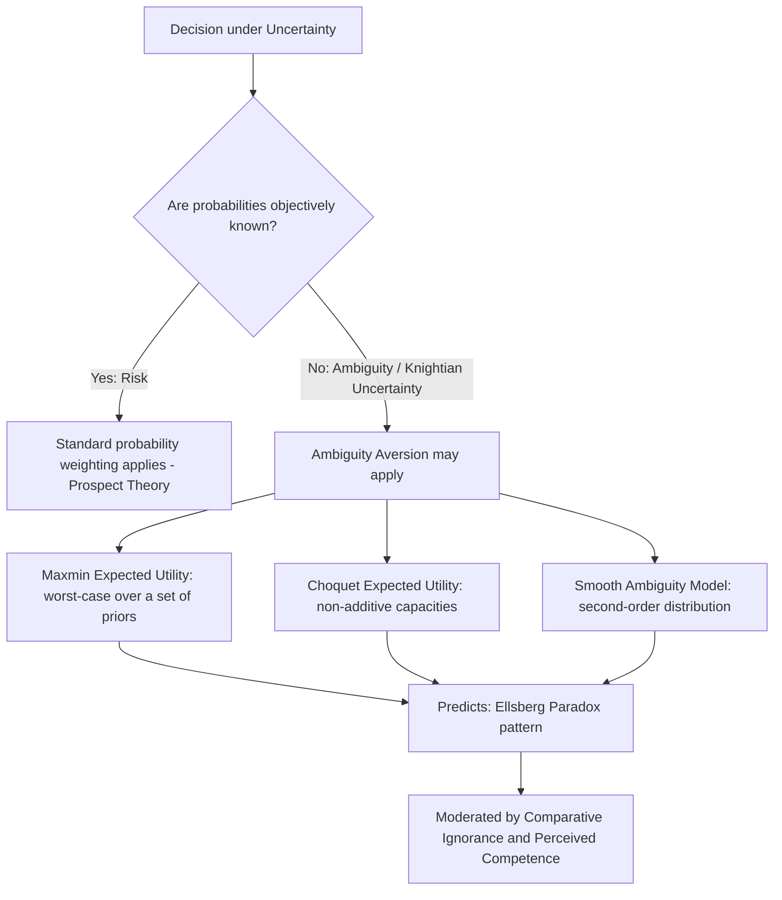

## Ambiguity Aversion

### Definition and Theoretical Placement

Ambiguity aversion is the systematic preference for options with known, precisely specified probabilities (risk) over options with equally favorable-in-expectation but unknown, vague, or imprecisely specified probabilities (ambiguity or "Knightian uncertainty"). It is distinguished conceptually from ordinary risk aversion — which concerns a dislike of *variance* in outcomes even when probabilities are fully known — by concerning instead a dislike of *not knowing the probabilities themselves*. Ambiguity aversion is the direct behavioral phenomenon demonstrated by the Ellsberg paradox (covered in an earlier topic in this chapter), and this entry extends that foundational discussion into the broader theoretical, empirical, and applied literature that has developed around ambiguity as a distinct dimension of decision-making under uncertainty.

### The Knight Distinction: Risk versus Uncertainty

The conceptual foundation for treating ambiguity as analytically distinct from risk predates Ellsberg's experimental demonstration by several decades, originating in economist Frank Knight's 1921 book *Risk, Uncertainty, and Profit*. Knight distinguished **risk** (situations where the probability distribution over outcomes is objectively known or can be reliably estimated, e.g., from a known physical process or large historical sample) from **uncertainty** (situations where no such reliable objective probability distribution exists or can be meaningfully estimated, often termed "Knightian uncertainty" in his honor). Knight argued that this distinction was economically consequential — for instance, in his account, genuine entrepreneurial profit arises specifically from bearing Knightian uncertainty, which cannot be diversified away or insured against in the way ordinary insurable risk can. Ellsberg's later experimental work operationalized this centuries-old philosophical distinction into testable behavioral predictions and, crucially, demonstrated that human decision-makers treat the two categories differently in ways inconsistent with any single subjective-probability-based theory of choice.

### Distinguishing Ambiguity Aversion from Risk Aversion: A Formal Contrast

Consider two decision-makers each facing a choice to bet on drawing a red ball from an urn. Decision-maker 1 faces an urn with a known composition of exactly 50 red and 50 black balls (risk: known probability 0.5). Decision-maker 2 faces an urn with an unknown composition of red and black balls, summing to 100, with no further information (ambiguity: probability could range anywhere from 0 to 1, though a natural symmetry argument might suggest an expected/average probability of 0.5 across a uniform prior over possible compositions). A standard subjective expected utility (SEU) agent, per Savage's axioms, should be indifferent between betting on red in either urn, provided their point-estimate subjective probability for red in the ambiguous urn is also 0.5. Empirically, however, the large majority of people prefer betting on the known 50/50 urn over the ambiguous urn — precisely the pattern the Ellsberg paradox demonstrates cannot be reconciled with any single well-defined subjective probability for the ambiguous urn, and which distinguishes ambiguity aversion from risk aversion: both urns share the same mean/expected probability of red, so a difference in preference cannot be explained by risk aversion over outcome variance alone (since the objective variance structure, given a symmetric 50/50 prior over ambiguous compositions, is comparable), but must instead reflect an independent aversion to the ambiguity/imprecision itself.

### Formal Models of Ambiguity-Averse Preferences

**Maxmin expected utility (Gilboa and Schmeidler, 1989).** The most influential formal model represents an ambiguity-averse decision-maker as holding not a single subjective probability distribution but a *set* of plausible probability distributions $\mathcal{P}$ (reflecting genuine uncertainty about which distribution is correct), and evaluating each available action according to its worst-case expected utility across that entire set:

$$V(f) = \min_{p \in \mathcal{P}} \mathbb{E}_p[u(f)]$$

where $f$ denotes an act (a mapping from states of the world to outcomes) and $\mathcal{P}$ is the decision-maker's set of plausible priors. This formalizes a cautious, worst-case-focused decision rule and directly rationalizes Ellsberg-paradox-consistent choice patterns, since betting on the known urn eliminates the min-over-a-set operation (there being only one plausible distribution), while betting on the ambiguous urn is evaluated at its pessimistic worst-case probability, making it comparatively less attractive.

**Choquet expected utility (Schmeidler, 1989).** A related, earlier formal framework generalizes the additive probability measure of standard SEU to a **non-additive** measure (a "capacity"), where the probabilities assigned to complementary events need not sum to exactly 1, and evaluates prospects using the Choquet integral rather than the standard expectation operator. This provides an alternative mathematical route to representing systematic ambiguity-sensitive preferences without requiring the explicit "set of distributions" apparatus of the maxmin model.

**Smooth ambiguity model (Klibanoff, Marinacci, and Mukerji, 2005).** A later refinement addresses a criticized feature of the maxmin model — its extreme, "kinked" focus exclusively on the single worst-case distribution, which can produce discontinuous or excessively conservative behavioral predictions. The smooth ambiguity model instead represents the decision-maker as holding a second-order probability distribution *over* the set of plausible first-order probability distributions, and applies a separate concave function to aggregate expected utility across this second-order distribution — allowing for a continuously varying, calibratable *degree* of ambiguity aversion (analogous to how a standard concave utility function allows for a calibratable degree of risk aversion) rather than the maxmin model's uniform worst-case focus.

**Variational preferences and multiplier preferences.** Additional formal generalizations (e.g., Maccheroni, Marinacci, and Rustichini's variational preferences; Hansen and Sargent's robust-control-theoretic multiplier preferences, influential particularly in macroeconomics) provide further alternative axiomatizations of ambiguity-sensitive choice, each making different tradeoffs between generality, tractability, and psychological interpretability; these are generally covered in more advanced decision-theory treatments beyond the introductory behavioral economics level but are worth noting as an active area of continued theoretical development.

### Empirical Extensions Beyond the Original Ellsberg Urns

**Comparative ignorance and the role of expertise.** Craig Fox and Amos Tversky (1995) demonstrated that ambiguity aversion is substantially attenuated, or can even disappear, when a decision-maker evaluates the ambiguous option *in isolation* rather than in direct side-by-side comparison with an unambiguous alternative — termed the "comparative ignorance hypothesis." This suggests ambiguity aversion may be driven less by an intrinsic dislike of ambiguity per se and more by a comparative, self-presentational concern about appearing (to oneself or others) less informed or less competent than an implicit comparison standard, a finding with significant implications for how ambiguity aversion is measured and interpreted.

**Source-dependence and competence effects.** Related work by Heath and Tversky (1991) found that ambiguity aversion is not uniform across all sources of uncertainty — people can exhibit ambiguity *seeking* rather than ambiguity aversion in domains where they perceive themselves to have relevant competence or knowledge (e.g., preferring to bet on an ambiguous event within one's area of expertise over a matched-probability chance device), suggesting that perceived self-competence relative to the ambiguous domain moderates or even reverses the standard Ellsberg-consistent pattern.

**Gain versus loss domain differences.** Some experimental work has found that ambiguity aversion is more pronounced and consistent for gains than for losses, with some studies finding ambiguity-*seeking* behavior in the loss domain (a pattern sometimes loosely analogized to the reflection effect in prospect theory, though the two phenomena arise from formally distinct theoretical mechanisms — probability weighting under known risk versus preference over sets/uncertainty about the probability itself).

### Domains of Application

**Insurance markets and catastrophe risk.** Ambiguity aversion has been used to explain empirical patterns in insurance markets that are difficult to reconcile with standard expected-utility-based pricing models, including insurers themselves charging higher premiums for risks with poorly characterized or ambiguous loss distributions (e.g., novel or emerging catastrophic risks such as certain forms of cyber risk or newly identified environmental hazards) relative to equally-expected-value risks with well-established, precisely estimated loss distributions, and consumer demand patterns showing disproportionate willingness to pay for coverage against ambiguous, poorly understood hazards.

**Asset pricing anomalies.** Ambiguity aversion has been proposed as a contributing factor in explaining several persistent asset-pricing puzzles, including the equity premium puzzle (extending beyond the myopic-loss-aversion explanation covered in the loss aversion topic, ambiguity about the true underlying distribution of stock returns may independently contribute to the historically large observed risk premium) and home bias in international investment (investors' persistent overweighting of domestic assets, which may reflect not just risk aversion or information costs but a genuine aversion to the comparatively greater ambiguity perceived in less-familiar foreign markets).

**Central banking and monetary policy under model uncertainty.** The robust-control/multiplier-preferences branch of ambiguity theory (Hansen and Sargent) has been directly applied within macroeconomics to model policymakers as making decisions that are robust to genuine uncertainty about which economic model correctly describes the economy, rather than committing to a single point-estimate model — an application with direct relevance to actual central bank policy-design discussions about robustness to model misspecification.

**Venture capital and novel-technology investment.** Ambiguity aversion helps explain a documented tendency for investors to demand a premium, or to simply avoid investment, in genuinely novel technology or business-model categories where historical base rates and reliable probability estimates for success do not yet exist, relative to more established categories with extensive track records, even when point-estimate expected-return assessments might be comparable — a pattern with direct relevance to the persistent difficulty novel, category-defining ventures face in raising early capital relative to ventures pursuing more legible, precedented models.

**Medical decision-making under diagnostic or prognostic uncertainty.** Patients and physicians facing treatment decisions where risk/benefit probabilities are well-established from extensive clinical trial data (unambiguous) versus decisions involving newer treatments or rare conditions with poorly characterized outcome probabilities (ambiguous) exhibit choice patterns consistent with ambiguity aversion, with direct relevance to informed-consent design and to understanding barriers to adoption of novel medical interventions even when point-estimate efficacy appears comparable to established alternatives.

### Distinguishing Ambiguity Aversion from Related Concepts

- **Ambiguity aversion vs. risk aversion**: Risk aversion concerns known-probability outcome variance; ambiguity aversion concerns the imprecision of the probabilities themselves, and the two are empirically and theoretically separable (as demonstrated by the symmetric-urn comparison above).
- **Ambiguity aversion vs. probability weighting (prospect theory)**: Probability weighting (covered in an earlier topic) applies specifically to prospects with known, objective probabilities and describes nonlinear transformation of those known values into decision weights; ambiguity aversion applies to situations where the probabilities are not objectively known at all, requiring a formally distinct modeling apparatus (sets of distributions, non-additive capacities) rather than a single weighting function over a known probability scale.
- **Ambiguity aversion vs. general uncertainty avoidance/anxiety**: While colloquially related to a general psychological discomfort with uncertainty, ambiguity aversion in the formal decision-theoretic sense is a precise, structurally defined property of preferences over specifically constructed choice problems (as in the Ellsberg design), distinguishable from broader personality-level constructs such as intolerance of uncertainty studied in clinical psychology, though the two literatures share conceptual affinities.

### Illustrative Example

**Example**: A pension fund's investment committee is choosing between allocating capital to a well-established asset class with a long, extensively documented historical return distribution (e.g., broad-market domestic equities) versus a genuinely novel asset class with a comparable point-estimate expected return but a much shorter, less reliable historical track record and considerably more disagreement among analysts about its true underlying risk-return distribution (e.g., a newly emerged alternative asset category). Consistent with ambiguity aversion, the committee is predicted to demand a higher expected-return premium, or simply decline to allocate meaningfully, to the novel asset class relative to what a pure risk-based (variance-only) analysis using the point-estimate expected returns would justify — and, per the comparative-ignorance findings of Fox and Tversky, this reluctance is predicted to be substantially more pronounced when the committee evaluates the two asset classes side by side than when evaluating the novel asset class in isolation, which has practical implications for how investment options are sequentially versus simultaneously presented in committee decision processes.

### Process Diagram

### Conceptual Diagram: Risk vs Ambiguity (svg_diagram)

<svg xmlns="http://www.w3.org/2000/svg" viewBox="0 0 700 320">
<text x="350" y="28" text-anchor="middle" font-size="17" font-weight="bold" fill="#1a1a1a">Risk vs Ambiguity: The Knightian Distinction (svg_diagram)</text>
<rect x="60" y="70" width="280" height="180" fill="#edf2f7" stroke="#333" />
<text x="200" y="95" text-anchor="middle" font-size="13" font-weight="bold" fill="#333">Risk</text>
<text x="200" y="120" text-anchor="middle" font-size="12" fill="#333">Known probability distribution</text>
<text x="200" y="140" text-anchor="middle" font-size="12" fill="#333">e.g. 50 red / 50 black balls</text>
<text x="200" y="170" text-anchor="middle" font-size="11" fill="#2b6cb0">Single, well-defined P(red) = 0.5</text>
<text x="200" y="220" text-anchor="middle" font-size="11" fill="#333">Governed by Prospect Theory</text>
<text x="200" y="238" text-anchor="middle" font-size="11" fill="#333">weighting function w(p)</text>
<rect x="360" y="70" width="280" height="180" fill="#fff5f5" stroke="#333" />
<text x="500" y="95" text-anchor="middle" font-size="13" font-weight="bold" fill="#333">Ambiguity</text>
<text x="500" y="120" text-anchor="middle" font-size="12" fill="#333">Unknown proportion, 100 balls</text>
<text x="500" y="140" text-anchor="middle" font-size="12" fill="#333">red + black, split unstated</text>
<text x="500" y="170" text-anchor="middle" font-size="11" fill="#c53030">Set of plausible P(red) values</text>
<text x="500" y="220" text-anchor="middle" font-size="11" fill="#333">Governed by Maxmin / Smooth</text>
<text x="500" y="238" text-anchor="middle" font-size="11" fill="#333">Ambiguity models</text>
</svg>

**Next Steps**

- The Ellsberg paradox: full experimental treatment and joint-choice-pattern analysis
- Maxmin expected utility and Choquet expected utility as formal decision-theoretic frameworks
- The smooth ambiguity model and second-order probability representations
- Comparative ignorance and source-dependence in ambiguity aversion (Fox and Tversky; Heath and Tversky)
- Robust control theory and monetary policy under model uncertainty (Hansen and Sargent)
- Ambiguity aversion in venture capital and novel-technology investment decisions
- Knightian uncertainty and entrepreneurial profit theory
- Home bias and the equity premium puzzle: ambiguity-based contributions