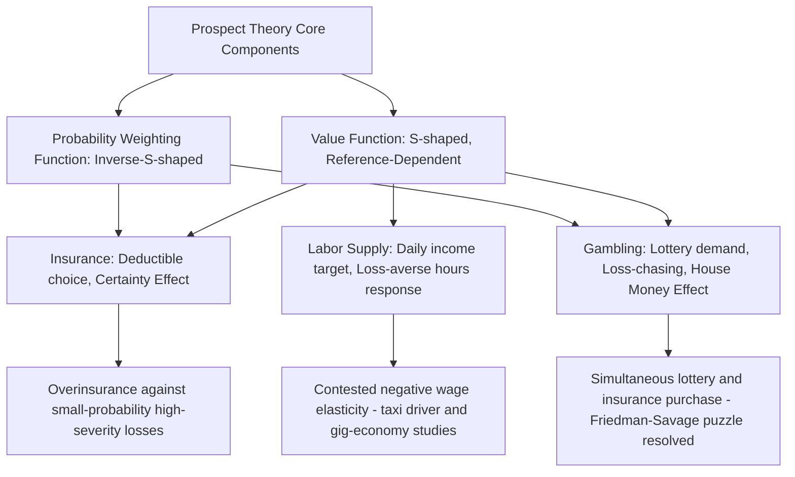

## Prospect Theory in Insurance, Gambling, and Labor Supply Decisions

### Purpose: Synthesizing Prospect Theory into Applied Domains

This topic serves as an integrative application chapter, drawing together the core components of prospect theory developed across the preceding topics in this chapter — the reference-dependent, S-shaped value function; loss aversion; the probability weighting function; the fourfold pattern of risk attitudes; and the certainty and reflection effects — and demonstrating how their joint operation generates specific, testable, and empirically documented predictions in three major applied domains: insurance purchasing, gambling behavior, and labor supply decisions. Each domain illustrates a different facet or combination of prospect theory's structural components, and together they demonstrate the theory's explanatory reach beyond the stylized laboratory choice problems used in its original derivation.

### Insurance Decisions Under Prospect Theory

**The baseline puzzle prospect theory resolves.** Standard expected utility theory predicts insurance purchasing as a consequence of risk aversion (concave utility) applied to a genuine, actuarially-priced risk — a risk-averse agent is willing to pay a premium above actuarially fair value to eliminate variance in wealth. This account, however, struggles to explain several well-documented empirical patterns in actual insurance markets, which prospect theory's combined value-function-and-weighting-function structure addresses more directly.

**Overinsurance against small, low-probability losses.** Consumers frequently purchase insurance products with low or even negative expected value relative to premium cost for low-probability, high-severity losses — extended warranties, flight cancellation insurance, and specific-peril policies covering rare events. This is directly predicted by the low-probability-loss cell of the fourfold pattern: the probability weighting function's overweighting of small probabilities ($w(p) > p$ for small $p$) combined with the value function's convexity in the loss domain jointly produce risk-averse behavior specifically in this cell, generating demand for insurance against rare losses beyond what a standard, globally-concave EUT utility function calibrated to reasonable risk-aversion levels would predict.

**Underinsurance against correlated, high-probability, or ambiguous risks.** Conversely, prospect theory helps explain documented underinsurance patterns for certain risks — for instance, flood or earthquake insurance in high-risk zones is frequently underpurchased relative to what actuarially fair pricing and standard risk-aversion models would predict, a pattern attributed in part to availability-heuristic-driven underestimation of the true probability (a separate heuristics-and-biases mechanism) interacting with prospect theory's reference-point effects, since insurance premiums are experienced as a certain, immediate, salient loss (paid annually) against an uncertain, temporally distant, and easily discounted potential benefit.

**Deductible structure and the psychology of small, certain losses.** Prospect theory also informs the analysis of deductible choice: because a small, certain loss (the deductible, paid with certainty upon any claim) is evaluated differently from an equivalent expected-value reduction folded into a probabilistic premium structure, consumers' deductible preferences often deviate from what a standard expected-utility-based optimal-deductible calculation would recommend, with many consumers choosing lower deductibles than a risk-neutral or even moderately risk-averse EUT calculation would justify, consistent with the certainty effect's disproportionate weight on eliminating a small, salient certain-loss component.

**The Sydnor (2010) homeowners insurance study.** An influential empirical paper by Justin Sydnor analyzed a large sample of homeowners insurance deductible choices and found that the implied risk aversion required to rationalize observed deductible choices under standard EUT was implausibly, almost absurdly, large (implying risk aversion coefficients far outside the range typically estimated from other economic behaviors, such as portfolio allocation), providing strong empirical evidence that standard EUT-based risk aversion alone cannot account for observed insurance behavior, and that prospect-theory-consistent mechanisms (probability overweighting of the loss scenario, and/or the certain-loss aversion associated with the deductible payment itself) offer a more empirically coherent explanation.

### Gambling Decisions Under Prospect Theory

**The lottery-ticket puzzle and the possibility effect.** As introduced in the probability weighting topic, the low-probability-gain cell of the fourfold pattern directly predicts risk-seeking behavior for small-probability, large-payoff gambles: the overweighting of the tiny winning probability ($w(p) \gg p$ for very small $p$, as in a lottery jackpot) inflates the subjective attractiveness of the gamble well beyond its negative expected value, explaining sustained lottery demand despite deeply unfavorable actuarial terms — a pattern standard EUT, absent an implausibly convex (risk-seeking) utility function applied uniformly across the wealth distribution, cannot easily accommodate.

**Break-even effects and loss-chasing.** Gambling behavior research has documented a "break-even effect" or "loss-chasing" pattern: gamblers who are currently behind (in a loss position relative to their starting-session reference point) tend to take on increased risk in an attempt to return to the reference point (break even), consistent with the value function's convexity in the loss domain (risk-seeking to escape a loss) and directly paralleling the disposition-effect pattern discussed for investors in the loss aversion topic. This has been documented in both laboratory gambling-task studies and in field data from real casino and sports-betting records, and is a significant applied concern in problem-gambling research and harm-reduction intervention design, since loss-chasing is one of the most consistently identified behavioral markers of disordered gambling.

**Reference point resetting and the "house money effect."** Richard Thaler and Eric Johnson's (1990) research identified a related but distinct pattern: gamblers who have already won money within a session sometimes treat subsequent gambling with those winnings as "house money" — mentally re-coding the current session's prior winnings as a new, elevated reference point (or, alternatively, treating subsequent losses as merely reducing an already-banked gain rather than as true losses relative to the original starting point), which can produce increased risk-taking with prior winnings ("playing with house money") compared to risk-taking with an equivalent amount of one's own initial capital — a pattern directly tied to prospect theory's reference-point flexibility and its implications for sequential, session-based decision-making, and one with direct relevance to casino/gambling-platform design (e.g., how winnings are displayed or "banked" during a session) as well as to broader financial decision-making after windfall gains.

**Simultaneous insurance and lottery purchasing.** As emphasized in the probability weighting topic, prospect theory's signature achievement in this domain is jointly explaining why the *same individual* frequently both purchases insurance (risk-averse, low-probability-loss behavior) and buys lottery tickets (risk-seeking, low-probability-gain behavior) — a pattern long recognized as a puzzle for standard EUT (originally discussed by Milton Friedman and Leonard Savage in 1948, predating prospect theory, via a proposed doubly-inflected utility function) but which prospect theory's combined value-and-weighting-function architecture accommodates more parsimoniously and with stronger independent empirical support for each component mechanism.

### Labor Supply Decisions Under Prospect Theory

**The reference-dependent labor supply model.** Standard neoclassical labor-supply theory predicts that higher hourly wages should, via the substitution effect (holding income effects aside or assuming they are dominated), induce workers to supply *more* labor hours, since each hour of leisure becomes relatively more costly to take at a higher wage. Prospect-theory-based reference-dependent labor supply models instead propose that workers set a target income level (a reference point, potentially based on a daily, weekly, or habitual income norm) and treat income below that target as a loss and income above it as a gain, which — combined with loss aversion and the differing value-function curvature on either side of the reference point — can generate a labor-supply response in the *opposite* direction from the standard prediction under certain conditions: working fewer hours on high-wage days (quickly reaching the target, after which further hours yield only diminishing-marginal-value gains) and working more hours on low-wage days (continuing to work in order to avoid falling short of the target, a loss-averse response).

**The New York City taxi driver studies (Camerer, Babcock, Loewenstein, and Thaler, 1997).** As introduced in the loss aversion topic, this influential (though later contested) study analyzed daily driving-hours and earnings data for NYC taxi drivers and found patterns broadly consistent with daily-income-target, reference-dependent labor supply: drivers appeared to quit earlier on high-earnings days and drive longer on low-earnings days, producing a negative correlation between the daily wage rate and hours worked — the opposite sign from the standard positive-substitution-effect prediction.

**Methodological reanalysis and ongoing debate.** Subsequent work, notably by Henry Farber (2005, 2008) using more extensive data and alternative econometric specifications, and by Fehr and Goette (2007) using a randomized field experiment with bicycle messengers, has produced a more mixed and debated picture: some reanalyses find the reference-dependent, negative-wage-elasticity pattern is not robust once alternative empirical specifications (e.g., accounting for the full distribution of session lengths rather than simple daily aggregates) are applied, while other studies — including experimental designs explicitly randomizing wage rates to avoid the endogeneity concerns present in the original observational taxi-driver data — do find labor-supply patterns more consistent with reference-dependent, loss-averse target-income behavior. [Inference/Unverified: the current balance of evidence in this specific sub-literature remains genuinely debated rather than settled, and readers should treat the "taxi driver" example, while historically influential in introducing the reference-dependent labor supply idea, as illustrative of a contested empirical claim rather than a definitively established finding]

**Applied relevance to gig-economy and piece-rate work design.** The reference-dependent labor supply framework has gained renewed applied relevance with the growth of gig-economy platforms (ride-hailing, food delivery) that offer real-time, flexible, hours-by-hours earnings visibility — platform algorithmic design choices (e.g., displaying progress toward a daily or weekly earnings target, or structuring bonus thresholds around specific milestone numbers of completed trips) have been documented and, in some cases, explicitly informed by an understanding of reference-dependent labor-supply psychology, since a target-based bonus structure can induce drivers to continue working specifically to avoid "losing" a nearly-achieved bonus threshold.

### Cross-Domain Synthesis

| Domain | Prospect Theory Mechanism(s) Primarily Involved | Key Empirical Pattern |
| --- | --- | --- |
| Insurance (low-probability loss) | Probability weighting (overweighting small $p$) + value function convexity for losses | Overinsurance against rare, high-severity risks; Sydnor's implausible implied risk aversion |
| Insurance (deductible choice) | Certainty effect | Preference for lower deductibles beyond EUT-optimal levels |
| Gambling (lottery purchase) | Probability weighting (overweighting small $p$) + value function concavity for gains | Persistent demand for negative-expected-value long-shot gambles |
| Gambling (loss-chasing) | Value function convexity for losses | Increased risk-taking when in a losing position within a session |
| Gambling (house money effect) | Reference point flexibility/resetting | Increased risk-taking with prior session winnings versus initial capital |
| Labor supply (target-income) | Reference dependence + loss aversion | Contested evidence for negative wage-hours elasticity around a daily income target |

### Illustrative Example

**Example**: A rideshare driver sets an informal daily earnings target of $200 (a reference point shaped by habit and platform-displayed progress indicators). On a day with unusually high demand and surge pricing, the driver reaches $200 after only 5 hours and stops driving despite the unusually favorable (high) effective hourly wage still available — a pattern consistent with reference-dependent labor supply, since additional earnings beyond the $200 target are evaluated via the value function's concave, diminishing-sensitivity gain-domain segment. On a subsequent slow day, the same driver continues working well past their typical quitting time, into a 9th and 10th hour at a comparatively low effective hourly wage, specifically to avoid finishing the day below the $200 reference point — a pattern consistent with loss aversion around the same target. The same driver also purchases a $20 weekly lottery ticket (risk-seeking, low-probability-gain behavior) while also maintaining supplemental accident/injury insurance coverage beyond the platform's minimum required coverage (risk-averse, low-probability-loss behavior) — illustrating the joint operation of several fourfold-pattern-consistent behaviors within a single individual's economic life.

### Process Diagram

### Conceptual Diagram: Three Applied Domains (svg_diagram)

<svg xmlns="http://www.w3.org/2000/svg" viewBox="0 0 700 340">
<text x="350" y="28" text-anchor="middle" font-size="17" font-weight="bold" fill="#1a1a1a">Prospect Theory Across Three Applied Domains (svg_diagram)</text>
<circle cx="350" cy="180" r="70" fill="#edf2f7" stroke="#333" stroke-width="2" />
<text x="350" y="175" text-anchor="middle" font-size="12" font-weight="bold" fill="#333">Prospect Theory</text>
<text x="350" y="192" text-anchor="middle" font-size="10" fill="#333">Value Fn + Weighting Fn</text>
<rect x="80" y="60" width="150" height="70" fill="#2b6cb0" />
<text x="155" y="90" text-anchor="middle" font-size="12" fill="#fff">Insurance</text>
<text x="155" y="108" text-anchor="middle" font-size="10" fill="#fff">low-p loss aversion</text>
<line x1="230" y1="110" x2="290" y2="150" stroke="#333" stroke-width="1.5" />
<rect x="470" y="60" width="150" height="70" fill="#c53030" />
<text x="545" y="90" text-anchor="middle" font-size="12" fill="#fff">Gambling</text>
<text x="545" y="108" text-anchor="middle" font-size="10" fill="#fff">low-p gain seeking</text>
<line x1="470" y1="110" x2="410" y2="150" stroke="#333" stroke-width="1.5" />
<rect x="275" y="250" width="150" height="70" fill="#38a169" />
<text x="350" y="280" text-anchor="middle" font-size="12" fill="#fff">Labor Supply</text>
<text x="350" y="298" text-anchor="middle" font-size="10" fill="#fff">target-income loss aversion</text>
<line x1="350" y1="250" x2="350" y2="250" stroke="#333" />
<line x1="330" y1="250" x2="330" y2="220" stroke="#333" stroke-width="1.5" />
</svg>

**Related Topics**

- The Sydnor (2010) homeowners insurance deductible study in detail
- Problem gambling: loss-chasing, house money effect, and cognitive-behavioral treatment approaches
- The Friedman-Savage (1948) doubly-inflected utility function as a pre-prospect-theory attempt at this puzzle
- Reference-dependent labor supply: the Farber and Fehr-Goette methodological debate
- Gig-economy platform design and behavioral labor-supply engineering
- Deductible and coverage-level choice architecture in insurance product design
- Availability heuristic interactions with insurance underpurchasing for catastrophic risk
- Mental accounting and session-based reference point resetting in gambling contexts