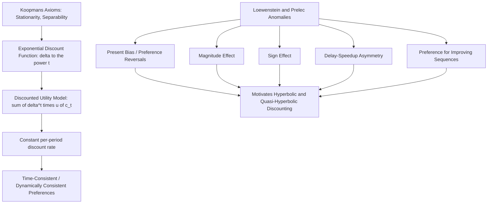

## Exponential Discounting and the Discounted Utility Model

### Purpose and Role as the Classical Benchmark for Intertemporal Choice

The discounted utility (DU) model, built around exponential discounting, is the classical normative and — for much of the twentieth century — dominant descriptive framework for modeling how individuals value outcomes occurring at different points in time. In a behavioral economics curriculum, it plays a structurally analogous role for the "Time Preferences and Intertemporal Choice" chapter to the role expected utility theory played for the preceding "Prospect Theory and Choice Under Risk" chapter: it is introduced as the rigorous, axiomatically grounded classical benchmark whose specific, well-documented empirical failures directly motivate the behavioral alternative models (principally hyperbolic and quasi-hyperbolic discounting) covered in subsequent topics.

### Historical Origins: Samuelson's 1937 Formulation

The discounted utility model originates in Paul Samuelson's 1937 paper "A Note on Measurement of Utility," in which Samuelson proposed a simple, tractable formula for aggregating utility across time periods. Notably, Samuelson himself was explicitly cautious about the model's psychological realism, describing it as a simplification adopted primarily for its analytical tractability rather than as a claim about how people actually experience or value time — a caveat later behavioral economics literature has frequently emphasized was substantially under-appreciated by the many subsequent decades of economic theory and applied work that adopted exponential discounting as a default, largely unquestioned modeling assumption.

### The Formal Model

The discounted utility model represents an individual's total intertemporal utility from a stream of outcomes (consumption, income, or other utility-relevant quantities) $c_0, c_1, c_2, \ldots, c_T$ occurring at times $0, 1, 2, \ldots, T$ as:

$$U(c_0, c_1, \ldots, c_T) = \sum_{t=0}^{T} \delta^t \, u(c_t)$$

or, in continuous time:

$$U = \int_0^T e^{-\rho t} \, u(c_t) \, dt$$

where $u(\cdot)$ is a per-period (instantaneous) utility function, $\delta \in (0,1)$ is the discrete-time discount factor, and $\rho > 0$ is the continuous-time discount rate, related by $\delta = e^{-\rho}$. The defining structural feature — and the specific property that gives exponential discounting its name — is that the discount factor applied between any two periods depends only on the *length* of the time interval separating them, not on *when* that interval occurs (i.e., not on calendar time or on how far in the future the interval begins).

### The Key Property: Time-Consistent (Stationary) Preferences

**Constant discount rate per period.** Under exponential discounting, the ratio of discount factors applied to any two outcomes separated by a fixed interval $k$ is constant regardless of when that interval occurs:

$$\frac{\delta^{t+k}}{\delta^t} = \delta^k \quad \text{for all } t$$

This is the formal statement of the model's **stationarity** or **time-consistency** property: a decision-maker's relative valuation of two outcomes separated by, say, exactly one year, is identical whether that year-long gap begins today or begins ten years from now.

**Implication for dynamic consistency.** Time consistency has a crucial behavioral implication: a plan for future consumption or behavior that is optimal when evaluated today will remain optimal when re-evaluated at any later date, provided no new information has arrived. A decision-maker with exponential discounting who prefers, say, $110 in 31 days over $100 in 30 days when planning today will, upon actually reaching day 30, still prefer to wait the additional day for the larger amount — their relative preference between the two options does not flip merely because time has passed and both options have moved closer. This property is what makes exponential discounting **dynamically consistent**: plans made in advance do not require any self-imposed commitment device to be carried out, because the decision-maker's own future self will not want to deviate from the plan.

### Axiomatic Foundations

Tjalling Koopmans (1960) provided a formal axiomatic derivation of the discounted utility model, analogous in spirit to von Neumann and Morgenstern's derivation of expected utility theory, deriving exponential discounting as the necessary consequence of a small set of axioms imposed on preferences over infinite consumption streams, most notably:

- **Stationarity**: as described above, preferences between two consumption streams that are identical except for a shared, common delay applied to both should not depend on the length of that common delay.
- **Independence of consumption periods (separability)**: utility from consumption in one period is independent of consumption levels in other periods, allowing the total utility to be represented as an additively separable sum across periods.

Koopmans' result established that stationarity, in particular, essentially forces the discount function to take the exponential form $\delta^t$ — any non-exponential discount function (such as the hyperbolic forms covered in the subsequent topic) necessarily violates stationarity and therefore implies dynamically inconsistent preferences, a point that became central to how behavioral economists later framed hyperbolic discounting as a specific, formally characterized departure from Koopmans' axioms rather than merely an ad hoc empirical curve-fit.

### The Discount Rate and Its Interpretation

**Positive time preference and impatience.** A discount factor $\delta < 1$ (equivalently, $\rho > 0$) reflects "pure" impatience — a preference for receiving a given utility sooner rather than later, independent of any change in the marginal utility of consumption itself. This is conceptually distinct from, though often practically intertwined with, diminishing marginal utility of consumption (captured by the curvature of $u(\cdot)$ itself) and from genuine uncertainty about whether a future outcome will actually be realized (e.g., mortality risk, which provides an independent, non-psychological rationale for some degree of discounting even under otherwise time-neutral preferences).

**Individual differences and estimation.** Empirically elicited discount rates vary substantially across individuals, elicitation methods, and the specific goods or outcomes being discounted, a heterogeneity that itself becomes a significant point of departure discussed in the behavioral critique of the model (see below). Standard applied economic modeling (e.g., in macroeconomics, public finance, and cost-benefit analysis for long-horizon public projects such as climate policy) has historically relied on specific calibrated values of $\rho$, with the choice of discount rate frequently identified as one of the most consequential and contested parameters in these applied contexts, given how sensitively long-horizon net present value calculations depend on it.

### Applications and the Model's Continued Normative Role

**Cost-benefit analysis and public policy.** The discounted utility model remains the standard workhorse framework in applied public economics and cost-benefit analysis, including prominently in the economics of climate change, where the choice of social discount rate (famously debated between, e.g., the low rate advocated in the Stern Review and the higher rate implied by market-based calibration approaches favored by critics such as William Nordhaus) has enormous quantitative consequences for the calculated present value of long-horizon climate damages and mitigation benefits.

**Consumption-savings models (permanent income and life-cycle hypotheses).** Exponential discounting underlies the standard intertemporal consumption-savings optimization problem central to macroeconomics and household finance theory, including Milton Friedman's permanent income hypothesis and Franco Modigliani's life-cycle hypothesis, both of which model households as smoothing consumption over their lifetime according to a discounted-utility-maximizing plan.

**Asset pricing.** The stochastic discount factor framework central to modern asset pricing theory builds directly on discounted-utility foundations, with the time-consistency property of exponential discounting playing a structurally important role in standard dynamic asset pricing models (e.g., the consumption-based capital asset pricing model, CCAPM).

**Retains normative standing despite descriptive challenges.** As with expected utility theory in the risk domain, the discounted utility model retains substantial standing as a *normative* benchmark — a coherent, dynamically consistent, and axiomatically well-grounded account of how a rational planner arguably should value time — even as the subsequent topics in this chapter document specific, well-replicated ways in which actual human intertemporal choice behavior systematically departs from it.

### Empirical Anomalies: Why the DU Model Fails as a Descriptive Theory

The dedicated treatment of hyperbolic and quasi-hyperbolic discounting follows as separate topics in this chapter, but the core empirical challenges to exponential discounting, first systematically catalogued by George Loewenstein and Drazen Prelec (1992) in their influential review "Anomalies in Intertemporal Choice," are summarized here as the direct motivation for the behavioral alternatives:

**Present bias / preference reversals over time.** The most consequential anomaly: people often prefer a smaller-sooner reward over a larger-later reward when both are close to the present (e.g., $100 today over $110 tomorrow), but prefer the larger-later reward when the identical choice is shifted equally further into the future (e.g., $110 in 31 days over $100 in 30 days) — a direct, dynamically inconsistent preference reversal that exponential discounting's stationarity property cannot accommodate under any single, fixed discount rate $\delta$.

**The magnitude effect.** Discount rates elicited from experimental choices tend to be smaller (more patient) for larger outcome magnitudes than for smaller ones — a $1,000 reward is typically discounted at a lower implied rate than a $10 reward over the identical time horizon — a pattern inconsistent with a constant $\delta$ applied uniformly across outcome magnitudes.

**The sign effect.** Gains are typically discounted more heavily (more impatiently) than losses of equivalent magnitude — people are often relatively more willing to wait for a future gain to grow than they are willing to delay a future loss, another asymmetry the single-parameter exponential model does not naturally accommodate.

**The delay-speedup asymmetry.** The compensation people demand to accept a delay in receiving a reward is often larger than the amount they are willing to pay to speed up receiving the identical reward by the identical amount of time — an asymmetry inconsistent with a model in which a single consistent discount function should generate symmetric valuations of delay and acceleration.

**Sequence effects and preference for improving sequences.** People frequently prefer an improving sequence of outcomes over time (e.g., a rising wage profile) over a declining or flat sequence with an equal or even higher total sum, a preference not well accommodated by an additively separable, exponentially discounted utility sum, since a pure discounted-utility-maximizer with positive time preference should, all else equal, prefer to front-load good outcomes rather than defer them, and standard exponential discounting has no natural mechanism for a genuine preference over the *sequencing/shape* of an outcome stream independent of its discounted total value.

**Hidden zero effect and framing sensitivity.** Choices between intertemporal options have been shown to be sensitive to how explicitly the "zero" outcome for the non-chosen time periods is presented (e.g., "$100 today" versus "$100 today, $0 in a year"), a framing sensitivity with no natural place in the standard DU model's outcome-stream representation.

### Distinguishing the DU Model from Related Constructs

- **Discounted utility model vs. hyperbolic/quasi-hyperbolic discounting**: The DU model assumes a constant per-period discount factor $\delta$ (or constant rate $\rho$) producing time-consistent preferences; hyperbolic and quasi-hyperbolic models (covered as the next topics in this chapter) instead specify discount functions that decline more steeply in the near term than in the distant future, directly generating the present-bias/preference-reversal pattern the DU model cannot accommodate.
- **Pure time preference (impatience) vs. diminishing marginal utility**: The discount factor $\delta$ captures a pure preference for earlier timing independent of consumption levels; the curvature of $u(\cdot)$ separately captures how marginal utility changes with consumption magnitude — conflating these two conceptually distinct sources of apparent "discounting" is a common source of confusion in both applied modeling and in interpreting experimentally elicited discount rates (since an experiment measuring willingness to trade off money across time is jointly identifying both components unless carefully designed to isolate pure time preference).
- **Individual discounting vs. social discounting**: The rate an individual applies to their own personal future consumption (individual discount rate) is a conceptually and often empirically distinct quantity from the discount rate a social planner should apply to evaluate intergenerational welfare in public policy contexts (the social discount rate), a distinction central to debates such as the Stern Review controversy in climate economics.

### Illustrative Example

**Example**: An individual with discount factor $\delta = 0.95$ per year and linear per-period utility $u(c) = c$ evaluates two options: receiving $1,000 in 5 years, valued at $0.95^5 \times 1000 \approx \$774$ in present-value terms, versus receiving $1,200 in 6 years, valued at $0.95^6 \times 1200 \approx \$883$ in present-value terms. Since the second option has a higher present value, the exponential-discounting individual should prefer waiting the extra year for the larger amount. Crucially, if this same individual is asked the equivalent, temporally-shifted choice today between $1,000 immediately and $1,200 in one year, an exponential discounter with the same $\delta$ will apply exactly the same one-year discount ratio ($0.95$) to the comparison and should reach the consistent conclusion (preferring to wait, provided $1,200 × 0.95 > $1,000, i.e., $1,140 > $1,000, which holds) — demonstrating time-consistency: the decision reached when both options are far away (5 versus 6 years) matches the decision reached when the equivalent gap is shifted to be immediate versus 1 year away. This stability is precisely the property that the present-bias anomalies (covered in the next topic) show is empirically violated when the near option is very close to the present (e.g., $1,000 today vs. $1,200 tomorrow — often reversing to favor the immediate $1,000, a reversal exponential discounting with any single $\delta$ cannot produce).

### Process Diagram

### Conceptual Diagram: Exponential Discount Function (svg_diagram)

<svg xmlns="http://www.w3.org/2000/svg" viewBox="0 0 700 340">
<text x="350" y="28" text-anchor="middle" font-size="17" font-weight="bold" fill="#1a1a1a">Exponential Discount Function: Constant Ratio per Period (svg_diagram)</text>
<line x1="70" y1="290" x2="640" y2="290" stroke="#333" stroke-width="2" />
<line x1="70" y1="290" x2="70" y2="50" stroke="#333" stroke-width="2" />
<text x="355" y="320" text-anchor="middle" font-size="13" fill="#333">Time (periods from present)</text>
<text x="35" y="170" text-anchor="middle" font-size="13" fill="#333" transform="rotate(-90 35 170)">Discount factor delta^t</text>
<path d="M 70 60 Q 200 130 350 190 Q 500 235 630 265" fill="none" stroke="#2b6cb0" stroke-width="3" />
<line x1="150" y1="290" x2="150" y2="100" stroke="#999" stroke-dasharray="3,3" />
<line x1="250" y1="290" x2="250" y2="145" stroke="#999" stroke-dasharray="3,3" />
<text x="150" y="90" text-anchor="middle" font-size="10" fill="#555">t</text>
<text x="250" y="135" text-anchor="middle" font-size="10" fill="#555">t+k</text>

<text x="450" y="200" text-anchor="middle" font-size="11" fill="`#805ad5`" font-style="italic">Ratio delta^(t+k) / delta^t = delta^k</text>

<text x="450" y="218" text-anchor="middle" font-size="11" fill="`#805ad5`" font-style="italic">constant regardless of t</text>

</svg>

**Next Steps**

- Hyperbolic discounting and the mathematical form of declining discount rates
- Quasi-hyperbolic (beta-delta) discounting as a tractable two-parameter approximation
- Present bias and time-inconsistent preferences
- Self-control problems and commitment devices as responses to present bias
- The Loewenstein and Prelec (1992) anomalies in full empirical detail
- Social discount rate debates in climate policy (Stern Review vs. Nordhaus)
- Sophistication versus naivete in time-inconsistent planning (O'Donoghue and Rabin)
- Individual differences in elicited discount rates and their measurement