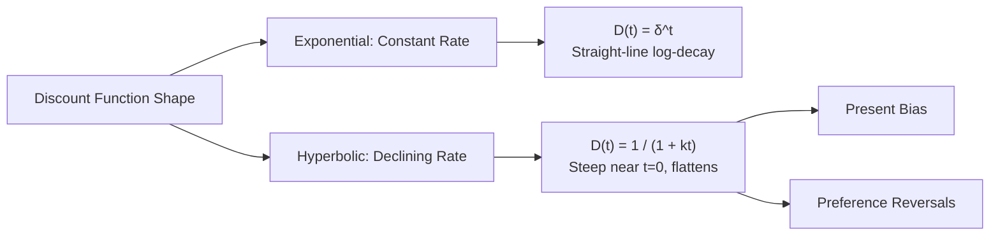
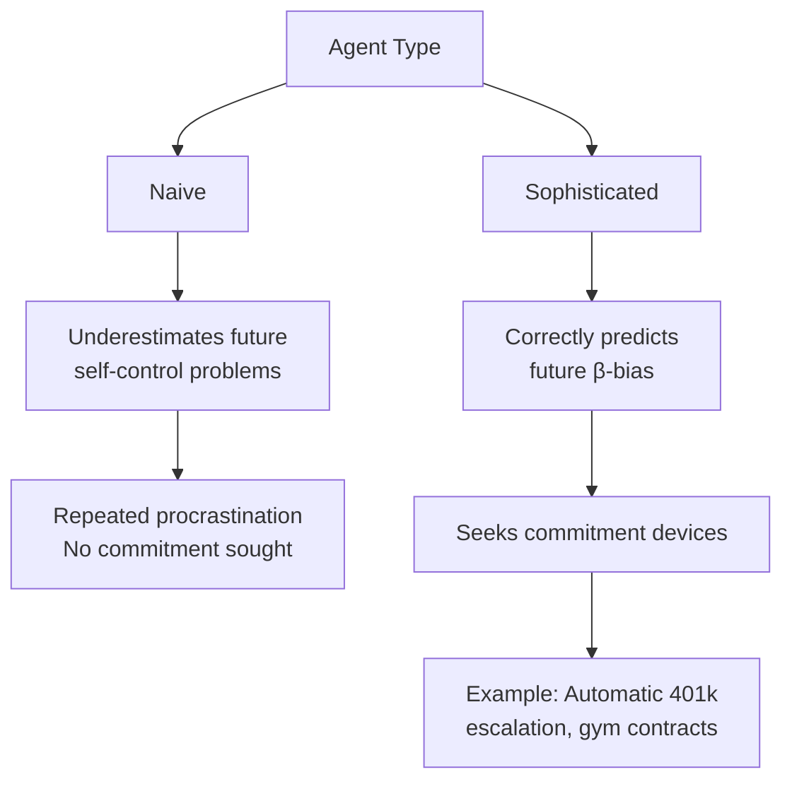

## Hyperbolic and Quasi-Hyperbolic Discounting

### Overview

Hyperbolic and quasi-hyperbolic discounting are descriptive models of intertemporal choice developed to account for empirical deviations from the exponential discounting model assumed in standard neoclassical economics. Both models capture **preference reversals** and **present bias** — the empirically robust tendency for people to weight immediate outcomes disproportionately relative to delayed ones, and to display time-inconsistent preferences when the same tradeoff is shifted further into the future.

### The Exponential Discounting Baseline

Classical intertemporal choice theory, formalized by Paul Samuelson's Discounted Utility Model (1937), assumes a **constant discount rate** $\delta$ applied exponentially over time:

$$U_t = \sum_{k=0}^{T} \delta^k u(c_{t+k})$$

where $\delta \in (0,1)$ is the per-period discount factor. A defining property of exponential discounting is **time consistency**: the relative valuation of two delayed rewards does not change merely because both are shifted forward or backward by the same amount of time.

$$\frac{U(x, t)}{U(y, t+\tau)} = \frac{U(x, t+s)}{U(y, t+\tau+s)} \quad \text{for any } s$$

**Key Points**

- Time consistency implies preferences formed today about a future tradeoff will still hold when that future moment arrives
- Exponential discounting predicts no preference reversals as the common delay to both options changes
- This assumption underlies most standard macroeconomic and finance models (e.g., permanent income hypothesis, DSGE models)

### Empirical Anomaly: Preference Reversals

**Example**

Most people prefer $110 in 31 days over $100 in 30 days (a 1-day-delayed comparison far in the future), but prefer $100 today over $110 tomorrow (the identical 1-day tradeoff, only shifted to the present). Exponential discounting cannot generate this reversal, since the discount ratio between any two dates separated by a fixed interval is constant regardless of when that interval occurs.

This pattern was documented experimentally by Thaler (1981) and theoretically modeled by Ainslie (1975, 1992), whose work with pigeons and self-control research provided the behavioral foundation for hyperbolic discounting.

### Hyperbolic Discounting

**Key Points**

- Proposed by George Ainslie; formalized economically primarily by David Laibson (1997)
- Discount rate is not constant but **declines with the length of delay** — steep for short horizons, flatter for long horizons
- Produces the characteristic "impatience up close, patience far away" pattern

The general hyperbolic discount function (Mazur, 1987 form):

$$D(t) = \frac{1}{1 + kt}$$

where $k > 0$ is an impulsiveness parameter and $t$ is delay. Larger $k$ implies steeper short-run discounting.

A generalized form (Loewenstein & Prelec, 1992):

$$D(t) = (1 + \alpha t)^{-\beta/\alpha}$$

where $\alpha, \beta > 0$ control curvature and long-run discount steepness independently.

**Discount Rate Comparison (illustrative, $k=1$, $\delta=0.9$)**

| Delay $t$ | Exponential $D(t)=\delta^t$ | Hyperbolic $D(t)=1/(1+kt)$ |
| --- | --- | --- |
| 0 | 1.000 | 1.000 |
| 1 | 0.900 | 0.500 |
| 5 | 0.590 | 0.167 |
| 10 | 0.349 | 0.091 |
| 20 | 0.122 | 0.048 |

[Inference] The specific numerical crossover pattern depends on chosen parameter values; the qualitative property — hyperbolic decay is steeper at short delays and flatter at long delays relative to a comparably calibrated exponential — is the robust, well-documented feature.

### Quasi-Hyperbolic (Beta-Delta) Discounting

**Key Points**

- Introduced by Robert Strotz (1955–56) in continuous form and Elster (1977); computationally simplified into discrete form by Laibson (1997), building on Phelps & Pollak (1968)
- Approximates the hyperbolic curve with a two-parameter, analytically tractable structure — preferred in applied and computational economics because it avoids the complexity of a fully hyperbolic function while retaining the key qualitative property of present bias
- Also referred to as the **beta-delta ($\beta\text{-}\delta$) model**

The discrete quasi-hyperbolic discount function:

$$D(t) = \begin{cases} 1 & \text{if } t = 0 \\ \beta\delta^t & \text{if } t \geq 1 \end{cases}$$

- $\delta \in (0,1)$: standard long-run exponential discount factor (models patience over the future generally)
- $\beta \in (0,1)$: present-bias parameter, applied as a one-time discontinuous "penalty" to *all* future periods relative to the present

When $\beta = 1$, the model collapses to standard exponential discounting. $\beta < 1$ generates the discontinuous jump between "now" and "not now" that produces present bias without requiring a fully continuous hyperbolic curve.

$$U_t = u(c_t) + \beta \sum_{k=1}^{T} \delta^k u(c_{t+k})$$

**Example**

With $\beta = 0.7$ and $\delta = 0.95$, a reward available today is undiscounted, but a reward available even one period from now is discounted by an *additional* multiplicative factor of $0.7$ beyond the standard $\delta$ decay — this is what generates a strong preference for immediate consumption relative to any future date, while preferences *among* future dates remain comparatively closer to exponential (since $\beta$ is applied uniformly once the delay is nonzero).

### Sophisticated vs. Naive Agents

A critical extension in the quasi-hyperbolic literature (Laibson, 1997; O'Donoghue & Rabin, 1999) distinguishes agents by their self-awareness of future present bias:

- **Naive agents** believe their future selves will discount according to $\delta$ alone (i.e., they mistakenly predict no future present bias), leading to systematic underestimation of future procrastination or overconsumption
- **Sophisticated agents** correctly anticipate that future selves will also apply $\beta$, and may adopt **commitment devices** to bind future behavior

**Example**

A sophisticated present-biased individual who knows they will want to skip saving next month may pre-commit via automatic payroll deduction (as in Thaler and Benartzi's *Save More Tomorrow* program), locking in future behavior their present self endorses but their future self, absent commitment, would resist.

### Formal Comparison: Exponential vs. Quasi-Hyperbolic vs. Hyperbolic

| Property | Exponential | Quasi-Hyperbolic | Hyperbolic |
| --- | --- | --- | --- |
| Discount rate over time | Constant | Discontinuous drop at $t=0 \to 1$, constant thereafter | Continuously declining |
| Time consistency | Consistent | Inconsistent | Inconsistent |
| Parameters | 1 ($\delta$) | 2 ($\beta, \delta$) | 1–2 ($k$, or $\alpha,\beta$) |
| Computational tractability | High | High | Lower (nonlinear) |
| Common use case | Standard macro/finance models | Applied behavioral/policy models | Psychological/experimental modeling |

### Applications

**Key Points**

- **Retirement savings**: present bias explains chronic undersaving despite stated long-run intentions; used to justify default-enrollment and auto-escalation policies (Thaler & Benartzi, 2004, *Save More Tomorrow*)
- **Procrastination**: naive present-biased agents systematically delay effortful tasks with delayed payoffs (O'Donoghue & Rabin, 1999)
- **Addiction and self-control**: used in modeling cue-triggered consumption and demand for commitment (e.g., pre-committing to not purchase cigarettes)
- **Health behaviors**: explains gaps between intended and realized exercise, diet, and preventive care behavior

### Limitations and Critiques

[Inference] The following points reflect ongoing debate in the literature rather than settled consensus:

- Some experimental economists argue observed "hyperbolic" patterns may partly reflect subadditive discounting, uncertainty about payment delivery, or transaction-cost confounds rather than a pure time-preference anomaly (Read, 2001; Andreoni & Sprenger, 2012)
- The $\beta$-$\delta$ model's discontinuity at $t=0$ is a stylized simplification and does not claim to represent a literal cognitive discontinuity — it is a tractability device
- Estimating $\beta$ and $\delta$ separately from field or experimental data is methodologically difficult, since both jointly determine any single observed discount rate at a given horizon

### Next Steps

- Present Bias and Commitment Devices in Applied Policy Design
- Naive vs. Sophisticated Agents: Formal Dynamic Programming Treatment
- Save More Tomorrow: Case Study in Behavioral Retirement Policy
- Discounted Utility Model: Samuelson's Original Assumptions and Critiques
- Temporal Construal Theory and Its Relationship to Discounting Models
- Experimental Elicitation Methods for Discount Rates (Convex Time Budgets, MPL)