## Present Bias

### Definition

Present bias is the tendency to disproportionately weight immediate rewards and costs over future ones, beyond what a consistent (time-invariant) discount rate would predict. It manifests as a preference reversal: a decision-maker who prefers a larger-later reward when both options are far in the future switches to preferring a smaller-sooner reward once that option becomes immediately available.

**Key Points**

- Present bias is distinct from simple impatience (a high but *constant* discount rate). It specifically describes a disproportionate, time-inconsistent weighting of "now" versus "later."
- It is the behavioral mechanism underlying procrastination, undersaving, overeating, and failure to complete effortful tasks with delayed payoffs.
- Formal treatments model it via **quasi-hyperbolic discounting** (the $\beta\text{-}\delta$ model), distinct from the smoother hyperbolic discounting curve.

### Theoretical Background: From Exponential to Quasi-Hyperbolic Discounting

#### Exponential Discounting (the classical/rational benchmark)

Standard economic models (Samuelson's Discounted Utility model) assume a decision-maker discounts future utility exponentially:

$$U_t = \sum_{k=0}^{\infty} \delta^k u(c_{t+k})$$

where $\delta \in (0,1)$ is a constant per-period discount factor. This implies **time-consistent** preferences: the relative weighting of any two future periods depends only on the time *between* them, not on when the evaluation is made. A plan made today about trade-offs next year versus the year after will still look the same when "next year" arrives.

#### Quasi-Hyperbolic ($\beta\text{-}\delta$) Discounting

Present bias is formalized by inserting an extra discount factor $\beta \in (0,1)$ that applies only to the *immediate* period, first modeled by Phelps and Pollak (1968) and popularized in behavioral economics by Laibson (1997):

$$U_t = u(c_t) + \beta \sum_{k=1}^{\infty} \delta^k u(c_{t+k})$$

- $\delta$: long-run discount factor (standard patience between any two future periods)
- $\beta$: present-bias parameter — applies a discontinuous extra penalty to *all* future periods relative to *now*
- If $\beta = 1$: reduces to standard exponential discounting (no present bias)
- If $\beta < 1$: the present is weighted disproportionately, and the discount function has a "kink" between period 0 and period 1

This creates a discount schedule that drops sharply between "now" and "one period from now," then declines smoothly (at rate $\delta$) thereafter — unlike hyperbolic discounting, which declines smoothly throughout.

**Example**

A person deciding between $100 today and $110 in one week may take the $100 now. But asked to choose between $100 in 52 weeks and $110 in 53 weeks, the same person typically picks the $110 — even though the delay (one week) and the gap are identical in both cases. Only the *presence of an immediate option* changes the choice. This reversal is the empirical signature of present bias.

### Visualizing the Discount Function

```mermaid
graph LR
    A["Period 0 (Now): weight = 1"] -->|"steep drop (β factor)"| B["Period 1: weight = β·δ"]
    B -->|"smooth decay (δ only)"| C["Period 2: weight = β·δ²"]
    C -->|"smooth decay (δ only)"| D["Period 3: weight = β·δ³"]
    D -->|"smooth decay (δ only)"| E["Period n: weight = β·δⁿ"]

    style A fill:#f9f9f9,stroke:#333
    style B fill:#f9f9f9,stroke:#333
```

The discontinuity between A and B (governed by $\beta$) is the mathematical signature of present bias; the smooth decay from B onward (governed only by $\delta$) mirrors ordinary exponential discounting.

### Sophistication vs. Naivety

A critical extension of the model distinguishes how aware an agent is of their own future present bias:

<svg xmlns="http://www.w3.org/2000/svg" viewBox="0 0 720 340" font-family="Helvetica, Arial, sans-serif">
<text x="360" y="28" text-anchor="middle" font-size="17" font-weight="bold" fill="#1a1a1a">Sophisticated vs. Naive Present Bias (svg_diagram)</text>
<rect x="30" y="60" width="300" height="240" rx="10" fill="#eef3fb" stroke="#3b6ea5" stroke-width="1.5" />
<text x="180" y="90" text-anchor="middle" font-size="15" font-weight="bold" fill="#20456e">Sophisticated Agent</text>
<text x="180" y="115" text-anchor="middle" font-size="12" fill="#333">Correctly predicts future β &lt; 1</text>
<text x="55" y="150" font-size="12" fill="#333">• Anticipates self-control failure</text>
<text x="55" y="172" font-size="12" fill="#333">• Uses precommitment devices</text>
<text x="55" y="194" font-size="12" fill="#333"> (deadlines, deposit contracts)</text>
<text x="55" y="216" font-size="12" fill="#333">• Demand for costly commitment</text>
<text x="55" y="238" font-size="12" fill="#333"> is itself evidence of β &lt; 1</text>
<text x="55" y="270" font-size="12" font-style="italic" fill="#555">e.g., paying more for a</text>
<text x="55" y="288" font-size="12" font-style="italic" fill="#555">non-refundable gym plan</text>
<rect x="390" y="60" width="300" height="240" rx="10" fill="#fbeeee" stroke="#a53b3b" stroke-width="1.5" />
<text x="540" y="90" text-anchor="middle" font-size="15" font-weight="bold" fill="#6e2020">Naive Agent</text>
<text x="540" y="115" text-anchor="middle" font-size="12" fill="#333">Believes future β = 1 (wrongly)</text>
<text x="415" y="150" font-size="12" fill="#333">• Repeatedly plans to start</text>
<text x="415" y="172" font-size="12" fill="#333"> "tomorrow," never does</text>
<text x="415" y="194" font-size="12" fill="#333">• No demand for commitment</text>
<text x="415" y="216" font-size="12" fill="#333"> devices (sees no need)</text>
<text x="415" y="238" font-size="12" fill="#333">• Systematically overestimates</text>
<text x="415" y="260" font-size="12" fill="#333"> own future follow-through</text>
<text x="415" y="288" font-size="12" font-style="italic" fill="#555">e.g., perpetual procrastination</text>
</svg>

O'Donoghue and Rabin (1999, 2001) formalized this distinction; most real agents are modeled as **partially naive**, holding a belief $\hat{\beta} \in (\beta, 1]$ about their own future self-control — overestimating it, but not entirely unaware of it.

### Domains of Empirical Evidence

- **Savings & retirement**: Under-contribution to retirement accounts despite stated long-run goals; motivates default-enrollment policy designs (e.g., Save More Tomorrow).
- **Health behaviors**: Gym membership patterns (overpaying for unused flat-rate contracts), smoking, exercise procrastination, delayed preventive care.
- **Task completion / procrastination**: Missed deadlines despite ample lead time; costly effort is deferred to "future self" repeatedly.
- **Debt & credit**: Overuse of high-interest short-term credit (payday loans, credit card revolving balances) despite awareness of the long-run cost.
- **Consumption**: Immediate gratification purchases outweighing stated savings intentions.

### Measurement: Convex Time Budgets and Choice Tasks

Present bias is typically estimated experimentally via:

1. **Time-dated monetary choice tasks**: comparing (smaller-sooner vs. larger-later) choices across a "now vs. soon" framing and a "future vs. further future" framing of equivalent delay length; a switch in preference between the two framings signals $\beta < 1$.
2. **Convex time budgets (Andreoni & Sprenger, 2012)**: subjects allocate a budget of tokens across two future dates, generating a richer estimate that separates $\beta$ from $\delta$ more cleanly than binary choice tasks.
3. **Effort/task-based field experiments**: assigning real effort tasks (e.g., data entry) with flexible deadlines to measure actual procrastination rather than stated preference, since [Inference] hypothetical monetary choice tasks may not fully generalize to effortful or health-related decisions.

**Note**: Estimating $\beta$ and $\delta$ separately requires enough data variation to disentangle a one-time "present" discontinuity from a longer-run patience parameter; naive comparison of a two-point choice cannot identify both parameters simultaneously.

### Relationship to Adjacent Concepts

| Concept | Relation to Present Bias |
| --- | --- |
| Hyperbolic discounting | Smooth-curve alternative generating similar reversals; $\beta\text{-}\delta$ is a simplified two-parameter approximation |
| Time inconsistency | Present bias is one specific *source* of time-inconsistent preferences; the broader category also includes other non-exponential discount forms |
| Self-control problems | Present bias is often treated as the formal microfoundation for self-control failure in economic models |
| Hot-cold empathy gap (Loewenstein) | A complementary mechanism: visceral/emotional states amplify present bias in "hot" states (craving, arousal) |
| Precommitment devices | A rational *response* to anticipated present bias by sophisticated agents |

### Policy and Design Applications

- **Nudges / defaults**: Automatic enrollment in savings plans exploits inertia to counteract present-biased under-saving without restricting choice.
- **Commitment contracts**: Platforms (e.g., stickK) let users stake money against failing to meet self-set future goals, directly addressing anticipated present bias.
- **Sin taxes**: Levying costs *now* on goods with delayed harms (cigarettes, sugary drinks) is sometimes justified as correcting the wedge introduced by present bias, [Inference] though optimal tax design is contested and depends on assumptions about the degree of consumer naivety.
- **Graduated commitment devices**: Products offering small, escalating commitment levels (rather than an all-or-nothing lock-in) are designed for partially naive users who might reject a large commitment outright.

**Related Topics**

- Hyperbolic Discounting
- Time-Inconsistent Preferences
- Sophistication vs. Naivety in Self-Control Models
- Hot-Cold Empathy Gap
- Precommitment Devices and Commitment Contracts
- Save More Tomorrow (Thaler & Benartzi)
- Convex Time Budget Experimental Design
- Dual-Self / Planner-Doer Models