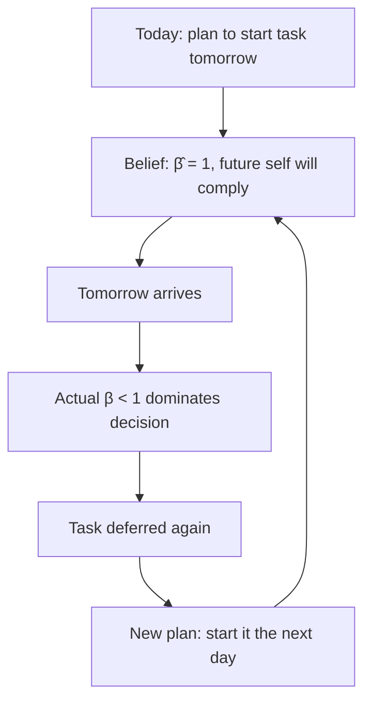

## Sophisticated versus Naive Time-Inconsistent Agents

### Definition

In models of present-biased (time-inconsistent) preferences, an agent's **sophistication** refers to the accuracy of their beliefs about their own future self-control. A **sophisticated** agent correctly anticipates that their future self will also be present-biased; a **naive** agent incorrectly believes their future self will behave patiently (as if $\beta = 1$), even though their current self does not. Most models — and most empirical behavior — fall between these extremes, described as **partial naivety**.

**Key Points**

- Sophistication/naivety is orthogonal to the *degree* of present bias ($\beta$) itself — it concerns the agent's *beliefs* about their future $\beta$, not their actual $\beta$.
- This distinction was formalized primarily by O'Donoghue and Rabin (1999, 2001) building on the quasi-hyperbolic ($\beta\text{-}\delta$) framework of Laibson (1997) and Phelps & Pollak (1968).
- The distinction has first-order consequences for welfare analysis, policy design, and predicted behavior — naive and sophisticated agents with identical $\beta$ can make opposite choices.

### Formal Setup

Recall the quasi-hyperbolic discounting model, where an agent's true instantaneous preferences at time $t$ are:

$$U_t = u(c_t) + \beta \sum_{k=1}^{\infty} \delta^k u(c_{t+k}), \quad \beta \in (0,1)$$

The agent's *belief* about their own future discounting is captured by $\hat{\beta} \in [\beta, 1]$ — the $\beta$ they expect to use in future periods, as perceived from today.

| Type | Belief about future β | Formal condition |
| --- | --- | --- |
| Sophisticated | Correctly anticipates future self-control | $\hat{\beta} = \beta$ |
| Naive | Believes future self will be fully patient | $\hat{\beta} = 1$ |
| Partially naive | Anticipates *some* future bias, but underestimates it | $\beta < \hat{\beta} < 1$ |

Since actual behavior is governed by the true $\beta$ each period, while *planning* is governed by $\hat{\beta}$, the gap $(\hat{\beta} - \beta)$ determines how far actual behavior will diverge from the agent's own plans.

### Behavioral Consequences

#### Naive Agents

A naive agent ($\hat{\beta}=1$) makes plans today assuming their future self will follow through with effort or restraint — but when the future period arrives, their true $\beta < 1$ takes over and they again defer. This produces a **repeated postponement loop**:

- **Never-ending procrastination**: because the naive agent never updates their belief that "next time will be different," they can iterate this cycle indefinitely, even for tasks with large, obvious long-run payoffs.
- **No demand for commitment devices**: since the naive agent doesn't foresee a self-control problem, they see no need to pay for or seek out constraints on their own future choices — [Inference] this makes naivety difficult to detect from field data alone, since an absence of commitment-seeking behavior is also consistent with simply having no present bias at all ($\beta = 1$ truly).
- **Information avoidance**: naive agents may resist information that would reveal their own inconsistency, since it threatens a self-image of future competence.

#### Sophisticated Agents

A sophisticated agent ($\hat{\beta} = \beta$) correctly predicts that their future self will also discount steeply, and incorporates this into current decision-making via **backward induction** over their sequence of future selves (treated as a game between temporally-distinct "selves").

- **Demand for precommitment**: sophisticated agents will pay a premium to restrict their own future choice sets — e.g., choosing a costly non-refundable gym membership specifically *because* it removes the option to skip.
- **Preemptive action**: sophisticates may complete tasks early, deliberately front-loading effort rather than trusting a future self they know will defer it.
- **Strategic self-management**: use of external deadlines, accountability partners, automatic transfers, or environment restructuring (e.g., removing temptation) to substitute for weak future willpower.
- [Inference] The *observed use* of commitment devices is often treated in empirical work as a revealed-preference signal of sophistication, though this inference assumes the agent has access to such devices and that using them is not costly for unrelated reasons.

#### Partially Naive Agents

Most theoretical and applied work models agents as partially naive, since pure sophistication and pure naivety are both extreme cases rarely observed cleanly in the field.

- Partially naive agents *may* seek commitment, but often choose commitment levels that are **too weak** — because they underestimate how large a constraint their future self will actually need.
- This generates a distinctive prediction: partial naifs will sometimes pay for commitment devices, but the devices chosen will be systematically insufficient relative to what a fully sophisticated agent (facing the same true $\beta$) would choose.

### Comparative Diagram: Planning vs. Actual Behavior

<svg xmlns="http://www.w3.org/2000/svg" viewBox="0 0 760 360" font-family="Helvetica, Arial, sans-serif">
<text x="380" y="26" text-anchor="middle" font-size="16" font-weight="bold" fill="#1a1a1a">Planned vs. Realized Effort Over Time (svg_diagram)</text>
<line x1="80" y1="300" x2="720" y2="300" stroke="#333" stroke-width="1.5" />
<line x1="80" y1="300" x2="80" y2="60" stroke="#333" stroke-width="1.5" />
<text x="400" y="330" text-anchor="middle" font-size="12" fill="#333">Time (periods)</text>
<text x="35" y="180" text-anchor="middle" font-size="12" fill="#333" transform="rotate(-90 35 180)">Effort exerted</text>

<polyline points="100,120 220,120 220,90 720,90" fill="none" stroke="#2a7a3b" stroke-width="2.5" />
<text x="560" y="78" font-size="12" fill="#2a7a3b" font-weight="bold">Sophisticated: plan = actual (front-loads)</text>

<polyline points="100,240 220,240 220,130 720,130" fill="none" stroke="#3b5ea5" stroke-width="2" stroke-dasharray="6,4" />
<text x="560" y="118" font-size="12" fill="#3b5ea5" font-weight="bold">Naive: planned effort (assumes future compliance)</text>

<polyline points="100,240 720,240" fill="none" stroke="#a53b3b" stroke-width="2.5" />
<text x="560" y="255" font-size="12" fill="#a53b3b" font-weight="bold">Naive: actual effort (repeatedly deferred)</text>
<circle cx="220" cy="240" r="4" fill="#333" />
<text x="220" y="280" text-anchor="middle" font-size="11" fill="#333">"Today" (decision point)</text>
</svg>

The sophisticated agent's plan and actual behavior coincide because they correctly price in their own future weakness; the naive agent's plan (dashed) diverges sharply from their realized behavior (solid red), which remains flat — effort never actually rises despite repeated intentions to increase it.

### Welfare Implications

- For **sophisticated** agents, standard revealed-preference welfare analysis is complicated because there is no single unified "self" whose preferences should count — welfare judgments require specifying whether the long-run self ($\delta$-weighted, $\beta$-free) or the sequence of present selves is the normative benchmark.
- For **naive** agents, this problem is compounded: their own *stated* plans and predictions about their future selves are demonstrably wrong, so their choices cannot straightforwardly be taken as welfare-maximizing even by their own stated goals.
- This underpins the argument in **libertarian paternalism** (Thaler & Sunstein) for policies like smart defaults: because naive agents systematically fail to implement their own long-run-preferred plans, a well-designed default can improve outcomes measured against the agent's own long-run utility function, without removing choice.

### Empirical Identification

Distinguishing sophistication from naivety in the field is methodologically difficult because both types can exhibit similar *outcomes* (e.g., procrastination) while differing only in *anticipation*. Common identification strategies:

1. **Demand for commitment devices**: offering a costly commitment contract and observing uptake; sophisticates are predicted to accept advantageous commitment, naifs to decline it.
2. **Elicited predictions vs. realized behavior**: asking agents to predict their own future task completion, gym attendance, or savings, then comparing predictions to outcomes — systematic over-optimism is the signature of naivety.
3. **DellaVigna & Malmendier (2006) gym membership study**: found that flat-rate gym members who rarely attend continue paying rather than switching to pay-per-visit, consistent with (partially) naive beliefs about future attendance. [Inference] This is widely cited as indirect field evidence of partial naivety, though alternative explanations (e.g., insurance value against uncertain future motivation) have also been discussed in the literature.

### Related Topics

**Related Topics**

- Present Bias
- Quasi-Hyperbolic ($\beta\text{-}\delta$) Discounting
- Precommitment Devices and Commitment Contracts
- Libertarian Paternalism and Choice Architecture
- Planner-Doer / Dual-Self Models
- Time-Inconsistent Preferences
- DellaVigna & Malmendier Gym Membership Study
- Welfare Analysis Under Non-Standard Preferences