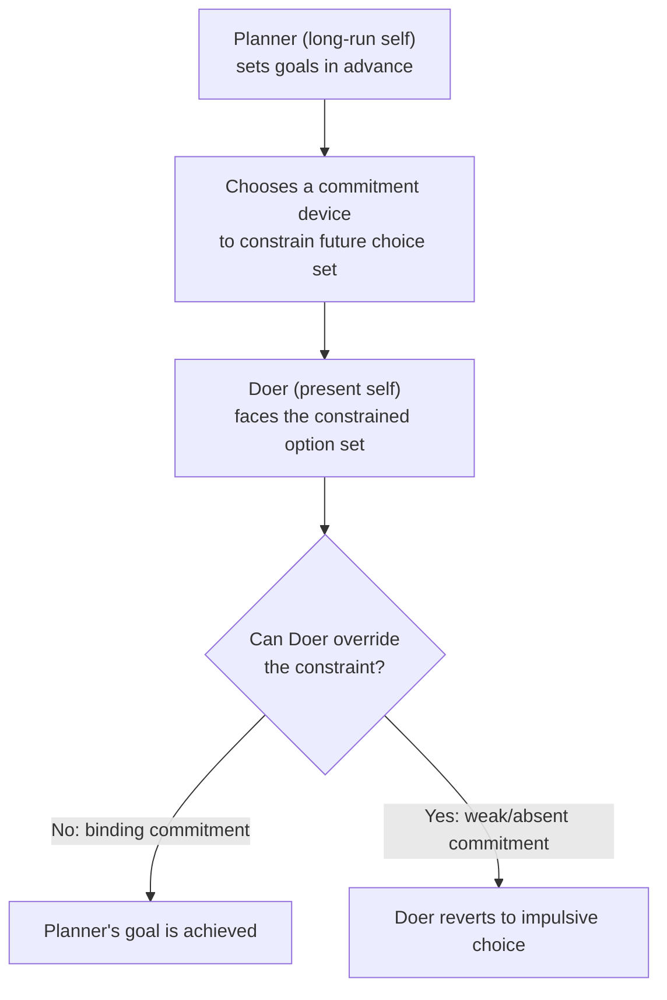

## Self-Control Problems and Commitment Devices

### Definition

A self-control problem arises when an agent's momentary preferences systematically conflict with their own long-run interests, such that the agent, left unconstrained, repeatedly acts against goals they themselves endorse when evaluating the decision from a distance. A **commitment device** is any mechanism — contractual, financial, social, or environmental — that an agent voluntarily adopts to restrict their own future choice set, precisely in order to prevent this conflict from producing an undesired outcome.

**Key Points**

- Self-control problems are the behavioral manifestation of present bias and time-inconsistent preferences; commitment devices are the primary *rational response* available to an agent who is aware of the problem.
- Demand for commitment devices is often treated in the literature as revealed-preference evidence of **sophistication** (correct anticipation of one's own future weakness), distinguishing sophisticated from naive agents.
- The theoretical foundation traces to Strotz (1955) on dynamic inconsistency, formalized in the quasi-hyperbolic framework by Laibson (1997), and extended by Thaler and Shefrin's (1981) planner-doer model.

### Theoretical Foundations

#### The Planner-Doer Model (Thaler & Shefrin, 1981)

This model represents the self-control problem as an internal principal-agent conflict between two facets of the same person:

- **The Planner**: holds far-sighted, consistent preferences aligned with long-run welfare (analogous to the $\delta$-only, patient perspective).
- **The Doer**: a myopic, impulsive agent who controls behavior moment-to-moment and responds to immediate rewards (analogous to the $\beta$-discounted present self).

Self-control problems occur because the Doer, not the Planner, executes actual choices in real time. Commitment devices are tools the Planner uses *in advance* to constrain the Doer's options before the moment of temptation arrives.

#### Strotz's Dynamic Inconsistency and the "Precommitment" Solution

Strotz (1955) first formalized that an agent whose discount function is non-exponential (i.e., not time-consistent) faces three possible strategies when their earlier plan conflicts with their later preferences:

1. **Precommitment**: bind the future self to the earlier plan by eliminating other options.
2. **Consistent planning**: the earlier self chooses, from the set of options the later self would actually follow through on, the best available one (a form of backward induction over one's own future selves).
3. **Naive strategy**: reoptimize at each point in time, without accounting for the anticipated conflict — resulting in outcomes the earlier self would not have chosen, had they foreseen the reversal.

Commitment devices are the practical implementation of strategy (1).

### Taxonomy of Commitment Devices

| Category | Mechanism | Example |
| --- | --- | --- |
| Financial commitment | Monetary stakes lost upon failure | Deposit contracts (e.g., stickK), non-refundable gym memberships |
| Contractual/legal | Legally binding restriction on future options | Illiquid retirement accounts with early-withdrawal penalties |
| Social commitment | Reputational or interpersonal stakes | Publicly announcing a goal; accountability partners |
| Physical/environmental | Removing the option or the cue from the environment | Deleting an app, not keeping snacks at home, website blockers |
| Structural/default-based | Restructuring the default path of least resistance | Automatic payroll deduction into savings |
| Graduated commitment | Escalating constraint levels rather than all-or-nothing | Tiered penalty structures tied to degree of shortfall |

**Example**

A worker enrolls in a "Save More Tomorrow" pension plan (Thaler & Benartzi, 2004), pre-committing a portion of *future* salary increases to retirement savings before the increases occur. Because the commitment targets money the Doer has not yet received or grown attached to, it exploits **loss aversion asymmetry**: forgoing a raise increase feels far less painful than a reduction in current take-home pay, allowing the Planner to lock in higher savings without the Doer's later resistance being triggered.

### The Economics of Demand for Commitment

Ashraf, Karlan, and Yin's (2006) field experiment on a commitment savings product ("SEED") in the Philippines is a frequently cited empirical study: offering a savings account that restricted access to deposited funds until a self-chosen goal (date or amount) was reached significantly increased savings among a subset of clients who opted in, relative to those given an unrestricted account. This is generally interpreted as direct field evidence that at least some individuals value the ability to bind their own future choices, [Inference] though the magnitude and generality of this effect across other populations and contexts is not established by a single study.

#### Conditions Under Which Commitment Devices Are Valuable

A rational demand for commitment devices requires:

1. **Genuine time-inconsistency** ($\beta < 1$): without present bias, there is no future self to bind against.
2. **At least partial sophistication** ($\hat{\beta}$ close to $\beta$): a fully naive agent sees no need for commitment and will not seek it out, since they believe (incorrectly) their future self will comply anyway.
3. **The device must be sufficiently binding**: a commitment that is too easy to circumvent (e.g., a small financial penalty relative to the temptation) fails to alter the Doer's incentives at the moment of choice.
4. **The device must not be so costly or rigid that it destroys option value**: since future circumstances are uncertain, an overly rigid commitment can trap the agent in a suboptimal plan if their legitimate needs change — this is the central **cost side** of commitment.

### The Cost of Commitment: Flexibility versus Bindingness

Commitment devices trade away flexibility in exchange for solving a self-control problem. This creates a genuine design tension:

<svg xmlns="http://www.w3.org/2000/svg" viewBox="0 0 740 320" font-family="Helvetica, Arial, sans-serif">
<text x="370" y="26" text-anchor="middle" font-size="16" font-weight="bold" fill="#1a1a1a">Commitment Strength vs. Flexibility Trade-off (svg_diagram)</text>
<line x1="90" y1="270" x2="670" y2="270" stroke="#333" stroke-width="1.5" />
<line x1="90" y1="270" x2="90" y2="60" stroke="#333" stroke-width="1.5" />
<text x="380" y="300" text-anchor="middle" font-size="12" fill="#333">Commitment strength (bindingness)</text>
<text x="45" y="165" text-anchor="middle" font-size="12" fill="#333" transform="rotate(-90 45 165)">Value to agent</text>
<path d="M 100,240 Q 260,60 420,90" fill="none" stroke="#2a7a3b" stroke-width="2.5" />
<text x="150" y="130" font-size="12" fill="#2a7a3b" font-weight="bold">Value from solving</text>
<text x="150" y="146" font-size="12" fill="#2a7a3b" font-weight="bold">self-control problem</text>
<path d="M 100,90 Q 300,110 550,250" fill="none" stroke="#a53b3b" stroke-width="2.5" />
<text x="430" y="180" font-size="12" fill="#a53b3b" font-weight="bold">Cost from lost flexibility</text>
<text x="430" y="196" font-size="12" fill="#a53b3b" font-weight="bold">under uncertainty</text>
<line x1="330" y1="60" x2="330" y2="270" stroke="#666" stroke-width="1" stroke-dasharray="4,3" />
<text x="330" y="290" text-anchor="middle" font-size="11" fill="#555">Optimal commitment level</text>
<circle cx="330" cy="118" r="4" fill="#1a1a1a" />
</svg>

The optimal commitment level balances the marginal self-control benefit of increased bindingness against the marginal cost of reduced adaptability to unforeseen future states — [Inference] this optimum is agent- and context-specific and is not generally identifiable from theory alone; it depends on empirical estimates of $\beta$, the variance of future shocks, and the agent's risk preferences.

### Graduated and Partial Commitment for Partially Naive Agents

Because most real agents are modeled as **partially naive** rather than fully sophisticated, they tend to underestimate how strong a commitment device they actually need. This has practical design implications:

- Offering only a single, maximal commitment option can lead partial naifs to decline it (perceiving it as unnecessary), even though a *moderate* commitment would have been both accepted and beneficial.
- **Graduated commitment menus** — offering a range of commitment strengths — allow partial naifs to self-select into some binding constraint, even if it is short of what a fully sophisticated agent, facing the same underlying $\beta$, would ideally choose.
- This helps explain why real-world commitment products (savings apps, fitness commitment contracts) often offer tiered stakes rather than one fixed all-or-nothing structure.

### Distinguishing Commitment Devices from Simple Willpower or Incentives

- A commitment device differs from a simple incentive (e.g., an external bonus for performance) because it is **self-imposed** — the agent restricts their own future options rather than merely facing an externally set reward structure.
- It differs from raw willpower because it operates by **changing the choice set itself**, not by relying on the future self to resist temptation within an unchanged, still-tempting choice set.
- **Cue avoidance** (a form of physical/environmental commitment) works through a related but distinct channel: rather than restricting the final choice, it reduces exposure to the visceral or attentional trigger that activates present-biased preference reversals in the first place (cf. the hot-cold empathy gap).

### Related Topics

**Related Topics**

- Present Bias
- Sophisticated versus Naive Time-Inconsistent Agents
- Quasi-Hyperbolic ($\beta\text{-}\delta$) Discounting
- Planner-Doer / Dual-Self Models (Thaler & Shefrin)
- Save More Tomorrow and Behavioral Savings Design
- Libertarian Paternalism and Choice Architecture
- Hot-Cold Empathy Gap
- Loss Aversion and Reference Dependence