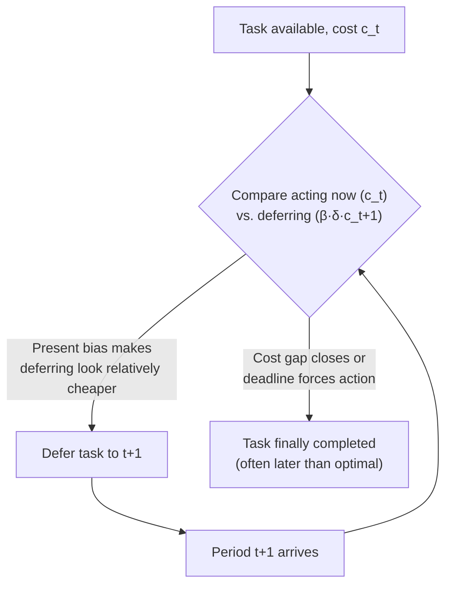

## Procrastination

### Definition

Procrastination is the voluntary, self-defeating delay of an intended action despite expecting to be worse off for the delay. In behavioral economics, it is modeled as a specific, empirically important *consequence* of present-biased, time-inconsistent preferences applied to tasks with an immediate cost and a delayed benefit (or a delayed cost that can be pushed into the future).

**Key Points**

- Procrastination is not merely poor time management; formally, it requires that the agent's *own* evaluation of the delay, from an earlier vantage point, would judge the delay to be a mistake.
- The canonical formal treatment is O'Donoghue and Rabin's (1999) "Doing It Now or Later," which models procrastination as an equilibrium outcome of quasi-hyperbolic discounting combined with (at least partial) naivety.
- Procrastination is distinct from simple impatience: a purely impatient but time-consistent agent may rationally delay a costly task if delay is genuinely optimal — the diagnostic feature of *behavioral* procrastination is that the delay is a preference reversal, not a stable plan.

### Formal Model: Costly, One-Time Tasks

O'Donoghue and Rabin's baseline model considers a task that must be completed exactly once, where the cost of completing it is believed to (weakly) fall over time, and the reward for completion is fixed and arrives only upon completion.

Let the immediate cost of completing the task in period $t$ be $c_t$, with the sequence of costs $c_0 \geq c_1 \geq c_2 \dots$ (non-increasing — i.e., the task is expected to get easier or cheaper, or the agent expects to become more capable, later). Using the quasi-hyperbolic value function, the perceived cost of acting *today* versus deferring is amplified by the $\beta$ term applying to the immediate cost:

$$\text{Perceived net cost of acting now} = c_t \quad \text{vs.} \quad \text{Perceived net cost of deferring} = \beta \delta c_{t+1}$$

Because $\beta < 1$ shrinks the *future* cost more than it shrinks the *present* cost from the perspective of the current self, a present-biased agent systematically overvalues the relief of deferring relative to a time-consistent agent — even when $c_{t+1} \geq c_t$ in absolute terms. This bias compounds each period, producing indefinite postponement for a naive agent, since each period's self re-derives the same distorted comparison.

### Two Types of Procrastinating Tasks

O'Donoghue and Rabin distinguish two structurally different task types, which generate different procrastination patterns:

| Task type | Structure | Behavioral prediction |
| --- | --- | --- |
| Immediate-cost tasks | Cost is borne now; reward (or relief) is delayed | Repeated deferral; task is completed later than the agent's own earlier plan intended, or never |
| Immediate-reward tasks | Reward is immediate; cost is delayed | The mirror image — "preproperation," i.e., doing pleasurable-now, costly-later tasks too readily (e.g., overspending, overeating) |

Procrastination in the everyday sense (delaying effortful, unpleasant, or high-friction tasks) corresponds to the first category; the second category produces the *opposite*-looking but structurally identical bias toward premature action on instant-gratification tasks.

### Naivety as the Amplifying Mechanism

The severity of procrastination depends critically on the agent's degree of naivety about their own future $\beta$:

- A **fully sophisticated** agent ($\hat{\beta} = \beta$) correctly anticipates that deferring will look attractive again next period, and — under the "consistent planning" strategy — may act earlier than a naive agent would, precisely *because* they do not trust their future self to follow through.
- A **fully naive** agent ($\hat{\beta} = 1$) believes their future self will complete the task "for sure" and sees no urgency to act now, generating the longest and most severe delays; O'Donoghue and Rabin show that naive agents can procrastinate on tasks with strictly positive value **indefinitely**, in principle never completing them at all if no external deadline intervenes.
- **Partially naive** agents fall between these cases; the degree of underestimated future bias, $\hat{\beta} - \beta$, is a direct predictor of how much *additional* delay occurs relative to the sophisticated benchmark.

**Example**

A researcher intends to file an expense report with a cost of one hour of tedious data entry, and no fixed deadline for several months. Each week, the report is "easy to do anytime," and the perceived relative cost of doing it *this specific week* (versus next week) is inflated by present bias. Absent an external deadline, this can continue for the full window, resulting in either a last-minute rush or a report that is never filed — despite the researcher, at any earlier point, agreeing the task should be done promptly.

### The Role of Deadlines

Deadlines function as a partial substitute for internal commitment, converting an open-ended procrastination problem into a bounded one:

- **External, binding deadlines** eliminate the option of indefinite deferral, forcing task completion no later than the deadline — though present bias still predicts the task will be completed *at* the deadline rather than optimally earlier, generating last-minute clustering of task completion.
- **Self-imposed deadlines**, studied experimentally by Ariely and Wertenbroch (2002), can improve performance for procrastination-prone tasks — but only if they carry a genuine binding cost for missing them; a self-imposed deadline with no enforcement mechanism does not reliably change a present-biased agent's behavior, since the future self can simply revise the self-imposed deadline away.
- Ariely and Wertenbroch's study found that when subjects were allowed to set their *own* spaced deadlines for a multi-part task (versus one final deadline for all parts), those with evenly spaced self-imposed deadlines performed better than those with no interim deadlines — though [Inference] performance was still generally below that of externally imposed, evenly spaced deadlines, suggesting self-imposed commitment is only a partial substitute for external commitment.

### Distinguishing Procrastination from Rational Delay

Not all task delay is behavioral procrastination in the technical sense. A time-consistent agent may rationally delay a task if:

- New information relevant to the task is expected to arrive before the deadline.
- The cost of completing the task is genuinely, credibly expected to fall (e.g., waiting for a tool or resource that will make the task easier).
- Other higher-priority tasks currently dominate the agent's attention on standard cost-benefit grounds.

The behavioral signature that separates procrastination from rational delay is the **preference reversal**: the same agent, if asked *in advance* whether they would want their future self to delay the task under the same conditions, would say no — yet their future self delays anyway when the moment arrives. This inconsistency between planning-self judgment and choosing-self behavior is the defining empirical test.

### Interventions and Policy Responses

<svg xmlns="http://www.w3.org/2000/svg" viewBox="0 0 740 300" font-family="Helvetica, Arial, sans-serif">
<text x="370" y="26" text-anchor="middle" font-size="16" font-weight="bold" fill="#1a1a1a">Interventions Targeting Procrastination (svg_diagram)</text>
<rect x="30" y="55" width="210" height="215" rx="10" fill="#eef3fb" stroke="#3b6ea5" stroke-width="1.5" />
<text x="135" y="82" text-anchor="middle" font-size="13" font-weight="bold" fill="#20456e">Structural</text>
<text x="50" y="112" font-size="11" fill="#333">Binding external deadlines</text>
<text x="50" y="134" font-size="11" fill="#333">Automatic defaults</text>
<text x="50" y="156" font-size="11" fill="#333">Graduated interim milestones</text>
<text x="50" y="178" font-size="11" fill="#333">Reduced task friction / effort</text>
<rect x="265" y="55" width="210" height="215" rx="10" fill="#eef7ee" stroke="#2a7a3b" stroke-width="1.5" />
<text x="370" y="82" text-anchor="middle" font-size="13" font-weight="bold" fill="#1d5c2b">Commitment-Based</text>
<text x="285" y="112" font-size="11" fill="#333">Self-imposed binding deadlines</text>
<text x="285" y="134" font-size="11" fill="#333">Financial stakes on completion</text>
<text x="285" y="156" font-size="11" fill="#333">Accountability partners</text>
<text x="285" y="178" font-size="11" fill="#333">Public commitment to timeline</text>
<rect x="500" y="55" width="210" height="215" rx="10" fill="#fbeeee" stroke="#a53b3b" stroke-width="1.5" />
<text x="605" y="82" text-anchor="middle" font-size="13" font-weight="bold" fill="#6e2020">Informational</text>
<text x="520" y="112" font-size="11" fill="#333">Reminders and prompts</text>
<text x="520" y="134" font-size="11" fill="#333">Feedback on past delay patterns</text>
<text x="520" y="156" font-size="11" fill="#333">Debiasing self-prediction</text>
<text x="520" y="178" font-size="11" fill="#333">Reduced naivety via tracking data</text>
</svg>

[Inference] The relative effectiveness of these categories is context-dependent and task-dependent; structural and commitment-based interventions are generally better supported by field-experimental evidence (e.g., Ariely and Wertenbroch's deadline study) than purely informational nudges, which tend to have smaller and less consistent effects on procrastination specifically, as opposed to other behaviors like savings.

### Related Topics

**Related Topics**

- Present Bias
- Sophisticated versus Naive Time-Inconsistent Agents
- Self-Control Problems and Commitment Devices
- Quasi-Hyperbolic ($\beta\text{-}\delta$) Discounting
- Ariely and Wertenbroch Self-Imposed Deadlines Study
- Task-Based Models of Effort and Delay
- Preproperation and Immediate-Reward Tasks
- Nudges and Reminder-Based Interventions