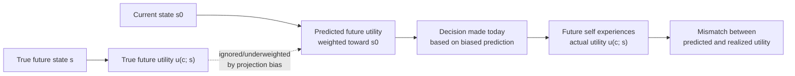

## Projection Bias and Mispredicted Future Utility

### Definition

Projection bias is the systematic tendency to overestimate the degree to which one's *future* preferences, tastes, or states will resemble one's *current* state — effectively projecting present feelings, cravings, or circumstances onto future decision-making. It produces mispredicted future utility: people misforecast how much they will actually like, want, or need something once the current state (hunger, emotion, arousal, habituation level) has changed.

**Key Points**

- Projection bias is formalized primarily by Loewenstein, O'Donoghue, and Rabin (2003) in "Projection Bias in Predicting Future Utility."
- It is distinct from present bias: present bias concerns *how much weight* is given to a correctly-predicted future utility, while projection bias concerns *whether the predicted future utility itself is accurate* — the forecast, not the discount rate, is the error.
- The bias applies symmetrically to both self-prediction (forecasting one's own future wants) and prediction of others' future states (e.g., a doctor advising a patient, or a manager predicting employee satisfaction).

### Formal Model

Loewenstein, O'Donoghue, and Rabin model an agent's true utility from consumption $c$ in a future state $s$ as $u(c;s)$, dependent on the state variable $s$ (e.g., hunger level, emotional arousal, habit stock). The agent's *predicted* utility, however, is a weighted average that overweights the current state $s_0$:

$$\tilde{u}(c;s) = (1-\alpha)\, u(c;s) + \alpha\, u(c;s_0), \quad \alpha \in [0,1]$$

where $\alpha$ is the projection bias parameter:

- $\alpha = 0$: correct prediction (rational expectations about future state-dependent utility)
- $\alpha = 1$: complete failure to adjust — the agent predicts future utility *as if* the future state will be identical to the current state
- $0 < \alpha < 1$: partial projection — the standard empirical case, where predictions are anchored on the present state but adjust somewhat

This is structurally distinct from the quasi-hyperbolic $\beta\text{-}\delta$ present-bias model: projection bias operates on the *utility function's inputs* (misforecasting the state $s$), whereas present bias operates on the *discount weights* applied to a correctly-anticipated utility stream.

### Distinguishing Projection Bias from Related Concepts

| Concept | What is mispredicted or misweighted |
| --- | --- |
| Projection bias | The *content* of future utility — what will actually be liked/needed |
| Present bias | The *weight* given to correctly-predicted future utility |
| Hot-cold empathy gap | A related but distinct mechanism specifically about visceral/emotional state transitions (see below) |
| Adaptation neglect / hedonic adaptation misprediction | Failure to predict that utility from a fixed good or event will diminish over time due to habituation |
| Affective forecasting error (broader psychology literature) | A superset term covering general mispredictions of future emotional reactions, of which projection bias is one specific, formalized mechanism |

### The Hot-Cold Empathy Gap as a Special Case

Loewenstein's earlier work (1996) on "visceral factors" describes a closely related phenomenon: people in a "cold" (non-aroused, non-craving) state systematically underestimate how much a "hot" (aroused, craving) state will influence their future behavior, and vice versa. This is often treated as a specific instance of projection bias applied to visceral/emotional states specifically, rather than general state variables like habituation or prior consumption levels.

**Example**

Grocery shopping while hungry (a "hot" state relative to satiety) leads to overbuying of high-calorie, immediately appealing food — the shopper projects their current hunger onto the future state (when the food will actually be eaten, likely while not hungry). Conversely, shopping on a full stomach leads to underbuying, as the current "cold" satiety state is projected onto future meals when the shopper will, in fact, be hungry.

### Empirical Evidence

#### Retail and Consumption Studies

Conlin, O'Donoghue, and Vogelsang (2007) studied mail-order catalog purchases of cold-weather clothing and found that unexpectedly cold temperatures at the time of order placement predicted higher rates of product returns, consistent with projection bias: buyers purchased items suited to the (unusually cold) current weather, projecting that state forward, and later regretted the purchase once temperatures normalized and the true need diminished.

#### Labor Markets

[Inference] Studies of job search and job satisfaction have argued that projection bias can affect decisions such as which job offer to accept, since candidates evaluating an offer may project their current employment state (e.g., desperation while unemployed, or satisfaction/frustration in a current role) onto their expected future satisfaction in the new position — though isolating projection bias from other confounds (selection, information asymmetry) in field settings is methodologically challenging.

#### Health and Addiction

Habit formation and addiction models (e.g., rational addiction frameworks extended with projection bias) suggest that individuals in a state of low current craving systematically underpredict how strong future cravings will be once a habit-forming good is reintroduced, contributing to relapse after periods of abstinence — the "it won't be that hard" misprediction.

### Consequences for Decision-Making

- **Systematic overbuying/underbuying**: purchases anchored to current-state needs (hunger, weather, mood) rather than accurately forecasted future needs.
- **Failure of self-control interventions**: commitment devices and plans made in a "cold" state may be undermined because the planner underestimates how differently they will value options once in a "hot" state (or vice versa) — this compounds with, but is mechanistically distinct from, ordinary present bias.
- **Miscommunication in advice-giving**: experts or advisors (doctors, financial planners, negotiators) may project their own current-state preferences onto the person they are advising, or fail to account for how the advisee's state will change, producing systematically biased recommendations.
- **Policy design implications**: interventions that account for projection bias (e.g., structuring choices to be made in a state resembling the one in which they will be experienced, or providing corrective information about expected future states) can reduce misprediction-driven regret, [Inference] though the practical scalability of "matching decision-state to consumption-state" interventions varies significantly by domain.

### Projection Bias versus Rational Learning

A key identification challenge is separating projection bias from rational Bayesian updating. If an agent has genuinely limited information about their future state, using current-state information as a reasonable proxy is not itself biased — it becomes projection bias specifically when the misprediction is systematic, directionally predictable from the current state, and persists even when better information about the future state is available or knowable in principle. Empirical designs (such as the catalog-return study) typically address this by exploiting quasi-random variation in the current state (e.g., weather shocks) that carries no genuine informational content about the true future state.

### Related Topics

**Related Topics**

- Hot-Cold Empathy Gap
- Present Bias
- Hedonic Adaptation and Adaptation Neglect
- Affective Forecasting Errors
- Rational Addiction Models with Behavioral Extensions
- Self-Control Problems and Commitment Devices
- Reference-Dependent Preferences