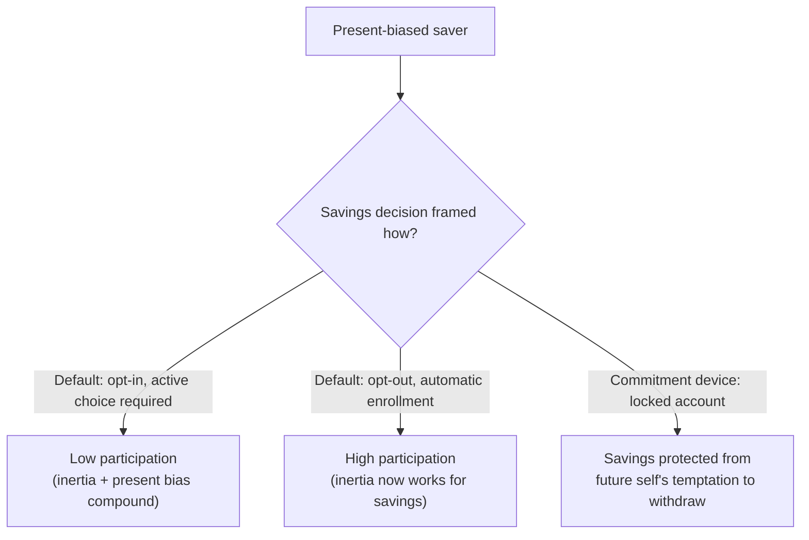

## Intertemporal Choice in Savings, Health, and Addiction

### Definition

This topic synthesizes how the core behavioral mechanisms of intertemporal choice — present bias, quasi-hyperbolic discounting, sophistication/naivety, self-control problems, and projection bias — apply across three of the most heavily studied applied domains: retirement and precautionary savings, preventive and health-related behavior, and addictive consumption. Each domain shares the same underlying formal structure (an immediate cost or temptation weighed against delayed, discounted benefits or harms) while differing in institutional context, available commitment tools, and policy response.

**Key Points**

- All three domains can be modeled using the same quasi-hyperbolic ($\beta\text{-}\delta$) framework introduced for present bias, with domain-specific cost/reward timing structures.
- Savings, health, and addiction differ primarily in the *reversibility* of the harm from delay (savings shortfalls are largely recoverable with effort; certain health and addiction harms are not) and in the *type* of self-control device that is institutionally available.
- These domains are the primary empirical testing grounds and policy application areas for behavioral time-preference theory, and connect present bias to real-world welfare-relevant outcomes.

### Savings and Retirement

#### The Behavioral Undersaving Problem

Standard life-cycle models (Modigliani-Brumberg) predict that a rational, exponential discounter will smooth consumption across their lifetime, saving adequately during working years for retirement. Empirically, however, a substantial share of the working population undersaves relative to their own stated retirement income targets — a gap poorly explained by exponential discounting alone but consistent with present-biased, partially naive intertemporal preferences: saving imposes an immediate, salient cost (reduced current consumption) for a distant, abstract benefit (future retirement income).

#### Behavioral Interventions in Savings

- **Save More Tomorrow (SMarT)** (Thaler & Benartzi, 2004): pre-commits employees to allocate a portion of *future* salary raises to increased retirement contributions, exploiting the fact that a raise not yet received does not trigger the same loss-averse resistance as a cut to current take-home pay.
- **Automatic enrollment and escalation defaults**: since present-biased and inertia-prone agents disproportionately stick with defaults, switching the default from opt-in to opt-out savings participation substantially raises participation rates, documented extensively in Madrian and Shea (2001).
- **Commitment savings accounts**: restricted-access accounts (e.g., the Ashraf, Karlan, and Yin 2006 SEED study) allow agents to lock away funds until a self-set goal is met, directly targeting demand for commitment among (at least partially) sophisticated savers.

### Health Behaviors

#### Preventive Care and Health Investment

Preventive health behaviors (vaccination, screening, exercise, dietary choices) share the immediate-cost/delayed-benefit structure central to present bias: the cost (time, discomfort, effort) is borne now, while the benefit (reduced disease risk, improved long-run health) is uncertain, diffuse, and temporally distant. This structure predicts systematic under-investment in preventive care relative to a time-consistent benchmark, [Inference] though the magnitude of the behavioral (versus purely financial or access-based) contribution to under-screening and under-vaccination varies by study and context.

#### The Gym Membership Puzzle

DellaVigna and Malmendier's (2006) study of health club contracts found that members on flat monthly-fee contracts attended far less often than would justify the cost per visit relative to a cheaper pay-per-visit option, yet stayed enrolled substantially longer than needed to "break even" against switching to pay-per-visit pricing. This pattern is consistent with (partially) naive present bias: members overestimate their own future gym attendance at the time of signing up for a flat-rate plan, then fail to cancel promptly once actual attendance proves lower than predicted.

#### Health Behavior and Commitment

- **Financial incentive programs**: modest cash incentives for attending screenings or completing vaccination courses can outperform pure information campaigns for present-biased populations, since they reduce the immediate net cost rather than relying on appeals to distant benefits.
- **Commitment contracts for health goals**: platforms allowing users to stake money against self-set health targets (weight loss, exercise frequency, smoking cessation) directly apply the commitment-device logic developed for savings to health behavior.
- **Framing and defaults in choice architecture**: default enrollment in wellness programs, or default "opt-out" organ donation policies, exploit the same inertia and present-bias-driven status quo bias documented in the savings literature.

### Addiction

#### Rational versus Behavioral Models of Addiction

The standard economic starting point is Becker and Murphy's (1988) **rational addiction model**, which treats addictive consumption as fully forward-looking: agents correctly anticipate that current consumption raises future consumption (via habit formation / tolerance) and rationally choose their consumption path given stable, time-consistent preferences. This model can generate realistic-looking addictive consumption patterns without any behavioral bias, but has been criticized for requiring implausibly high patience and full self-awareness to match observed relapse and cessation-attempt patterns.

Behavioral extensions replace or augment the rational addiction framework with:

- **Present bias**: each period, the immediate pleasure of consumption is weighted disproportionately relative to its delayed health and dependency costs, producing consumption levels above what the same agent's long-run self would choose.
- **Projection bias / hot-cold empathy gap**: in a "cold" (non-craving) state, an agent underestimates how strong future cravings will be, leading to underinvestment in avoidance strategies and overconfidence about the ease of abstaining, contributing to relapse.
- **Cue-triggered preference reversals**: environmental cues associated with the addictive substance can trigger a shift toward the "hot" state in which present bias is most severe, even absent a change in the underlying $\beta$ parameter.

#### Addiction-Specific Commitment Devices

<svg xmlns="http://www.w3.org/2000/svg" viewBox="0 0 740 280" font-family="Helvetica, Arial, sans-serif">
<text x="370" y="26" text-anchor="middle" font-size="16" font-weight="bold" fill="#1a1a1a">Commitment Strategies Across Domains (svg_diagram)</text>
<rect x="30" y="55" width="210" height="195" rx="10" fill="#eef3fb" stroke="#3b6ea5" stroke-width="1.5" />
<text x="135" y="82" text-anchor="middle" font-size="13" font-weight="bold" fill="#20456e">Savings</text>
<text x="50" y="112" font-size="11" fill="#333">Auto-enrollment defaults</text>
<text x="50" y="134" font-size="11" fill="#333">Save More Tomorrow</text>
<text x="50" y="156" font-size="11" fill="#333">Restricted-access accounts</text>
<rect x="265" y="55" width="210" height="195" rx="10" fill="#eef7ee" stroke="#2a7a3b" stroke-width="1.5" />
<text x="370" y="82" text-anchor="middle" font-size="13" font-weight="bold" fill="#1d5c2b">Health</text>
<text x="285" y="112" font-size="11" fill="#333">Screening/vaccine incentives</text>
<text x="285" y="134" font-size="11" fill="#333">Staked exercise/diet goals</text>
<text x="285" y="156" font-size="11" fill="#333">Default wellness enrollment</text>
<rect x="500" y="55" width="210" height="195" rx="10" fill="#fbeeee" stroke="#a53b3b" stroke-width="1.5" />
<text x="605" y="82" text-anchor="middle" font-size="13" font-weight="bold" fill="#6e2020">Addiction</text>
<text x="520" y="112" font-size="11" fill="#333">Pharmacological blockers</text>
<text x="520" y="134" font-size="11" fill="#333">Contingency-management stakes</text>
<text x="520" y="156" font-size="11" fill="#333">Cue-avoidance environment design</text>
</svg>

- **Contingency management**: financial rewards contingent on biologically verified abstinence (e.g., verified via drug testing) directly counter present bias by moving part of the delayed health benefit into the immediate period.
- **Pharmacological commitment**: some treatments (e.g., medications that produce an aversive reaction if the substance is consumed) function as a hard commitment device by making relapse immediately costly rather than merely delayed-costly.
- **Structural/environmental commitment**: inpatient treatment programs, restricted access to triggering environments, and social-support commitment (public accountability) parallel the environmental and social commitment categories used in general self-control theory.

### Cross-Domain Comparison

| Dimension | Savings | Health | Addiction |
| --- | --- | --- | --- |
| Immediate cost of "good" behavior | Reduced current consumption | Time, discomfort, effort | Withdrawal, loss of immediate reward |
| Delayed benefit | Retirement income | Reduced disease risk | Long-run health, functioning |
| Reversibility of inaction's harm | Largely recoverable with later effort | Partially reversible (context-dependent) | Often only partially reversible; dependency compounds |
| Dominant commitment tool in practice | Defaults, restricted-access accounts | Incentives, staked goals | Contingency management, structural removal of access |
| Primary behavioral mechanism invoked | Present bias, inertia | Present bias, projection bias | Present bias, hot-cold empathy gap, cue reactivity |

### Shared Policy Implications

- **Libertarian paternalism** (Thaler & Sunstein) applies across all three domains: defaults and choice-architecture nudges preserve formal freedom of choice while correcting for predictable present-biased under-investment.
- **Timing of incentives matters more than magnitude alone**: across savings, health, and addiction interventions, moving a portion of the delayed benefit (or cost) into the present period tends to be more behaviorally effective than increasing the size of a purely delayed incentive, [Inference] though the precise elasticity of behavior to near-term versus delayed incentives is domain- and population-specific and not governed by a single universal parameter.
- **Naivety-aware design**: because a meaningful share of the population is only partially naive about their own self-control limitations, offering graduated or optional commitment menus (rather than a single fixed intensity) tends to reach a broader range of agents across all three domains.

### Related Topics

**Related Topics**

- Present Bias
- Sophisticated versus Naive Time-Inconsistent Agents
- Self-Control Problems and Commitment Devices
- Projection Bias and Mispredicted Future Utility
- Save More Tomorrow and Behavioral Savings Design
- Rational Addiction Models (Becker & Murphy)
- Libertarian Paternalism and Choice Architecture
- Contingency Management in Behavioral Health