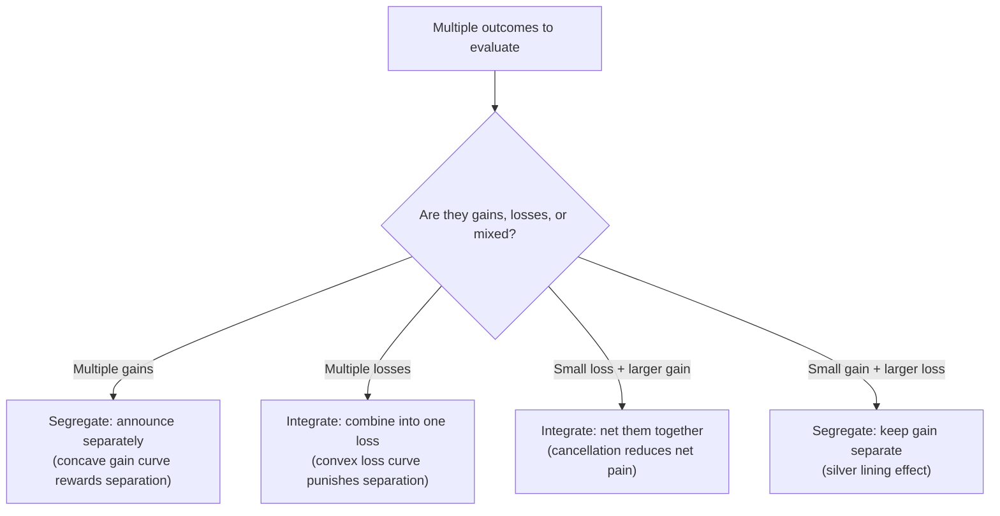

## Mental Accounting Theory

### Definition

Mental accounting is the set of cognitive operations individuals use to organize, evaluate, and track financial activities — categorizing money into separate, non-fungible mental "accounts" (e.g., by source, intended use, or time period) rather than treating all money as perfectly interchangeable, as standard economic theory assumes. The term and its systematic formalization are primarily due to Richard Thaler (1985, 1999).

**Key Points**

- Mental accounting directly violates the economic assumption of **fungibility of money** — the idea that a dollar is a dollar regardless of its source or designated use.
- Thaler's foundational 1999 paper, "Mental Accounting Matters," organizes the concept into three core components: how outcomes are perceived and experienced (framing), how activities are assigned to specific accounts (categorization), and how often accounts are evaluated (choice bracketing).
- Mental accounting is not merely a descriptive curiosity — it has systematic, predictable effects on consumption, saving, and risk-taking that deviate from rational-agent predictions in specific, testable directions.

### Core Components

#### 1. Framing of Outcomes: Coding Gains and Losses

Building on prospect theory's value function, mental accounting examines how outcomes are mentally coded as gains or losses relative to a reference point, and — critically — whether multiple outcomes are **combined** or **segregated** when evaluated. Thaler's "hedonic editing" hypothesis predicts:

- **Segregate multiple gains**: because the prospect theory value function is concave for gains, two separate small gains feel better combined than one large gain of equal total size — so people prefer to *announce* or *experience* good news separately.
- **Integrate multiple losses**: because the value function is convex for losses, one large loss feels less painful than several smaller losses of the same total — so people prefer to *combine* bad news.
- **Integrate a small loss with a larger gain** (cancellation): a small loss subtracted from a larger gain is less painful when merged into the net gain than when experienced as a separate loss.
- **Segregate a small gain from a larger loss** (the "silver lining" principle): a small gain, if merged into a larger loss, barely registers on the concave gain region — but as a standalone gain, it registers more strongly on the steep initial portion of the gain curve.

#### 2. Categorization: Assigning Activities to Accounts

Money is mentally sorted into distinct accounts along several dimensions, and this categorization affects consumption independent of the underlying budget constraint:

- **Source of income**: money from a "windfall" (bonus, gift, gambling win) is treated differently — typically spent more freely — than money earned through regular, effortful income, even when both are fungible in an objective budget sense. This is sometimes termed the **"house money effect."**
- **Intended use / budget category**: households often maintain informal category-specific budgets (groceries, entertainment, "fun money") and resist reallocating funds across categories even when one category is exhausted and another has surplus.
- **Timing account**: current income, current assets, and future income are treated as distinct accounts with different marginal propensities to consume, contrary to the life-cycle/permanent-income hypothesis, which predicts consumption should depend only on total lifetime wealth, not its temporal or categorical labeling.

**Example**

A household that has budgeted $400/month for dining out but only $150 for entertainment may decline an appealing $60 entertainment purchase (citing the exhausted "entertainment budget") even while there is unspent slack in the dining category that month — despite the two categories being economically fungible from a total-budget perspective.

#### 3. Choice Bracketing: The Frequency of Account Evaluation

Choice bracketing refers to how broadly or narrowly a decision-maker groups a set of choices together when evaluating them:

- **Narrow bracketing**: evaluating each decision (or account) in isolation, period by period — e.g., checking investment portfolio performance daily.
- **Broad bracketing**: evaluating decisions jointly, in aggregate, over a longer horizon — e.g., assessing total lifetime wealth trajectory rather than daily portfolio swings.

Narrow bracketing interacts with loss aversion to produce **myopic loss aversion** (Benartzi & Thaler, 1995): investors who evaluate their portfolios frequently experience more loss-triggering evaluation periods (since short-horizon returns are more volatile and more likely to show a loss on any given check), leading to excessive risk aversion in long-horizon investments like equities relative to what their true long-run risk preferences would justify.

### The Fungibility Violation: Why It Matters Economically

Standard economic theory (rooted in the life-cycle/permanent-income hypothesis) predicts that the marginal propensity to consume out of a dollar of wealth should not depend on that dollar's source, label, or the account in which it is held. Mental accounting research documents systematic, replicated violations:

| Prediction under fungibility | Observed mental-accounting deviation |
| --- | --- |
| Consumption depends only on total wealth | Consumption responds differently to income vs. windfalls vs. asset gains |
| Borrowing to fund current consumption is symmetric with drawing down savings | People hold high-interest debt (credit cards) while simultaneously holding low-yield savings, rather than netting them |
| Tax refunds and regular paychecks are spent identically per dollar | Tax refunds are disproportionately spent on discretionary/non-essential goods relative to equivalent regular income |
| A sunk cost should not affect a forward-looking marginal decision | Sunk costs paid into a specific "account" (a prepaid trip, an unused gym membership) distort subsequent decisions (see Sunk Cost Fallacy) |

[Inference] The magnitude of these deviations varies by study, population, and the salience of the accounting structure — mental accounting effects tend to be strongest when account boundaries are made explicit or highly visible (e.g., physical budgeting envelopes, separate bank sub-accounts), and can be attenuated by interventions that increase visibility of total wealth.

### Household Budgeting as an Applied Mental Accounting System

<svg xmlns="http://www.w3.org/2000/svg" viewBox="0 0 740 300" font-family="Helvetica, Arial, sans-serif">
<text x="370" y="26" text-anchor="middle" font-size="16" font-weight="bold" fill="#1a1a1a">Household Mental Accounts (svg_diagram)</text>
<rect x="40" y="55" width="640" height="60" rx="8" fill="#eef3fb" stroke="#3b6ea5" stroke-width="1.5" />
<text x="360" y="90" text-anchor="middle" font-size="13" font-weight="bold" fill="#20456e">Current Income Account (highest MPC — spent most readily)</text>
<rect x="40" y="130" width="640" height="60" rx="8" fill="#eef7ee" stroke="#2a7a3b" stroke-width="1.5" />
<text x="360" y="165" text-anchor="middle" font-size="13" font-weight="bold" fill="#1d5c2b">Current Assets Account (moderate MPC — savings, checking balance)</text>
<rect x="40" y="205" width="640" height="60" rx="8" fill="#fbeeee" stroke="#a53b3b" stroke-width="1.5" />
<text x="360" y="240" text-anchor="middle" font-size="13" font-weight="bold" fill="#6e2020">Future Income Account (lowest MPC — pensions, expected future earnings)</text>

<text x="360" y="290" text-anchor="middle" font-size="11" fill="#555">Life-cycle theory predicts equal marginal propensity to consume (MPC) across all three — mental accounting predicts it declines top to bottom</text>

</svg>

This tripartite division (current income, current assets, future income), introduced in Thaler's original framework, explains empirical patterns such as households simultaneously carrying credit card debt (drawing against future income at high cost) while maintaining a separate "untouchable" long-term savings or retirement account, rather than optimally netting the two.

### Distinguishing Mental Accounting from Related Concepts

| Concept | Relationship to mental accounting |
| --- | --- |
| Prospect theory | Supplies the underlying value function (loss aversion, diminishing sensitivity) that explains *why* certain account-framing choices (segregate vs. integrate) feel better or worse |
| Sunk cost fallacy | A specific behavioral consequence of treating a mental account as needing to be "closed out" or justified, rather than a pure forward-looking decision |
| House money effect | A specific categorization effect: windfall gains are mentally coded as "not really mine," lowering the psychological cost of risking or spending them |
| Myopic loss aversion | The interaction of narrow choice bracketing with loss aversion, specifically in repeated risky-choice/investment contexts |
| Budgeting heuristics (envelope method, etc.) | A deliberate, often prescriptive application of mental accounting principles as a self-control tool, rather than a purely descriptive bias |

### Applications and Policy Relevance

- **Marketing and pricing**: framing a purchase as coming from a "bonus" or "found money" account, or bundling small losses with larger gains, can influence willingness to pay independent of the objective price.
- **Behavioral savings design**: labeled sub-accounts (e.g., a bank account explicitly named "Vacation Fund" or "Emergency Fund") leverage categorization to increase savings persistence, by making the account feel earmarked and less fungible with general spending money — [Inference] this is a deliberate, welfare-improving *use* of a bias that is otherwise often framed as a departure from rational behavior.
- **Tax and stimulus policy design**: how a rebate or stimulus payment is framed (a "bonus" lump sum versus small increments spread through regular paychecks) affects the marginal propensity to consume out of it, a finding with direct relevance to the design of fiscal stimulus programs.
- **Debt management counseling**: financial advice that encourages clients to view all debts and assets as a single consolidated account (rather than separate mental "buckets") can improve objectively suboptimal behaviors like paying down low-interest debt while carrying high-interest balances.

### Related Topics

**Related Topics**

- Prospect Theory and the Value Function
- Loss Aversion and Reference Dependence
- Sunk Cost Fallacy
- House Money Effect
- Myopic Loss Aversion (Benartzi & Thaler)
- Choice Bracketing (Narrow vs. Broad)
- Behavioral Savings Design and Labeled Accounts
- Life-Cycle and Permanent-Income Hypotheses