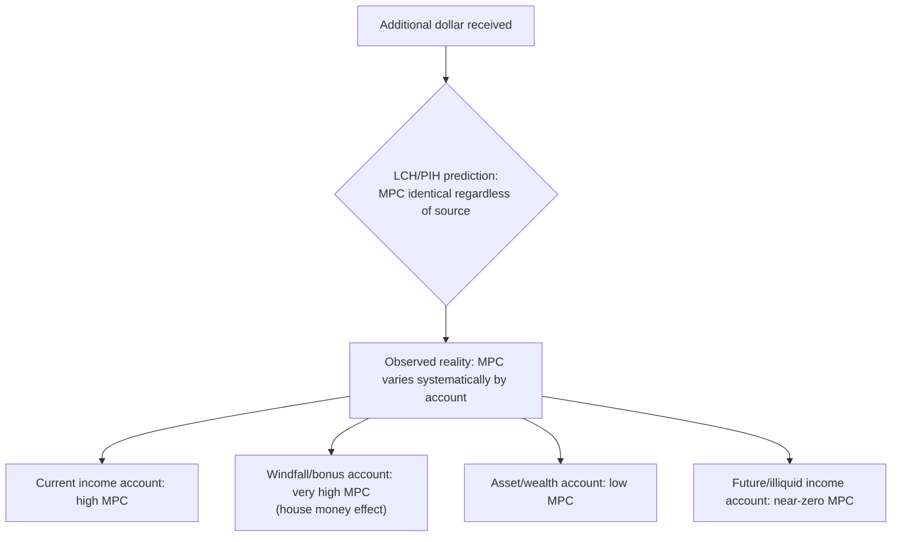
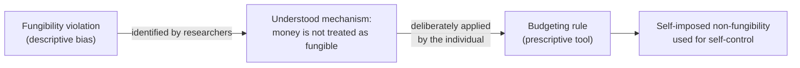

## Fungibility Violations and Budgeting Rules

### Definition

Fungibility, in standard economic theory, is the assumption that money is perfectly interchangeable regardless of its source, physical form, or the label attached to it — a dollar earned as salary, a dollar received as a gift, and a dollar saved for a specific purpose should all have identical marginal value and be treated identically in consumption decisions. A fungibility violation occurs whenever observed behavior systematically depends on a dollar's label, source, or designated account rather than only on total wealth. Budgeting rules are the self-imposed heuristics — often deliberately exploiting these violations — that households use to allocate money across non-fungible mental categories.

**Key Points**

- Fungibility violations are the empirical core evidence for mental accounting as a distinct behavioral phenomenon, separable from the framing and bracketing components of the broader theory.
- Budgeting rules can be understood as a **deliberate, welfare-improving use** of an otherwise "irrational" bias: households impose artificial non-fungibility on themselves as a self-control device, converting a bias into a tool.
- The theoretical benchmark against which violations are measured is the **life-cycle/permanent-income hypothesis (LCH/PIH)**, which predicts consumption should track total lifetime wealth, not the source or label of any given dollar.

### The Standard Benchmark: Life-Cycle/Permanent-Income Hypothesis

Under the LCH/PIH (Modigliani-Brumberg; Friedman), a rational agent smooths consumption based on the present value of total lifetime resources:

$$c_t = f(\text{PV of lifetime wealth}), \quad \text{independent of how that wealth is labeled or received}$$

This implies the **marginal propensity to consume (MPC)** out of an additional dollar should be identical whether that dollar arrives as a temporary bonus, a permanent salary increase, an asset appreciation, or a small windfall — since all are simply additions to the same fungible wealth stock. Empirical departures from this equal-MPC prediction constitute a fungibility violation.

### Documented Categories of Fungibility Violations

#### 1. Differential MPC by Income Source

Empirical studies of tax rebates, stimulus payments, and windfalls consistently find MPC out of one-time or "unusual" payments differs from MPC out of regular income, even holding total wealth constant. [Inference] Estimated MPC magnitudes vary considerably across studies, payment types, and business cycle conditions, so no single universal MPC figure should be treated as a fixed constant — but the qualitative pattern of source-dependent spending is robustly replicated.

#### 2. The House Money Effect

Money perceived as a windfall (gambling winnings, unexpected gifts, lottery proceeds) is mentally coded into a separate, more "spendable" account than earned income — a term originating from the gambling context, where bettors are more willing to risk winnings ("the house's money") than their own original stake. This produces both higher consumption propensity and higher risk tolerance for windfall-sourced funds relative to equivalent earned funds.

#### 3. Simultaneous High-Interest Debt and Low-Yield Savings

A frequently cited violation: households hold revolving credit card debt at high interest rates while simultaneously maintaining savings or checking balances earning near-zero interest, rather than paying down debt with the savings — a strategy that would be strictly wealth-improving under fungibility. This is explained by mental accounting as the debt and the savings occupying separate "accounts" with different psychological purposes (the savings account may be mentally earmarked as an "emergency fund," treated as untouchable even when net-wealth-improving to redirect).

#### 4. Sticky Category Budgets

Households that maintain informal category-specific spending limits (groceries, entertainment, clothing) often decline to reallocate unspent funds from an under-used category to an over-used one, even within the same budgeting period — violating fungibility at the sub-account level, not just across income-source accounts.

**Example**

A household with $200 remaining unspent in its monthly "clothing" budget but only $20 left in "dining out" may decline a $40 restaurant meal, framing it as "over budget," despite total discretionary spending for the month remaining well under the combined category limits.

### Budgeting Rules: From Bias to Deliberate Tool

While fungibility violations are typically documented as a bias relative to rational-agent predictions, the same underlying psychological mechanism can be **deliberately harnessed** as a self-control strategy — converting an involuntary cognitive tendency into a voluntary commitment structure. This reframes budgeting rules as an applied extension of the theory developed for self-control problems and commitment devices.

| Budgeting rule | Mechanism | Self-control function |
| --- | --- | --- |
| Envelope method (cash divided into labeled physical envelopes) | Forces hard non-fungibility via physical separation | Prevents overspending in one category by making cross-category "borrowing" physically effortful |
| Labeled/named sub-accounts (e.g., bank "buckets") | Creates soft non-fungibility via categorization | Reduces temptation to raid savings by making the earmarked purpose salient |
| Fixed percentage allocation rules (e.g., 50/30/20 budgeting) | Pre-commits proportional splits across broad categories | Reduces in-the-moment decision fatigue and ad hoc reallocation |
| "Pay yourself first" automatic transfers | Removes discretionary income from the current-income account before it is mentally available for spending | Exploits high MPC of current income by relocating funds to a lower-MPC account before consumption occurs |
| Windfall-specific rules (e.g., "50% of any bonus goes to savings") | Pre-commits treatment of windfall income before the house money effect can take hold | Counters the naturally higher MPC of windfall-labeled money |

### Interaction with Self-Control and Present Bias

Budgeting rules function as a form of commitment device specifically targeted at the mental-accounting channel: by pre-labeling money's purpose, they raise the psychological (and sometimes practical) cost of reallocating it toward immediate temptation, complementing — but operating through a distinct mechanism from — the financial or contractual commitment devices discussed in self-control theory. [Inference] The relative effectiveness of accounting-based commitment (labeled accounts) versus financial commitment (deposit contracts with monetary penalties) likely depends on the individual's specific self-control profile and is not conclusively ranked in the literature as universally superior in either direction.

### Fungibility Violations in Firms and Organizations

Mental accounting and its associated fungibility violations are not confined to household finance; similar effects are documented in organizational budgeting:

- **Departmental "use it or lose it" budgets**: fixed-category departmental budgets that cannot be reallocated across departments or carried forward create incentives for end-of-period wasteful spending, mirroring the sticky category budget pattern at the organizational level.
- **Capital versus operating budget separation**: firms often treat capital expenditure and operating expenditure budgets as non-fungible pools even when a reallocation would be net-present-value-improving, a pattern [Inference] plausibly linked to mental-accounting-style categorization, though formal organizational budgeting rules (governance, accounting standards) are also independently sufficient explanations, making the behavioral contribution difficult to cleanly isolate from institutional constraints.

### Distinguishing Genuine Bias from Rational Uses of Account Structure

Not every instance of category-specific spending reflects behavioral bias. Maintaining separate accounts can be a rational response to:

- **Imperfect self-knowledge about future temptation** (a rational, sophisticated use of commitment, as discussed under self-control theory).
- **Transaction costs of reallocation** (genuine costs of moving funds between account types, such as penalties on tax-advantaged retirement accounts).
- **Principal-agent monitoring needs** (e.g., a household member enforcing a shared budget structure to monitor a partner's spending).

The behavioral signature that identifies a *bias* rather than a rational structure is when the account boundary persists and distorts decisions **even after accounting for such rational motives** — i.e., when an agent would, by their own admission, prefer to reallocate funds across categories but fails to do so purely due to the psychological salience of the account label.

### Related Topics

**Related Topics**

- Mental Accounting Theory
- House Money Effect
- Self-Control Problems and Commitment Devices
- Sunk Cost Fallacy
- Life-Cycle and Permanent-Income Hypotheses
- Marginal Propensity to Consume and Fiscal Stimulus Design
- Behavioral Savings Design and Labeled Accounts
- Choice Bracketing (Narrow vs. Broad)