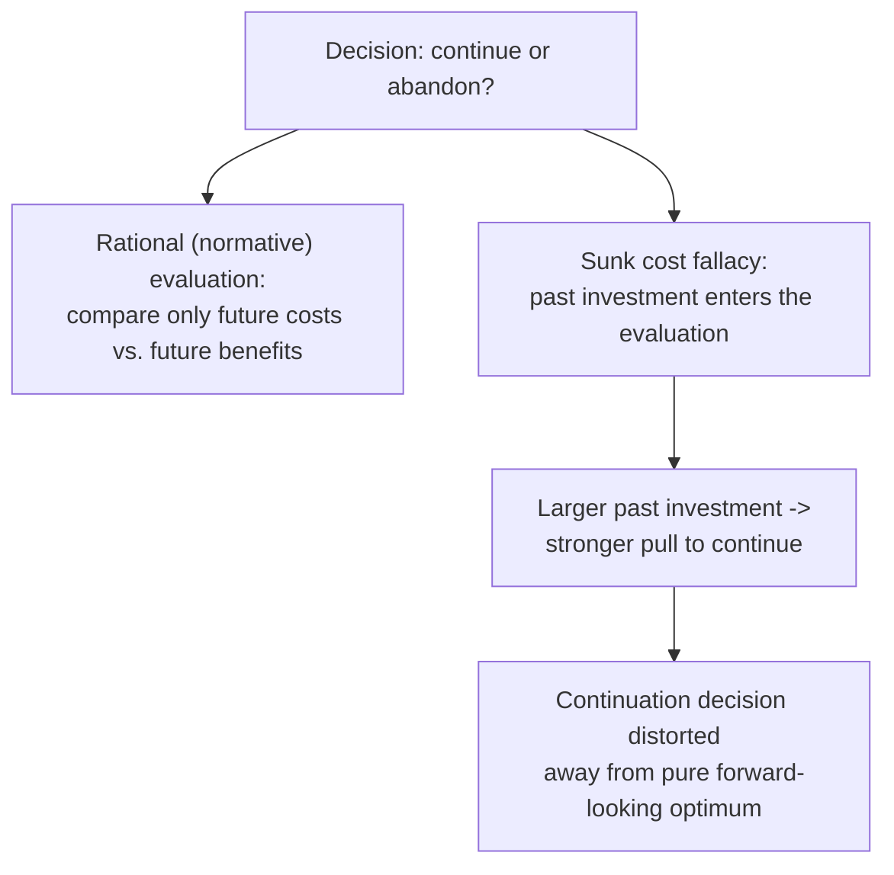

## The Sunk Cost Fallacy

### Definition

The sunk cost fallacy is the tendency to continue investing time, money, or effort into a decision based on the cumulative prior investment already made, rather than basing the decision solely on its future expected costs and benefits. Standard economic theory holds that **sunk costs are irrelevant to forward-looking decisions**: since a sunk cost cannot be recovered regardless of the choice made now, a rational agent should ignore it entirely and evaluate only the marginal costs and benefits going forward.

**Key Points**

- The normative benchmark — that sunk costs should not influence forward-looking choice — is uncontroversial in standard decision theory; the fallacy describes a robust, well-documented *deviation* from this benchmark.
- The sunk cost fallacy is most commonly explained within behavioral economics as a consequence of mental accounting: an open "account" (the investment) feels psychologically incomplete or in need of justification until it produces a positive return, biasing continuation decisions.
- It is closely related to, but conceptually distinct from, loss aversion and escalation of commitment; these mechanisms are often invoked together to explain the same behavioral pattern from complementary angles.

### The Normative Benchmark

For a rational, forward-looking decision-maker, the choice of whether to continue a project, relationship, or course of action should depend only on:

$$\text{Continue if and only if: } E[\text{future benefits}] > E[\text{future costs}]$$

Any cost already incurred — money spent, time invested, effort expended — is, by definition, unrecoverable regardless of the decision made today, and should carry **zero weight** in this comparison. The sunk cost fallacy is observed whenever the magnitude of *past* investment measurably shifts the decision to continue, holding constant the actual future cost-benefit comparison.

### Mental Accounting Explanation

Thaler's mental accounting framework explains the sunk cost fallacy as arising from the psychological need to "close an account" with a net-positive outcome. An unfinished project or an unused purchase represents an **open mental account** with a negative balance (money spent, no return yet realized); abandoning it before extracting value feels like realizing — and formally closing the account on — a loss, which loss aversion makes psychologically painful to accept. Continuing, by contrast, keeps the account open and preserves the possibility of eventually "earning back" the investment, even when this is not the objectively wealth-maximizing path.

**Example**

A household that pays for a full season of theater tickets, then falls sick on the night of a performance, is more likely to attend anyway (rather than staying home to recover) than if the ticket had been given to them for free — despite the cost of the ticket being identical and irrecoverable in both cases at the moment of the decision. The paid-for ticket represents an "open account" that attending helps to close with a sense of return; forgoing it registers as a compounding loss.

### Distinguishing Related Mechanisms

| Concept | Core mechanism | Relationship to sunk cost fallacy |
| --- | --- | --- |
| Mental accounting | Open account needing closure | Provides the accounting-structure explanation for why sunk costs feel relevant |
| Loss aversion | Losses loom larger than equivalent gains | Explains *why* abandoning a sunk-cost project feels like realizing a painful loss |
| Escalation of commitment (organizational behavior literature) | Increasing commitment to a failing course of action, often to justify prior decisions | A related, largely overlapping phenomenon studied more in management/psychology, often driven partly by ego-justification and self-presentation concerns in addition to pure sunk cost reasoning |
| Endowment effect | Overvaluing what one already possesses | Distinct mechanism (ownership-based), but can compound sunk cost effects when the "sunk" investment is also an owned asset |
| Status quo bias | General preference for the current state of affairs | A broader tendency that sunk cost effects can be seen as a specific application of, in contexts involving prior investment |

### Empirical Evidence

#### The Original Concorde Fallacy

The sunk cost fallacy is sometimes called the "Concorde fallacy," referencing the British and French governments' continued funding of the supersonic Concorde aircraft program well after it became evident the project was commercially unviable — a widely cited (though largely anecdotal, non-experimental) illustrative case of large-scale sunk cost reasoning in public investment decisions.

#### Laboratory and Field Evidence

Arkes and Blumer's (1985) foundational experiments demonstrated the effect directly: in one study, theater-goers who paid full price for season tickets attended significantly more performances over the season than those who received a discount on the same tickets, despite both groups facing identical future cost-benefit trade-offs for any individual performance once the season pass was purchased. [Inference] Subsequent replications have found the effect to be robust across many domains (dining, gambling, project management), though effect sizes vary by context, and modern replication efforts in some experimental economics settings have found smaller or more context-dependent effects than the earliest studies suggested — the qualitative direction of the bias is well established, but its universal magnitude is not.

#### Organizational and Managerial Contexts

Sunk cost effects appear prominently in organizational decision-making, particularly around escalation of commitment to failing projects, capital investments, and R&D programs. [Inference] In these settings, sunk cost reasoning is often intertwined with distinct organizational and psychological pressures — including a manager's desire to avoid admitting a prior decision was wrong, reputational concerns, and principal-agent misalignment — making it difficult to attribute observed continuation decisions to sunk cost reasoning in isolation from these other forces.

### Boundary Conditions and Debate

- **Individual differences**: susceptibility to the sunk cost fallacy varies across individuals and has been linked in some studies to factors such as age and decision-making experience, [Inference] though findings on which populations are more or less susceptible are not fully consistent across the literature.
- **Distinguishing genuine information value from pure sunk cost reasoning**: continuing an investment after unexpected costs can sometimes be rational if the additional spending itself reveals new information about the project's prospects (e.g., persisting through a difficult phase because doing so demonstrates project viability) — a valid forward-looking reason for continuation that should not be conflated with the fallacy. The bias is present only when the *magnitude of the past cost itself*, rather than any genuine informational or option value it reveals, drives the continuation decision.
- **Framing manipulations**: the size of the sunk cost effect has been shown experimentally to be sensitive to how the choice is framed (e.g., explicit reminders to "ignore sunk costs" can reduce, though [Inference] not reliably eliminate, the effect in experimental settings), suggesting the bias operates partly through attentional and framing channels rather than being a fully automatic, unavoidable response.

### Practical and Policy Applications

<svg xmlns="http://www.w3.org/2000/svg" viewBox="0 0 740 280" font-family="Helvetica, Arial, sans-serif">
<text x="370" y="26" text-anchor="middle" font-size="16" font-weight="bold" fill="#1a1a1a">Debiasing Strategies for Sunk Cost Reasoning (svg_diagram)</text>
<rect x="40" y="55" width="330" height="90" rx="8" fill="#eef3fb" stroke="#3b6ea5" stroke-width="1.5" />
<text x="205" y="80" text-anchor="middle" font-size="13" font-weight="bold" fill="#20456e">Reframe the decision</text>
<text x="60" y="105" font-size="11" fill="#333">Ask: "If I were starting fresh today,</text>
<text x="60" y="123" font-size="11" fill="#333">would I choose to begin this now?"</text>
<rect x="390" y="55" width="330" height="90" rx="8" fill="#eef7ee" stroke="#2a7a3b" stroke-width="1.5" />
<text x="555" y="80" text-anchor="middle" font-size="13" font-weight="bold" fill="#1d5c2b">Separate evaluator from decider</text>
<text x="410" y="105" font-size="11" fill="#333">Have someone uninvolved in the original</text>
<text x="410" y="123" font-size="11" fill="#333">investment review continuation decisions</text>
<rect x="40" y="165" width="330" height="90" rx="8" fill="#fbeeee" stroke="#a53b3b" stroke-width="1.5" />
<text x="205" y="190" text-anchor="middle" font-size="13" font-weight="bold" fill="#6e2020">Pre-commit exit criteria</text>
<text x="60" y="215" font-size="11" fill="#333">Set objective abandonment thresholds</text>
<text x="60" y="233" font-size="11" fill="#333">before investment begins, not during</text>
<rect x="390" y="165" width="330" height="90" rx="8" fill="#f7f2e8" stroke="#9a7a2a" stroke-width="1.5" />
<text x="555" y="190" text-anchor="middle" font-size="13" font-weight="bold" fill="#6b5015">Track record transparently</text>
<text x="410" y="215" font-size="11" fill="#333">Make prior investment losses visible and</text>
<text x="410" y="233" font-size="11" fill="#333">normalized, reducing justification pressure</text>
</svg>

- **Project management and capital budgeting**: firms increasingly formalize "stage-gate" review processes with predetermined, objective continuation criteria, specifically designed to reduce the influence of cumulative prior spending on go/no-go decisions.
- **Personal finance**: financial advisors commonly counsel clients to evaluate underperforming investments based on forward-looking prospects alone, explicitly disregarding the original purchase price — advice directly targeting sunk cost reasoning in a household investment context.
- **Consumer behavior and marketing**: firms are aware that sunk cost reasoning can be leveraged to increase customer retention (e.g., loyalty programs, non-refundable prepayment structures), which raises the same "bias as deliberately exploited design feature" dynamic discussed for mental accounting more broadly.

### Related Topics

**Related Topics**

- Mental Accounting Theory
- Loss Aversion and Reference Dependence
- Fungibility Violations and Budgeting Rules
- Escalation of Commitment (Organizational Behavior)
- Endowment Effect
- Status Quo Bias
- Prospect Theory and the Value Function