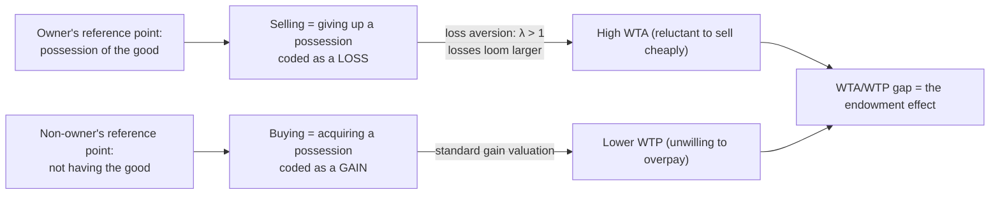

## The Endowment Effect

### Definition

The endowment effect is the tendency for individuals to assign a higher value to an object or asset once they own it than they would have assigned to the same object before ownership — producing a systematic gap between an owner's minimum acceptable selling price (willingness-to-accept, WTA) and a potential buyer's maximum purchase price (willingness-to-pay, WTP) for an identical good. The term was coined by Richard Thaler (1980), building directly on the loss-averse value function of prospect theory (Kahneman & Tversky, 1979).

**Key Points**

- The endowment effect is a specific, well-replicated prediction of loss aversion applied to trading decisions: giving up an owned good is coded as a loss, while acquiring an unowned good is coded as a gain, and losses loom larger than equivalent gains.
- The canonical experimental demonstration is the "mug experiment" (Kahneman, Knetsch & Thaler, 1990), which found WTA prices roughly double WTP prices for an identical, randomly assigned object.
- The endowment effect directly implies a violation of the **Coase theorem's** prediction that, absent transaction costs, initial allocation of property rights should not affect final efficient allocation — ownership itself changes valuation, and therefore can change trading outcomes.

### Theoretical Foundation: Loss Aversion Applied to Trade

Under the prospect theory value function, losses relative to a reference point are weighted more heavily than equivalent gains, typically by a loss-aversion coefficient $\lambda > 1$:

$$v(x) = \begin{cases} x^{\alpha} & x \geq 0 \\ -\lambda(-x)^{\beta} & x < 0 \end{cases}$$

Applying this to a trading decision, an owner's reference point is *possession* of the good. Selling requires giving it up — coded as a loss — while a non-owner's reference point is *not having* the good, so acquiring it is coded as a gain. Since $\lambda > 1$, the pain of the potential loss (for the seller) exceeds the pleasure of the equivalent gain (for the buyer), producing:

$$\text{WTA} > \text{WTP} \quad \text{for the identical good}$$

### The Canonical Experiment: Kahneman, Knetsch & Thaler (1990)

In the widely cited mug experiment, participants were randomly assigned to one of three groups: "sellers" given a coffee mug and asked their minimum selling price, "buyers" given no mug and asked their maximum purchase price, and a "choosers" group asked to choose between receiving a mug or an equivalent amount of cash (a condition designed to control for pure ownership by removing actual possession while still forcing a mug-versus-cash judgment). The study found median seller valuations roughly double median buyer valuations for the identical mug, while the choosers' valuations fell closer to the buyers' — supporting the interpretation that **actual possession**, not merely being asked to imagine owning the good, drives the bulk of the effect.

**Example**

A person who inherits a piece of furniture they did not select may demand a substantially higher price to sell it than they themselves would have been willing to pay to acquire an identical piece from a store — despite no functional difference in the object itself, and despite having made no deliberate choice to acquire it in the first place.

### Boundary Conditions and Moderating Factors

The endowment effect is not universal in magnitude, and research has identified conditions under which it strengthens, weakens, or disappears:

| Factor | Effect on endowment effect magnitude |
| --- | --- |
| Goods held for personal use/consumption vs. goods held for exchange/resale | Effect is substantially weaker or absent for goods the owner acquired specifically to trade (e.g., a token explicitly designated as tradeable, or goods held by experienced market traders such as coin/card dealers) |
| Market experience | More experienced traders in a given market context tend to show smaller endowment effects for goods within their domain of trading expertise, though [Inference] the degree to which experience generalizes across unrelated goods is less established |
| Duration of ownership | Longer periods of ownership are generally associated with a stronger effect, consistent with the reference point more fully updating to include the good |
| Nature of the good (experiential vs. purely functional/monetary) | Effects have been found to vary by good type, though [Inference] there is no fully settled taxonomy predicting effect size purely from good category across the literature |

### Relationship to the Coase Theorem

The Coase theorem, a foundational result in law and economics, holds that in the absence of transaction costs, the initial assignment of a property right does not affect the efficiency of the final allocation — bargaining will move the good to whoever values it most, regardless of who started with it. The endowment effect directly undermines a key behavioral premise of this result: if valuation itself changes depending on who holds the initial right, then the initial allocation is **not neutral**, since it changes the very willingness-to-trade thresholds on both sides of the bargain, independent of transaction costs. This has direct implications for legal and regulatory design, where initial rights assignments (e.g., default consumer protections, environmental permits, custody defaults) may persist as final outcomes even in low-transaction-cost settings, purely because of endowment-driven valuation shifts.

### Distinguishing the Endowment Effect from Related Concepts

| Concept | Relationship to the endowment effect |
| --- | --- |
| Loss aversion | The direct underlying mechanism; the endowment effect is loss aversion specifically applied to a trading/valuation context |
| Status quo bias | A broader tendency to prefer the current state of affairs across any decision domain, of which endowment-effect-driven reluctance to trade is one specific manifestation |
| Sunk cost fallacy | Distinct mechanism (concerns *prior investment*, not current possession), though both can jointly inflate resistance to giving up an asset already held |
| Reference-dependent preferences | The general theoretical framework (valuing outcomes relative to a reference point rather than in absolute terms) that both loss aversion and the endowment effect are specific applications of |
| Mere ownership effect (broader psychology literature) | A related, sometimes overlapping concept from social psychology describing enhanced liking or positive evaluation of self-owned objects, independent of the specific WTA/WTP pricing framework |

### Debates and Alternative Explanations

- **Procedural/experimental artifact critiques**: some researchers have argued that early WTA/WTP gaps partly reflected experimental design issues (e.g., poorly incentivized elicitation mechanisms, participant confusion about the elicitation task), and that more carefully incentivized designs (e.g., using the Becker-DeGroot-Marschak mechanism) tend to find smaller, though [Inference] still generally non-zero, gaps — suggesting the effect is real but its magnitude in early studies may have been partly inflated by methodological factors.
- **List (2003, 2004) market-experience findings**: field experiments with sports card and pin traders found that market-experienced traders exhibited little to no endowment effect for goods within their trading domain, while novice traders showed the standard gap — supporting the interpretation that the effect can be substantially attenuated (though [Inference] not necessarily eliminated entirely) through repeated market experience and learning, rather than being a fixed, immutable feature of preferences.
- **Uncertainty about whether the effect reflects true preference change or attentional/strategic bargaining behavior**: [Inference] there remains some debate in the literature about whether observed WTA/WTP gaps always reflect genuine underlying valuation shifts versus, in some contexts, strategic price-setting behavior by participants who suspect the elicitation exercise itself; this distinction matters for how directly the effect should be extrapolated to real-world market prices outside the lab.

### Applications

<svg xmlns="http://www.w3.org/2000/svg" viewBox="0 0 740 260" font-family="Helvetica, Arial, sans-serif">
<text x="370" y="26" text-anchor="middle" font-size="16" font-weight="bold" fill="#1a1a1a">Applied Domains of the Endowment Effect (svg_diagram)</text>
<rect x="30" y="55" width="220" height="175" rx="10" fill="#eef3fb" stroke="#3b6ea5" stroke-width="1.5" />
<text x="140" y="82" text-anchor="middle" font-size="13" font-weight="bold" fill="#20456e">Consumer Marketing</text>
<text x="50" y="112" font-size="11" fill="#333">Free trial periods</text>
<text x="50" y="134" font-size="11" fill="#333">"Try before you buy"</text>
<text x="50" y="156" font-size="11" fill="#333">Money-back guarantees</text>
<text x="50" y="178" font-size="11" fill="#333">that induce psychological</text>
<text x="50" y="200" font-size="11" fill="#333">ownership before purchase</text>
<rect x="265" y="55" width="220" height="175" rx="10" fill="#eef7ee" stroke="#2a7a3b" stroke-width="1.5" />
<text x="375" y="82" text-anchor="middle" font-size="13" font-weight="bold" fill="#1d5c2b">Real Estate/Negotiation</text>
<text x="285" y="112" font-size="11" fill="#333">Sellers anchoring on</text>
<text x="285" y="134" font-size="11" fill="#333">above-market asking prices</text>
<text x="285" y="156" font-size="11" fill="#333">Longer time-on-market for</text>
<text x="285" y="178" font-size="11" fill="#333">owner-occupied vs. investor-</text>
<text x="285" y="200" font-size="11" fill="#333">owned properties</text>
<rect x="500" y="55" width="220" height="175" rx="10" fill="#fbeeee" stroke="#a53b3b" stroke-width="1.5" />
<text x="610" y="82" text-anchor="middle" font-size="13" font-weight="bold" fill="#6e2020">Law and Policy</text>
<text x="520" y="112" font-size="11" fill="#333">Default rule design in</text>
<text x="520" y="134" font-size="11" fill="#333">contracts and regulation</text>
<text x="520" y="156" font-size="11" fill="#333">Initial allocation of</text>
<text x="520" y="178" font-size="11" fill="#333">property/liability rights</text>
<text x="520" y="200" font-size="11" fill="#333">affecting final outcomes</text>
</svg>

- **Marketing and sales strategy**: free trials, "try before you buy" programs, and generous return policies are designed to induce a sense of psychological ownership before a purchase decision is finalized, raising the effective WTP once the endowment effect takes hold during the trial period.
- **Real estate markets**: seller anchoring on purchase price or long-held valuations, rather than current market-clearing price, is commonly attributed in part to endowment-driven reference point formation, [Inference] though disentangling this from ordinary loss aversion relative to purchase price (a related but distinct anchoring mechanism) is not always straightforward in field data.
- **Legal and regulatory design**: awareness of the endowment effect informs debates over how initial legal entitlements (e.g., default privacy protections, environmental permits, employee benefit defaults) should be assigned, since — contrary to a pure Coasean prediction — the assignment itself can durably shape final outcomes even where formal transaction costs are low.

### Related Topics

**Related Topics**

- Loss Aversion and Reference Dependence
- Prospect Theory and the Value Function
- The Sunk Cost Fallacy
- Status Quo Bias
- Mental Accounting Theory
- Willingness-to-Accept versus Willingness-to-Pay Gaps
- Coase Theorem and Behavioral Critiques