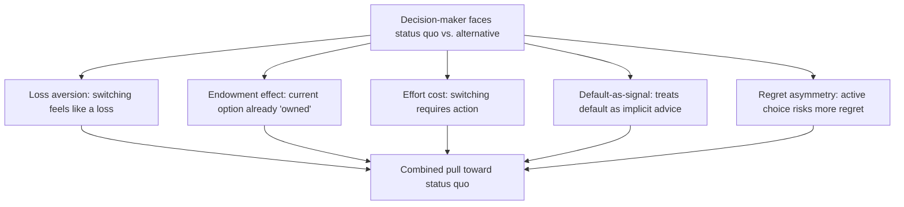

## Status Quo Bias and Default Effects

### Definition

Status quo bias is the tendency to disproportionately prefer the current state of affairs, exhibiting a systematic reluctance to switch away from an existing option even when an alternative would be objectively equal or superior under neutral evaluation. A **default effect** is the specific, widely applied manifestation of status quo bias in which the pre-set option a decision-maker receives absent active choice — the "default" — exerts a strong, disproportionate influence on final outcomes, even when switching away from the default requires minimal effort.

**Key Points**

- Status quo bias was formally named and experimentally demonstrated by Samuelson and Zeckhauser (1988), who showed that merely designating one option as the incumbent/status quo option shifted choices toward it, holding the underlying option set constant.
- Default effects are the applied, policy-relevant subset of status quo bias specifically concerned with how pre-selected options in forms, enrollments, and settings shape real-world outcomes — most prominently documented in retirement savings and organ donation policy.
- The bias is explained by multiple, non-exclusive mechanisms: loss aversion (switching away from the status quo is coded as a potential loss), the endowment effect (the status quo is treated as an owned entitlement), pure inertia/effort costs, and default-as-implied-recommendation (interpreting the default as an implicit expert endorsement).

### Theoretical Mechanisms

Status quo bias is not attributed to a single cause; the literature identifies several overlapping mechanisms that jointly contribute to its strength:

| Mechanism | Explanation |
| --- | --- |
| Loss aversion | The status quo functions as the reference point; any deviation involves giving up features of the current state, which registers as a loss even if the alternative also has offsetting gains |
| Endowment effect | The current option is treated as already "owned," inflating its perceived value relative to unowned alternatives |
| Effort/transaction costs | Actively switching requires cognitive and sometimes procedural effort (filling forms, researching alternatives), creating a rational — not purely behavioral — component to status quo persistence |
| Default-as-recommendation | Decision-makers may interpret a pre-set default as an implicit signal of what a knowledgeable party (employer, policymaker, platform designer) recommends, especially under uncertainty |
| Regret avoidance | Actively choosing to switch and having it turn out poorly may generate more anticipated regret than passively remaining with a default that turns out poorly, even when the objective outcome is identical |

### The Samuelson-Zeckhauser Experimental Demonstration

Samuelson and Zeckhauser's original studies presented participants with investment or policy choice scenarios, varying only whether a particular option was framed as the pre-existing/inherited status quo or as one option among a neutral set with no designated status quo. They found participants disproportionately chose whichever option was framed as the status quo, even though the underlying menu of options and their objective merits were held constant across framings — isolating the psychological effect of "incumbency" itself from any genuine difference in option quality.

**Example**

Employees automatically enrolled in a company's default retirement contribution rate (e.g., 3% of salary into a target-date fund) tend to remain at that rate for years, rarely adjusting it upward even when their own stated savings goals would justify a higher contribution — while employees required to actively select a contribution rate from the same menu, with no default pre-selected, choose a wide range of rates reflecting their actual stated preferences more closely.

### Default Effects: The Applied Policy Dimension

#### Retirement Savings

Madrian and Shea's (2001) study of 401(k) enrollment is among the most cited applied demonstrations: switching a company's retirement plan from an opt-in default (employees must actively enroll) to an opt-out default (employees are automatically enrolled unless they actively decline) produced large increases in plan participation rates, with many employees remaining at the automatically assigned contribution rate and fund allocation for extended periods rather than customizing it, even when the default parameters were not individually optimized for their circumstances.

#### Organ Donation Policy

Cross-country comparisons of organ donation consent rates (Johnson & Goldstein, 2003) found dramatically higher effective donor registration rates in countries using **presumed consent** (opt-out: citizens are registered as donors by default unless they actively opt out) relative to countries using **explicit consent** (opt-in: citizens must actively register), a pattern widely interpreted as a large-scale, real-world default effect operating on a decision with substantial ethical and personal weight, not merely low-stakes consumer choices. [Inference] The precise causal contribution of the default itself versus other cross-national differences (administrative systems, public awareness campaigns, cultural attitudes) in these cross-country comparisons has been debated, and later within-country natural experiments have generally supported a genuine default effect, though the estimated magnitude varies by study design.

#### Insurance and Benefits Enrollment

Default plan selections in employer-provided health insurance and other benefits programs (e.g., default enrollment tiers, default beneficiary designations) show similarly high persistence rates, with a substantial share of employees remaining on default-assigned plans even when alternative plans would better match their stated risk profiles or family circumstances.

### Distinguishing Status Quo Bias from Rational Persistence

Not every instance of sticking with the status quo reflects behavioral bias — genuine transaction costs, switching costs, and legitimate uncertainty about alternatives can rationally justify persistence. The behavioral signature that identifies true status quo bias is when **persistence exceeds what these rational factors alone would predict** — most clearly demonstrated when:

- The switching cost is trivial (e.g., a single checkbox), yet persistence remains high.
- The specific *labeling* of an option as the status quo, holding the option set and switching cost constant, itself changes the choice (as in the Samuelson-Zeckhauser design).
- Individuals report, when surveyed, that they would prefer an alternative to their current default, yet do not act to switch — revealing a preference-behavior gap not explained by genuine indifference.

### Default Effects and Libertarian Paternalism

The strength and reliability of default effects underpin the policy framework of **libertarian paternalism** (Thaler & Sunstein, *Nudge*, 2008): because defaults are known to exert substantial influence on outcomes, and because *some* default must be chosen in any system requiring a status quo option (there is no neutral "no default" state in most institutional contexts), policymakers and choice architects can select defaults that steer outcomes toward what most people would choose if fully engaged and informed — while preserving the formal freedom to opt out for anyone with a genuine preference to deviate.

<svg xmlns="http://www.w3.org/2000/svg" viewBox="0 0 740 260" font-family="Helvetica, Arial, sans-serif">
<text x="370" y="26" text-anchor="middle" font-size="16" font-weight="bold" fill="#1a1a1a">Opt-In vs. Opt-Out Default Structures (svg_diagram)</text>
<rect x="60" y="55" width="280" height="180" rx="10" fill="#eef3fb" stroke="#3b6ea5" stroke-width="1.5" />
<text x="200" y="82" text-anchor="middle" font-size="13" font-weight="bold" fill="#20456e">Opt-In Default</text>
<text x="80" y="112" font-size="11" fill="#333">Default state: NOT enrolled/participating</text>
<text x="80" y="134" font-size="11" fill="#333">Requires active action to join</text>
<text x="80" y="156" font-size="11" fill="#333">Typically yields lower participation</text>
<text x="80" y="178" font-size="11" fill="#333">Participants who do join tend to be</text>
<text x="80" y="198" font-size="11" fill="#333">more actively engaged/self-selected</text>
<rect x="400" y="55" width="280" height="180" rx="10" fill="#eef7ee" stroke="#2a7a3b" stroke-width="1.5" />
<text x="540" y="82" text-anchor="middle" font-size="13" font-weight="bold" fill="#1d5c2b">Opt-Out Default</text>
<text x="420" y="112" font-size="11" fill="#333">Default state: enrolled/participating</text>
<text x="420" y="134" font-size="11" fill="#333">Requires active action to leave</text>
<text x="420" y="156" font-size="11" fill="#333">Typically yields higher participation</text>
<text x="420" y="178" font-size="11" fill="#333">Participants may remain passively</text>
<text x="420" y="198" font-size="11" fill="#333">enrolled without full engagement</text>
</svg>

### Ethical and Design Considerations

- **Who sets the default matters**: because defaults exert outsized influence, the choice of default becomes a substantive policy or design decision in itself, raising questions about the responsibility and accountability of whoever selects it (employer, platform, government).
- **Defaults are not neutral even when framed as "just a starting point"**: the evidence base establishes that defaults causally shape outcomes rather than merely reflecting pre-existing preferences, which is central to why choice-architecture interventions are considered a genuine policy lever rather than a passive information-neutral baseline.
- **Reversibility and ease of opt-out remain ethically relevant**: libertarian paternalist designs are typically defended on the grounds that the default can be costlessly reversed by anyone with a strong contrary preference, distinguishing default-setting from more coercive interventions that remove choice entirely — though [Inference] critics have debated how meaningfully "costless" reversal really is once inertia, effort costs, and the other mechanisms above are accounted for.

### Related Topics

**Related Topics**

- The Endowment Effect
- Loss Aversion and Reference Dependence
- Libertarian Paternalism and Choice Architecture
- Self-Control Problems and Commitment Devices
- Save More Tomorrow and Behavioral Savings Design
- Mental Accounting Theory
- Regret Aversion in Decision-Making