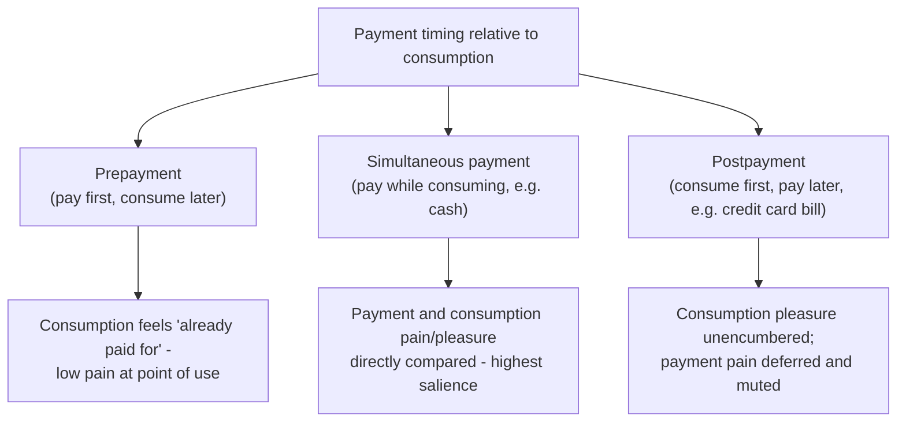

## Payment Decoupling and the Pain of Paying

### Definition

The "pain of paying" refers to the immediate psychological discomfort associated with the act of parting with money, distinct from the economic cost of the underlying purchase itself. **Payment decoupling** describes any mechanism — temporal, procedural, or perceptual — that separates the moment of payment from the moment of consumption, thereby reducing the salience and intensity of this pain and altering spending behavior relative to a fully coupled (pay-as-you-consume) baseline. The concept was formalized primarily by Prelec and Loewenstein (1998) in their model of mental "double-entry" accounting for purchases.

**Key Points**

- The pain of paying is theorized to draw on neural and psychological mechanisms overlapping with the processing of physical pain or loss, giving the concept both a behavioral-economic and, in some research, a neuroeconomic basis.
- Decoupling operates along two primary dimensions: **temporal decoupling** (separating the timing of payment from consumption) and **evaluability/transparency decoupling** (reducing how salient or trackable the monetary cost feels at the point of use).
- Payment decoupling is widely and deliberately exploited in the design of payment instruments and business models (credit cards, subscriptions, prepaid systems, all-inclusive pricing), making it one of the most commercially applied concepts in mental accounting theory.

### Prelec and Loewenstein's Mental Accounting Model of Payment

Prelec and Loewenstein model consumption and payment as two separate entries in a mental ledger, each carrying its own hedonic impact: consumption generates pleasure, while payment generates displeasure (the pain of paying), and the two are integrated or separated in memory depending on their temporal and perceptual proximity. Key predictions of the model:

- **Prepayment reduces the pain of paying at the moment of consumption**: because the payment pain is experienced and "written off" before consumption occurs, the subsequent consumption experience is unencumbered by simultaneous payment pain, making it feel more purely pleasurable.
- **Postpayment (paying after consuming) similarly separates the two**, though the mechanism differs: consumption is not tainted by simultaneous payment pain, but a (typically muted) pain of paying resurfaces later, when the bill arrives — a "debt account" that many consumers report as psychologically far less vivid than the original consumption pleasure.
- **Simultaneous, transparent payment produces the most pain**, because the mental ledger entries for pleasure and pain are experienced together and directly offset one another in a single, salient comparison — this is the least "decoupled" case.

### Dimensions of Decoupling

#### Temporal Decoupling

Separating *when* money leaves the payer's control from *when* the good or service is consumed. All-inclusive vacation packages, prepaid gift cards, and prepaid phone/data plans exemplify strong temporal decoupling: the salient, singular payment event occurs well before the (often many, spread-out) consumption events, so each individual consumption moment carries no fresh payment pain.

#### Evaluability / Transparency Decoupling

Separating the *form* of payment from a directly felt monetary cost, even when payment is contemporaneous with consumption. Credit and debit cards, mobile payment apps, and in-app virtual currencies (tokens, points, credits) reduce the transparency of the transaction relative to handing over physical cash, weakening the direct, tangible sense of "money leaving my hand."

**Example**

Casino chips and in-game virtual currencies function as an evaluability-decoupling mechanism: because chips or tokens are not immediately recognized by the brain with the same salience as cash, spending them at a gaming table or in an app store tends to feel psychologically "cheaper" than spending an equivalent cash amount directly, even though the underlying monetary value is identical and the exchange rate is fully known to the purchaser.

### Empirical Evidence

#### Cash versus Card Spending

Prelec and Simester (2001) conducted a field study auctioning tickets to a sporting event, finding that participants bidding with the ability to pay by credit card submitted substantially higher bids on average than those restricted to cash payment for the identical item — consistent with credit cards reducing the felt pain of paying at the moment of the purchase decision, thereby raising willingness to pay. [Inference] Subsequent research has generally supported a cash-versus-card spending gap across various settings, though the precise magnitude varies by study, population, and purchase category, and some of the effect may also reflect liquidity constraints and mental budget-tracking differences between cash and card users rather than pain-of-paying alone.

#### Subscription and Flat-Rate Pricing

The gym membership puzzle (DellaVigna & Malmendier, 2006) discussed in the context of self-control and present bias can also be partly understood through a payment-decoupling lens: a single upfront or recurring flat monthly fee decouples the payment event from each individual gym visit, reducing the marginal pain of paying associated with any specific visit (or lack thereof) — potentially contributing, alongside present-biased overconfidence, to the observed pattern of low marginal usage relative to a pay-per-visit benchmark.

#### Mobile and Digital Payment Adoption

[Inference] Survey and field research on mobile wallet and contactless payment adoption has generally found associations between more frictionless, decoupled payment methods and higher average transaction sizes or spending frequency relative to cash, though causal identification in real-world commercial settings is complicated by self-selection (heavier spenders may independently be more likely to adopt convenient payment methods), so care is warranted in attributing all such correlations purely to a payment-decoupling mechanism.

### Business and Product Design Applications

<svg xmlns="http://www.w3.org/2000/svg" viewBox="0 0 740 280" font-family="Helvetica, Arial, sans-serif">
<text x="370" y="26" text-anchor="middle" font-size="16" font-weight="bold" fill="#1a1a1a">Payment Decoupling Mechanisms in Product Design (svg_diagram)</text>
<rect x="30" y="55" width="220" height="195" rx="10" fill="#eef3fb" stroke="#3b6ea5" stroke-width="1.5" />
<text x="140" y="82" text-anchor="middle" font-size="13" font-weight="bold" fill="#20456e">Prepaid Systems</text>
<text x="50" y="112" font-size="11" fill="#333">Gift cards</text>
<text x="50" y="134" font-size="11" fill="#333">All-inclusive travel packages</text>
<text x="50" y="156" font-size="11" fill="#333">Prepaid mobile data plans</text>
<text x="50" y="178" font-size="11" fill="#333">Season passes / punch cards</text>
<rect x="265" y="55" width="220" height="195" rx="10" fill="#eef7ee" stroke="#2a7a3b" stroke-width="1.5" />
<text x="375" y="82" text-anchor="middle" font-size="13" font-weight="bold" fill="#1d5c2b">Deferred/Bundled Billing</text>
<text x="285" y="112" font-size="11" fill="#333">Credit card monthly statements</text>
<text x="285" y="134" font-size="11" fill="#333">Subscription flat-rate services</text>
<text x="285" y="156" font-size="11" fill="#333">"Buy now, pay later" installments</text>
<text x="285" y="178" font-size="11" fill="#333">Auto-renewing memberships</text>
<rect x="500" y="55" width="220" height="195" rx="10" fill="#fbeeee" stroke="#a53b3b" stroke-width="1.5" />
<text x="610" y="82" text-anchor="middle" font-size="13" font-weight="bold" fill="#6e2020">Abstracted Currency</text>
<text x="520" y="112" font-size="11" fill="#333">In-app virtual currencies/tokens</text>
<text x="520" y="134" font-size="11" fill="#333">Casino chips</text>
<text x="520" y="156" font-size="11" fill="#333">Loyalty points systems</text>
<text x="520" y="178" font-size="11" fill="#333">Cryptocurrency/digital wallets</text>
</svg>

- **Subscription business models**: recurring flat-fee billing decouples payment from individual usage instances, supporting business models where consumers systematically under-track their cumulative marginal usage relative to cost.
- **Buy-now-pay-later (BNPL) products**: split installment payments further decouple the total cost from any single payment event, reducing the salience of the aggregate price at the point of purchase decision.
- **Loyalty points and rewards currencies**: converting cash into points or miles creates an additional layer of evaluability decoupling, since the "cost" of redeeming points for a reward is less directly comparable to a cash price than a transaction denominated in the payer's home currency.

### Consumer Welfare and Policy Considerations

- **Debiasing tools**: budgeting apps and card issuers that provide real-time spending notifications or itemized, immediate transaction summaries are designed to *re-couple* payment salience with consumption in digital or deferred-payment contexts, directly countering the decoupling effects otherwise built into the payment instrument.
- **Regulatory disclosure requirements**: mandated all-in pricing disclosures, total-cost annual percentage rate (APR) disclosures for credit and BNPL products, and cooling-off periods for high-value purchases can be understood partly as policy responses to payment decoupling's tendency to obscure the true aggregate cost of a purchase decision at the point of commitment.
- **Consumer debt accumulation**: [Inference] payment decoupling mechanisms — particularly postponed and abstracted billing — are frequently cited as a contributing behavioral factor in consumer debt accumulation patterns, alongside present bias and other self-control mechanisms, though isolating the independent quantitative contribution of decoupling specifically (versus interest rates, income shocks, and other financial factors) is not straightforward from observational data alone.

### Related Topics

**Related Topics**

- Mental Accounting Theory
- Self-Control Problems and Commitment Devices
- Loss Aversion and Reference Dependence
- Fungibility Violations and Budgeting Rules
- Present Bias
- Credit Card Debt and Behavioral Finance
- Consumer Protection and Disclosure Regulation