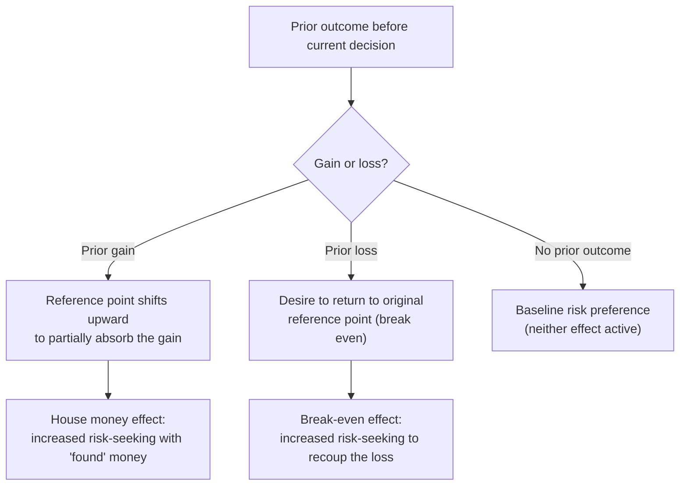

## Windfall Gains and the House Money Effect

### Definition

A windfall gain is money received that was unearned, unexpected, or not the product of the recipient's regular income-generating effort — bonuses, lottery winnings, gambling proceeds, tax refunds, gifts, and inheritances are the primary examples. The **house money effect**, a term originating from casino gambling (where winnings are colloquially "the house's money" rather than the gambler's own), describes the specific behavioral pattern whereby windfall-sourced money is mentally coded as less "real" or less one's own than earned income, resulting in both a higher marginal propensity to consume it and a greater willingness to take risks with it, relative to equivalent amounts of regular earned income.

**Key Points**

- The house money effect is a specific, well-documented instance of mental accounting's broader prediction that money is not treated as fungible across sources — here, the "source" account is windfall versus earned income.
- The effect was formally documented in a risk-taking context by Thaler and Johnson (1990), who showed experimentally that prior gains increase subsequent risk-seeking behavior relative to a baseline with no prior gain.
- The house money effect operates on **two separable dimensions**: consumption behavior (windfalls are spent more readily) and risk-taking behavior (windfalls are wagered or invested more readily), both departing from the fungibility benchmark in the same qualitative direction.

### Theoretical Mechanism

#### Mental Accounting and the "Not Really Mine" Effect

Windfall gains are argued to enter a distinct mental account from earned income — one implicitly coded as a bonus above a baseline reference point of prior wealth, rather than as a permanent addition to that baseline. Because the money was not "worked for" through the individual's regular effort, its loss (through spending or risky wagering) does not feel like a loss relative to the pre-windfall reference point in the same way that spending down earned savings would.

#### Reference Point Shifting and the Break-Even Effect

Thaler and Johnson's original formulation ties the house money effect to how a **prior gain shifts the reference point** for subsequent decisions: after winning, a gambler's reference point may shift upward to partially incorporate the recent gain, making subsequent losses (up to the amount of the prior gain) feel like merely forgoing a portion of unexpected good fortune, rather than a true loss relative to pre-windfall wealth. This produces increased risk-seeking specifically in the domain of amounts up to the recent gain — a pattern termed the **"house money effect"** proper.

A closely related but distinct pattern, the **"break-even effect,"** describes increased risk-seeking specifically among individuals who have experienced a *prior loss* and are given a chance to recoup it: the desire to return to the original reference point (break even) can motivate greater risk-taking than either a no-prior-outcome baseline or, in some cases, than the risk appetite following a prior gain.

### Thaler and Johnson's Experimental Evidence

Thaler and Johnson (1990) presented participants with sequential gambling scenarios, varying whether a choice was preceded by a prior gain, a prior loss, or no prior outcome. They found that participants who had just experienced a gain were significantly more willing to accept a subsequent risky gamble than those with no prior outcome, provided the potential loss in the new gamble did not exceed the size of the prior gain — consistent with the house money framing where the "cushion" of the recent win absorbs the downside risk psychologically. When potential losses exceeded the prior gain (threatening the pre-windfall wealth baseline), risk-seeking reverted toward or below the no-prior-outcome baseline, indicating the effect operates specifically within the bounds of the windfall amount rather than reflecting a general, unconditional increase in risk tolerance.

**Example**

A gambler who wins $200 early in a casino visit is, according to the house money pattern, more likely to wager a substantial portion of that $200 on subsequent bets than they would be to wager an equivalent $200 drawn from their regular checking account on a similarly risky proposition presented as a standalone decision — even though the $200 is, from that point forward, equally part of the gambler's total wealth in either case.

### Consumption-Side Evidence: Windfalls and Marginal Propensity to Consume

Beyond gambling and risk-taking, the house money effect extends to consumption decisions involving non-gambling windfalls:

- **Tax refunds and rebates**: studies of consumer spending following tax refunds and stimulus payments have generally found higher marginal propensity to consume out of these lump-sum, "unexpected" payments relative to equivalent regular income, [Inference] though — as with fungibility violation estimates generally — the precise magnitude varies substantially by study, payment framing (rebate vs. bonus vs. refund), and macroeconomic context, and should not be treated as a single fixed parameter.
- **Bonus income**: workplace bonuses, even when fully anticipated by the recipient in advance, are frequently spent on discretionary or indulgent purchases at higher rates than equivalent salary increases, consistent with a persistent windfall-labeling effect even under conditions of reduced genuine unexpectedness.
- **Gifts and inheritances**: qualitative and survey research on gift and inheritance spending similarly finds a tendency toward higher discretionary and "treat" spending relative to equivalent-sized earned income, [Inference] though rigorous causal identification in this specific sub-domain is comparatively sparser than for tax rebate studies, which benefit from cleaner natural experiment designs (policy-driven, broad-based rebate rollouts).

### Distinguishing the House Money Effect from Related Concepts

| Concept | Relationship to the house money effect |
| --- | --- |
| Mental accounting | The general theoretical framework; the house money effect is the specific application to windfall-versus-earned-income categorization |
| Reference-dependent preferences / prospect theory | Supplies the mechanism (reference point shifting after a gain) that explains why the house money effect occurs |
| Break-even effect | A related but distinct pattern driven by prior *losses* rather than prior gains, sometimes producing similarly elevated risk-seeking but via a different psychological route |
| Endowment effect | Distinct mechanism (concerns valuation of owned goods relative to unowned goods), though both share a reference-point-based explanation rooted in prospect theory |
| Fungibility violations (general) | The house money effect is one specific, well-studied category within the broader set of source-dependent fungibility violations |

### Applications and Implications

<svg xmlns="http://www.w3.org/2000/svg" viewBox="0 0 740 260" font-family="Helvetica, Arial, sans-serif">
<text x="370" y="26" text-anchor="middle" font-size="16" font-weight="bold" fill="#1a1a1a">House Money Effect: Applied Domains (svg_diagram)</text>
<rect x="30" y="55" width="220" height="175" rx="10" fill="#eef3fb" stroke="#3b6ea5" stroke-width="1.5" />
<text x="140" y="82" text-anchor="middle" font-size="13" font-weight="bold" fill="#20456e">Gambling &amp; Trading</text>
<text x="50" y="112" font-size="11" fill="#333">Casino wagering behavior</text>
<text x="50" y="134" font-size="11" fill="#333">Day-trader risk-taking after</text>
<text x="50" y="156" font-size="11" fill="#333">a profitable trading streak</text>
<text x="50" y="178" font-size="11" fill="#333">Sports betting parlay chains</text>
<rect x="265" y="55" width="220" height="175" rx="10" fill="#eef7ee" stroke="#2a7a3b" stroke-width="1.5" />
<text x="375" y="82" text-anchor="middle" font-size="13" font-weight="bold" fill="#1d5c2b">Fiscal Policy Design</text>
<text x="285" y="112" font-size="11" fill="#333">Stimulus payment framing</text>
<text x="285" y="134" font-size="11" fill="#333">(lump-sum vs. spread across</text>
<text x="285" y="156" font-size="11" fill="#333">paychecks) to influence MPC</text>
<text x="285" y="178" font-size="11" fill="#333">Tax rebate timing decisions</text>
<rect x="500" y="55" width="220" height="175" rx="10" fill="#fbeeee" stroke="#a53b3b" stroke-width="1.5" />
<text x="610" y="82" text-anchor="middle" font-size="13" font-weight="bold" fill="#6e2020">Personal Finance Advice</text>
<text x="520" y="112" font-size="11" fill="#333">"Treat windfalls like earned</text>
<text x="520" y="134" font-size="11" fill="#333">income" savings heuristics</text>
<text x="520" y="156" font-size="11" fill="#333">Automatic windfall-to-savings</text>
<text x="520" y="178" font-size="11" fill="#333">allocation rules</text>
</svg>

- **Financial risk management**: awareness of the house money effect is relevant to professional trading and portfolio management contexts, where risk-taking that escalates after a string of gains may reflect house-money-style reference point shifting rather than a genuine, deliberate reassessment of risk-adjusted opportunity — [Inference] though attributing any specific trader's behavior to this mechanism versus other explanations (updated beliefs, genuine skill signals) requires care in any individual case.
- **Fiscal stimulus design**: policymakers designing rebate or stimulus programs can use knowledge of the house money effect (and the related but distinct broader windfall-MPC literature) to anticipate how payment framing and delivery mechanism (single lump sum versus distributed increments) will affect aggregate consumption response.
- **Personal financial planning**: financial advisors sometimes explicitly counsel clients to mentally relabel windfalls as regular income (e.g., depositing a bonus directly into a retirement account rather than a discretionary spending account) as a deliberate debiasing strategy that exploits categorization to counteract, rather than reinforce, the house money effect.

### Related Topics

**Related Topics**

- Mental Accounting Theory
- Prospect Theory and the Value Function
- Loss Aversion and Reference Dependence
- Fungibility Violations and Budgeting Rules
- The Endowment Effect
- Break-Even Effect in Sequential Risk-Taking
- Marginal Propensity to Consume and Fiscal Stimulus Design