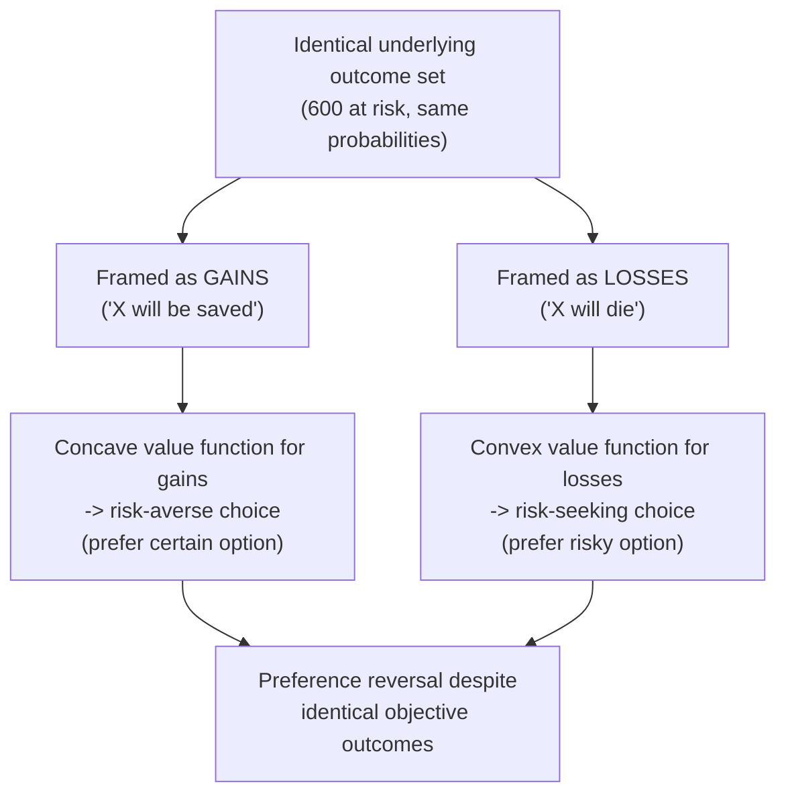

## Framing Effects in Decision-Making

### Definition

A framing effect occurs when logically equivalent descriptions of the same decision problem — differing only in wording, presentation, or context, not in the underlying substantive options, probabilities, or outcomes — produce systematically different choices. Framing effects are among the most direct and robust violations of the standard economic **invariance axiom**, which holds that rational preferences should depend only on the actual outcomes and probabilities involved, not on how those outcomes are described or presented.

**Key Points**

- The foundational demonstration is Tversky and Kahneman's (1981) "Asian disease problem," which showed that identical outcomes framed in terms of lives saved versus lives lost produced opposite risk preferences.
- Framing effects are generally explained through the lens of prospect theory: because the value function is concave for gains and convex for losses, whether an outcome is framed as a gain or a loss relative to an implied reference point determines whether risk-averse or risk-seeking behavior results.
- Framing is not a single unified phenomenon; the literature distinguishes several structurally distinct subtypes (risky-choice framing, attribute framing, goal framing), each with somewhat different mechanisms and typical effect patterns.

### The Canonical Demonstration: The Asian Disease Problem

Tversky and Kahneman presented participants with a hypothetical outbreak expected to kill 600 people, and two policy program choices, described in one of two logically equivalent ways:

**Gain frame:**

- Program A: 200 people will be saved
- Program B: a 1/3 probability of saving all 600 people, and a 2/3 probability of saving no one

**Loss frame (identical outcomes, described differently):**

- Program C: 400 people will die
- Program D: a 1/3 probability that no one dies, and a 2/3 probability that all 600 die

Programs A and C, and B and D, are respectively identical in terms of actual outcomes and probabilities. Yet participants presented with the gain frame overwhelmingly preferred the certain option (A), exhibiting risk aversion, while participants presented with the loss frame overwhelmingly preferred the risky option (D), exhibiting risk seeking — a direct reversal driven purely by the framing of identical outcomes as gains versus losses.

### Theoretical Explanation via Prospect Theory

Framing effects of the risky-choice type are explained as a direct consequence of the S-shaped prospect theory value function combined with the framing-dependent choice of reference point:

$$v(x) = \begin{cases} x^{\alpha} & x \geq 0 \text{ (concave: diminishing sensitivity to gains)} \\ -\lambda(-x)^{\beta} & x < 0 \text{ (convex: diminishing sensitivity to losses)} \end{cases}$$

When a problem is framed in terms of gains (lives saved), the implicit reference point is the worst-case outcome (everyone dies), making all described outcomes register as gains — landing decision-makers on the concave portion of the value function, which favors the certain gain over an equivalent-expected-value gamble. When the identical problem is framed in terms of losses (lives lost), the implicit reference point shifts to the best-case outcome (everyone survives), making all described outcomes register as losses — landing decision-makers on the convex portion, which favors the risky gamble over a certain loss.

### Taxonomy of Framing Effect Subtypes

Levin, Schneider, and Gaeth (1998) proposed an influential three-way taxonomy distinguishing structurally different framing phenomena that are sometimes conflated in looser usage of the term:

| Subtype | Structure | Example |
| --- | --- | --- |
| Risky-choice framing | Gain/loss framing of outcomes under uncertainty, as in the Asian disease problem | Medical treatment described by survival rate vs. mortality rate |
| Attribute framing | A single characteristic of an object or event is described in positive or negative terms | Ground beef labeled "75% lean" vs. "25% fat" |
| Goal framing | The consequences of taking or not taking an action are framed as an avoided loss vs. an achieved gain | "You will lose $50 by not switching providers" vs. "You will save $50 by switching providers" |

Each subtype has somewhat distinct typical effect patterns: attribute framing effects tend to operate primarily through affective/evaluative associations with positive versus negative wording (independent of any risk component), while goal framing effects specifically leverage loss aversion by emphasizing the avoided-loss framing of an action, which tends to be more persuasive than an equivalent achieved-gain framing due to losses looming larger than gains.

**Example**

A medical procedure described to patients as having a "90% survival rate" is generally rated more favorably and chosen more often than the identical procedure described as having a "10% mortality rate," despite the two descriptions conveying mathematically identical information — a widely replicated attribute-framing effect with direct relevance to informed consent and health communication practice.

### Framing in Applied Domains

#### Health Communication

Framing effects have substantial documented influence on health-related decision-making, including screening uptake, treatment choice, and vaccination decisions, where survival-versus-mortality and gain-versus-loss framings of identical statistical information produce measurably different patient and provider choices. [Inference] The magnitude of framing effects in real clinical decision contexts (versus stylized laboratory vignettes) has been found in some studies to be smaller or more variable than in classic laboratory demonstrations, since real decisions often involve additional information sources, repeated exposure, and higher personal stakes that can attenuate pure framing sensitivity.

#### Marketing and Consumer Choice

Attribute framing is pervasively used in product labeling and marketing: positively framed attributes ("90% fat-free") are systematically preferred over negatively framed equivalent attributes ("10% fat"), a pattern exploited across food labeling, financial product disclosure, and general advertising copy.

#### Public Policy and Political Communication

Goal framing and risky-choice framing are widely used in political messaging and policy communication, where identical policy trade-offs (e.g., tax changes, healthcare reforms) can be described in terms of what will be gained or what will be lost, systematically shifting public support independent of the substantive policy content — [Inference] a well-established qualitative pattern in political communication research, though precisely quantifying the electoral or attitudinal impact of any specific framing choice in a real campaign is confounded by numerous simultaneous factors beyond framing alone.

#### Financial and Retirement Communication

Framing retirement contribution decisions in terms of potential future income foregone (a loss frame: "you could lose $X in retirement income by not increasing your contribution") versus future income gained (a gain frame: "you could gain $X by increasing your contribution") has been studied as a lever for influencing savings behavior, paralleling the broader behavioral savings design literature.

### Boundary Conditions and Debate

- **Framing effects are not unlimited or unconditional**: they tend to be strongest under conditions of genuine uncertainty, complexity, or low personal engagement with the decision, and can be attenuated by numeracy, deliberation time, repeated exposure to the same decision, and explicit training in recognizing framing manipulations.
- **Distinguishing genuine preference reversal from rational inference from framing**: in some real-world contexts, the *way* information is framed can carry a small amount of genuine informational content (e.g., a speaker's choice to emphasize losses might rationally signal that losses are the more policy-relevant consideration), complicating clean attribution of an observed framing effect to pure bias versus legitimate inference — though the Asian disease problem and similar tightly controlled lab designs are specifically constructed to rule out this confound.
- **Individual differences**: susceptibility to framing effects has been linked in some research to factors including need for cognition, numeracy, and age, [Inference] though findings across this individual-differences literature are not fully consistent, and no single robust demographic predictor of framing susceptibility is firmly established across all domains studied.

### Framing as a Choice Architecture Tool

<svg xmlns="http://www.w3.org/2000/svg" viewBox="0 0 740 240" font-family="Helvetica, Arial, sans-serif">
<text x="370" y="26" text-anchor="middle" font-size="16" font-weight="bold" fill="#1a1a1a">Framing as a Deliberate Design Lever (svg_diagram)</text>
<rect x="60" y="55" width="280" height="150" rx="10" fill="#eef3fb" stroke="#3b6ea5" stroke-width="1.5" />
<text x="200" y="82" text-anchor="middle" font-size="13" font-weight="bold" fill="#20456e">Descriptive Use</text>
<text x="80" y="112" font-size="11" fill="#333">Documenting how existing framing</text>
<text x="80" y="134" font-size="11" fill="#333">in markets, media, or institutions</text>
<text x="80" y="156" font-size="11" fill="#333">already shapes observed choices</text>
<rect x="400" y="55" width="280" height="150" rx="10" fill="#eef7ee" stroke="#2a7a3b" stroke-width="1.5" />
<text x="540" y="82" text-anchor="middle" font-size="13" font-weight="bold" fill="#1d5c2b">Prescriptive Use</text>
<text x="420" y="112" font-size="11" fill="#333">Deliberately selecting a framing</text>
<text x="420" y="134" font-size="11" fill="#333">(e.g., in public health messaging)</text>
<text x="420" y="156" font-size="11" fill="#333">to steer toward a target outcome</text>
</svg>

The dual descriptive/prescriptive nature of framing research raises directly the same ethical questions as choice architecture and default-setting more broadly: since some frame must always be chosen to communicate any decision-relevant information, the selection of frame is itself a substantive, consequential design choice, whether or not the communicator intends it to be persuasive.

### Related Topics

**Related Topics**

- Prospect Theory and the Value Function
- Loss Aversion and Reference Dependence
- Mental Accounting Theory
- Status Quo Bias and Default Effects
- Libertarian Paternalism and Choice Architecture
- Attribute Framing in Marketing and Labeling
- Goal Framing in Persuasive Communication