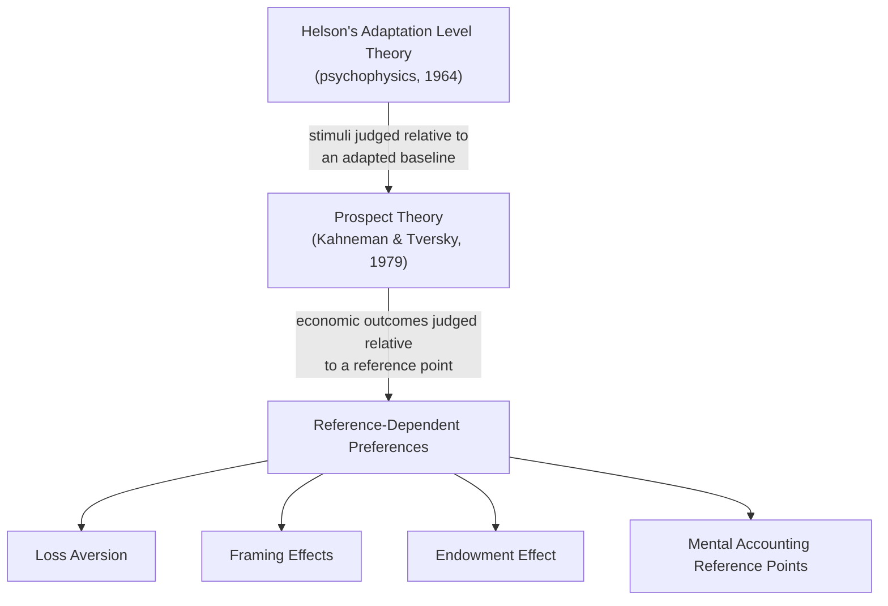
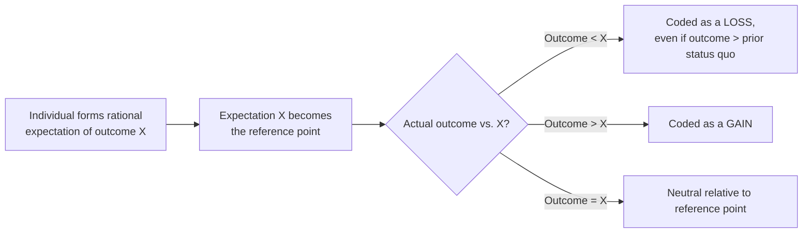

## Reference Points and Adaptation Level Theory

### Definition

A reference point is the baseline against which outcomes are psychologically evaluated as gains or losses, rather than in absolute terms — a foundational departure from standard economic theory, in which utility is typically assumed to depend only on final wealth or consumption states. **Adaptation level theory**, originating in psychophysics (Helson, 1964), provides the conceptual precursor: it holds that perception and evaluation of any stimulus are calibrated relative to an adapted baseline level shaped by past experience, context, and expectation, rather than assessed in an absolute, context-free manner. Reference-dependent preference theory extends this principle from sensory perception to economic choice and welfare evaluation.

**Key Points**

- Reference dependence is the foundational assumption underlying prospect theory's value function and, by extension, loss aversion, the endowment effect, framing effects, and mental accounting — nearly all major behavioral departures from expected utility theory rest on some form of reference-dependent evaluation.
- Unlike standard expected utility theory, which evaluates outcomes as *levels* of final wealth, reference-dependent models evaluate outcomes as *changes* relative to a reference point — a shift with substantial implications for predicted risk attitudes.
- Identifying what determines the reference point in any given decision — status quo, expectations, a social comparison target, or an aspiration level — is a central, still-debated question in reference-dependence research, since different reference point assumptions can generate different behavioral predictions for the same choice problem.

### From Adaptation Level Theory to Reference-Dependent Preferences

Helson's original adaptation level theory, developed to explain psychophysical judgments (e.g., perceived weight, brightness, or temperature), proposed that judgments of a stimulus are made relative to an internal adaptation level formed from the weighted average of past and present stimuli, plus contextual/background stimuli. A stimulus above the adaptation level is judged as "more," and one below as "less" — with the *same* absolute stimulus judged differently depending on the observer's adaptation history.

Kahneman and Tversky's prospect theory (1979) imported this logic directly into economic choice: outcomes are evaluated as gains or losses relative to a reference point (functionally analogous to Helson's adaptation level), rather than as absolute final states. This reframing has two major structural consequences relative to standard expected utility theory:

$$\text{Standard EU theory: } U = E[u(\text{final wealth})]$$

$$\text{Reference-dependent theory: } U = E[v(\text{outcome} - \text{reference point})]$$

### The Value Function Around the Reference Point

The prospect theory value function has three defining properties, all specified relative to the reference point rather than in absolute terms:

1. **Reference dependence itself**: outcomes are coded as gains or losses relative to a reference point, not evaluated on an absolute wealth scale.
2. **Loss aversion**: the function is steeper for losses than for gains of equal absolute magnitude ($\lambda > 1$ in the standard parameterization), so a loss of a given size is felt more intensely than an equivalent gain.
3. **Diminishing sensitivity**: the function is concave for gains and convex for losses, meaning the marginal psychological impact of a given change diminishes as one moves further from the reference point in either direction.

**Example**

A raise from $50,000 to $55,000 in annual salary produces a substantial felt improvement in well-being, while an already-high earner's raise from $500,000 to $505,000 — an identical $5,000 absolute change — produces comparatively little felt improvement, consistent with diminishing sensitivity as the change moves further from each individual's respective reference point.

### What Determines the Reference Point?

A central and still-debated question in reference-dependence research is precisely what determines the reference point in a given decision context. The literature has identified several candidate determinants, which are not mutually exclusive and can operate simultaneously:

| Candidate reference point | Description |
| --- | --- |
| Status quo / current holdings | The most commonly used default assumption; current wealth, possessions, or position serve as the baseline (as in the endowment effect) |
| Expectations | Köszegi and Rabin (2006, 2007) formalize rational expectations themselves as the reference point, so an outcome is a "loss" if it falls short of what was reasonably expected, even relative to a lower status quo |
| Aspiration or goal levels | A self-set target (a savings goal, a sales quota, a personal best) can function as the reference point, producing disproportionate motivation or disappointment around the goal threshold |
| Social comparison targets | Relative standing versus a comparison group (peers, competitors, social norms) can serve as an implicit reference point, independent of one's own prior outcomes |
| Recent past outcomes | A recency-weighted average of one's own past experience, closely mirroring Helson's original adaptation level formulation |

### Köszegi-Rabin Expectations-Based Reference Points

A significant modern extension of reference-dependent theory, developed by Köszegi and Rabin, formalizes the reference point as the decision-maker's own **rational expectations** about the outcome, rather than a fixed status quo. This model predicts that anticipated outcomes shift the reference point dynamically: if an individual comes to expect a raise, the absence of that raise is coded as a loss relative to the (unrealized) expected reference point, even though their objective wealth has not decreased relative to their prior status quo.

This expectations-based framework has been applied to explain phenomena such as labor supply responses to unexpectedly high or low daily earnings (relevant to the "reference-dependent labor supply" literature on taxi drivers and gig workers) and to disappointment aversion in negotiations and consumer choice.

### Reference Points in Applied Domains

- **Labor supply**: studies of taxi driver and gig worker daily labor supply decisions have examined whether workers set an income target (a reference point) for each day and stop working once it is reached, producing a labor supply curve that can, under some specifications, slope in the opposite direction from a standard forward-looking, reference-independent model — [Inference] though this literature has an active methodological debate, with some re-analyses finding that apparent reference-dependent stopping patterns are partly attributable to measurement issues (e.g., unobserved heterogeneity in driver shifts) rather than reference dependence alone.
- **Negotiation and bargaining**: reference points formed from expectations or prior offers in a negotiation can shape which subsequent offers are perceived as gains versus losses, influencing concession behavior and negotiated outcomes independent of the objective value of the offers themselves.
- **Sports and competitive performance**: reference points set by goals, personal records, or "round number" milestones (e.g., a marathon finishing time just under four hours) have been studied as influencing effort and performance around the threshold, consistent with loss aversion around a self-set aspiration reference point.

### Distinguishing Reference Dependence from Related Concepts

| Concept | Relationship to reference dependence |
| --- | --- |
| Prospect theory | The formal decision-theoretic model built directly on reference-dependent evaluation of outcomes |
| Loss aversion | A specific property (steeper losses than gains) of the value function once reference dependence is assumed |
| Status quo bias | A behavioral consequence that arises when the reference point is anchored to the current state of affairs |
| Adaptation level theory (Helson) | The psychophysical precursor theory from which economic reference dependence borrows its core structural logic |
| Aspiration-level theories (from behavioral decision theory, e.g., Simon) | A related but independently developed tradition emphasizing goal-based reference points, particularly in organizational and satisficing contexts |

### Theoretical and Empirical Challenges

- **Reference point instability and manipulation**: because the reference point is not directly observable and can shift with framing, expectations, and context, empirically pinning down which reference point is operative in a given study is a persistent methodological challenge, and different theoretical choices (status quo versus expectations-based models) can generate divergent predictions for the same scenario.
- **Multiple simultaneous reference points**: in complex, multi-attribute decisions, different attributes of an outcome (e.g., price, quality, time) may be evaluated relative to different reference points simultaneously, complicating a single unified prediction.
- [Inference] The degree to which reference points update immediately upon a change in circumstances versus persist with inertia from a prior baseline is an active area of research, with evidence suggesting reference point adjustment is neither instantaneous nor complete in many empirical settings, though the precise dynamics vary by domain and are not governed by a single universal adjustment rate.

### Related Topics

**Related Topics**

- Prospect Theory and the Value Function
- Loss Aversion and Reference Dependence
- The Endowment Effect
- Framing Effects in Decision-Making
- Köszegi-Rabin Expectations-Based Reference Points
- Reference-Dependent Labor Supply
- Status Quo Bias and Default Effects