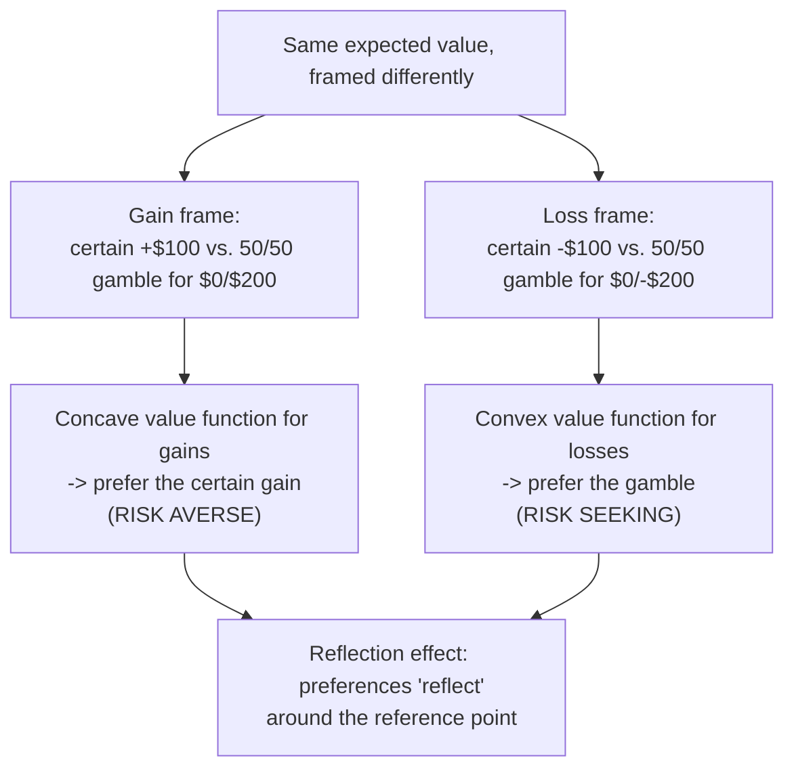

## Gain-Loss Framing

### Definition

Gain-loss framing is the specific class of framing effect in which logically equivalent outcomes are described either as gains (positive changes relative to a reference point) or as losses (negative changes relative to a reference point), producing systematically different risk preferences despite identical underlying probabilities and payoffs. It is the risky-choice framing subtype within the broader taxonomy of framing effects, and is the most directly and explicitly grounded in the asymmetric shape of the prospect theory value function.

**Key Points**

- Gain-loss framing is distinguished from attribute framing and goal framing (the other two subtypes in Levin, Schneider, and Gaeth's taxonomy) specifically by its focus on framing outcomes *under risk or uncertainty* as gains versus losses, rather than framing a fixed attribute or a binary action-outcome.
- The core empirical signature is the **reflection effect**: risk aversion in the domain of gains paired with risk seeking in the domain of losses, for equivalent-probability, equivalent-magnitude prospects.
- Gain-loss framing is the direct behavioral mechanism underlying the Asian disease problem and is foundational to applications in health communication, insurance framing, tax and rebate policy design, and negotiation strategy.

### The Reflection Effect

Kahneman and Tversky (1979) documented the reflection effect as a core empirical regularity motivating prospect theory: preferences over gains and preferences over the *mirror-image* losses are systematically reflected around zero, rather than symmetric extensions of a single risk attitude.

$$\text{Preference for a sure gain over an equivalent-EV gamble (risk averse)} \Longleftrightarrow \text{Preference for an equivalent-EV gamble over a sure loss (risk seeking)}$$

| Domain | Choice A (certain) | Choice B (risky) | Typical preference |
| --- | --- | --- | --- |
| Gains | Certain gain of $100 | 50% chance of $200, 50% chance of $0 | A preferred (risk averse) |
| Losses | Certain loss of $100 | 50% chance of losing $200, 50% chance of losing $0 | B preferred (risk seeking) |

This pattern directly follows from the shape of the value function: concavity in the gain domain makes the certain (smaller, sure) gain psychologically preferable to the equivalent-expected-value gamble, while convexity in the loss domain makes the gamble (which offers a chance of avoiding the loss entirely) preferable to the certain loss.

### Formal Mechanism: Value Function Curvature

Under the standard prospect theory value function:

$$v(x) = \begin{cases} x^{\alpha} & x \geq 0 \\ -\lambda(-x)^{\beta} & x < 0 \end{cases}$$

with $0 < \alpha, \beta < 1$ (diminishing sensitivity in both domains) and $\lambda > 1$ (loss aversion), the concavity of $x^{\alpha}$ for gains directly produces risk-averse behavior over gains, while the convexity of $-\lambda(-x)^{\beta}$ for losses directly produces risk-seeking behavior over losses — the reflection effect is thus a direct mathematical consequence of the assumed functional form, rather than an independently fitted empirical add-on.

### Gain-Loss Framing versus the Broader Framing Taxonomy

| Subtype | What varies | Core mechanism |
| --- | --- | --- |
| Gain-loss (risky-choice) framing | Whether an outcome under risk is described as a gain or a loss | Reflection effect via value function curvature |
| Attribute framing | Positive vs. negative wording of a single fixed characteristic | Affective/evaluative associations with valence-laden wording |
| Goal framing | Whether taking an action is framed as achieving a gain or avoiding a loss | Loss aversion applied to the *decision to act*, not to outcome risk |

Gain-loss framing is specifically the subtype that generates *risk preference reversals*; attribute and goal framing typically shift evaluations or persuasiveness without necessarily involving any element of risk or uncertainty in the choice itself.

**Example**

An insurance policy pitched with the framing "protect yourself from a potential $2,000 loss" tends to be evaluated differently than the logically equivalent framing "guarantee your $2,000 in savings against an unlikely event," even though both describe the identical underlying risk transfer — the loss-framed pitch, by emphasizing the loss domain, can increase willingness to pay for insurance (a risk-averse response to a loss-framed prospect, since insurance itself functions as the "certain small loss" — the premium — against the "risky large loss," making insurance purchase a case where the loss-averse, risk-averse pull toward certainty favors buying coverage).

### Applications by Domain

#### Health Communication

Framing treatment outcomes and risks in survival-rate (gain) versus mortality-rate (loss) terms has been extensively studied in medical decision-making research, generally finding that loss-framed messages (emphasizing what will be lost by inaction, such as "get screened or you may miss early cancer detection") tend to be more effective at prompting risk-averse protective behaviors like screening uptake, since these are typically framed as reducing the risk of a large potential loss, while gain-framed messages have shown [Inference] more mixed effectiveness that appears to depend on the specific health behavior (detection behaviors like screening versus prevention behaviors like sunscreen use have sometimes shown different optimal framings in the literature, complicating any single universal framing recommendation across all of health communication).

#### Insurance and Risk Management

Insurance purchase decisions are a canonical applied domain for gain-loss framing: because insurance itself involves accepting a certain small loss (the premium) to avoid a risky large loss, framing that emphasizes the potential large loss being avoided (rather than the benefit being gained) tends to align with the risk-averse, loss-focused psychology that favors insurance purchase.

#### Tax and Fiscal Policy Communication

Tax policy changes framed as "avoiding a tax increase" (loss-avoidance framing) versus "receiving a tax cut" (gain framing) for logically identical policy outcomes can shift public support, since the loss-avoidance framing engages loss aversion more directly than an equivalent gain framing of the same net fiscal effect.

#### Negotiation and Bargaining

Negotiators can strategically frame identical concessions or proposals as gains or losses relative to different reference points (e.g., a counteroffer framed relative to the other party's opening ask versus relative to a neutral market benchmark) to influence perceived favorability and risk tolerance during bargaining.

### Boundary Conditions

- **Framing strength depends on ambiguity and stakes**: gain-loss framing effects tend to be strongest when the underlying probabilities and outcomes are not independently, transparently verifiable by the decision-maker, and can be attenuated when decision-makers have strong independent information or high personal stakes that prompt more careful, frame-independent analysis.
- **Repeated exposure and expertise reduce susceptibility**: [Inference] individuals with greater domain expertise or more repeated exposure to a particular class of decision (e.g., experienced financial professionals evaluating investment framing) have been found in some studies to show attenuated, though not necessarily eliminated, gain-loss framing effects relative to novices — though this finding is not uniform across all studied populations and decision types.
- **Distinguishing manipulation from legitimate emphasis**: as with framing effects generally, there is a normative question of when using a particular gain-loss frame constitutes ethically problematic manipulation versus a legitimate, unavoidable choice about how to communicate genuinely identical information, since some frame must always be selected in any real communication.

### Related Topics

**Related Topics**

- Framing Effects in Decision-Making
- Prospect Theory and the Value Function
- Reference Points and Adaptation Level Theory
- Loss Aversion and Reference Dependence
- The Reflection Effect and Risk Attitude Reversal
- Insurance Demand and Risk-Averse Behavior
- Goal Framing in Persuasive Communication