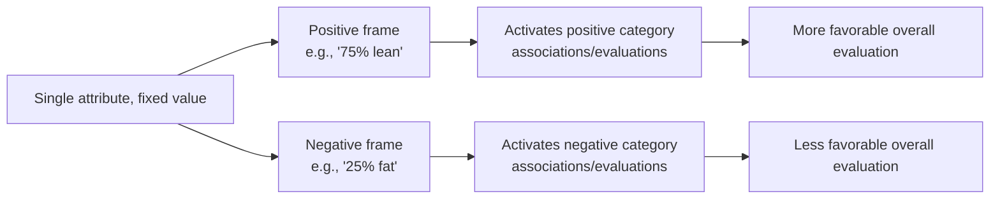
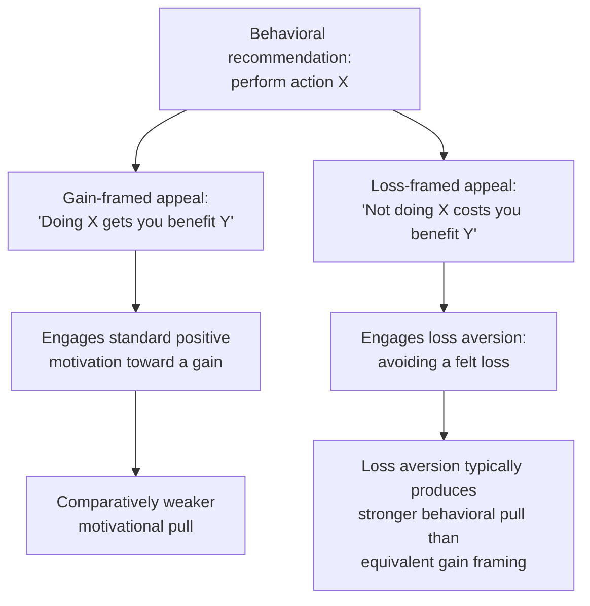

## Attribute Framing and Goal Framing

### Definition

Attribute framing and goal framing are the two non-risky-choice subtypes in Levin, Schneider, and Gaeth's (1998) three-way taxonomy of framing effects. **Attribute framing** describes how a single characteristic of an object, event, or outcome is presented in positive versus negative terms, without any element of risk or uncertainty. **Goal framing** describes how the consequences of performing or not performing a specific action are presented — as an achieved gain from acting, or as an avoided loss from acting — again without necessarily involving risk. Both are distinguished from gain-loss (risky-choice) framing, which specifically concerns the description of probabilistic outcomes.

**Key Points**

- Attribute framing operates primarily through **affective/evaluative associations** attached to positively versus negatively valenced language, rather than through the risk-driven value-function mechanism underlying gain-loss framing.
- Goal framing operates primarily through **loss aversion applied to the decision to act or not act**, making loss-framed appeals (emphasizing what will be lost by inaction) typically more motivationally potent than logically equivalent gain-framed appeals.
- Levin, Schneider, and Gaeth's taxonomy was explicitly motivated by evidence that framing effects across different experimental paradigms did not share a single uniform underlying mechanism or even consistent effect strength, warranting the three-way distinction rather than treating "framing" as a monolithic phenomenon.

### Attribute Framing

#### Mechanism

Attribute framing involves describing a single object or event characteristic using either a positive or a negative valence, where both descriptions are numerically or logically equivalent. Unlike gain-loss framing, there is no risk or probability involved — a single, certain attribute is simply labeled differently.

$$\text{Positive frame: "X\% positive attribute"} \quad \equiv \quad \text{Negative frame: "(100−X)\% negative attribute"}$$

The classic mechanism proposed is that positively and negatively valenced words trigger different evaluative associations and processing biases even when the underlying referent is identical — the positive frame activates associations consistent with the positive category prototype, while the negative frame activates associations consistent with the negative category prototype.

#### Classic Demonstrations

The original ground-beef labeling study (Levin & Gaeth, 1988) found that beef labeled "75% lean" was rated as higher quality and less greasy than identical beef labeled "25% fat," even when participants tasted the product — with the framing effect on taste perception somewhat, though not entirely, reduced by direct tasting experience relative to a no-tasting condition. [Inference] This partial (not complete) reduction upon direct sensory experience is frequently cited as evidence that attribute framing effects, while real, are attenuated but not eliminated when decision-makers have independent verifying information, a pattern broadly consistent with the general boundary conditions found across framing research.

#### Applications

- **Food and nutrition labeling**: fat/lean, sugar-free/sugar content, and similar dual-framing choices in food packaging are a long-studied and commercially applied instance of attribute framing.
- **Medical and pharmaceutical communication**: success-rate versus failure-rate framing of treatment efficacy, and side-effect probability framing (e.g., "affects 1 in 100 patients" versus "99% of patients unaffected"), are attribute-framing applications distinct from the risky-choice framing of the Asian disease type, since no explicit risky choice between alternatives is necessarily being presented.
- **Employment and performance evaluation**: describing employee performance or unemployment/employment rates in positive versus negative terms (e.g., "95% employment rate" versus "5% unemployment rate") shapes evaluative judgments of economic conditions independent of the underlying statistic.

### Goal Framing

#### Mechanism

Goal framing concerns how the consequences of a specific action (or inaction) are presented — specifically, whether performing the action is framed as producing a gain, or as avoiding a loss. Unlike gain-loss (risky-choice) framing, goal framing typically does not involve probabilistic outcomes; it concerns a single, usually deterministic behavioral recommendation and the way its rationale is communicated.

$$\text{Gain-framed appeal: "By doing X, you will gain/achieve Y"}$$

$$\text{Loss-framed appeal: "By not doing X, you will lose/forgo Y"}$$

Because loss aversion implies that a potential loss of a given magnitude is felt more intensely than an equivalent potential gain, loss-framed goal appeals are generally predicted — and often found — to be more motivationally effective at prompting the recommended action than logically equivalent gain-framed appeals, particularly for **risk-increasing or detection-oriented behaviors** (behaviors, like medical screening, that can reveal an already-existing problem).

#### The Detection-Prevention Asymmetry

A well-studied nuance in the goal-framing literature (Rothman & Salovey, 1997) proposes that the relative effectiveness of loss- versus gain-framed messages depends on whether the recommended behavior is oriented toward:

| Behavior type | Description | Typically more effective frame |
| --- | --- | --- |
| Detection behaviors | Behaviors that carry some risk of revealing an unwanted, already-existing condition (e.g., cancer screening, HIV testing) | Loss-framed (emphasizing the risk of missing an existing problem by not acting) |
| Prevention behaviors | Behaviors that reduce the risk of a *future* negative outcome without revealing a current condition (e.g., sunscreen use, vaccination) | Gain-framed (emphasizing the safety/benefit achieved by acting) |

[Inference] This asymmetry has been influential in health communication design guidance, though subsequent research has produced mixed replications, and the detection/prevention distinction, while a useful organizing heuristic, does not perfectly predict framing effectiveness across all studied health behaviors and populations.

#### Applications

- **Public health campaigns**: messaging design for screening programs, vaccination campaigns, and preventive health behaviors routinely applies the detection/prevention goal-framing distinction.
- **Environmental and energy conservation messaging**: appeals framed around "avoiding wasted energy costs" (loss framing) versus "saving money through efficiency" (gain framing) are studied in the energy-conservation behavioral literature as a goal-framing application outside the health domain.
- **Charitable giving and prosocial appeals**: fundraising and prosocial messaging sometimes uses goal framing (e.g., "help us avoid closing this program" versus "help us reach this positive milestone") to influence donor response.

### Distinguishing the Three Framing Subtypes in Practice

| Question to ask | Subtype indicated |
| --- | --- |
| Does the message involve a probabilistic outcome or explicit risk comparison between options? | Gain-loss (risky-choice) framing |
| Is a single fixed characteristic simply relabeled positively or negatively, with no risk element? | Attribute framing |
| Is the message framing the consequence of taking or not taking a specific action, without necessarily involving explicit risk? | Goal framing |

Real-world communications frequently blend elements of more than one subtype simultaneously (e.g., a health message might combine an attribute-framed statistic with a goal-framed behavioral call to action), which is one reason careful experimental designs typically isolate a single framing dimension at a time to draw clean causal conclusions about any one subtype's independent effect.

### Related Topics

**Related Topics**

- Framing Effects in Decision-Making
- Gain-Loss Framing
- Prospect Theory and the Value Function
- Loss Aversion and Reference Dependence
- Detection versus Prevention Health Behavior Framing
- Reference Points and Adaptation Level Theory
- Consumer Product Labeling and Marketing Psychology