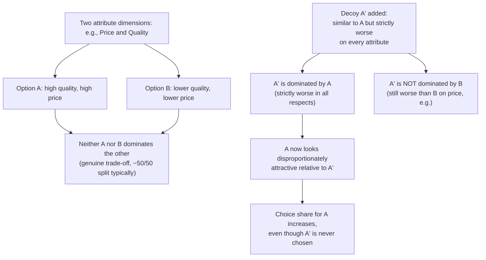

## Decoy Effects and Asymmetric Dominance

### Definition

A decoy effect occurs when adding a third, strategically inferior option to a choice set changes the relative preference between the two original options, even though the added option ("the decoy") is itself never chosen. The most well-documented form is **asymmetric dominance** (also called the "attraction effect"), in which the decoy is constructed to be completely dominated by one target option (worse on every attribute) but only partially dominated by the other — making the fully-dominating option appear disproportionately more attractive by comparison, and increasing its choice share relative to a two-option baseline.

**Key Points**

- The foundational empirical demonstration is Huberman, Payne, and Puto's (1982) asymmetric dominance studies, which showed that adding a decoy dominated by only one of two existing options increased choice share for the dominating option, violating the standard rational-choice axiom of **regularity** (adding an option should never increase the choice probability of an existing option).
- Decoy effects are a direct violation of the **independence of irrelevant alternatives (IIA)** property assumed in standard rational choice and random utility models, since the presence of a never-chosen third option changes preferences between the original two.
- Asymmetric dominance is distinguished from other decoy subtypes (compromise effect, phantom decoys) by its specific structural requirement: the decoy must be strictly dominated by the target option on all relevant attributes, while being only partially (not strictly) dominated by the competitor.

### The Asymmetric Dominance Structure

Consider a choice between two products, A and B, that trade off on two attributes (e.g., price and quality) such that neither dominates the other — a standard, genuinely difficult trade-off decision. An asymmetric dominance decoy, A′, is constructed to be:

- **Strictly worse than A** on every attribute (dominated by A)
- **Not strictly dominated by B** — worse than B on at least one attribute, but not on all

**Example**

A magazine subscription offer presenting only "Web-only: $59" and "Print + Web: $125" produces a roughly even split between the two options. Adding a third option, "Print-only: $125" (identical price to the Print + Web bundle, but strictly worse — offering only print with no web access) leaves the print-only decoy essentially unchosen, but sharply increases the share of participants choosing "Print + Web," since it now looks like a clearly superior deal relative to the newly added, strictly dominated decoy — a widely cited illustrative pattern from Ariely's classroom replications of the original Huber, Payne, and Puto design.

### Violation of Regularity and Independence of Irrelevant Alternatives

Standard rational choice theory, and the random utility models underlying much of applied microeconomics, assume the **regularity condition**: adding a new alternative to a choice set can never increase the probability that an existing alternative is chosen — at most, a new option can only draw share away from existing options, never toward them. Asymmetric dominance effects are a direct, well-replicated empirical violation: the dominating option's choice share measurably *increases* upon the decoy's addition, which regularity strictly prohibits.

This is closely related to, and often discussed alongside, the **independence of irrelevant alternatives (IIA)** property in discrete choice modeling (central to the standard multinomial logit framework), which similarly implies that the relative odds of choosing between two existing options should not depend on the presence or attributes of a third, non-chosen option.

### Related Decoy Subtypes

| Decoy type | Structure | Mechanism |
| --- | --- | --- |
| Asymmetric dominance (attraction effect) | Decoy strictly dominated by target, only partially dominated by competitor | Decoy makes the dominating target look disproportionately favorable by direct, unambiguous comparison |
| Compromise effect | A third option is added at an extreme of an attribute range, making a previously extreme option now appear as the "middle," moderate choice | Preference for compromise/moderate options over extremes, independent of the decoy's own dominance relationship |
| Phantom decoy | A decoy is presented as available but later revealed to be unavailable (e.g., "out of stock") | Even a decoy that cannot actually be chosen can still shift preferences between the remaining genuine options while it is displayed |

### Theoretical Explanations

- **Comparative evaluability**: asymmetric dominance decoys provide an unambiguous, easily processed comparison (the decoy is worse on *every* attribute relative to the target), which may make the dominating option's overall superiority more cognitively salient and easier to justify than the genuinely difficult trade-off between the two original, non-dominated options.
- **Reason-based choice**: some theoretical accounts (Shafir, Simonson, and Tversky, 1993) propose that decoys succeed by providing decision-makers with an easy, defensible *reason* to choose the dominating option ("it's strictly better than at least one alternative"), which can be psychologically valuable when a decision otherwise requires making a harder, less easily justified trade-off.
- **Range and frequency effects on attribute weighting**: the compromise effect specifically has been linked to range-frequency theories of judgment, in which the perceived importance of an attribute is influenced by the range of values present in the choice set, shifting which option appears most "moderate" or balanced.

### Empirical Robustness and Boundary Conditions

- Asymmetric dominance effects have been replicated across a wide range of product categories (beer, cars, electronics, subscription pricing, and others) since the original 1982 demonstration, [Inference] though the magnitude of the effect varies considerably by product category, decoy construction, and experimental context, and some more recent replication efforts using larger, more diverse samples have reported smaller average effect sizes than the earliest, often smaller-sample laboratory studies.
- The effect tends to be stronger when the two original (non-decoy) options are relatively close in overall attractiveness (a genuinely difficult trade-off), since a decoy has comparatively little added leverage when one option is already clearly superior to the other on its own merits.
- [Inference] Individual differences in decision-making style (e.g., preference for maximizing versus satisficing, need for cognition) have been examined as potential moderators of susceptibility to decoy effects, though findings in this sub-literature are not fully consistent across studies.

### Applications in Pricing and Marketing

<svg xmlns="http://www.w3.org/2000/svg" viewBox="0 0 740 260" font-family="Helvetica, Arial, sans-serif">
<text x="370" y="26" text-anchor="middle" font-size="16" font-weight="bold" fill="#1a1a1a">Decoy Pricing Structure Example (svg_diagram)</text>
<rect x="40" y="60" width="200" height="150" rx="10" fill="#eef3fb" stroke="#3b6ea5" stroke-width="1.5" />
<text x="140" y="88" text-anchor="middle" font-size="13" font-weight="bold" fill="#20456e">Web-only</text>
<text x="140" y="112" text-anchor="middle" font-size="12" fill="#333">$59</text>
<text x="140" y="134" text-anchor="middle" font-size="11" fill="#555">Digital access only</text>
<rect x="270" y="60" width="200" height="150" rx="10" fill="#fbeeee" stroke="#a53b3b" stroke-width="1.5" />
<text x="370" y="88" text-anchor="middle" font-size="13" font-weight="bold" fill="#6e2020">Print-only (decoy)</text>
<text x="370" y="112" text-anchor="middle" font-size="12" fill="#333">$125</text>
<text x="370" y="134" text-anchor="middle" font-size="11" fill="#555">Print access only</text>
<text x="370" y="152" text-anchor="middle" font-size="11" fill="#a53b3b">Strictly worse than</text>
<text x="370" y="168" text-anchor="middle" font-size="11" fill="#a53b3b">Print + Web at same price</text>
<rect x="500" y="60" width="200" height="150" rx="10" fill="#eef7ee" stroke="#2a7a3b" stroke-width="1.5" />
<text x="600" y="88" text-anchor="middle" font-size="13" font-weight="bold" fill="#1d5c2b">Print + Web (target)</text>
<text x="600" y="112" text-anchor="middle" font-size="12" fill="#333">$125</text>
<text x="600" y="134" text-anchor="middle" font-size="11" fill="#555">Full digital and print access</text>
<text x="600" y="152" text-anchor="middle" font-size="11" fill="#1d5c2b">Looks like a clear win</text>
<text x="600" y="168" text-anchor="middle" font-size="11" fill="#1d5c2b">versus the decoy</text>
</svg>

- **Product line design**: firms deliberately introduce dominated "decoy" tiers in pricing menus (subscription plans, product bundles, menu items) specifically to steer choice share toward a target, typically higher-margin, option.
- **Political and policy option framing**: proposals with an intentionally unattractive "straw man" alternative included in a comparison set can be understood through the same decoy logic, [Inference] though direct experimental evidence isolating decoy effects specifically in political choice settings (as opposed to general negative campaigning effects) is comparatively less developed than the extensive consumer product literature.
- **Menu and service tier design**: subscription services, software tiers, and restaurant menus are commonly cited real-world applications, though [Inference] the extent to which any specific commercial pricing structure was deliberately designed using decoy-effect research versus arrived at through independent trial-and-error commercial practice is generally not verifiable from the pricing structure alone.

### Related Topics

**Related Topics**

- Framing Effects in Decision-Making
- Reference Points and Adaptation Level Theory
- The Compromise Effect
- Independence of Irrelevant Alternatives (IIA)
- Choice Overload and Assortment Size Effects
- Anchoring and Adjustment Heuristic
- Reason-Based Choice Theory