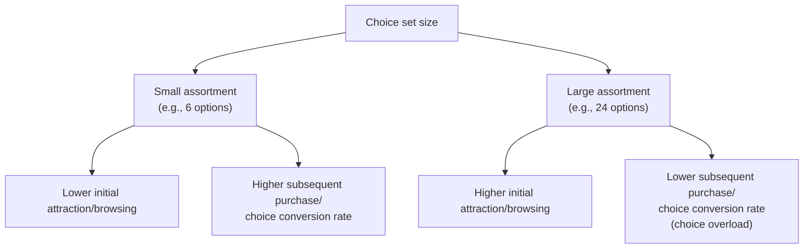
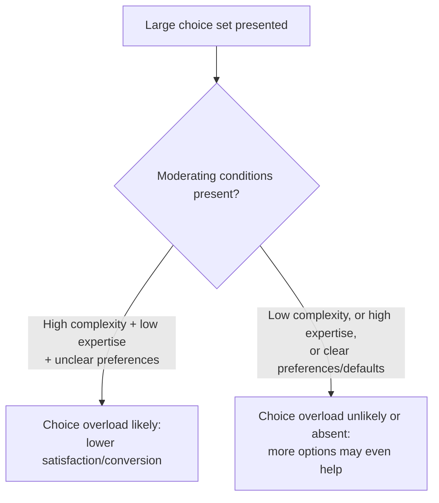

## Choice Overload and the Paradox of Choice

### Definition

Choice overload (also termed the "paradox of choice," following Barry Schwartz's popularization of the concept) describes the phenomenon whereby an increase in the number of options available in a choice set — beyond standard economic theory's prediction that more options should weakly increase welfare by expanding the feasible set — can instead reduce decision-maker satisfaction, lower actual choice/purchase rates, and increase decision difficulty, regret, and post-decision dissatisfaction.

**Key Points**

- Choice overload directly contradicts the standard economic **more-options-cannot-hurt** principle: since any additional option can simply be ignored, a rational agent's welfare from an expanded choice set should be weakly higher, never lower — the phenomenon, where documented, is a genuine behavioral departure from this benchmark.
- The most widely cited empirical demonstration is Iyengar and Lepper's (2000) "jam study," which found a smaller assortment of jam samples produced a substantially higher purchase conversion rate than a larger assortment.
- The existence, robustness, and boundary conditions of choice overload have become a genuinely contested area within behavioral economics, with subsequent meta-analytic work finding the effect to be considerably more context-dependent and smaller in magnitude, on average, than the original demonstrations suggested.

### The Iyengar and Lepper "Jam Study"

Iyengar and Lepper (2000) set up a tasting booth in a grocery store, alternating between displaying either 6 or 24 varieties of jam for sampling. They found that while the larger 24-jam display attracted more initial browsing interest, the smaller 6-jam display produced a substantially higher subsequent **purchase conversion rate** among those who sampled — a result widely interpreted as evidence that excessive choice can suppress action (in this case, purchase) despite generating more initial attention.

### Proposed Mechanisms

Several complementary mechanisms have been proposed to explain why larger choice sets can reduce satisfaction and completion rates, rather than uniformly improving them as standard theory predicts:

| Mechanism | Explanation |
| --- | --- |
| Increased cognitive/decision effort | Comparing more options across more attributes imposes higher information-processing costs, which can lead to decision avoidance or deferral entirely |
| Heightened expectations | A larger assortment can raise the expectation that a "perfect" option exists somewhere in the set, making the eventually chosen option feel comparatively disappointing relative to the (unexplored) alternatives |
| Increased anticipated and experienced regret | With more foregone alternatives, there is more scope for counterfactual thinking about options not chosen, increasing anticipated regret at the point of decision and dissatisfaction after |
| Choice deferral / decision paralysis | Faced with a difficult, high-effort comparison, some decision-makers opt to defer or avoid the decision entirely rather than resolve the trade-offs |
| Reduced confidence in the chosen option | Difficulty confidently ranking many options can reduce the decision-maker's certainty that the option they did choose was in fact the best one |

**Example**

A retirement plan offering 50 investment fund options may produce lower overall plan participation than an otherwise identical plan offering 10 carefully curated options, if potential enrollees find the larger menu sufficiently overwhelming to defer the enrollment decision altogether — a pattern with direct relevance to default and choice-architecture design in retirement savings contexts (paralleling but distinct from pure default-effect mechanisms).

### The Contested Empirical Status of Choice Overload

Unlike some other behavioral phenomena covered in this syllabus, choice overload's empirical robustness has become an active subject of meta-analytic debate within the field:

- **Scheibehenne, Greifeneder, and Todd's (2010) meta-analysis** aggregated a substantial number of choice overload studies and found the average effect size across the literature to be close to zero, with substantial heterogeneity across individual studies — some finding strong choice overload effects, others finding no effect, and a smaller number finding the opposite pattern (more choice increasing satisfaction or conversion).
- This meta-analytic finding has led to a broader reframing within the field: choice overload is now generally understood not as a universal, unconditional phenomenon, but as one that emerges reliably only under specific **moderating conditions**, several of which have been identified in subsequent research.

### Moderating Conditions

| Moderator | Effect on likelihood of choice overload |
| --- | --- |
| Choice set complexity | Overload is more likely when options vary on many attributes simultaneously, rather than differing on a single simple dimension |
| Decision-maker expertise | Novices in a domain are more susceptible to overload than domain experts, who can process larger option sets more efficiently |
| Time pressure and decision context | Overload is more likely under time pressure or when a definitive best option is not clearly identifiable in advance |
| Preference clarity | Decision-makers with clear, well-articulated prior preferences are less susceptible than those with poorly defined preferences, since a large set is easier to navigate when one already knows what one is looking for |
| Presence of a clear dominant option or defaults | A large set with an easily identifiable best option (or a sensible default) can neutralize overload, since the effective decision-making burden is reduced regardless of the nominal set size |

### Distinguishing Choice Overload from Related Concepts

| Concept | Relationship to choice overload |
| --- | --- |
| Status quo bias and default effects | A large choice set can amplify default persistence, since the effort cost of actively choosing among many options rises with set size, making the default relatively more attractive as an escape from decision effort |
| Decoy effects / asymmetric dominance | A related but distinct choice-architecture phenomenon concerning the *structure* (dominance relationships) of a choice set rather than its raw *size* |
| Satisficing (Herbert Simon) | Choice overload research is sometimes connected to the broader satisficing literature, which argues that bounded-rational agents often seek a "good enough" option rather than exhaustively optimizing across a full choice set — larger sets make exhaustive optimization costlier, potentially pushing decision-makers toward satisficing or avoidance strategies |
| Maximizing versus satisficing decision styles | Individual differences in whether a person seeks the objectively best option ("maximizers") versus a good-enough option ("satisficers") have been studied as a moderator of susceptibility to choice overload and its associated regret |

### Applications and Choice Architecture Implications

- **Retail assortment design**: retailers and e-commerce platforms use curated "best of" or algorithmically filtered subsets, alongside full catalogs, partly informed by choice overload research, though [Inference] commercial assortment decisions are also driven by inventory economics, supply chain considerations, and other factors independent of any specific behavioral research finding.
- **Retirement and benefits plan design**: given the moderating role of preference clarity and complexity, plan designers informed by choice overload research sometimes recommend curated default fund menus or tiered options (a simple default set alongside an "advanced" full menu for engaged users) rather than large undifferentiated menus.
- **Digital interface and recommendation system design**: algorithmic filtering, personalized recommendations, and progressive disclosure (revealing additional options only on request) in digital products can be understood as choice-architecture responses aimed at preserving the benefits of a large underlying inventory while reducing the decision-making burden associated with presenting it all at once.

### Related Topics

**Related Topics**

- Status Quo Bias and Default Effects
- Decoy Effects and Asymmetric Dominance
- Bounded Rationality and Satisficing (Herbert Simon)
- Regret Aversion in Decision-Making
- Libertarian Paternalism and Choice Architecture
- Maximizing versus Satisficing Decision Styles