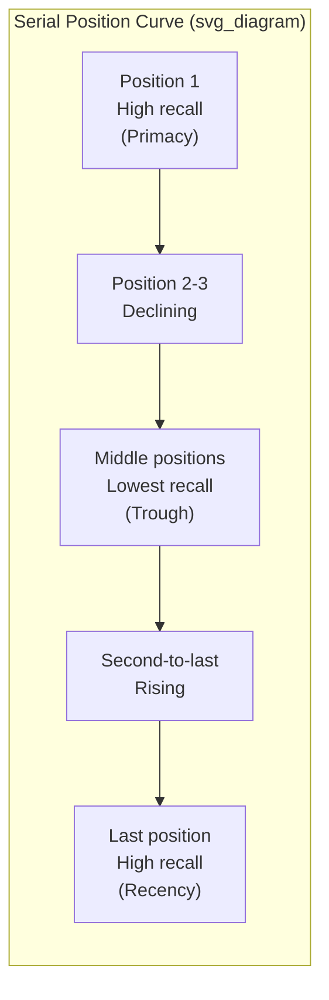
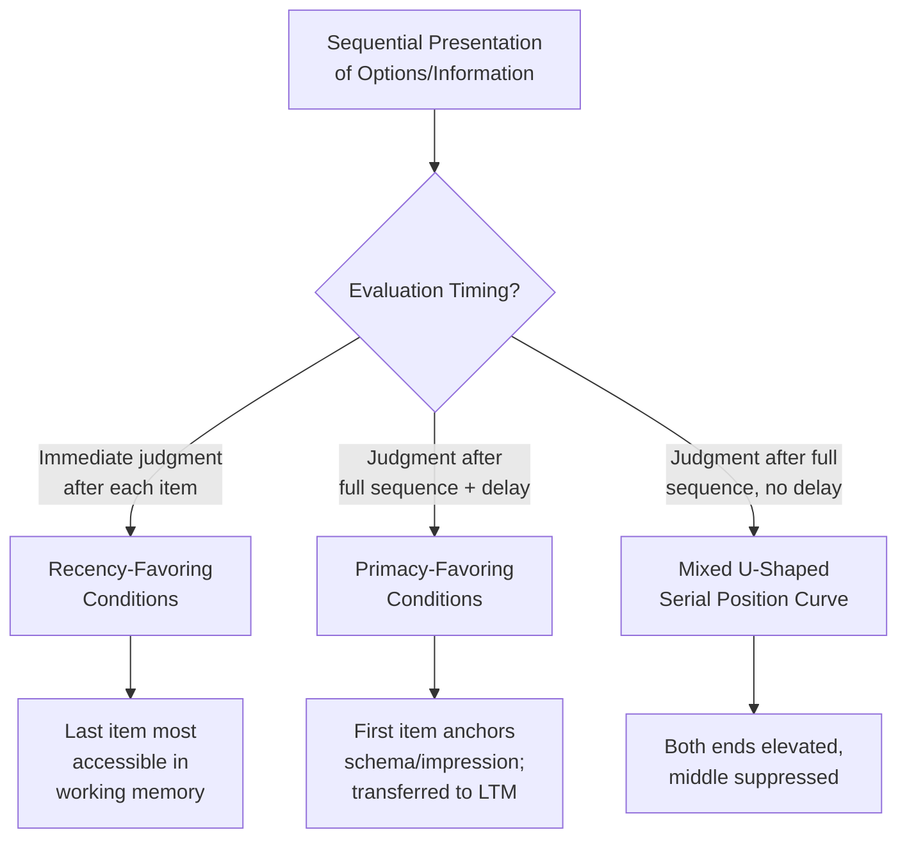

## Order Effects, Primacy, and Recency in Choice

### Definition and Conceptual Overview

Order effects refer to the systematic influence that the sequence in which options, information, or stimuli are presented has on judgment, evaluation, and choice, independent of the substantive content being presented. Order effects are a core anomaly relative to the rational-agent assumption that preferences should be invariant to the arbitrary sequencing of an otherwise fixed choice set — a violation of what decision theorists call **procedure invariance**.

Two dominant sub-phenomena are typically distinguished:

- **Primacy effect**: Items, arguments, or options presented earlier in a sequence receive disproportionate weight in the final judgment, are recalled more accurately, or are more likely to be selected.
- **Recency effect**: Items, arguments, or options presented later in a sequence receive disproportionate weight, recall, or selection likelihood.

These effects are not mutually exclusive; empirically, sequences often display a **serial position curve** — a U-shaped or J-shaped function relating position in a sequence to recall/selection probability, with items in the middle of a list suffering the most relative neglect.

### Theoretical Mechanisms

**Key Points**

- **Memory-based accounts (dual-store model)**: Primacy is attributed to greater rehearsal and transfer of early items into long-term memory; recency is attributed to items still residing in working/short-term memory at the time of judgment, and thus more accessible for immediate retrieval.
- **Anchoring-and-adjustment**: The first piece of information encountered functions as a reference point (anchor) against which subsequent information is contrastively evaluated, biasing the final judgment toward the initial value or option — this is the dominant explanation for primacy in sequential evaluative judgments (e.g., first-item-as-anchor in negotiations, pricing, or ratings).
- **Attention and information-processing decay**: Attentional resources and processing depth are hypothesized to decline over the course of a long sequence, producing systematic underweighting of middle items (fatigue/depletion account).
- **Impression formation (Asch's configural model)**: Early traits or information disproportionately shape the interpretive frame ("schema") through which later information is assimilated, causing early information to color the meaning assigned to everything that follows — a mechanism distinct from pure memory decay.
- **Choice architecture / satisficing accounts**: When decision-makers use non-compensatory heuristics (e.g., "satisficing" — pick the first option that clears a threshold), primacy emerges because option 1 sets the bar and is chosen unless a clearly superior alternative later disconfirms it; this predicts primacy dominance under time pressure or long lists.

### Primacy Effect: Detailed Mechanics

Primacy effects are most robust under conditions that favor either (a) transfer to long-term memory or (b) anchor formation:

- **Longer inter-item intervals** and **shorter lists** favor rehearsal-driven primacy (memory account).
- **High cognitive load** or **time pressure** during the decision itself (not during encoding) tends to amplify primacy, since decision-makers default to the earliest-formed impression rather than integrating new information (anchoring account).
- **Sequential, non-comparative evaluation** (each item judged in isolation before the next is seen) is a necessary condition for primacy to dominate in impression-formation paradigms — this describes most real-world consumer and political-candidate evaluation settings.

Classic empirical grounding: Asch (1946) demonstrated that identical trait lists ("intelligent, industrious, impulsive, critical, stubborn, envious" vs. the reversed order) produced substantially more favorable overall impressions when positive traits appeared first, holding total content constant.

### Recency Effect: Detailed Mechanics

Recency effects dominate under different boundary conditions:

- **Simultaneous or near-simultaneous comparison** of all options (e.g., a comparison table, a single screen listing all items) suppresses recency because working-memory decay is less relevant when nothing needs to be held in memory.
- **Immediate judgment following the sequence** (no delay, no distractor task) favors recency, since last-seen items are still active in working memory.
- **Short-to-medium list lengths** with no rehearsal opportunity between items favor recency; a distractor task inserted after the last item eliminates most recency effects (a classic dissociation used to confirm the dual-store memory account).
- **Political and legal contexts**: ballot-order effects and "last-speaker advantage" in debates/trials are field demonstrations of recency, particularly when the decision is rendered immediately after exposure.

### Serial Position Curve

$$P(\text{recall or selection} \mid \text{position } i) = f(i)$$

The canonical serial position curve is U-shaped: high probability of recall/selection at the first few serial positions (primacy), a trough in the middle, and elevated probability again at the last few positions (recency), with the recency "hook" typically steeper but more fragile (eliminated by delay or distraction) than the primacy portion (durable, resistant to delay).

### Domain-Specific Manifestations

**Consumer Choice and Product Lists**

- Products listed first on a shelf, menu, or search results page receive disproportionate selection share, holding quality constant — documented in menu engineering (appetizers/entrées listed first or in top-right "eye path" zones) and online marketplace click-through studies.
- Sequential taste tests (wine flights, product sampling) show recency dominance for the immediately preceding item when a rating is given right after each sample, but primacy dominance for the very first item sampled when an overall end-of-session ranking is requested.

**Political Science: Ballot-Order Effects**

- Candidates listed first on a ballot receive a measurable vote-share premium (typically cited in the range of low single-digit percentage points, varying by race salience, contest is down-ballot, and voter familiarity), a well-replicated finding that has led several U.S. states to mandate rotation of candidate order across precincts.
- Effect is stronger in low-information, low-salience races (e.g., judicial retention elections) than in high-salience presidential races, consistent with the satisficing/heuristic-substitution account: order effects fill the gap left by absent substantive information.

**Legal Judgment**

- Mock-jury studies show that argument order (prosecution-first vs. defense-first) and witness order can shift verdict leanings; recency effects are amplified when there is a time delay between evidence presentation and jury deliberation is preceded by a summary of the *last* arguments heard (recency-biased structure of closing arguments).

**Job Interviews and Personnel Evaluation**

- Interviewers evaluating a sequence of candidates show both primacy (first candidate sets an anchor/reference standard) and recency (last candidate is most vividly recalled at the moment of the hiring decision), with the dominant effect depending on whether ratings are recorded immediately after each candidate (favors recency at the point of final ranking) or only after all candidates are seen (favors primacy-driven anchoring).

**Survey Methodology**

- Response-option order in surveys produces both primacy (in **visual/self-administered** surveys — respondents anchor on and select from options they see first) and recency (in **aural/telephone** surveys — respondents recall and select from the last options they heard), a well-established methodological distinction guiding survey design.

### Choice Architecture Implications

**Example**

A retailer redesigning an online product listing page can exploit primacy by placing the highest-margin, comparably-priced item in position 1 of a "Recommended for You" carousel, since click-through and add-to-cart rates decay by ordinal position even when relevance scores are held constant — a direct application of position-based default-effect logic often layered onto the position-1 slot.

- **Debiasing through order randomization**: When a choice architect wants to preserve genuine preference expression (e.g., ballots, candidate lists, survey batteries), rotating presentation order across respondents cancels out the order effect in aggregate, converting an individual-level bias into unbiased noise at the population level.
- **Strategic order-setting**: When a choice architect wants to steer toward a particular option (a "target option"), placing it first exploits primacy under sequential/isolated evaluation, or placing it last exploits recency under immediate-judgment/simultaneous-recall conditions — the correct strategy is conditional on the evaluation format, not universal.
- **Interaction with the default effect**: Order position is often confounded with default status (the first-listed option is frequently pre-selected or visually anchored as the "typical" choice), meaning apparent order effects in field/observational data may partly reflect a co-occurring default effect rather than order alone; well-designed studies orthogonalize position and default status to isolate each.

### Distinguishing Order Effects from Related Phenomena

| Phenomenon | Core Mechanism | Distinguishing Feature |
| --- | --- | --- |
| Order effects (primacy/recency) | Position in a sequence | Applies to any sequential presentation, memory- or attention-driven |
| Anchoring | First-seen numeric/reference value | Specifically about numeric estimation, not general item selection |
| Default effect | Status-quo/pre-selected option | Effect exists even without any sequence; a single highlighted option suffices |
| Framing effect | Valence of description (gain/loss) | Content of the message is altered, not merely its position |
| Mere exposure effect | Repetition frequency | Driven by number of exposures, not ordinal position of a single exposure |

### Boundary Conditions and Moderators

- **Expertise**: Domain experts show attenuated order effects relative to novices, since experts rely more on substantive attribute-based evaluation and less on heuristic position-based shortcuts. [Inference: the magnitude of this attenuation is domain- and study-specific and should not be treated as a fixed quantitative discount.]
- **List length**: Very short lists (2–3 items) show minimal or no reliable order effects since both first and last items remain jointly salient; the effect strengthens with list length up to a point, then both primacy and recency portions of the serial-position curve can flatten under extreme list lengths due to general fatigue. [Inference: exact list-length thresholds vary by study design, stimulus type, and modality]
- **Motivation and stakes**: Higher decision stakes generally increase deliberate, compensatory processing, which can reduce reliance on position-based heuristics — but time pressure under high stakes can have the opposite effect, reinstating heuristic reliance. [Unverified: the net directional effect of stakes is contingent on whether stakes also increase available deliberation time; results in the literature are mixed]
- **Modality**: Visual/simultaneous presentation (e.g., printed ballots, webpages) versus auditory/sequential presentation (e.g., spoken debates, phone surveys) shifts the balance between primacy and recency, as described above.

### Illustrative Diagram: Order Effect Decision Framework

### Practical Detection and Measurement

- **Within-subjects rotation design**: Randomly assign presentation order across participants or trials, then regress selection probability or rating on ordinal position, controlling for item identity via fixed effects — the standard econometric/psychometric approach to isolating a pure order effect from item-quality confounds.
- **Position-swap replication**: Present the identical item set in at least two reversed or shuffled orders to different subject groups; a significant interaction between item and position (rather than a main effect of item alone) confirms an order effect independent of item quality.
- Field studies (ballot order, menu position) typically rely on **naturally occurring rotation** (e.g., legally mandated ballot rotation across precincts) as a quasi-experimental source of identification, since true randomization of real-world consequential choices is often infeasible or unethical.

### Conclusion

Order effects — manifesting as primacy and recency — demonstrate that the sequence of information presentation is not a neutral procedural detail but an active input into judgment and choice, mediated by memory architecture, anchoring, attentional dynamics, and heuristic substitution under uncertainty. The direction and magnitude of the effect are highly conditional on evaluation timing (immediate vs. delayed), presentation modality (simultaneous vs. sequential), and decision-maker expertise, making order effects a central and highly actionable lever within choice architecture design — usable both to debias (via rotation) and, more controversially, to steer (via strategic placement).

**Related Topics**

- Anchoring and Adjustment Heuristic
- The Default Effect and Status-Quo Bias
- Menu Engineering and Choice Set Design
- Ballot-Order Effects and Electoral System Design
- Serial Position Effect in Cognitive Psychology (Memory Literature)
- Framing Effects: Gain/Loss and Attribute Framing
- Satisficing and Non-Compensatory Decision Heuristics
- Impression Formation and Configural Information Integration (Asch Paradigm)
- Choice Overload and List-Length Effects on Decision Quality
- Debiasing Techniques in Survey and Ballot Design