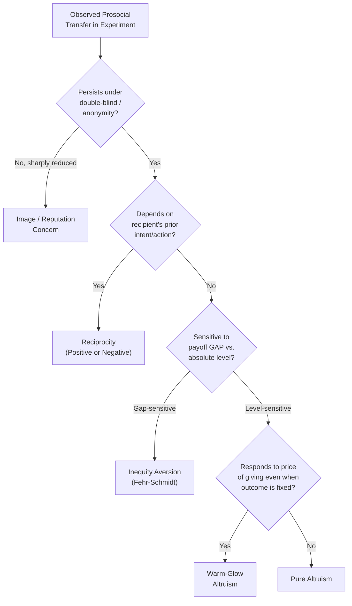

## Altruism and Other-Regarding Preferences

### Definition and Conceptual Overview

Other-regarding preferences refer to a class of utility specifications in which an agent's welfare depends not only on their own material payoff but also, directly, on the payoffs or welfare of other agents. This directly contradicts the standard neoclassical assumption of **pure self-interest** (homo economicus), under which utility is a function solely of own consumption. Altruism is the specific case in which the dependence on others' payoffs is **positive** — the agent derives utility from increases in another's wellbeing, independent of any strategic or reputational return.

Formally, a simple linear other-regarding utility function extends standard utility as:

$$U_i = \pi_i + \alpha \pi_j$$

where $\pi_i$ is agent $i$'s own material payoff, $\pi_j$ is the payoff of the other agent $j$, and $\alpha$ is a weighting parameter capturing the intensity and direction of other-regard. Pure self-interest corresponds to $\alpha = 0$; **altruism** corresponds to $\alpha > 0$; **spite** corresponds to $\alpha < 0$.

### Taxonomy of Other-Regarding Preferences

**Key Points**

- **Pure altruism**: Utility increases monotonically in the other's payoff, unconditionally, regardless of the other's actions, intentions, or relative standing — the simplest and most restrictive form.
- **Warm-glow altruism**: Utility derives from the *act of giving itself* (the private sense of moral satisfaction), rather than from the resulting change in the recipient's payoff — implies giving persists even when it is known to be economically inefficient or fully crowded out by other sources of support.
- **Inequity aversion**: Utility depends on the *difference* between own and others' payoffs, generating discomfort from both disadvantageous inequity (envy, when $\pi_j > \pi_i$) and advantageous inequity (guilt, when $\pi_i > \pi_j$) — formalized in the Fehr-Schmidt (1999) model.
- **Reciprocal altruism / reciprocity preferences**: Other-regard is *conditional* on the other's perceived intentions or prior actions — kindness is rewarded, unkindness is punished, even at a material cost to self (distinguishes reciprocity from unconditional altruism).
- **Efficiency-concerned (Pareto) preferences**: Utility increases in total surplus (efficiency), sometimes in tension with equality-based inequity aversion — captured in models like Charness-Rabin (2002), which nest both equity and efficiency motives.
- **Warm spite / competitive preferences**: Negative other-regard, where utility increases as the gap between own and others' payoff widens in one's own favor — relevant to status-seeking and rivalry.

### Fehr-Schmidt Inequity Aversion Model

The canonical formalization for two-player settings:

$$U_i(\pi_i, \pi_j) = \pi_i - \alpha_i \max(\pi_j - \pi_i, 0) - \beta_i \max(\pi_i - \pi_j, 0)$$

- $\alpha_i$ captures disadvantageous-inequity aversion (envy); typically calibrated $\alpha_i \geq \beta_i$, reflecting the empirical regularity that people dislike being behind more than they dislike being ahead.
- $\beta_i$ captures advantageous-inequity aversion (guilt); constrained to $0 \leq \beta_i < 1$ to ensure the agent never prefers to destroy their own surplus to achieve equality at an infinite cost.
- This model successfully rationalizes rejection of unequal offers in the Ultimatum Game and positive but incomplete sharing in the Dictator Game, both of which pure self-interest cannot explain.

### Key Experimental Paradigms

**Dictator Game**

- One participant (the "dictator") unilaterally decides how to split an endowment with a passive recipient who has no ability to reject, accept, or retaliate.
- Under pure self-interest, the rational prediction is zero transfer; the robust empirical finding across hundreds of replications is that a substantial share of dictators transfer a positive amount, typically averaging in the range of roughly 20-30% of the endowment, though results vary widely with stakes, framing, and social distance manipulations. [Unverified: exact percentages are highly sensitive to experimental design parameters, sample population, and stake size, and should not be treated as a universal constant]
- Because the recipient cannot reciprocate or punish, the Dictator Game is the cleanest paradigm for isolating pure altruism/warm-glow from strategic or reciprocity-based motives.

**Ultimatum Game**

- A proposer offers a split of an endowment; a responder can accept (both receive the proposed split) or reject (both receive zero).
- Pure self-interest predicts the responder accepts any positive offer and the proposer offers the smallest possible positive amount; empirically, low offers (typically below roughly 20-30% of the pie) are frequently rejected, and modal offers cluster near a 50-50 split.
- Rejection of positive offers reveals a willingness to sacrifice own material payoff to punish perceived unfairness — best explained by inequity aversion or negative reciprocity rather than pure altruism (which would not predict rejection at all).

**Trust Game (Investment Game)**

- A sender can transfer part of an endowment to a receiver; the transferred amount is multiplied (typically by a factor of 3) by the experimenter, and the receiver then chooses how much, if any, to return to the sender.
- Positive sending reveals trust/expectation of reciprocity; positive returning by receivers (given no repeated-game incentive) reveals reciprocal other-regard, since a purely self-interested receiver would return nothing.

**Public Goods Game**

- Multiple participants simultaneously choose a private contribution to a shared pool; the pool is multiplied by a factor and divided equally among all participants regardless of individual contribution, creating a free-rider incentive.
- Positive contributions above the Nash equilibrium of zero (or the dominant-strategy prediction of full free-riding) demonstrate other-regard toward the group; contributions typically decay over repeated rounds as participants observe free-riding by others — a pattern often attributed to **conditional cooperation** (a reciprocity-based, not purely altruistic, motive) combined with negative reciprocity toward perceived defectors.

### Distinguishing Motives: A Methodological Challenge

**Example**

Suppose a dictator gives $20 out of a $100 endowment. This single data point is consistent with multiple distinct underlying preferences: (a) pure altruism (values the recipient's payoff directly), (b) warm-glow (values the private feeling of having given), (c) inequity aversion (uncomfortable with a large payoff gap), or (d) image/reputational concern (wants to be seen as generous by the experimenter). Distinguishing these requires targeted manipulations:

- **Double-blind protocols** (experimenter cannot observe individual choices) reduce giving relative to single-blind protocols, isolating an **image-concern** component from "true" altruism — a robust and important confound in the literature (Hoffman, McCabe, and Smith).
- **Taking-frame variants** (dictator can *take* from an already-endowed recipient rather than only *give*) reveal that measured "generosity" is highly sensitive to the reference point/framing of the decision, implicating loss aversion and framing rather than a stable altruism parameter.
- **Cost-of-giving manipulations** (varying the price/exchange rate of transferring $1 to the recipient) allow estimation of an implied "demand curve" for altruism, distinguishing warm-glow (which should show diminishing but continued giving as price rises) from pure outcome-based altruism (more sensitive to how much the recipient actually ends up with).

### Evolutionary and Biological Foundations

- **Kin selection (Hamilton's rule)**: Altruistic behavior toward genetic relatives is favored by natural selection when the cost to the altruist is less than the benefit to the recipient, discounted by the coefficient of relatedness: $rB > C$. This explains altruism toward kin but does not, by itself, explain altruism toward genetically unrelated strangers observed in laboratory Dictator Games.
- **Reciprocal altruism (Trivers, 1971)**: Altruism toward non-kin can be evolutionarily stable if it is reciprocated over repeated interactions, formalized via repeated-game strategies such as Tit-for-Tat; this mechanism motivates reciprocity-based models but, again, does not fully explain one-shot anonymous giving.
- **Strong reciprocity / cultural group selection**: An alternative account proposing that a taste for cooperation and costly punishment of norm violators, even toward genetic strangers in one-shot interactions, was favored via group-level selection processes in ancestral human environments. [Inference: this remains a debated theoretical account in the evolutionary economics and anthropology literature, not a settled empirical consensus]

### Neuroeconomic Evidence

- Neuroimaging studies (fMRI) have associated charitable giving and other-regarding transfers with activation in reward-related neural circuitry (e.g., ventral striatum, orbitofrontal cortex) that overlaps substantially with activation observed for receiving money oneself — cited as physiological support for the warm-glow hypothesis, sometimes summarized informally as "neural evidence for a genuine hedonic return to giving." [Inference: neural co-activation in overlapping reward regions is suggestive but does not by itself establish a specific causal utility mechanism; interpretation of fMRI correlational data in this literature carries acknowledged limitations]

### Applications in Policy and Market Design

- **Charitable fundraising design**: Matching-donation campaigns, seed money announcements, and public recognition of donors ("giving lists") are choice-architecture applications that exploit warm-glow and image-concern components of other-regarding preferences to increase total contributions beyond what pure altruism-based appeals would predict.
- **Corporate social responsibility and consumer behavior**: Willingness-to-pay premiums for ethically sourced or fair-trade products are frequently modeled as a market-based expression of other-regarding preferences internalized into private consumption choice.
- **Tax policy and charitable deduction design**: The "price" of giving (after-tax cost per dollar donated) is a key policy lever whose elasticity of response reveals the warm-glow vs. pure-altruism distinction — pure altruism implies donors care about total charity received (implying government provision should fully crowd out private giving), while warm-glow implies donors care about their own contribution and are therefore only partially crowded out — an empirically important and well-studied distinction (Andreoni, 1989, 1990).
- **Labor economics**: Gift-exchange models of the employment relationship (Akerlof, 1982) apply reciprocal other-regarding preferences to explain why employers may pay wages above the market-clearing rate and workers respond with effort above the shirking-constrained minimum.

### Comparison Table: Motive Types and Diagnostic Signatures

| Motive | Depends on Recipient's Outcome? | Depends on Own Relative Standing? | Conditional on Recipient's Intent? | Persists Under Double-Blind? |
| --- | --- | --- | --- | --- |
| Pure altruism | Yes | No | No | Yes |
| Warm-glow | Weakly / indirectly | No | No | Partially reduced |
| Inequity aversion | Yes (via gap) | Yes | No | Yes |
| Reciprocity | Yes | Sometimes | Yes | Yes |
| Image/reputation concern | No (instrumentally, yes) | No | No | Sharply reduced |

### Illustrative Diagram: Other-Regarding Preference Decomposition

### Conclusion

Altruism and other-regarding preferences constitute a foundational departure from the self-interest axiom of standard economic theory, with robust experimental support across the Dictator, Ultimatum, Trust, and Public Goods paradigms. The central analytical challenge in this literature is not establishing *that* people exhibit other-regard — this is well-documented — but rather decomposing *which* specific mechanism (pure altruism, warm-glow, inequity aversion, reciprocity, or reputational concern) underlies any given observed behavior, since these motives generate observationally similar behavior in many settings but diverge sharply under targeted manipulations (blinding, framing, pricing, and conditionality).

**Next Steps**

- Inequity Aversion Models: Fehr-Schmidt and Bolton-Ockenfels Formalizations
- Reciprocity and Intention-Based Preferences (Rabin's Fairness Equilibrium)
- The Ultimatum Game: Cross-Cultural Variation and Stake-Size Effects
- Warm-Glow Giving and Crowding-Out in Public Goods Provision
- Social Preferences in Repeated Games and the Folk Theorem
- Gift-Exchange Models in Labor Markets (Akerlof and Fair-Wage Theory)
- Identity, Group Membership, and In-Group Favoritism in Other-Regarding Behavior
- Costly Punishment and the Enforcement of Social Norms