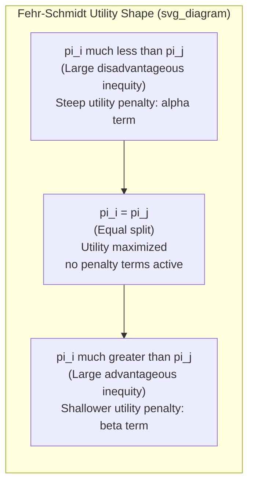

## Inequity Aversion Models

### Definition and Conceptual Overview

Inequity aversion models are formal utility specifications in behavioral economics in which an agent's wellbeing depends negatively on the *discrepancy* between their own material payoff and the payoffs of relevant others, rather than on own payoff alone. Unlike pure altruism (which is monotonic in others' absolute payoff regardless of the comparison to self), inequity aversion is fundamentally **comparative and self-referential**: the same absolute payoff to another person can generate either discomfort or satisfaction in the focal agent depending on whether it places that agent behind or ahead.

Two directional components are typically distinguished:

- **Disadvantageous inequity aversion**: Discomfort arising when the agent's own payoff is *lower* than a relevant comparison other's payoff — commonly associated with envy.
- **Advantageous inequity aversion**: Discomfort arising when the agent's own payoff is *higher* than a comparison other's payoff — commonly associated with guilt, or a sense of unfairness toward the disadvantaged party.

The two leading formal models in this literature are the **Fehr-Schmidt model** (1999) and the **Bolton-Ockenfels ERC model** (2000), which share the comparative-payoff intuition but differ substantially in functional form and behavioral implications.

### The Fehr-Schmidt Model

**Key Points**

For the two-player case, agent $i$'s utility over own payoff $\pi_i$ and the other's payoff $\pi_j$ is:

$$U_i(\pi_i, \pi_j) = \pi_i - \alpha_i \max(\pi_j - \pi_i, 0) - \beta_i \max(\pi_i - \pi_j, 0)$$

- $\alpha_i \geq 0$: the envy/disadvantageous-inequity parameter, penalizing states where $\pi_j > \pi_i$.
- $\beta_i \geq 0$: the guilt/advantageous-inequity parameter, penalizing states where $\pi_i > \pi_j$.
- **Standard calibration constraint**: $\alpha_i \geq \beta_i$ and $0 \leq \beta_i < 1$. The first restriction reflects the well-replicated empirical regularity that people dislike disadvantageous inequity more intensely than advantageous inequity. The second restriction ($\beta_i < 1$) ensures the agent never has an incentive to destroy their own payoff purely to achieve equality — if $\beta_i \geq 1$, an agent would prefer to burn money to eliminate a payoff gap, which is a knife-edge/degenerate case excluded by the standard specification.
- Heterogeneity in $(\alpha_i, \beta_i)$ across the population is central to the model's explanatory power: Fehr and Schmidt assume a **distribution** of types, including a substantial share of purely self-interested agents ($\alpha_i = \beta_i = 0$) alongside inequity-averse agents, which is necessary to jointly rationalize both competitive-market outcomes (where self-interested behavior prevails under sufficient competition) and bilateral bargaining outcomes (where fairness concerns bind).

**Generalization to $n$-Player Settings**

$$U_i = \pi_i - \frac{\alpha_i}{n-1}\sum_{j \neq i} \max(\pi_j - \pi_i, 0) - \frac{\beta_i}{n-1}\sum_{j \neq i} \max(\pi_i - \pi_j, 0)$$

Each pairwise comparison to every other group member is aggregated and normalized by group size, meaning the marginal disutility from any single unequal comparison shrinks as the group grows larger — a feature that has implications for predicted cooperation decay in larger public-goods groups.

### The Bolton-Ockenfels ERC Model

The Equity, Reciprocity, and Competition (ERC) model, developed contemporaneously with Fehr-Schmidt, takes a different functional approach:

$$U_i = U_i\left(\pi_i, \frac{\pi_i}{\sum_j \pi_j}\right)$$

- Utility depends on own absolute payoff $\pi_i$ **and** on own **relative share** of total group payoff, $\sigma_i = \pi_i / \sum_j \pi_j$.
- Utility is typically assumed single-peaked in $\sigma_i$, maximized at the equal share $\sigma_i = 1/n$, and declining as the agent's share moves either above or below equal share — a key structural difference from Fehr-Schmidt.
- **Critical distinction from Fehr-Schmidt**: ERC utility depends only on the agent's own payoff and the *aggregate* distribution (via own share of the total), not on payoff differences to *each individual* other player. This means ERC is insensitive to how a given inequitable total is distributed among other group members, whereas Fehr-Schmidt is sensitive to each individual pairwise gap. This distinction generates divergent, empirically testable predictions in specific multi-player designs (e.g., three-player dictator or ultimatum variants where the inequity is concentrated in one other player versus spread across two).

### Model Comparison Table

| Feature | Fehr-Schmidt (1999) | Bolton-Ockenfels ERC (2000) |
| --- | --- | --- |
| Comparison basis | Pairwise payoff differences to each other individual | Own payoff relative to own share of group total |
| Sensitive to distribution among others? | Yes | No |
| Envy vs. guilt asymmetry | Explicit, separate parameters ($\alpha \geq \beta$) | Implicit in the single-peaked share function |
| Heterogeneous types assumed? | Yes (population distribution of $\alpha, \beta$) | Yes (population distribution of utility function curvature) |
| Rationalizes Ultimatum rejection | Yes | Yes |
| Rationalizes positive Dictator giving | Yes | Yes |
| Predicts money-burning to equalize (edge case) | Possible if $\beta_i \geq 1$ (excluded by standard calibration) | Not directly, since utility is defined over share, not gap |

### Key Behaviors Rationalized by Inequity Aversion Models

**Example**

In the Ultimatum Game, a proposer offering a 90/10 split creates a large disadvantageous inequity for the responder ($\pi_j > \pi_i$ from the responder's perspective is reversed — the responder receives the *lower* share). Under Fehr-Schmidt, the responder rejects if the disutility from disadvantageous inequity ($\alpha_i \times$ gap) exceeds the foregone payoff from rejecting (which sets both payoffs to zero, eliminating the inequity entirely). This directly rationalizes rejection of low positive offers, a behavior standard self-interest models cannot explain.

- **Ultimatum Game rejections**: Both models predict responders will reject sufficiently unequal positive offers because eliminating disadvantageous inequity (by forcing mutual zero) yields higher utility than accepting a small but unequal positive payoff, for responders with sufficiently high $\alpha_i$.
- **Dictator Game positive giving**: Both models predict some positive transfer from advantageous-inequity-averse ($\beta_i > 0$) dictators, since giving reduces the guilt-inducing payoff gap even though it lowers own material payoff.
- **Cooperation and free-riding in Public Goods Games**: Inequity aversion helps explain **conditional cooperation** — contributing more when others are expected to contribute (avoiding disadvantageous inequity from being a "sucker") and reducing contribution when others free-ride (avoiding advantageous inequity from being exploited, or matching down to avoid appearing to be taken advantage of).
- **Wage rigidity and gift-exchange labor outcomes**: Inequity-averse workers may reduce effort when perceiving unfair wage-setting relative to co-workers or firm profits, providing a social-preference microfoundation for efficiency-wage and fair-wage models.

### Boundary Conditions and Empirical Limitations

- **The asymmetry assumption ($\alpha_i \geq \beta_i$) is empirically well-supported on average but does not hold uniformly for all individuals**; structural estimation studies fitting the Fehr-Schmidt model to experimental data typically find substantial heterogeneity, with a meaningful subset of estimated types showing $\beta_i > \alpha_i$ or near-zero values for both parameters. [Inference: precise population-level parameter distributions vary by study, subject pool, and elicitation method, and should not be treated as fixed universal constants]
- **Neither model incorporates intentions**: Both Fehr-Schmidt and ERC are purely **outcome-based** — they evaluate only the final payoff distribution, not the process or intent behind how it arose. This is a well-recognized limitation, since experimental evidence shows that identical unequal outcomes are treated very differently depending on whether they resulted from a deliberate choice versus an exogenous/random process (e.g., a computer-generated random allocation is rejected far less often than an identical human-chosen allocation in Ultimatum-type designs). This limitation directly motivated the development of **intention-based reciprocity models** (e.g., Rabin's Fairness Equilibrium, Dufwenberg-Kirchsteiger psychological game theory) as a distinct, complementary modeling tradition.
- **Static, one-shot framing**: The canonical formulations are typically applied to single-period or simultaneous-move settings; extending inequity aversion to fully dynamic, repeated-game contexts with belief updating requires additional structure not present in the base models.
- **Reference group ambiguity**: Both models require a specification of *who counts* as the relevant comparison other(s) (the reference group), which the base models take as exogenously given; in applied settings (e.g., organizational wage comparisons), identifying the empirically relevant reference group is itself a nontrivial and context-dependent modeling choice. [Inference: reference-group selection is an acknowledged open modeling challenge rather than a solved component of either base model]

### Illustrative Diagram: Fehr-Schmidt Utility as a Function of Own Payoff Share

### Structural Estimation and Applied Use

- Inequity aversion parameters are commonly estimated via **structural econometric methods** applied to experimental choice data (e.g., maximum likelihood estimation of $(\alpha, \beta)$ distributions fitting observed acceptance/rejection thresholds in Ultimatum Games, or observed transfer amounts in Dictator Games).
- These estimated preference parameters are then used as **microfoundations** embedded into broader models of labor markets (fair-wage effort models), industrial organization (fairness constraints on pricing and price discrimination — "fairness as a constraint on profit-maximizing behavior," per Kahneman, Knetsch, and Thaler's related but distinct fairness-perception research), and mechanism/contract design (optimal contracts under inequity-averse agents, relevant to team compensation and tournament design).
- In **mechanism design contexts**, inequity aversion among agents can be exploited or must be accounted for: for instance, revealing relative performance information (as in tournaments or forced-ranking systems) interacts with inequity aversion to affect both effort provision and morale, with theoretically ambiguous net effects depending on parameter values. [Inference: the net welfare and effort implications of transparency policies under inequity aversion are context- and parameter-dependent, not uniformly signed]

### Conclusion

Inequity aversion models formalize the intuition that fairness concerns operate through comparative, not purely absolute, payoff evaluation, providing rigorous microfoundations for a wide range of anomalous experimental behavior — most notably Ultimatum Game rejections and positive Dictator Game transfers — that pure self-interest cannot rationalize. The Fehr-Schmidt and Bolton-Ockenfels ERC frameworks remain the two dominant formalizations, differing chiefly in whether individual pairwise comparisons or aggregate relative share drive the inequity penalty; both share the significant limitation of being purely outcome-based, which has motivated a parallel and complementary literature on intention-based reciprocity.

**Related Topics**

- Rabin's Fairness Equilibrium and Intention-Based Reciprocity
- Dufwenberg-Kirchsteiger Psychological Game Theory
- Structural Estimation of Social Preference Parameters
- Fair-Wage Effort Models and Efficiency Wages
- Tournament Theory and Relative Performance Evaluation Under Inequity Aversion
- The Ultimatum Game: Cross-Cultural Variation and Stake-Size Effects
- Money-Burning Games and Costly Punishment
- Fairness as a Constraint on Profit-Maximizing Pricing (Kahneman, Knetsch, Thaler)