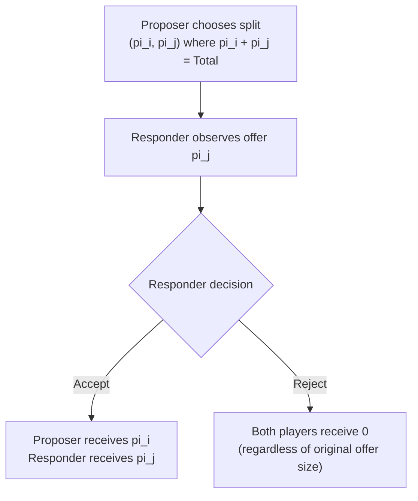

## The Ultimatum Game

### Definition and Conceptual Overview

The Ultimatum Game is a canonical two-player, sequential bargaining paradigm used in experimental and behavioral economics to test whether real decision-makers conform to the subgame-perfect predictions of standard game theory under complete self-interest, or instead exhibit fairness-related, other-regarding behavior. The game structure is deliberately minimal: one round, one offer, binary response — designed to strip bargaining down to its simplest possible strategic form so that any departure from the self-interested prediction can be cleanly attributed to social preferences rather than repeated-game reputational or strategic considerations.

### Formal Game Structure

**Key Points**

- **Players**: A **Proposer** (sometimes called the "allocator") and a **Responder**.
- **Endowment**: A fixed sum of money, $\Pi$, is provided by the experimenter.
- **Stage 1 (Proposal)**: The Proposer offers a split $(\pi_i, \pi_j)$ such that $\pi_i + \pi_j = \Pi$, where $\pi_i$ is the Proposer's retained share and $\pi_j$ is the amount offered to the Responder.
- **Stage 2 (Response)**: The Responder observes the offer and chooses to **Accept** (both players receive the proposed split) or **Reject** (both players receive zero, regardless of the offer's magnitude).
- **One-shot, anonymous, single interaction**: The canonical design specifies no repeated play and no identity revelation, in order to rule out reputation-building or retaliation-avoidance as confounding motives.

### The Subgame-Perfect (Self-Interest) Prediction

Under backward induction with the standard self-interest assumption:

- A rational, wealth-maximizing Responder should accept **any** offer $\pi_j > 0$, since rejecting yields a strictly worse payoff of zero versus any positive amount accepted.
- Anticipating this, a rational, wealth-maximizing Proposer should offer the smallest positive increment possible (approaching $\pi_j \to 0$), retaining nearly the entire endowment.
- This is the unique **subgame-perfect Nash equilibrium** of the game under common knowledge of rationality and purely self-interested preferences.

### Empirical Regularities

**Example**

If $\Pi = \$100$, the subgame-perfect prediction is an offer near $1 (or the smallest available unit), which the Responder accepts. In practice, across a large body of replications, modal offers instead cluster near a 50/50 split, and offers below roughly 20-30% of the endowment are frequently rejected outright — a robust and widely replicated departure from the standard prediction. [Unverified: precise modal offer values and rejection-rate thresholds vary meaningfully by study, stake size, and subject population, and the figures given here describe a general empirical pattern rather than a fixed universal constant]

- **Modal and mean offers**: Empirical offers typically center between 40% and 50% of the endowment, far above the near-zero prediction of the self-interest model.
- **Rejection rates**: Offers below approximately 20% of the endowment are rejected in a substantial share of trials, despite rejection being strictly costly to the Responder in material terms.
- **Robustness across stakes**: Increasing the endowment size (raising the absolute cost of rejection) reduces rejection rates somewhat but does not eliminate the phenomenon, even at stakes representing several months' income in some field replications conducted in lower-income settings. [Inference: the degree of stake-size sensitivity is study-specific; claims of near-complete convergence to the self-interest prediction at very high stakes are not uniformly supported across the literature]
- **Cross-cultural variation**: Large-scale cross-cultural studies (notably the Henrich et al. multi-society project) find substantial variation in both offer levels and rejection thresholds across small-scale societies, correlated with the degree of market integration and the structure of local cooperative institutions — indicating that fairness norms invoked in the Ultimatum Game are shaped by cultural context rather than being a fixed universal preference parameter.

### Theoretical Explanations for the Deviation

- **Inequity aversion (Fehr-Schmidt, Bolton-Ockenfels)**: Responders reject low offers because the disutility from disadvantageous inequity outweighs the utility from a small positive payoff; formally, a Responder rejects when $\alpha_i \times (\pi_i - \pi_j) > \pi_j$ under the Fehr-Schmidt specification.
- **Intention-based reciprocity (Rabin's Fairness Equilibrium)**: Rejection is modeled as *negative reciprocity* — punishing a Proposer perceived to have acted unkindly, conditional on inferred intent, not merely on the resulting payoff distribution. This explanation is supported by comparative designs showing that identical low offers generated by a random/computerized process are rejected far less frequently than the same offers attributed to a deliberate human choice.
- **Social norm and expectation-based accounts**: Offers and rejections are interpreted as reflecting internalized norms of a socially acceptable "fair" split (often anchored near equal division), with rejection functioning as a costly signal enforcing the norm against violators.
- **Spite and strategic signaling accounts**: An alternative view frames rejection as a form of costly punishment intended to deter future unfair behavior by the same or other proposers, which is more directly testable in repeated or multi-proposer variants of the design.

### Key Experimental Variants

**Third-Party Punishment Ultimatum Designs**

- An observing third party (uninvolved in the original split) is given the option to spend their own endowment to punish an unfair Proposer — used to test whether fairness enforcement extends beyond direct self-interest (a strong-reciprocity signature), since the third party has no material stake in the original division.

**Random/Computer-Generated Offer Comparison**

- Comparing rejection rates of identical low offers when attributed to a human Proposer's deliberate choice versus a random/computer-generated draw isolates the intention-based component of rejection from the purely outcome-based (inequity-averse) component — a key design used to adjudicate between competing theoretical accounts.

**Mini-Ultimatum Game**

- The Proposer chooses between only two pre-specified offers (e.g., a 50/50 split versus an 80/20 split, or an 80/20 split versus a 50/50 alternative), allowing cleaner inference about the Proposer's intent since the counterfactual alternative offer is known to the Responder — used extensively in the intention-based reciprocity literature.

**Cross-Cultural / Field Ultimatum Games**

- Conducted in small-scale, non-industrialized societies to test whether Western-derived fairness norms and offer patterns generalize; the Henrich et al. (2001, 2005) studies found substantial cross-societal variation, with some groups offering below-Western-average splits and others offering above-Western-average ("hyper-fair") splits linked to local gift-giving customs, and rejection patterns correlating with the society's degree of integration into market exchange.

**Stake-Size Variants**

- Conducted with endowments scaled to represent meaningful fractions of local income (e.g., studies in Indonesia and other lower-income settings using stakes equivalent to multiple months' wages) to test whether the self-interest prediction reasserts itself as the material cost of rejection rises substantially.

### Illustrative Diagram: Ultimatum Game Extensive Form

### Comparison to Related Bargaining Paradigms

| Feature | Ultimatum Game | Dictator Game | Trust Game |
| --- | --- | --- | --- |
| Responder has veto power? | Yes (reject sets both to zero) | No (recipient is passive) | Indirect (via reciprocal return) |
| Isolates pure altruism? | No (confounded with strategic anticipation of rejection) | Yes (no veto, no strategic response possible) | No (confounded with trust and reciprocity) |
| Reveals fairness enforcement / punishment? | Yes (via rejection of low offers) | No | Partially (via return-rate response to sender behavior) |
| Standard self-interest prediction | Near-minimal positive offer, always accepted | Zero transfer | Zero send, zero return |

### Applications and Broader Relevance

- **Labor and wage-setting contexts**: The Ultimatum Game is frequently invoked as a stylized analogy for wage bargaining and take-it-or-leave-it contract offers, motivating fair-wage models in which workers ("Responders") may reduce effort or engage in costly action against wage offers perceived as unfair, even when accepting would be materially rational.
- **International trade and diplomatic negotiation framing**: The logic of costly rejection to punish perceived unfairness has been applied metaphorically (with appropriate caution about external validity) to explain instances of parties rejecting objectively beneficial deals perceived as inequitable.
- **Mechanism and contract design**: Awareness of Ultimatum-Game-type rejection behavior informs the design of take-it-or-leave-it offer mechanisms in procurement, real estate, and other bargaining contexts, where offers perceived as exploitative risk outright rejection even when a positive-payoff acceptance would be materially optimal for the recipient. [Inference: the direct transferability of laboratory Ultimatum Game magnitudes to specific applied negotiation contexts is a reasonable extrapolation but not a precisely validated quantitative mapping]

### Conclusion

The Ultimatum Game stands as one of the most replicated and theoretically consequential paradigms in behavioral economics, providing the central empirical anchor for the broader research program on social preferences: the robust, cross-culturally variable, but persistently observed rejection of low but positive offers directly falsifies the subgame-perfect self-interest prediction and has motivated the development of both outcome-based (inequity aversion) and intention-based (reciprocity) formal models to account for the deviation.

**Related Topics**

- Inequity Aversion Models (Fehr-Schmidt and Bolton-Ockenfels)
- Rabin's Fairness Equilibrium and Intention-Based Reciprocity
- The Dictator Game and Isolating Pure Altruism
- Third-Party Punishment and Strong Reciprocity
- Cross-Cultural Experimental Economics (Henrich et al. Multi-Society Studies)
- Fair-Wage Effort Models and Efficiency Wages
- Costly Punishment and Social Norm Enforcement
- Behavioral Game Theory and Psychological Games (Dufwenberg-Kirchsteiger)