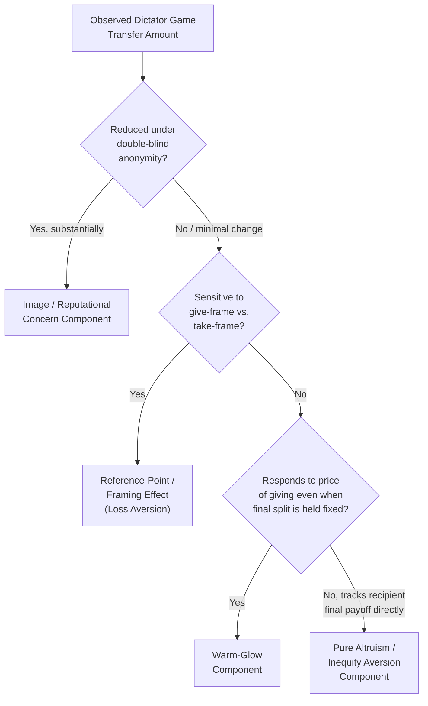

## The Dictator Game

### Definition and Conceptual Overview

The Dictator Game is a single-move, unilateral allocation paradigm in experimental economics designed to isolate pure other-regarding preferences from strategic considerations. It is derived directly from the Ultimatum Game by removing the Responder's veto power: one participant (the "Dictator") unconditionally determines the division of an endowment between themselves and a passive recipient who has no ability to accept, reject, retaliate, or otherwise influence the outcome. Because the recipient cannot respond, any positive transfer observed cannot be attributed to strategic anticipation of punishment, making the Dictator Game the cleanest available paradigm for measuring unconditional other-regard.

### Formal Game Structure

**Key Points**

- **Players**: A **Dictator** (active decision-maker) and a **Recipient** (fully passive).
- **Endowment**: A fixed sum $\Pi$ provided by the experimenter to the Dictator.
- **Single Decision**: The Dictator unilaterally chooses a transfer amount $\pi_j \in [0, \Pi]$ to give to the Recipient, retaining $\pi_i = \Pi - \pi_j$.
- **No response stage**: The Recipient receives whatever is transferred (including zero) with no capacity to reject, negotiate, or retaliate.
- **One-shot, typically anonymous**: The canonical design minimizes reputational and repeated-interaction incentives, though many variants deliberately manipulate anonymity to test its effect (see below).

### The Self-Interest Prediction vs. Empirical Findings

Under pure self-interest, the unique prediction is $\pi_j = 0$ — the Dictator retains the entire endowment, since there is no strategic cost whatsoever to doing so.

**Example**

If $\Pi = \$100$, the self-interest prediction is a $0 transfer. Empirically, across a large body of replications, a substantial majority of Dictators transfer a positive amount, with average transfers commonly falling in a broad range of roughly 10-30% of the endowment, though a non-trivial share of participants transfer nothing and a smaller share transfer equal or superior shares. [Unverified: precise average transfer percentages vary considerably across studies, populations, stake sizes, and procedural details, and the range cited here reflects a general empirical pattern rather than a fixed parameter]

- **Distribution shape**: Dictator Game giving is typically not normally distributed; common patterns include a spike at zero (purely self-interested participants), a spike at the 50/50 equal split (norm-following participants), and a more diffuse distribution across intermediate values.
- **High sensitivity to procedural details**: Unlike some other paradigms, Dictator Game transfer levels are unusually sensitive to seemingly minor design choices (framing, social distance, anonymity, exit options), making it a primary tool for studying *which specific conditions* activate or suppress other-regarding behavior.

### Critical Design Manipulations and What They Reveal

**Double-Blind Protocols**

- In single-blind designs, the experimenter can observe individual Dictator choices; in double-blind designs (pioneered by Hoffman, McCabe, and Smith), neither the experimenter nor the recipient can link a specific choice to a specific Dictator.
- Giving is robustly lower under double-blind conditions relative to single-blind conditions, indicating that a meaningful share of observed "generosity" in standard designs reflects **image or reputational concern** (a desire to be seen as fair by the experimenter) rather than purely intrinsic other-regard. This is one of the most methodologically important findings in the Dictator Game literature, as it demonstrates that the paradigm does not cleanly isolate altruism unless anonymity is rigorously enforced.

**Taking-Frame Variants**

- Standard framing presents the decision as *giving* from an endowment initially assigned to the Dictator; taking-frame variants instead endow the recipient first and give the Dictator the option to *take* from the recipient's endowment.
- Measured generosity differs substantially between give-frames and take-frames despite the underlying payoff-allocation problem being formally identical, implicating **reference-point dependence and framing effects** (loss aversion relative to the initial endowment) as confounds in interpreting Dictator Game giving as a stable, context-independent altruism parameter.

**Cost-of-Giving (Price) Manipulations**

- Varying the "exchange rate" of giving (e.g., $1 given by the Dictator costs the Dictator only $0.50, or costs $2) allows estimation of an implied demand curve for other-regarding transfers.
- Giving generally declines as the price rises but does not collapse to zero even at unfavorable exchange rates, and the specific shape of the response helps distinguish warm-glow motives (sensitive to the act/cost of giving itself) from pure outcome-based altruism (more sensitive to the recipient's final payoff level).

**Social Distance and Recipient Identity Manipulations**

- Reducing social distance (e.g., revealing recipient identity, using real charities as recipients, or pairing participants who have interacted beforehand) generally increases giving relative to fully anonymous stranger-pairings.
- Recipient "earned" endowments (e.g., recipient status is based on a prior task or merit-based criterion) versus randomly assigned recipient status affects Dictator generosity, linking Dictator Game behavior to broader desert- and merit-based fairness norms.

**Exit Option / Costless Refusal Variants**

- Providing Dictators a costless option to opt out of the game entirely (avoiding the decision) reveals that a portion of observed 50/50 "fair" splits may reflect a preference to avoid the discomfort of the allocation decision itself, rather than a genuine preference for equal division — some participants who would otherwise give little instead choose to exit rather than make a self-favoring allocation visible.

### Theoretical Interpretation: Which Motive Does the Dictator Game Isolate?

**Key Points**

- Because the recipient cannot respond, the Dictator Game in principle isolates unconditional other-regard from *reciprocity* (which requires a conditional response to the other's prior action) and from *strategic fairness* (anticipation of Responder rejection, as in the Ultimatum Game).
- However, the double-blind and taking-frame findings demonstrate that raw Dictator Game transfers are a **composite measure**, confounding: (a) pure altruism (value placed on the recipient's absolute payoff), (b) warm-glow (value placed on the private act of giving), (c) inequity aversion (discomfort with an unequal payoff gap, independent of the recipient's identity or wellbeing per se), and (d) image/reputational concern (desire for social approval, contingent on observability).
- Well-designed studies use combinations of the manipulations above (e.g., double-blind *and* cost-of-giving variation simultaneously) to statistically decompose these components, rather than treating a single transfer measurement as a clean estimate of "altruism."

### Illustrative Diagram: Decomposing Dictator Game Giving

### Comparison to Related Paradigms

| Feature | Dictator Game | Ultimatum Game | Trust Game |
| --- | --- | --- | --- |
| Recipient has veto/response power? | No | Yes (accept/reject) | Indirect (return decision) |
| Isolates unconditional other-regard? | Yes (cleanest available design) | No (confounded with rejection anticipation) | No (confounded with trust/reciprocity) |
| Self-interest prediction | Zero transfer | Near-minimal positive offer | Zero send/return |
| Primary confound | Image concern, framing, warm-glow | Strategic fairness anticipation | Belief about counterpart's reciprocity |

### Applications in Policy and Applied Research

- **Charitable giving research**: The Dictator Game serves as a standard laboratory proxy for real-world charitable donation behavior, used to test the effects of matching grants, seed money, suggested donation amounts, and social information (e.g., revealing what others gave) on giving levels — though external validity to large-stakes, real-world philanthropic decisions is a recognized limitation. [Inference: laboratory Dictator Game transfer rates are a useful directional proxy but do not map precisely onto real-world charitable giving rates, which are shaped by additional factors such as tax incentives and long-term relationship considerations]
- **Measuring discrimination and in-group/out-group bias**: Variants in which recipient group identity (ethnicity, nationality, team affiliation) is revealed to the Dictator are widely used to measure in-group favoritism and out-group discrimination in a controlled, incentive-compatible setting.
- **Cross-cultural and developmental studies**: The simplicity of the one-shot, one-decision design makes it well-suited for cross-cultural replication and for use with child and adolescent populations, supporting research on the developmental emergence of sharing and fairness norms.
- **Corporate social responsibility and consumer research**: Modified Dictator Game designs (e.g., "Dictator Games with Recipient earned endowments" or third-party framing) are used to study consumer willingness to support ethical sourcing and related prosocial market behavior.

### Conclusion

The Dictator Game provides the methodologically cleanest available paradigm for observing unconditional other-regarding behavior, since removing the recipient's response capacity eliminates strategic and reciprocity-based explanations for positive transfers. However, decades of manipulation-based research have shown that raw transfer amounts are a composite measure reflecting multiple distinct motives — pure altruism, warm-glow, inequity aversion, and image concern — that require additional experimental controls (double-blind protocols, framing variation, price-of-giving manipulations) to disentangle, making careful interpretation of any single Dictator Game result essential.

**Next Steps**

- Altruism and Other-Regarding Preferences: Motive Decomposition
- Inequity Aversion Models (Fehr-Schmidt and Bolton-Ockenfels)
- The Ultimatum Game and the Role of Responder Veto Power
- Double-Blind Experimental Protocols in Social Preference Research
- In-Group Favoritism and Discrimination in Allocation Games
- Warm-Glow Giving and the Economics of Charitable Contribution
- Framing Effects and Reference-Point Dependence in Allocation Decisions
- Developmental Origins of Sharing and Fairness Norms