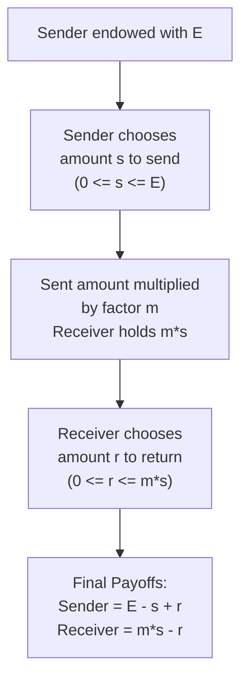

## The Trust Game and Reciprocity

### Definition and Conceptual Overview

The Trust Game — also known as the Investment Game — is a sequential, two-player experimental paradigm designed to measure both **trust** (a first-mover's willingness to place resources at risk based on an expectation of favorable reciprocation) and **trustworthiness/reciprocity** (a second-mover's willingness to reward that trust at a material cost to themselves). Developed by Berg, Dickhaut, and McCabe (1995), the game is distinct from the Dictator and Ultimatum Games in that it embeds a genuine social dilemma: mutual cooperation produces a larger total surplus than either party could achieve unilaterally, but the sequential structure creates a temptation for the second mover to defect, making the paradigm a direct behavioral test of reciprocal other-regarding preferences under an efficiency-enhancing but individually exploitable structure.

### Formal Game Structure

**Key Points**

- **Players**: A **Sender** (Trustor/Investor) and a **Receiver** (Trustee).
- **Endowment**: The Sender is given an initial endowment $E$.
- **Stage 1 (Send)**: The Sender chooses an amount $s \in [0, E]$ to send to the Receiver, retaining $E - s$.
- **Multiplication**: The experimenter multiplies the sent amount by a fixed factor $m$ (commonly $m = 3$), so the Receiver receives $m \cdot s$.
- **Stage 2 (Return)**: The Receiver, now holding $m \cdot s$, chooses an amount $r \in [0, m \cdot s]$ to return to the Sender, retaining $m \cdot s - r$.
- **Final payoffs**: Sender receives $E - s + r$; Receiver receives $m \cdot s - r$.

$$\pi_{\text{Sender}} = E - s + r \qquad \pi_{\text{Receiver}} = m \cdot s - r$$

### The Self-Interest Prediction vs. Empirical Findings

Under backward induction with pure self-interest: a wealth-maximizing Receiver returns $r = 0$ (any positive return is a pure cost with no strategic benefit in a one-shot, anonymous game), and anticipating this, a wealth-maximizing Sender sends $s = 0$, since sending anything yields a strictly worse expected payoff than retaining the full endowment.

**Example**

With $E = \$10$ and $m = 3$: the subgame-perfect prediction is $s = 0$, $r = 0$, yielding the Sender their full $10 and the Receiver $0. Empirically, across a large body of replications, Senders typically transfer a substantial share of the endowment — commonly averaging in the broad range of 40-60% — and Receivers return a positive amount in the majority of cases, though returned amounts frequently fall short of fully compensating the Sender for the implied trust, generating average net returns to trust that vary considerably by study. [Unverified: precise average send and return percentages differ substantially across replications, stake sizes, and subject pools, and should be treated as a general empirical pattern rather than fixed parameters]

- **Positive sending**: Robustly departs from the zero-sending prediction, interpreted as revealing genuine trust or an expectation of reciprocity (or, alternatively, a degree of unconditional altruism toward the Receiver, which the base design cannot fully separate out — see decomposition discussion below).
- **Positive returning**: Robustly departs from the zero-return prediction; the amount returned is typically found to be **increasing in the amount sent**, consistent with a reciprocity-based (conditional) motive rather than pure unconditional altruism, which would not necessarily predict such a relationship.
- **Return often falls short of "fair" reciprocation**: Many studies find that Senders who send the maximum amount do not, on average, receive back an equal split of the resulting surplus, indicating that trust is frequently not "fully" rewarded even though it is partially rewarded — a source of the empirical finding that expected monetary returns to sending are often close to break-even or modestly negative for the Sender, despite positive average sending behavior. [Inference: whether trust is, on net, "rational" in a narrow expected-payoff sense is sensitive to the specific parameterization and subject pool of a given study, and results are mixed across the literature]

### Distinguishing Trust from Altruism: The Decomposition Problem

**Key Points**

- A central methodological challenge is that Sender behavior in the base Trust Game confounds **trust** (belief that the Receiver will reciprocate) with **unconditional altruism** (willingness to transfer resources to benefit the Receiver regardless of any expected return) — since sending money both places trust *and* directly benefits the Receiver via the multiplication factor.
- **Standard decomposition method**: Comparing Sender behavior in the Trust Game to Dictator Game behavior with an equivalent multiplied endowment isolates the trust component. If a Sender would give the same amount in a Dictator Game (where no reciprocity is possible) as they send in the Trust Game, this suggests the transfer is driven primarily by altruism rather than strategic trust; amounts sent in the Trust Game **in excess of** the Dictator Game benchmark are attributed to the genuinely trust-based component.
- Similarly, Receiver return behavior confounds **reciprocity** (a conditional response rewarding the Sender's trusting action) with unconditional altruism toward the Sender; comparing return rates to Dictator Game giving by an equivalently-endowed Dictator helps isolate the reciprocal component from pure other-regard.

### Theoretical Interpretation of Reciprocity

- **Positive reciprocity**: The tendency to reward perceived kind or trusting actions by others at a material cost to oneself, even absent any repeated-game or reputational incentive to do so — the Receiver's return behavior in the Trust Game is a primary empirical signature of this motive.
- **Intention-based models (Rabin's Fairness Equilibrium; Dufwenberg-Kirchsteiger psychological game theory)**: Formalize reciprocity as depending on the *perceived kindness* of the other player's action relative to what they could have done, not merely on the resulting payoff distribution — directly relevant to the Trust Game, since the Receiver's return is empirically sensitive to the size of the sent amount, a signal of the Sender's intended kindness, not merely to the absolute payoff the Receiver now holds.
- **Belief-dependent utility**: Psychological game theory formalizes reciprocity as utility depending not just on strategies and outcomes but on players' **beliefs about beliefs** (the Receiver's return may depend on their belief about what the Sender expected in return), a structural departure from standard game-theoretic utility that depends only on outcomes.

### Illustrative Diagram: Trust Game Extensive Form and Multiplication

### Key Experimental Variants

**Repeated Trust Games**

- Played over multiple rounds with the same partner (or with rotating partners under fixed/random matching), allowing study of trust-building dynamics, reputation formation, and the erosion or reinforcement of cooperation over time — introduces genuine strategic/reputational incentives absent from the one-shot design.

**Trust Game with Communication**

- Allowing pre-play cheap-talk communication (e.g., non-binding promises about intended returns) between Sender and Receiver typically increases both sending and subsequent return rates, used to study the behavioral power of promises and commitment devices absent formal enforceability.

**Trust Game with Third-Party Punishment or Monitoring**

- Introduces an observing third party with the ability to punish a Receiver who fails to reciprocate, used to study institutional and social enforcement mechanisms for sustaining trust beyond individual reciprocal preferences alone.

**Cross-Cultural and Field Trust Games**

- Conducted across diverse societies and real-world relationship contexts (e.g., between actual business partners, or across differing institutional-trust environments) to study how baseline trust and reciprocity levels correlate with broader societal-level trust indicators (such as survey-based generalized trust measures) and economic development outcomes.

**Neuroeconomic Trust Games**

- fMRI and hormone-manipulation studies (notably research examining the neuropeptide oxytocin) have investigated the physiological correlates of trusting and reciprocating behavior, with some studies reporting that oxytocin administration increases Sender trust levels. [Inference: findings in this specific neuroeconomic sub-literature, particularly regarding oxytocin's precise causal role, have faced replication challenges and should be treated as a contested rather than fully settled area of research]

### Comparison to Related Paradigms

| Feature | Trust Game | Dictator Game | Ultimatum Game |
| --- | --- | --- | --- |
| Sequential with two active decisions? | Yes (send, then return) | No (single decision) | Yes (offer, then accept/reject) |
| Surplus-generating (multiplication)? | Yes | No | No |
| Isolates reciprocity specifically? | Yes, via comparison to Dictator Game benchmark | No | No (isolates negative reciprocity via rejection only) |
| Both players have active, payoff-relevant choices? | Yes | No (Recipient fully passive) | Yes, but Responder choice is binary only |

### Applications in Economics and Policy

- **Microfinance and credit markets**: The Trust Game is used as a stylized laboratory analogue for lender-borrower relationships absent formal contract enforcement, informing research on social collateral, group lending, and trust-based credit access in settings with weak formal institutions.
- **Organizational and workplace trust**: Applied to study principal-agent relationships, delegation decisions, and the behavioral foundations of psychological contracts in employment relationships, complementing gift-exchange labor market models.
- **Institutional and macroeconomic trust research**: Trust Game measures elicited from representative samples are correlated with country-level survey-based trust indicators and used in research examining links between social trust and economic growth, financial market development, and contract enforcement institutions. [Inference: the causal direction and magnitude of links between laboratory trust measures and macroeconomic outcomes remain an active and debated area of research, not a settled causal finding]
- **Online marketplace and platform design**: Reputation and rating systems in e-commerce and gig-economy platforms are frequently framed as institutional mechanisms designed to substitute for or reinforce the interpersonal trust and reciprocity dynamics studied via the laboratory Trust Game, by providing repeated-game-like incentives in otherwise one-shot-feeling transactions.

### Conclusion

The Trust Game provides a rich behavioral paradigm for jointly studying trust and reciprocity as distinct but interrelated social preferences, embedding a genuine cooperative dilemma via its surplus-multiplying structure that the Dictator and Ultimatum Games lack. Its central methodological contribution is enabling, through comparison to Dictator Game benchmarks, the decomposition of observed transfers into a genuinely trust- or reciprocity-based component versus an unconditional altruism component — a decomposition strategy that has become foundational for isolating specific social preference mechanisms across the broader experimental economics literature.

**Related Topics**

- Altruism and Other-Regarding Preferences: Motive Decomposition
- Rabin's Fairness Equilibrium and Intention-Based Reciprocity
- Dufwenberg-Kirchsteiger Psychological Game Theory
- The Dictator Game as a Benchmark for Isolating Altruism
- Repeated Games, Reputation Formation, and the Folk Theorem
- Gift-Exchange Models in Labor Markets
- Social Capital, Generalized Trust, and Economic Development
- Neuroeconomics of Trust and Cooperation