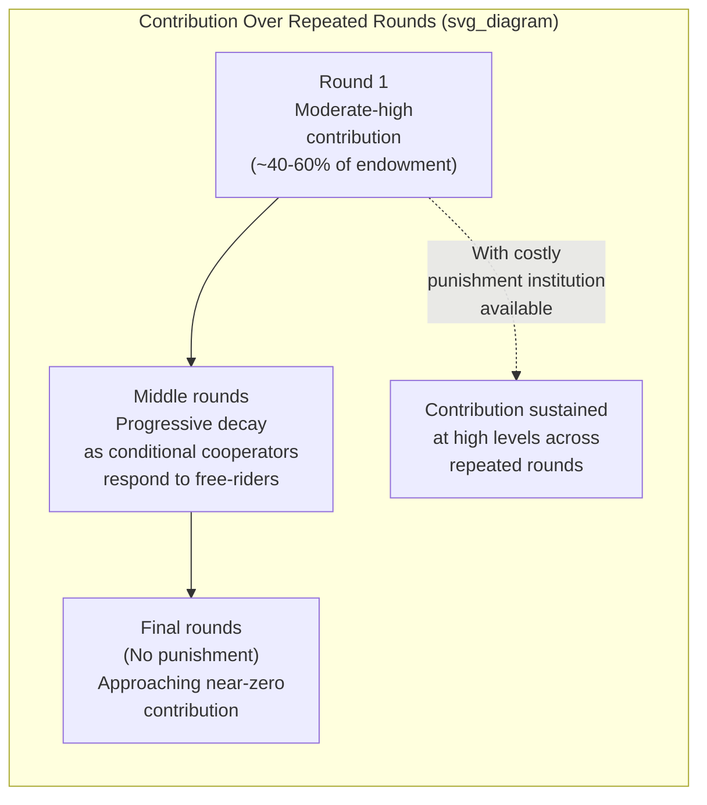

## Public Goods Games and Free-Riding

### Definition and Conceptual Overview

The Public Goods Game is an $n$-player experimental paradigm designed to study voluntary contribution to a shared, non-excludable resource under a social dilemma structure in which individual and collective incentives diverge. The game formalizes the free-rider problem central to public economics: because the benefits of the public good are shared by all group members regardless of individual contribution, standard self-interest predicts zero voluntary contribution (full free-riding), even though full cooperation would maximize total group welfare. The persistent empirical gap between this prediction and observed behavior makes the Public Goods Game one of the most extensively studied paradigms for social preferences, conditional cooperation, and the behavioral effects of punishment institutions.

### Formal Game Structure

**Key Points**

- **Players**: $n$ participants (commonly groups of 4), each endowed with a fixed sum $E$.
- **Contribution decision**: Each player $i$ simultaneously and independently chooses a contribution $c_i \in [0, E]$ to a shared group pool.
- **Multiplication and equal division**: The sum of all contributions is multiplied by a **marginal per capita return (MPCR)** factor $m$ (where $1/n < m < 1$) and divided equally among all $n$ group members, regardless of individual contribution levels.

$$\pi_i = (E - c_i) + m \sum_{j=1}^{n} c_j$$

- The constraint $m > 1/n$ ensures the public good is **socially efficient** to fund (the group as a whole benefits from any contribution, since $n \cdot m > 1$), while $m < 1$ ensures contributing is **individually costly** (each contributed dollar returns only $m < 1$ dollars to the contributor personally), creating the core tension between individual and collective rationality.

### The Self-Interest Prediction vs. Empirical Findings

Under standard self-interest, since $m < 1$, each individual dollar contributed returns less than a dollar to the contributor personally, making $c_i = 0$ the dominant strategy for every player regardless of others' contributions — the unique Nash equilibrium is **universal free-riding** ($c_i = 0$ for all $i$), which is Pareto-inferior to full contribution.

**Example**

With $n = 4$, $E = \$20$, and $m = 0.4$: the Nash equilibrium prediction is zero contribution by all players, each retaining $20. If all four players instead contributed their full endowment, the pool would total $80, multiplied to $32, and divided equally to yield $32 to each player — a strictly superior outcome for everyone, illustrating the divergence between individual dominant-strategy incentives and collectively efficient behavior. Empirically, initial-round contributions in one-shot or first-period repeated games typically average approximately 40-60% of the endowment, substantially above the zero-contribution prediction. [Unverified: precise average contribution levels vary considerably by MPCR value, group size, subject pool, and experimental framing, and the range cited reflects a broad empirical pattern rather than a fixed constant]

- **Contribution decay over repeated rounds**: In repeated (finitely-played) Public Goods Games without punishment, average contributions typically decline substantially from initial levels as rounds progress, often approaching, but rarely reaching, the full free-riding prediction by the final rounds — a widely replicated pattern often referred to as the **decay effect**.
- **Restart effect**: If participants are informed the game will restart with a fresh set of rounds (or are given a surprise unannounced restart), contributions typically jump back up before resuming their decay pattern, suggesting the decline is not solely a function of accumulated experience or strategy refinement but also reflects a horizon-dependent or fatigue-related dynamic. [Inference: the precise psychological mechanism underlying the restart effect remains debated in the literature]

### Theoretical Explanations for the Contribution-Decay Pattern

**Conditional Cooperation**

- The dominant explanation in the modern literature: a substantial share of participants are **conditional cooperators**, willing to contribute more when they believe others will also contribute, but reducing their own contribution when they observe or expect free-riding by others.
- Elicited via the "strategy method" (asking participants to specify their contribution for every possible average contribution level of other group members before observing actual group behavior), this research consistently finds a large subgroup of conditional cooperators (contribution roughly increasing with, though typically less than proportionally to, others' average contribution), a smaller subgroup of consistent free-riders, and a smaller residual subgroup exhibiting other patterns (e.g., hump-shaped contribution schedules). [Inference: exact proportions of each behavioral type vary across studies and subject populations]
- Contribution decay is explained under this account as an equilibrium unraveling process: conditional cooperators progressively reduce contributions in response to the presence of free-riders in their group, even if they would prefer mutual high contribution, generating a downward spiral despite no single player's preferences having changed.

**Confusion and Learning Accounts**

- An alternative or complementary explanation holds that some initial contribution reflects participant confusion about the dominant-strategy structure of the game, with decay partly reflecting learning toward the self-interested equilibrium over repeated exposure. [Inference: the relative contribution of confusion/learning versus genuine conditional cooperation to the observed decay pattern is disputed, and most contemporary researchers consider both mechanisms to operate simultaneously to some degree]

**Warm-Glow and Inequity Aversion**

- Positive initial contributions are also consistent with warm-glow altruism (utility from the act of contributing itself) and with inequity aversion (discomfort at receiving a larger private return than group-oriented contribution would suggest is "fair"), providing overlapping but theoretically distinct explanations for above-zero baseline contribution independent of the conditional-cooperation dynamic.

### Institutional Solutions: Costly Punishment

**Key Points**

- A landmark line of research (notably Fehr and Gächter, 2000, 2002) introduced a **punishment stage** following the contribution stage: after observing all group members' contributions, each player may pay a cost to reduce another player's payoff (a form of **costly, or "altruistic," punishment**, since the punisher gains no direct material benefit and incurs a cost themselves).
- **Central finding**: When costly punishment is available, contributions rise substantially and are sustained at high levels across many repeated rounds, in sharp contrast to the decay pattern observed without punishment — a dramatic behavioral reversal directly attributable to the punishment institution.
- Punishment is systematically targeted at group members who contributed **below** the group average, consistent with a negative-reciprocity or norm-enforcement motive rather than random or self-interested punishment.
- **Second-order free-riding problem**: Because punishment itself is individually costly with no material return to the punisher, standard self-interest predicts zero punishment (the incentive to punish is itself a public good, subject to the same free-riding logic) — the robust empirical finding that punishment nonetheless occurs at economically meaningful levels is a further, compounding anomaly relative to the pure self-interest benchmark, and is generally attributed to the same reciprocal/normative preferences documented elsewhere in the social preferences literature.

### Illustrative Diagram: Public Goods Game Contribution Dynamics

### Key Experimental Variants

**Threshold / Provision-Point Public Goods Games**

- The public good is only provided if total contributions reach a specified threshold; below the threshold, contributions may be partially or fully refunded, studying coordination dynamics distinct from the standard linear MPCR design.

**Public Goods Games with Sorting/Endogenous Group Formation**

- Allowing participants to choose or vote on group composition (e.g., excluding known free-riders from future groups) studies institutional and social-sorting mechanisms for sustaining cooperation without formal punishment.

**Public Goods Games with Reward Instead of (or in Addition to) Punishment**

- Comparing costly punishment to costly reward (paying to increase a cooperative group member's payoff) generally finds punishment to be a more effective and commonly used cooperation-sustaining mechanism than reward, though results vary by cultural context and specific design.

**Cross-Cultural Public Goods and Punishment Studies**

- Large cross-societal studies have documented substantial variation in both baseline contribution levels and the prevalence of a specific anomalous behavior termed **"antisocial punishment"** — punishing cooperators rather than free-riders — with antisocial punishment more prevalent in societies with weaker rule-of-law and civic cooperation norms, undermining the cooperation-enhancing effect of punishment institutions in those contexts.

### Comparison to Related Social Dilemma Structures

| Feature | Public Goods Game | Prisoner's Dilemma | Common-Pool Resource Game |
| --- | --- | --- | --- |
| Number of players | $n$ (typically $\geq 3$) | 2 | $n$ |
| Nature of shared resource | Positive externality (contribution benefits all) | N/A (payoff matrix based) | Negative externality (extraction depletes shared stock) |
| Dominant strategy under self-interest | Zero contribution (full free-riding) | Defect | Over-extraction |
| Standard institutional remedy studied | Costly punishment, communication | Repeated-game reputation/Tit-for-Tat | Communication, monitoring, Ostrom-style institutions |

### Applications in Policy and Institutional Design

- **Tax compliance and public finance**: The conditional-cooperation finding directly informs tax-compliance policy, motivating the use of social-norm-based interventions (e.g., informing taxpayers that most others comply) as a behavioral complement to standard deterrence-based enforcement.
- **Environmental economics and collective action**: The Public Goods Game framework underlies experimental and field research on climate change mitigation as a global public good problem, including studies of how communication, punishment institutions, and framing affect voluntary contribution to environmental cooperation.
- **Organizational team production and effort provision**: Applied to team-based compensation design, informing when and how peer monitoring, transparency, and peer-sanctioning mechanisms can sustain effort levels above what pure individual-incentive schemes would predict.
- **Common-pool resource management**: Complementary to Elinor Ostrom's institutional economics research on self-governance of shared natural resources, providing controlled laboratory evidence for the behavioral mechanisms (conditional cooperation, communication effects, graduated sanctions) underlying successful real-world commons management institutions.

### Conclusion

Public Goods Games reveal a robust and theoretically important departure from the self-interested free-riding prediction, with initial cooperation substantially exceeding zero but subject to systematic decay over repeated play absent an enforcement mechanism — a pattern best explained by a substantial population share of conditional cooperators responding negatively to observed free-riding. The introduction of costly punishment dramatically reverses this decay and sustains high cooperation levels, but this finding itself constitutes a further anomaly (the second-order free-riding problem), reinforcing the broader conclusion that reciprocal and norm-enforcing social preferences, rather than pure self-interest, are necessary to explain observed real-world levels of voluntary cooperation and collective action.

**Next Steps**

- Conditional Cooperation and the Strategy Method
- Costly Punishment and Strong Reciprocity
- Antisocial Punishment: Cross-Cultural Variation
- Second-Order Free-Riding and the Provision of Sanctioning Institutions
- Common-Pool Resource Games and Ostrom's Institutional Design Principles
- Tax Compliance and Social Norm-Based Policy Interventions
- Repeated Games and the Folk Theorem in Cooperation
- Communication and Cheap Talk in Social Dilemmas