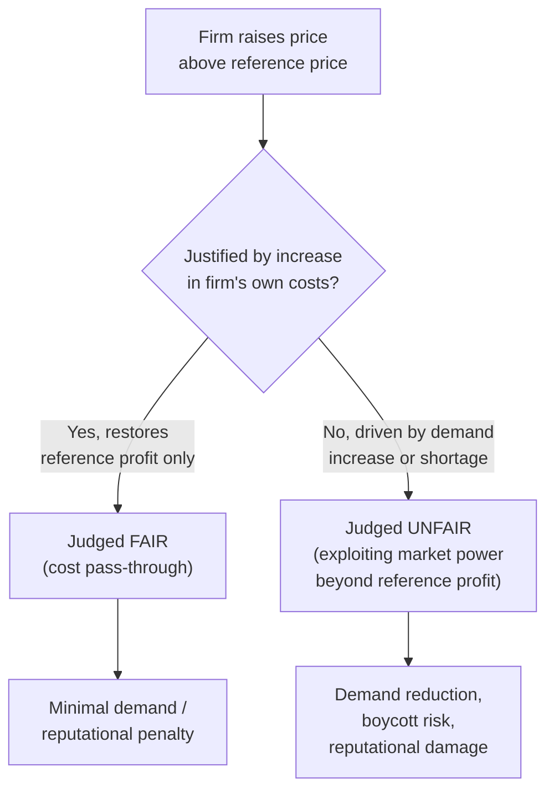

## Fairness Norms in Pricing and Market Transactions

### Definition and Conceptual Overview

Fairness norms in pricing refer to the systematic set of consumer and social expectations governing which price-setting behaviors by firms are perceived as acceptable versus exploitative, and the corresponding behavioral consequences (reduced demand, reputational damage, punishment) firms face when perceived fairness norms are violated — even when the violating price is fully consistent with standard supply-and-demand market clearing. This body of research, most prominently associated with Kahneman, Knetsch, and Thaler (1986), demonstrates that fairness operates as a **binding behavioral constraint on profit-maximizing pricing**, distinct from and in addition to standard demand-curve considerations, and helps explain a range of pricing phenomena that pure neoclassical market-clearing models struggle to rationalize.

### The Dual-Entitlement Principle

**Key Points**

The foundational theoretical framework from Kahneman, Knetsch, and Thaler (KKT) is the **dual-entitlement principle**, which holds that transactors are understood to be entitled to two distinct reference-dependent claims:

- **Firms are entitled to their reference profit** — the profit level historically or customarily associated with a given transaction, product, or relationship.
- **Customers are entitled to their reference price/terms** — the price or terms previously charged for the same or a similar transaction.
- A firm is judged to be acting **unfairly** when it increases profit by imposing a loss on the customer relative to the reference transaction (i.e., raising price above the reference price) **unless** the firm can point to an increase in its own costs that fully justifies the increase (restoring the firm's reference profit rather than exceeding it).
- Critically, the dual-entitlement framework implies a firm **is** considered entitled to pass through cost increases to maintain its reference profit level, but is **not** entitled to exploit a shift in demand or market power (e.g., a shortage) to increase profit beyond the reference level — this cost-based versus demand-based asymmetry is the central behavioral distinction the framework identifies.

### The KKT Survey Methodology and Key Findings

**Example**

In the canonical KKT survey vignette, respondents were asked to judge the fairness of a hardware store raising the price of snow shovels from $15 to $20 "the morning after a large snowstorm." A large majority of respondents judged this price increase as unfair, despite it being a textbook market-clearing response to a demand shock — illustrating that lay perceptions of fairness diverge sharply from the standard economic efficiency rationale for allowing prices to adjust to excess demand. [Unverified: the exact percentage of respondents judging such scenarios unfair varies by specific vignette wording and survey population, though the general directional finding — that demand-driven price increases are judged more harshly than cost-driven ones — is a robust and widely replicated result across the KKT survey series]

- **Asymmetric treatment of cost-based versus demand-based price increases**: Across a large series of paired vignettes, respondents consistently judged price increases attributed to a firm's own rising costs as fair (or at least far more acceptable), while judging observationally similar price increases attributed to increased demand or a supply shortage as unfair — even when the resulting price and profit margin were identical across the two framings.
- **Asymmetric treatment of losses versus foregone gains**: Consistent with prospect-theoretic loss aversion, imposing an explicit price increase (a loss relative to the reference price) was judged more harshly than achieving an equivalent outcome via withholding a discount or bonus that customers might have expected (a foregone gain) — the same net financial effect on the customer is judged differently depending on whether it is framed as a loss or a foregone gain.
- **Wage-setting parallels**: The same dual-entitlement asymmetry extends to labor market vignettes; cutting wages when a firm's profits decline was judged more acceptable than cutting wages when profits are stable but local unemployment rises (increasing the firm's market power over workers), even though both scenarios could be rationalized as profit-maximizing responses to changed market conditions under a purely neoclassical model.

### Behavioral Consequences of Perceived Unfair Pricing

- **Demand reduction and boycotts**: Consumers who perceive a price as unfair may reduce purchases or actively boycott a firm even when the price remains within their willingness-to-pay, reflecting a punishment motive analogous to Ultimatum Game rejection of low offers — customers are willing to sacrifice their own consumer surplus to punish a perceived unfair transactor.
- **Reputational and long-run demand effects**: Because fairness judgments are often shaped by inferred firm *intent* (a demand-based increase signals opportunistic exploitation; a cost-based increase signals a passive, non-exploitative response), a single fairness-violating pricing episode can generate reputational costs that persist and depress demand well beyond the immediate transaction, providing a rationale for price stickiness even in markets with volatile short-run demand.
- **Legal and regulatory responses**: Fairness norms around pricing have motivated real-world "price gouging" statutes in numerous jurisdictions, which explicitly restrict demand-driven price increases during declared emergencies (e.g., after natural disasters), effectively codifying the dual-entitlement asymmetry identified in the KKT research into formal law. [Inference: the precise design and enforcement stringency of price-gouging statutes vary considerably by jurisdiction and are subject to ongoing legal and economic policy debate regarding their efficiency costs]

### Illustrative Diagram: Dual-Entitlement Fairness Judgment Logic

### Price Discrimination and Fairness

**Key Points**

- **Fairness constraints interact with, and can limit, optimal price discrimination strategies**: Standard price theory predicts firms should charge different prices to different consumer segments based on willingness to pay, but overt or easily-detected price discrimination frequently triggers fairness backlash when customers become aware that otherwise-identical customers are paying different prices for the same good or service at the same time.
- **Acceptable versus unacceptable discrimination framing**: Price differences justified by observable cost differences (e.g., bulk discounts reflecting lower per-unit distribution costs) or by conventionally accepted segmentation practices (e.g., senior/student discounts, off-peak pricing) are generally viewed as fair, whereas price differences based on inferred willingness-to-pay alone (e.g., algorithmic personalized pricing based on browsing behavior or device type) are more likely to trigger perceptions of unfairness when discovered.
- **Dynamic and surge pricing controversies**: Real-time demand-based pricing models (notably ride-hailing surge pricing) represent a direct real-world application of the demand-based price increase scenario studied in the KKT vignettes, and have generated substantial documented consumer backlash and negative press coverage during periods of extreme surge multipliers, illustrating the practical commercial relevance of the fairness-versus-efficiency tension identified in the theoretical literature. [Inference: the specific magnitude of demand destruction or reputational cost attributable to surge pricing backlash in any given company's case is generally proprietary and not fully disclosed in public research, so precise quantification is not independently verifiable]

### Reciprocity and Gift-Exchange Extensions to Market Pricing

- The dual-entitlement framework connects directly to **gift-exchange models** in labor economics (Akerlof, 1982) and to reciprocity-based models of buyer-seller relationships, in which a firm perceived as offering "generous" terms (below the fairness-implied reference threshold, i.e., better than customers might expect) can elicit reciprocal customer loyalty, positive word-of-mouth, or reduced price sensitivity — a demand-side analogue to the effort-reciprocity relationship studied in labor gift-exchange experiments.
- **Menu costs and fairness-motivated price rigidity**: Fairness concerns provide a behavioral (in addition to the standard menu-cost) rationale for the well-documented empirical stickiness of posted prices, since firms may rationally choose to forgo profit-maximizing frequent price adjustments in order to avoid the reputational costs associated with fairness-violating price changes, particularly increases.

### Comparison to Related Fairness Paradigms

| Feature | Pricing Fairness (KKT) | Ultimatum Game | Inequity Aversion Models |
| --- | --- | --- | --- |
| Primary mechanism | Reference-dependent dual-entitlement judgment | Outcome-based rejection of unequal split | Payoff-gap-based utility penalty |
| Role of firm/proposer intent | Central (cost-based vs. demand-based justification) | Central in intention-based variants | Absent in base outcome-based model |
| Real-world regulatory application | Price-gouging statutes | N/A (laboratory paradigm) | Informs fair-wage/contract design theory |
| Primary behavioral consequence studied | Demand reduction, boycott, reputational damage | Rejection (zero payoff to both) | Rejection, reduced contribution/effort |

### Applications in Business Strategy and Regulation

- **Pricing strategy and communication**: Firms are widely advised, based on this research, to explicitly communicate cost-based justifications for price increases (e.g., citing input cost inflation) rather than allowing customers to infer a demand-based or opportunistic rationale, since the *attributed cause* of a price change, not merely its magnitude, drives the fairness judgment.
- **Dynamic pricing algorithm design**: Firms deploying algorithmic or surge-based pricing increasingly incorporate fairness-motivated caps, gradual rather than discrete price jumps, or transparent explanatory messaging, reflecting an applied behavioral-economics response to the documented backlash risk.
- **Regulatory policy design**: Price-gouging regulation, rent-control debates, and utility rate-setting proceedings frequently invoke fairness-based reasoning explicitly informed by or parallel to the dual-entitlement framework, alongside standard efficiency-based economic analysis, illustrating the direct policy relevance of this research stream.

### Conclusion

Fairness norms in pricing demonstrate that consumer and social judgments of transactional legitimacy depend heavily on reference-dependent comparisons and inferred intent (cost-based justification versus demand-based opportunism), constituting a behavioral constraint on profit-maximizing pricing that operates independently of, and sometimes in direct tension with, standard market-clearing efficiency logic. The dual-entitlement framework developed by Kahneman, Knetsch, and Thaler remains the foundational lens for understanding this constraint, with continuing direct relevance to contemporary controversies in algorithmic and dynamic pricing, price discrimination, and price-gouging regulation.

**Related Topics**

- Reference Dependence and Prospect Theory Foundations
- Loss Aversion in Consumer and Managerial Decision-Making
- Inequity Aversion Models (Fehr-Schmidt and Bolton-Ockenfels)
- Gift-Exchange Models and Fair-Wage Effort Theory
- Dynamic and Surge Pricing: Behavioral Backlash and Algorithm Design
- Price Discrimination Strategy Under Fairness Constraints
- Menu Costs and Behavioral Price Rigidity
- Price-Gouging Regulation and Consumer Protection Policy