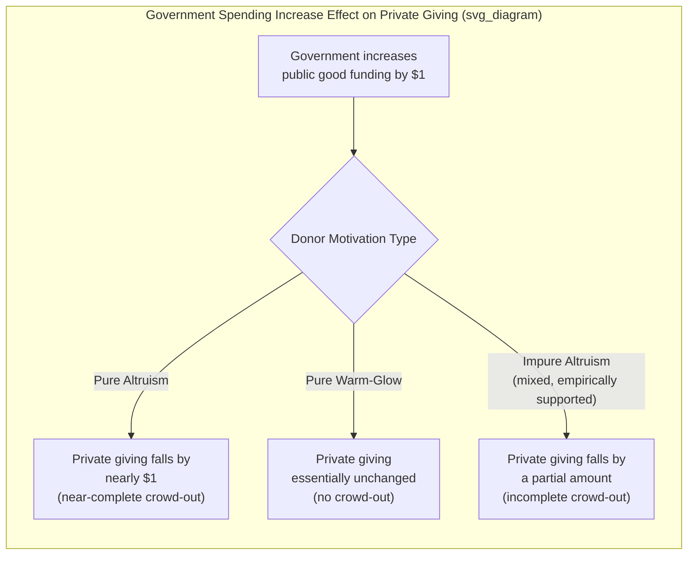

## Warm-Glow Giving and Prosocial Behavior

### Definition and Conceptual Overview

Warm-glow giving refers to a model of prosocial behavior in which an agent derives utility directly from the **act of giving itself** — the private psychological or moral satisfaction of contributing — rather than, or in addition to, utility derived from the resulting improvement in the recipient's or public good's outcome. The concept was formalized by James Andreoni (1989, 1990) specifically to resolve an empirical puzzle in public economics: standard "pure altruism" models, in which donors care only about the total quantity of a public good or a recipient's total wellbeing, predict that private charitable giving should be **fully crowded out** by government provision of the same good, a prediction strongly at odds with observed real-world giving behavior.

### The Crowding-Out Puzzle and Andreoni's Resolution

**Key Points**

- **Pure altruism prediction**: If a donor's utility depends only on the total amount of a public good provided (regardless of source), then a $1 increase in government-funded provision of that good should reduce the donor's private giving by close to $1, since the donor's marginal utility from further contribution falls once the desired total quantity is closer to being met — implying near-complete crowding out of private charity by public spending.
- **Empirical contradiction**: Extensive empirical research on charitable giving finds crowding-out effects that are real but consistently far smaller than the near-complete crowding-out predicted by pure altruism, with private giving persisting alongside substantial government provision of similar goods (e.g., social services, disaster relief) far more than the pure altruism model can rationalize. [Unverified: precise empirically estimated crowding-out magnitudes vary substantially across studies, public good categories, and estimation methodologies, and no single "crowding-out coefficient" is universally agreed upon in the literature]
- **Warm-glow resolution**: Andreoni's model resolves this by positing that donors derive utility partly (or entirely, in the "pure" warm-glow case) from their **own personal contribution** as a distinct argument in the utility function, separate from the resulting total public good level — since government provision does not substitute for the donor's own act of giving, warm-glow-motivated donations are not (or only partially) crowded out by increased government spending.

### Formal Utility Specification

The generalized (impure altruism) model specifies donor utility as a function of three arguments: own private consumption $x_i$, the total level of the public good $G$, and the donor's own contribution $g_i$:

$$U_i = U_i(x_i, G, g_i)$$

where $G = g_i + G_{-i}$ (the donor's own contribution plus the sum of all other contributions, including government provision).

- **Pure altruism** is the special case where utility depends only on $G$ (with $g_i$ entering utility solely through its effect on $G$, not as an independent argument) — implying $\partial U_i / \partial g_i = 0$ once $G$ is held fixed, and thus predicting complete crowding out.
- **Pure warm-glow** is the special case where utility depends only on $g_i$ directly, with no independent concern for the resulting total $G$ — implying zero crowding out, since the donor's optimal contribution is unaffected by how much others (including government) contribute.
- **Impure altruism** (Andreoni's preferred, empirically-motivated specification) allows utility to depend on both $G$ and $g_i$ as separate arguments, generating **partial** crowding out — a prediction that matches the empirical pattern far better than either polar case.

### Empirical Tests and Evidence

**Example**

A field experiment testing warm-glow versus pure altruism might vary, across randomly assigned donor groups, whether a matching grant is announced as increasing the *total* funds available to a cause (framed toward pure-altruism-relevant total impact) versus whether individual contributions are separately tracked and publicly acknowledged (framed toward warm-glow-relevant personal recognition); larger responsiveness to the acknowledgment/recognition manipulation relative to the pure impact manipulation is interpreted as evidence for a warm-glow component in donor motivation.

- **Charitable giving field experiments**: Studies varying matching-grant structures, seed money, and social recognition consistently find that donor responsiveness to these manipulations exceeds what a pure-outcome-based (impact-maximizing) altruism model would predict, supporting a meaningful warm-glow component in real-world giving.
- **Laboratory Dictator Game price-of-giving studies**: As discussed in the broader altruism literature, varying the "price" of transferring money to a recipient while holding the recipient's resulting payoff level constant (via compensating adjustments) allows researchers to isolate whether donors respond to their own contribution level per se (warm-glow) or only to the recipient's final outcome (pure altruism) — such studies generally find a mixture of both motives operating simultaneously across the donor population.
- **Public goods game contribution patterns**: The persistence of positive, non-zero contributions in one-shot Public Goods Games (where no genuine strategic or reputational return to contribution exists) is frequently cited as consistent with a warm-glow motive operating alongside conditional cooperation and inequity aversion, though these motives are difficult to fully separate within the standard Public Goods Game design alone.

### Illustrative Diagram: Warm-Glow vs. Pure Altruism Crowding-Out Prediction

### Neuroeconomic Evidence

- Neuroimaging (fMRI) studies of charitable donation decisions have reported activation in reward-related brain regions (including the ventral striatum and orbitofrontal cortex) that substantially overlaps with activation patterns observed when participants receive monetary rewards for themselves, a finding frequently cited as physiological corroboration of a genuine hedonic "glow" component to giving. [Inference: neural co-activation in shared reward circuitry is suggestive of an affective/hedonic component to giving but does not, on its own, definitively establish the specific utility-function mechanism proposed by the formal warm-glow model; interpreting fMRI correlational patterns as direct confirmation of an economic theoretical construct carries acknowledged limitations in the neuroeconomics literature]
- Some studies further report that mandatory or coerced transfers (e.g., forced taxation-like payments toward a charitable cause) generate substantially attenuated reward-region activation relative to voluntary giving of the identical amount, consistent with the warm-glow model's emphasis on the *voluntary act* of giving as the source of utility, distinct from the resulting financial outcome.

### Related Prosocial Behavior Phenomena

**Key Points**

- **Impression management and image-signaling motives**: Related to, but formally distinct from, warm-glow — image-based giving depends on **observability** by others (a reputational/social-signaling motive), whereas pure warm-glow utility exists even under conditions of complete anonymity; the double-blind Dictator Game manipulation (discussed under Dictator Game content) is the primary tool for separating these two related but distinct motives.
- **Moral licensing and moral self-regulation**: A distinct behavioral phenomenon in which an initial prosocial or virtuous act (potentially warm-glow-motivated) paradoxically *licenses* subsequent less prosocial or even antisocial behavior, as the individual feels they have "banked" sufficient moral credit — an important boundary condition on the persistence and consistency of prosocial behavior over time and across contexts. [Inference: the robustness and generalizability of moral licensing effects across contexts has been questioned in some replication-focused literature, and effect sizes reported vary considerably by study design]
- **Identifiable victim effect**: Giving and prosocial responsiveness increase substantially when a specific, identifiable individual beneficiary is presented (with a name, photo, or narrative) relative to a statistically identical but abstract/statistical description of need — a related but distinct phenomenon from warm-glow, operating through affective and identifiability channels rather than through the utility-from-own-contribution mechanism per se, though the two phenomena are often studied together in applied fundraising research.

### Applications in Fundraising and Nonprofit Strategy

- **Matching grant campaigns**: Announcing that a lead donor will match contributions dollar-for-dollar (or at some ratio) up to a cap has been shown in field experiments to increase both the likelihood of giving and total amounts raised beyond what a pure rational-impact calculation would predict, consistent with warm-glow and related image/recognition motives responding to the "leverage" framing of the appeal.
- **Public donor recognition and giving societies**: Naming donor walls, published donor lists segmented by contribution tier, and public acknowledgment events are direct applications designed to combine warm-glow utility with image-concern/reputational motives to maximize total fundraising.
- **Personal fundraising narratives and identifiable-victim framing**: Nonprofit marketing strategies increasingly emphasize individual beneficiary stories over aggregate statistical impact data, directly leveraging the identifiable victim effect alongside warm-glow-consistent messaging emphasizing the donor's personal role and impact.
- **Tax policy and the price elasticity of giving**: Because warm-glow utility depends partly on the donor's own contribution amount (not solely on the resulting total societal benefit), the price elasticity of charitable giving with respect to tax-deductibility rules is an important applied parameter estimated in public finance research to calibrate optimal charitable tax deduction design, directly informed by the crowding-out and impure-altruism theoretical framework.

### Comparison Table: Warm-Glow vs. Related Motives

| Feature | Pure Altruism | Pure Warm-Glow | Image/Reputation Concern |
| --- | --- | --- | --- |
| Utility source | Recipient's/public good's final outcome | Donor's own act of contributing | Being observed as generous by others |
| Predicted government crowd-out | Near-complete | None | N/A (independent of government spending) |
| Persists under full anonymity? | Yes | Yes | No, sharply reduced |
| Sensitive to "price" of giving at fixed final outcome? | No | Yes | Partially (signal value may still respond) |

### Conclusion

Warm-glow giving provides a critical theoretical and empirical resolution to the crowding-out puzzle left unexplained by pure altruism models, formalizing the intuitive but economically consequential idea that people derive independent utility from their own act of contribution, not merely from its downstream impact. This impure-altruism framework, combined with related but distinct phenomena such as image concern, moral licensing, and the identifiable victim effect, provides the theoretical foundation for a substantial share of applied fundraising practice and continues to directly inform public finance research on the optimal design of charitable tax incentives.

**Next Steps**

- Altruism and Other-Regarding Preferences: Motive Decomposition
- Crowding-Out Effects in Public Finance and Charitable Giving
- The Identifiable Victim Effect in Prosocial Decision-Making
- Moral Licensing and Moral Self-Regulation
- Image Concern and Reputation in Prosocial Signaling
- Neuroeconomics of Charitable Giving and Reward Processing
- Tax Policy Design for Charitable Deductions
- Matching Grants and Fundraising Mechanism Design