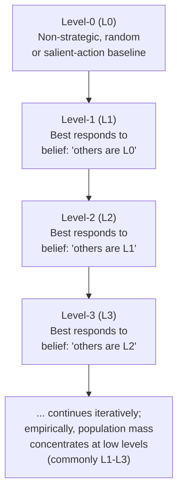

## Level-k and Cognitive Hierarchy Models

### Definition and Conceptual Overview

Level-k and cognitive hierarchy models are formal frameworks in behavioral game theory that relax the standard game-theoretic assumption of **common knowledge of rationality** and equilibrium play, replacing it with a finite, iterated model of strategic reasoning in which players differ in the *depth* of reasoning they perform about other players' likely behavior. Rather than assuming all players correctly anticipate and best-respond to the actual equilibrium strategies of others (as required for Nash equilibrium), these models posit a population of distinct "types," each characterized by a specific number of iterations of strategic thinking, providing a psychologically grounded account of the systematic and reproducible deviations from Nash equilibrium predictions observed across a wide range of experimental games.

### The Level-k Model: Formal Structure

**Key Points**

- **Level-0 (L0)**: The anchor of the hierarchy, representing a **non-strategic** type that does not reason about other players at all. L0 behavior is typically specified as a uniform random distribution over available actions, or sometimes as a focal/salient-action benchmark, and functions as a theoretical starting point rather than an empirically claimed description of actual population behavior.
- **Level-1 (L1)**: Players who assume all other players are Level-0, and choose the action that is the **best response** to a belief that others are playing randomly/non-strategically.
- **Level-2 (L2)**: Players who assume all other players are Level-1, and best-respond accordingly.
- **General Level-$k$**: A player of level $k$ assumes all other players are exactly level $k-1$, and best-responds to that specific belief.

$$\text{Level-}k \text{ strategy} = \text{BestResponse}(\text{belief that all others are Level-}(k-1))$$

- Critically, level-$k$ players hold a belief about others that is generally **incorrect** in a mixed population (since other players are not all exactly one level below), distinguishing this framework sharply from Nash equilibrium, in which all players hold correct beliefs about the actual strategy distribution in the population by construction.

### The Cognitive Hierarchy Model: Key Refinement

- Developed by Camerer, Ho, and Chong (2004) as a generalization addressing a specific weakness of the strict level-$k$ model: in level-$k$, a level-2 player's belief that *all* others are exactly level-1 is often behaviorally implausible, since real populations contain a mixture of types at multiple levels simultaneously.
- The **Cognitive Hierarchy (CH) model** instead assumes a level-$k$ player best-responds to the **entire distribution** of lower-level types (levels $0$ through $k-1$), typically weighted according to a specified frequency distribution (commonly a Poisson distribution calibrated from experimental data, with a single free parameter $\tau$ representing the population's average thinking depth).
- This refinement generates more behaviorally plausible beliefs (a level-2 CH player accounts for the possibility that other "level-2-labeled" opponents are actually a mix of level-0 and level-1 reasoners) while preserving the core iterated best-response logic of the level-$k$ framework.

### Motivation: Anomalies These Models Explain

**Example**

In the classic "Beauty Contest" (or "$p$-median") game, $n$ players simultaneously and independently choose a number in $[0, 100]$, and the winner is the player whose guess is closest to some fraction $p$ (commonly $p = 2/3$) of the average of all guesses. The unique Nash equilibrium, found via iterated elimination of dominated strategies, is for all players to choose $0$. Empirically, however, observed choices robustly cluster around values consistent with only one to three iterations of reasoning from a naive uniform-random or "50" anchor (e.g., a level-1 player anchored on an assumed average of 50 would guess $p \times 50 = 33$; a level-2 player anchored on an assumed average of 33 would guess $p \times 33 \approx 22$), rather than converging to the equilibrium prediction of zero. [Unverified: precise average guess values and implied modal reasoning levels vary by subject population, specific game parameters, and experience/repetition, and the figures given illustrate the general logic rather than a fixed universal result]

- **Beauty Contest / $p$-median games**: The canonical demonstration case; observed play robustly clusters at low iterated-reasoning levels (typically estimated modal levels around 1 to 2) rather than at the Nash equilibrium, and this pattern replicates with strong consistency across diverse subject pools.
- **Initial-play deviations in normal-form games**: Level-$k$ and CH models generally outperform Nash equilibrium in predicting **first-round, unlearned behavior** in novel one-shot games across a wide range of experimental designs, since Nash equilibrium requires a coordination-of-beliefs assumption that is implausible absent repeated play, communication, or focal-point conventions.
- **Asymmetric matching pennies and coordination games**: These models have been used to explain systematic, reproducible deviations from mixed-strategy Nash equilibrium predictions in simple two-player games where a naive population would otherwise be expected to randomize according to precise equilibrium mixing probabilities.
- **Signaling and information-revelation games**: Level-$k$ reasoning provides an alternative to fully rational Bayesian-Nash signaling equilibrium concepts, useful for explaining apparently "too much" or "too little" strategic information transmission relative to fully sophisticated equilibrium predictions.

### Estimation and Empirical Calibration

**Key Points**

- Level-$k$ and CH model parameters (the distribution of types/levels in a population, or the single Poisson parameter $\tau$ in the CH specification) are typically estimated via **maximum likelihood** fit to observed choice data across one or more games, then used to generate out-of-sample predictions for novel games.
- A key empirical and theoretical finding is that estimated modal or average reasoning levels across many studies cluster in a **relatively narrow range**, commonly cited as concentrated around levels 1 to 3, rather than being either purely non-strategic (level 0) or infinitely sophisticated/fully rational (equivalent to Nash equilibrium in common-knowledge settings). [Inference: while the general finding of low, bounded typical reasoning depth is robust and widely replicated, the precise numerical estimates of average level (often summarized loosely as "level 1.5" in popularized discussions) vary by study, game type, and estimation method, and should not be treated as a single universal constant]
- **Cross-game predictive validity**: A stronger test of the models' scientific validity than within-game fit is their ability to predict behavior in a *held-out* game using parameters estimated from a *different* game — level-$k$ and CH models have shown meaningful, though imperfect, out-of-sample predictive success in this cross-game validation approach, which is considered an important source of support relative to models that merely fit each game's data after the fact.

### Illustrative Diagram: Level-k Iterated Best-Response Structure

### Comparison to Nash Equilibrium and Related Boundedly Rational Models

| Feature | Nash Equilibrium | Level-k Model | Cognitive Hierarchy Model |
| --- | --- | --- | --- |
| Belief accuracy about others | Correct (by construction) | Incorrect (assumes all others exactly one level below) | Incorrect (assumes a specific distribution of lower levels) |
| Requires common knowledge of rationality? | Yes | No | No |
| Predicts heterogeneous population types? | No (single equilibrium strategy, possibly mixed) | Yes (discrete levels) | Yes (continuous/parametric distribution) |
| Best suited for | Repeated, learned, or highly transparent strategic settings | Novel, one-shot games; predicting initial play | Novel, one-shot games; more behaviorally plausible beliefs than strict level-k |

### Relationship to Learning Models

- Level-$k$ and CH models are explicitly models of **initial, unlearned strategic reasoning** and are generally understood as complementary to, rather than competing with, **experience-weighted attraction (EWA)** and other reinforcement/belief-learning models that describe how play evolves toward (though not always fully reaching) equilibrium over repeated exposure to the same game.
- A common integrated research approach uses level-$k$/CH models to predict and explain first-round play, then applies a learning model to characterize the trajectory of adjustment in subsequent rounds as players gain experience and, in many but not all games, converge closer to Nash equilibrium predictions.

### Applications in Applied Economics and Mechanism Design

- **Auction theory and bidding behavior**: Level-$k$ models have been applied to explain systematic overbidding relative to risk-neutral Nash equilibrium predictions in first-price sealed-bid auctions, an anomaly extensively documented in experimental auction research.
- **Market entry games and industrial organization**: Used to model firm entry decisions in the presence of uncertain rival behavior, where full common-knowledge-of-rationality equilibrium reasoning may be an implausible description of real managerial decision processes, especially in novel or rapidly evolving markets.
- **Mechanism design robustness**: Mechanism designers increasingly use level-$k$/CH frameworks to stress-test proposed mechanisms (e.g., auction formats, matching algorithms) against boundedly rational participant behavior, rather than relying solely on standard equilibrium-based robustness analysis, particularly relevant for mechanisms deployed to inexperienced or non-expert participant populations.
- **Political economy and voting behavior**: Applied to model strategic voting and campaign-message-response behavior under the assumption that voters and candidates engage in only limited iterated reasoning about each other's likely responses, rather than full game-theoretic equilibrium reasoning.

### Conclusion

Level-k and cognitive hierarchy models provide an empirically well-supported, psychologically grounded alternative to Nash equilibrium for predicting behavior in novel, one-shot strategic settings, replacing the assumption of common knowledge of rationality with a finite, iterated best-response hierarchy calibrated to the robust empirical finding that most individuals engage in only a small number of reasoning steps (commonly estimated around levels 1 to 3). These models have demonstrated meaningful cross-game predictive validity and are increasingly used alongside learning models and standard equilibrium analysis in applied behavioral game theory, auction design, and mechanism design research.

**Related Topics**

- The Beauty Contest Game and Iterated Dominance
- Experience-Weighted Attraction (EWA) Learning Models
- Quantal Response Equilibrium as an Alternative Bounded-Rationality Framework
- Bidding Behavior and Overbidding in First-Price Auctions
- Behavioral Mechanism Design and Robustness to Bounded Rationality
- Common Knowledge of Rationality: Theoretical Foundations and Critiques
- Poisson-Cognitive Hierarchy Parameter Estimation Methods
- Strategic Sophistication in Signaling and Information Games