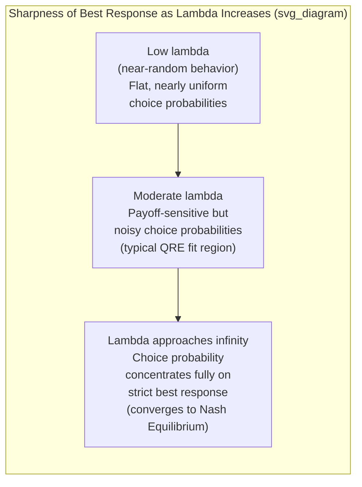

## Quantal Response Equilibrium

### Definition and Conceptual Overview

Quantal Response Equilibrium (QRE), introduced by McKelvey and Palfrey (1995), is a generalization of Nash equilibrium that relaxes the assumption of **perfect best-response behavior**, replacing it with a **stochastic best-response** in which players choose better actions with higher probability but do not choose optimally with certainty. Rather than modeling deviations from Nash equilibrium as arising from limited reasoning depth about *other players* (as in level-$k$ and cognitive hierarchy models), QRE models deviations as arising from **noisy, error-prone optimization** by each individual player over their own payoffs — a distinct behavioral mechanism that has proven to fit a wide range of experimental data, often outperforming standard Nash equilibrium predictions.

### Formal Structure: The Logit QRE Specification

**Key Points**

The most widely used variant, **logit QRE**, specifies that the probability a player chooses action $a$ from their available action set is an increasing function of that action's expected payoff, governed by a **precision parameter** $\lambda$:

$$P(a_i) = \frac{\exp(\lambda \cdot u_i(a_i, \sigma_{-i}))}{\sum_{a_i' \in A_i} \exp(\lambda \cdot u_i(a_i', \sigma_{-i}))}$$

where $u_i(a_i, \sigma_{-i})$ is player $i$'s expected utility from action $a_i$ given the (equilibrium) strategy profile $\sigma_{-i}$ of other players, and $\lambda \geq 0$ is the precision (or rationality) parameter.

- **As $\lambda \to \infty$**: Players become increasingly likely to choose only their strictly best-response action(s) with probability approaching 1, and QRE **converges to standard Nash equilibrium** as a limiting special case — a key theoretical property establishing QRE as a strict generalization rather than a wholly separate framework.
- **As $\lambda \to 0$**: Players choose uniformly at random across all available actions regardless of payoffs, representing the fully non-strategic, zero-rationality limiting case.
- **Fixed-point/equilibrium condition**: Critically, QRE retains the equilibrium (fixed-point) logic of Nash equilibrium — each player's quantal (noisy) best response must be consistent with, and computed against, the *actual* equilibrium distribution of other players' quantal responses, not against an assumed lower level of reasoning as in level-$k$ models. This is the central conceptual distinction between QRE and the level-$k$/cognitive hierarchy family of models.

### Key Conceptual Distinction from Level-k and Cognitive Hierarchy Models

**Example**

Consider a simple 2x2 coordination game with a clear payoff-dominant and a payoff-inferior Nash equilibrium. A level-$k$ model would explain miscoordination as arising because a level-1 player assumes their opponent is playing randomly (level-0) and best-responds to that specific (and generally incorrect) belief, generating a *systematic, level-dependent* deviation from equilibrium. A QRE model, by contrast, would explain the same miscoordination as arising because each player, even while correctly anticipating the *actual* equilibrium mixing behavior of their opponent, occasionally makes payoff-sensitive "trembles" or errors in their own choice — an *equilibrium* condition in which noisy best responses are mutually consistent, rather than a hierarchy of belief errors about the opponent's reasoning depth.

- **Source of deviation from Nash**: Level-$k$/CH models locate the deviation in **erroneous beliefs about other players' strategic sophistication**; QRE locates the deviation in **stochastic/noisy optimization by each player over otherwise correctly-anticipated opponent behavior**.
- **Equilibrium versus hierarchy structure**: QRE remains a genuine fixed-point equilibrium concept (self-consistent beliefs), whereas level-$k$ models are explicitly **not** equilibrium concepts, since level-$k$ players hold beliefs about others that are, by construction, generally inconsistent with the others' actual (mixed-level) behavior.
- **Complementary rather than mutually exclusive**: The two frameworks are not necessarily competing explanations of the same data; a substantial body of research uses both models side by side (or in hybrid specifications) to explain different aspects of observed deviations — QRE tends to perform well at explaining smooth, payoff-sensitive "trembling" around an equilibrium, while level-$k$/CH tends to perform well at explaining systematic first-round miscoordination and iterated-reasoning patterns, particularly in games like the Beauty Contest where QRE alone provides a less natural fit.

### Empirical Applications and Key Findings

**Key Points**

- **Payoff-sensitive comparative statics**: A central strength of QRE relative to standard Nash equilibrium is its ability to generate and successfully predict **payoff-sensitive comparative statics** — i.e., how the frequency of "errors" or deviations from the strict best response changes as the payoff cost of deviation changes. Standard Nash equilibrium (in the pure-strategy case) predicts discontinuous, all-or-nothing best-response behavior with no sensitivity to the magnitude of foregone payoff from a suboptimal choice, whereas QRE predicts that deviations become rarer as their payoff cost rises — a pattern robustly observed across numerous experimental games.
- **Asymmetric matching pennies and mixed-strategy games**: QRE has been particularly successful in explaining systematic and reproducible deviations from precise mixed-strategy Nash equilibrium predictions in games like asymmetric matching pennies, where standard theory predicts specific numerical mixing probabilities that are frequently and systematically violated in experimental data in a manner well-captured by the logit QRE specification.
- **Voluntary contribution and public goods settings**: QRE has been applied to help explain smooth, continuous deviation patterns in Public Goods Game contributions and other continuous-action strategic settings, complementing the conditional-cooperation and inequity-aversion explanations discussed in the social preferences literature.
- **Auction theory**: QRE has been used to explain systematic overbidding in first-price sealed-bid auctions relative to the risk-neutral Nash equilibrium bid function, providing an alternative or complementary account to risk-aversion-based and level-$k$-based explanations of the same well-documented overbidding anomaly.

### Illustrative Diagram: QRE Best-Response Curve vs. Nash Best Response

### Estimation and Structural Fitting

- QRE's single (or sometimes game-specific, multi-parameter) precision parameter $\lambda$ is typically estimated via **maximum likelihood** fit to observed choice frequencies in experimental data, analogous to the estimation approach used for level-$k$ and cognitive hierarchy models.
- **Agent Quantal Response Equilibrium (AQRE)** extends the framework to extensive-form (sequential-move) games, applying the logit quantal-response logic at each decision node separately, allowing QRE to be applied to sequential bargaining, signaling, and multi-stage strategic settings, not merely simultaneous normal-form games.
- A well-recognized methodological strength of QRE is that, because it nests Nash equilibrium as the $\lambda \to \infty$ limit, formal statistical tests can directly assess whether the estimated $\lambda$ is significantly different from the value implying near-perfect rationality, providing a principled, quantitative test of the departure from standard equilibrium predictions rather than a purely qualitative before/after comparison.

### Comparison Table: QRE vs. Nash Equilibrium vs. Level-k/CH

| Feature | Nash Equilibrium | Quantal Response Equilibrium | Level-k / Cognitive Hierarchy |
| --- | --- | --- | --- |
| Beliefs about others | Correct, deterministic | Correct, but responses are probabilistic | Incorrect (assumed lower reasoning level) |
| Own optimization | Perfect (no errors) | Noisy/stochastic (payoff-sensitive errors) | Perfect, conditional on (possibly wrong) belief |
| Fixed-point/equilibrium concept? | Yes | Yes | No |
| Explains payoff-sensitive error rates? | No (discontinuous best response) | Yes (central strength) | Not directly designed for this |
| Best suited for | Repeated/learned strategic settings | Mixed-strategy games, auctions, continuous-action settings | Novel one-shot games, iterated-reasoning tasks (e.g., Beauty Contest) |

### Theoretical Extensions and Refinements

- **Heterogeneous-$\lambda$ / type-distribution QRE**: Extensions allowing $\lambda$ to vary across a population of players (rather than assuming a single common precision parameter) to better capture observed individual-level heterogeneity in decision noise, analogous to the heterogeneous-level population assumption in cognitive hierarchy models.
- **Structural QRE combined with social preferences**: A growing applied literature embeds QRE's stochastic-choice structure on top of underlying social-preference utility functions (e.g., Fehr-Schmidt inequity aversion, rather than pure own-payoff maximization) to jointly account for both systematic other-regarding deviations from self-interested predictions and residual, unexplained choice noise around the resulting social-preference-adjusted best response.
- **Dynamic and Markov QRE**: Extensions to repeated and dynamic/stochastic games, incorporating quantal-response noise into each stage of an ongoing strategic interaction, relevant to modeling noisy learning and adjustment dynamics over time.

### Applications Beyond Laboratory Experiments

- **Political science and voter turnout models**: QRE has been applied to explain observed voter turnout levels that substantially exceed the near-zero turnout predicted by standard rational-voter models (in which an individual's vote has a vanishingly small probability of being pivotal), by modeling voting/abstention as a noisy, payoff-sensitive rather than perfectly optimizing decision.
- **Industrial organization and firm competition models**: Applied to explain observed pricing and output decisions in oligopoly settings that deviate from precise Nash equilibrium predictions in a smooth, payoff-sensitive manner consistent with noisy managerial optimization rather than systematic strategic miscalculation.
- **Conflict and international relations modeling**: QRE-based models have been used in formal political science research on crisis bargaining and conflict escalation to allow for the possibility of costly, payoff-sensitive miscalculation by state actors, rather than assuming perfectly rational brinksmanship as required by standard game-theoretic deterrence models. [Inference: the specific empirical validation of QRE-based conflict models against real-world international relations data is more limited and contested relative to its laboratory-experimental applications, given the inherent difficulty of testing such models against real geopolitical events]

### Conclusion

Quantal Response Equilibrium provides a theoretically elegant and empirically well-validated generalization of Nash equilibrium, replacing perfect optimization with payoff-sensitive stochastic choice while preserving the fixed-point equilibrium logic that level-$k$ and cognitive hierarchy models explicitly abandon. Its central strength — predicting smooth, payoff-sensitive comparative statics in deviation rates from strict best-response behavior — has made it one of the most widely applied behavioral game theory frameworks across experimental economics, auction theory, political science, and industrial organization, and its formal nesting of Nash equilibrium as a limiting case provides a principled basis for statistically testing the degree of departure from standard rational-choice predictions in any given strategic setting.

**Next Steps**

- Level-k and Cognitive Hierarchy Models: Comparison and Complementarity
- Agent Quantal Response Equilibrium in Extensive-Form Games
- Mixed-Strategy Nash Equilibrium and Experimental Tests
- Structural Estimation Methods in Behavioral Game Theory
- Overbidding in First-Price Auctions: Competing Explanations
- Voter Turnout Paradox and Behavioral Political Economy
- Combining Social Preferences with Stochastic Choice Models
- Experience-Weighted Attraction (EWA) Learning Models