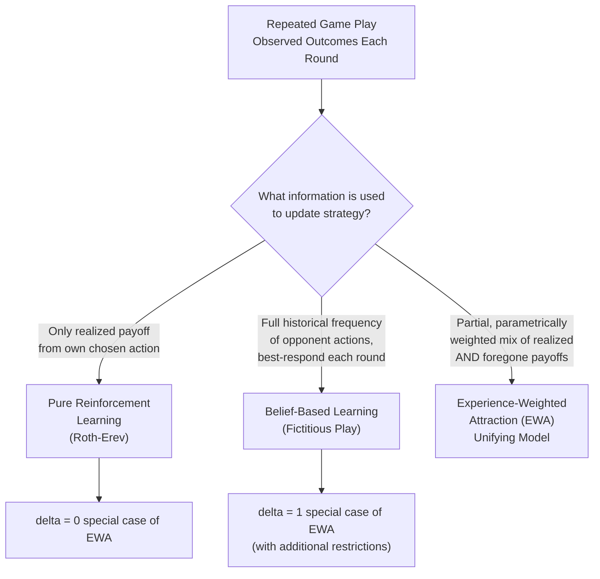

## Reinforcement and Belief-Based Learning in Games

### Definition and Conceptual Overview

Reinforcement and belief-based learning models constitute a family of dynamic behavioral game theory frameworks describing how players adjust their strategies over repeated play of a game based on past experience, as an alternative or complement to assuming players immediately play a Nash equilibrium or a static level-$k$/QRE profile from the outset. These models address a distinct empirical question from the static bounded-rationality frameworks discussed elsewhere in this chapter: not merely *how* players deviate from equilibrium in a single one-shot encounter, but *how and whether* repeated experience causes behavior to converge toward, oscillate around, or persistently diverge from equilibrium predictions over time.

### Reinforcement Learning Models

**Key Points**

- **Core mechanism**: Reinforcement learning models, rooted in behaviorist psychology and formalized for game-theoretic contexts (notably by Roth and Erev, 1995), posit that players increase the probability of choosing an action in the future in direct proportion to the **realized payoff** that action produced in the past, without requiring players to form explicit beliefs about opponents' strategies or even to understand the game's payoff structure for actions not yet chosen.
- **Propensity updating rule**: Each action $a_i$ has an associated propensity (or "attraction") score $q_i(a)$, updated after each round based on the realized payoff from the action actually taken:

$$q_i(a, t+1) = q_i(a, t) + \pi_i(a, t) \cdot \mathbb{1}[a \text{ chosen at } t]$$

with choice probabilities typically derived from relative propensities via a logit or power-function transformation.

- **Law of effect**: The foundational psychological principle underlying this class of models — actions followed by positive/relatively favorable outcomes become more likely to be repeated, while actions followed by poor outcomes become less likely, entirely independent of any strategic reasoning about why the outcome occurred.
- **Key limitation**: Because pure reinforcement models only update propensities for **actions actually taken** (not foregone alternatives), they generally predict slower learning and convergence than belief-based models in games where substantial information about foregone payoffs is available and potentially usable by more sophisticated players.

### Belief-Based (Fictitious Play) Learning Models

**Key Points**

- **Core mechanism**: Belief-based models, with **fictitious play** as the canonical example, posit that players form and continuously update beliefs about the probability distribution of opponents' strategies based on the observed **historical frequency** of opponents' past actions, and then choose a **best response** to this updated belief each round.
- **Belief updating rule**: A player's belief about an opponent's mixed strategy is typically modeled as the empirical frequency distribution of that opponent's past choices, updated each round as new observations accrue — critically, this requires the player to observe (or infer) the *actual actions* taken by opponents, not merely their own realized payoff.
- **Best-response requirement**: Unlike reinforcement learning, fictitious play assumes players correctly compute and play the best response to their current belief each period, requiring more cognitive sophistication (knowledge of the payoff structure, ability to compute best responses) than pure reinforcement learning.
- **Convergence properties**: Fictitious play is known to converge to Nash equilibrium in specific classes of games (e.g., zero-sum games, and games solvable by iterated dominance), but does **not** converge to equilibrium in all games, and can generate persistent cycling behavior in certain game structures — a well-established theoretical result distinct from its empirical performance as a behavioral model.

### Experience-Weighted Attraction (EWA): A Unifying Hybrid Model

**Example**

Consider a player in a repeated coordination game who, after choosing action A and receiving a moderate payoff, also observes that action B (which they did not choose) would have yielded a substantially higher payoff given what their opponent actually did. A pure reinforcement learner would not adjust their attraction to action B at all, since it was not chosen; a pure belief-based (fictitious play) learner would fully incorporate this foregone-payoff information into updating their strategy; the Experience-Weighted Attraction model developed by Camerer and Ho (1999) allows for a **partial, parametrically weighted** incorporation of this foregone-payoff information, nesting both polar cases within a single unified framework and estimating empirically how much weight real subjects place on foregone versus realized payoffs.

- **Unifying parameter structure**: EWA introduces a weighting parameter (commonly denoted $\delta$) governing the degree to which **foregone payoffs** (payoffs from actions not actually chosen, computed counterfactually given the opponent's actual observed play) are incorporated into attraction updating, alongside the realized payoff from the action actually taken.
- **Nesting reinforcement and fictitious play as special cases**: When $\delta = 0$, EWA collapses to a form of pure reinforcement learning (only realized payoffs matter); when $\delta = 1$ (with additional parameter restrictions), EWA approximates fictitious play (full weight on both realized and foregone payoffs, consistent with belief-based updating).
- **Additional decay and experience parameters**: EWA further incorporates parameters governing the decay of past experience relative to new information and the relative growth rate of an "experience" counter, allowing the model to capture varying degrees of recency-weighting in how strongly recent versus distant rounds influence current attractions.
- **Empirical estimation findings**: Structural estimation of the EWA model across numerous experimental datasets has generally found intermediate values of $\delta$ (a partial, rather than zero or complete, weighting of foregone payoffs), indicating that real subjects incorporate some but not full counterfactual reasoning into their learning process — providing quantitative support for a hybrid model over either polar pure-reinforcement or pure-belief-based specification. [Unverified: precise estimated parameter values vary considerably by game type, subject pool, and specific experimental design, and should not be treated as universal constants]

### Illustrative Diagram: Learning Model Taxonomy

### Convergence Patterns and Relationship to Equilibrium

- **Games with unique, stable Nash equilibria**: Learning models generally predict, and experimental data generally confirm, gradual convergence toward the Nash equilibrium prediction over a sufficient number of repeated rounds, though the *speed* and *smoothness* of this convergence varies substantially by game structure and is often better captured by EWA than by either polar model alone.
- **Games with multiple equilibria or coordination problems**: Learning dynamics can lead to convergence toward different equilibria depending on initial conditions, random early-round outcomes, and framing/labeling of strategies (relevant to focal-point/Schelling-point theory), an important area where learning models complement rather than substitute for static equilibrium selection theories.
- **Games with cycling or non-convergent theoretical dynamics** (e.g., certain games where fictitious play theoretically cycles rather than converges): Reinforcement and EWA-style learning models can generate qualitatively different — sometimes convergent, sometimes persistently cycling — predictions relative to pure fictitious play, an active area of ongoing theoretical and experimental research. [Inference: the precise conditions under which real subject behavior converges versus persistently cycles in theoretically non-convergent games remain incompletely characterized and are sensitive to specific game parameters]
- **Relationship to static bounded-rationality models**: Level-$k$/cognitive hierarchy and QRE models are generally understood as describing **initial, unlearned** play (effectively, "period 1" behavior), while reinforcement, fictitious play, and EWA models describe the **trajectory of adjustment** over subsequent periods — the two model families are complementary components of a fuller dynamic account of strategic behavior, with some integrated research frameworks explicitly combining an initial level-$k$/QRE-consistent starting condition with a subsequent EWA-style learning trajectory.

### Comparison Table: Reinforcement vs. Fictitious Play vs. EWA

| Feature | Pure Reinforcement (Roth-Erev) | Fictitious Play | EWA (Camerer-Ho) |
| --- | --- | --- | --- |
| Uses foregone-payoff information? | No | Yes, fully | Yes, partially (weighted by $\delta$) |
| Requires knowledge of full payoff matrix? | Not necessarily | Yes | Yes |
| Requires best-response computation each round? | No (propensity-based) | Yes | Yes (attraction-based, similar logic) |
| Nests the other two as special cases? | No | No | Yes (both, under parameter restrictions) |

### Applications and Empirical Domains

- **Market and auction learning dynamics**: Applied to model how bidders in repeated auction settings adjust bidding strategies over successive auction rounds, informing predictions about long-run market efficiency and price discovery as participants gain experience.
- **Coordination game experiments and organizational behavior**: Used to explain how work teams or organizational units converge (or fail to converge) on efficient coordinated behavior patterns over repeated interaction, relevant to understanding organizational routines and the persistence of inefficient equilibria within firms.
- **Financial market micro-structure and trader learning**: Applied in experimental asset market research to model how trader behavior and price bubble/crash dynamics evolve across repeated trading sessions with the same or overlapping subject pools, informing behavioral finance research on market efficiency.
- **Algorithmic and multi-agent systems research**: The reinforcement learning formalization used in behavioral game theory shares conceptual and mathematical lineage with reinforcement learning algorithms in computer science and artificial intelligence, and cross-fertilization between the two literatures has informed research on multi-agent learning dynamics in algorithmic trading, automated auction bidding agents, and other applied computational contexts. [Inference: the degree of direct methodological transfer between behavioral-economics reinforcement learning models and modern machine-learning reinforcement learning algorithms varies, and the two literatures, while historically related, have developed with substantially different technical emphases]

### Conclusion

Reinforcement and belief-based learning models provide the essential dynamic complement to static bounded-rationality frameworks like level-$k$ and QRE, addressing how repeated experience shapes the trajectory of strategic adjustment rather than merely characterizing deviations from equilibrium in a single encounter. The Experience-Weighted Attraction model's success in nesting pure reinforcement learning and fictitious play as special cases, while estimating an intermediate empirical weighting of foregone-payoff information, represents a significant unifying achievement in this literature, and the broader learning-dynamics research program remains essential for understanding whether, how quickly, and toward which outcome real strategic behavior evolves under repeated play.

**Related Topics**

- Level-k and Cognitive Hierarchy Models: Static Initial-Play Predictions
- Quantal Response Equilibrium and Payoff-Sensitive Choice
- Fictitious Play Convergence Theorems and Cycling Games
- Equilibrium Selection in Coordination Games and Focal Points
- Experimental Asset Markets and Bubble Formation Dynamics
- Multi-Agent Reinforcement Learning in Computational Game Theory
- Auction Learning Dynamics and Long-Run Market Efficiency
- Structural Estimation Methods in Behavioral Game Theory