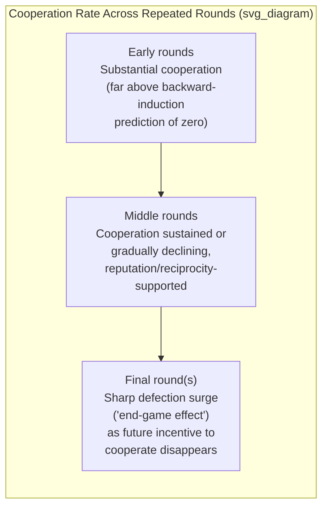

## Cooperation and Reputation in Repeated Games

### Definition and Conceptual Overview

Cooperation and reputation in repeated games examines how sustained interaction over multiple periods can support cooperative outcomes that would be unsustainable in a one-shot strategic encounter, and how behavioral departures from pure self-interest observed in laboratory settings interact with, reinforce, or complicate the standard game-theoretic mechanisms (repeated-game reputation and punishment strategies) that already predict cooperation is possible under purely self-interested preferences. This topic sits at the intersection of classical repeated-game theory (the Folk Theorem, trigger strategies) and behavioral game theory's finding that actual human cooperation frequently exceeds, and follows a different pattern from, what self-interested reputation-building alone would predict.

### The Folk Theorem: Standard Game-Theoretic Foundation

**Key Points**

- The **Folk Theorem** establishes that in an infinitely (or indefinitely, with sufficiently high continuation probability) repeated game, **any individually rational payoff** (a payoff at least as good as a player's minmax/security payoff) that is achievable through some feasible combination of stage-game strategies can be sustained as a subgame-perfect Nash equilibrium outcome of the repeated game, provided players are sufficiently patient (the discount factor is sufficiently close to 1).
- This means that cooperation in a repeated Prisoner's Dilemma — which is strictly individually irrational in the one-shot stage game — can be a full equilibrium outcome of the repeated game, sustained by the threat of future punishment for defection, **without requiring any social preferences or other-regarding utility whatsoever**; the standard Folk Theorem result rests entirely on self-interested players' concern for future payoffs.
- **Trigger strategies** (e.g., Grim Trigger: cooperate until any defection is observed, then defect forever after) and **Tit-for-Tat** (cooperate on the first move, then mirror the opponent's previous move) are the canonical strategy classes used to construct cooperative equilibria under the Folk Theorem's logic.

### Why Behavioral Research Is Still Needed: Anomalies Relative to the Folk Theorem

**Example**

Consider a finitely repeated Prisoner's Dilemma with a known, fixed final round. Standard backward induction implies defection is the unique subgame-perfect equilibrium in every round: in the known final round, both players defect (since there is no future to protect via cooperation); anticipating mutual defection in the final round, both players should also defect in the second-to-last round (since cooperating there yields no future benefit either); this unraveling logic propagates all the way back to the first round, predicting **full defection throughout the entire finitely repeated game** — the "chain-store paradox" or unraveling result. Empirically, however, laboratory finitely repeated Prisoner's Dilemma and Public Goods Game experiments robustly find substantial cooperation persisting for many rounds, with a sharp increase in defection typically only in the final round or two (a well-documented "end-game effect"), rather than the complete unraveling from round one predicted by backward induction. [Unverified: precise cooperation-decay patterns and the exact timing of end-game effects vary considerably by game parameters, group size, matching protocol, and subject pool]

- **Finitely repeated games and the unraveling paradox**: The standard backward-induction prediction of full defection from the very first round in any finitely repeated Prisoner's Dilemma is robustly violated in experimental data, which instead shows substantial cooperation until a pronounced end-game defection surge near the final rounds — a central behavioral anomaly motivating research beyond the pure self-interest Folk Theorem framework.
- **Reputation-building explanations (Kreps-Milgrom-Roberts-Wilson)**: A classical game-theoretic (not purely behavioral) resolution introduces a small probability of an "irrationally cooperative" or "commitment" type player type into the population; even fully self-interested players may find it optimal to *mimic* cooperative behavior for much of the game in order to build a reputation and induce continued cooperation from their opponent, generating cooperation that unravels only near the game's end — this explains the general *shape* of the empirical pattern (sustained cooperation, late-game unraveling) using standard rational-actor reasoning augmented with incomplete information about types, rather than requiring social preferences.
- **Behavioral/social-preference explanations**: An alternative or complementary account attributes sustained mid-game cooperation directly to genuine social preferences (inequity aversion, reciprocity, conditional cooperation, as documented in the social preferences literature) rather than purely strategic reputation-building — under this account, some fraction of the population cooperates because they have genuine other-regarding preferences, not merely because they are strategically mimicking a "nice" type.
- **Distinguishing the two explanations empirically**: Researchers use variations such as randomly and unpredictably ending the game early (removing common knowledge of the exact final round), varying group/partner matching protocols (fixed-partner vs. randomly rematched each round, isolating reputation-building incentives which require a stable partner history), and comparing behavior in games explicitly framed as one-shot with no possibility of reputation to disentangle strategic reputation motives from genuine social preferences.

### Direct versus Indirect Reciprocity

**Key Points**

- **Direct reciprocity**: Cooperation sustained through repeated interaction with the **same** partner, where each player's current behavior is conditioned on that specific partner's own past behavior toward them — the classical Tit-for-Tat and trigger-strategy mechanism described above.
- **Indirect reciprocity**: Cooperation sustained through reputation that is observable to **third parties**, even absent repeated direct interaction between the same two players — a player who is observed cooperating with others builds a positive reputation that induces cooperative treatment from entirely new partners who were not party to the original interaction, and conversely for defection.
- **Image scoring and reputation systems**: Formal models of indirect reciprocity (notably Nowak and Sigmund's image-scoring framework) show that cooperation can be evolutionarily and behaviorally stable even in populations with random, one-shot pairwise matching, provided reputational information about past behavior is sufficiently observable and used by players in deciding whether to cooperate with a new, previously unencountered partner.
- **Real-world relevance**: Indirect reciprocity mechanisms are directly relevant to understanding cooperation in large-scale, low-repeat-interaction real-world settings (online marketplaces, gig-economy platforms, professional reputation networks) where direct repeated interaction between the same two parties is rare, but reputational information persists and is shared across the broader population.

### Illustrative Diagram: Cooperation Trajectory in Finitely Repeated Games

### Reputation Mechanisms and Institutional Design

- **Reputation systems in online platforms**: E-commerce and gig-economy platform rating and review systems function as formalized, technologically-mediated indirect reciprocity mechanisms, designed explicitly to substitute for the direct repeated-interaction reputation-building that the classical Folk Theorem and Kreps-Wilson reputation models describe, in settings where any given buyer-seller or rider-driver pairing may occur only once.
- **Relational contracting in organizations and supply chains**: Long-term business relationships (supplier contracts, employment relationships) are widely modeled using repeated-game reputation logic, where the expected value of continued future cooperation deters opportunistic short-run defection (e.g., quality shading, contract renegotiation) even absent formal, fully specified, and costlessly enforceable contracts — an application area bridging repeated-game theory and organizational economics (relational contract theory).
- **Behavioral considerations in institutional design**: Because behavioral research shows genuine social preferences (not merely strategic reputation concern) contribute to sustained cooperation, institutional designers increasingly account for the possibility that transparency, communication, and identity-revealing mechanisms can activate reciprocity-based cooperation *in addition to* the purely strategic reputation incentives predicted by standard repeated-game theory, potentially sustaining cooperation in settings where purely rational reputation-based incentives alone would be insufficient (e.g., very short or uncertain-duration relationships).

### Comparison Table: Mechanisms Sustaining Cooperation in Repeated Interaction

| Mechanism | Requires Repeated/Ongoing Interaction? | Requires Genuine Social Preferences? | Primary Theoretical Source |
| --- | --- | --- | --- |
| Folk Theorem trigger strategies | Yes (infinite/indefinite horizon) | No | Standard repeated-game theory |
| Kreps-Wilson reputation-building | Yes, but can unravel near known endpoint | No (incomplete information about types suffices) | Reputation game theory |
| Conditional cooperation / reciprocity | No (can operate in single interactions) | Yes | Behavioral/social preferences literature |
| Indirect reciprocity / image scoring | No (works across non-repeated pairings) | Partially (requires some willingness to act on reputation) | Evolutionary game theory, Nowak-Sigmund |

### Applications in Economics and Organizational Behavior

- **Labor markets and relational employment contracts**: Repeated-game reputation logic, combined with reciprocity-based gift-exchange preferences, jointly explains sustained high-effort employment relationships absent complete, costlessly enforceable formal contracts, informing theories of implicit contracts and long-term employment relationships.
- **International trade agreements and cooperation**: Repeated-game logic underlies standard models of self-enforcing international trade cooperation (e.g., sustained tariff cooperation absent a supranational enforcement authority), with the Folk Theorem providing the baseline rational-actor explanation and behavioral reciprocity concerns offering a potential supplementary explanation for cooperation that appears to exceed narrow self-interested calculation.
- **Platform and marketplace design**: Directly informs the design of rating, review, and dispute-resolution systems intended to substitute for direct repeated-interaction reputation mechanisms in large, low-repeat-encounter digital marketplaces.
- **Antitrust and tacit collusion analysis**: The Folk Theorem's demonstration that cooperation (including collusive pricing) can be sustained via trigger-strategy-like reputation mechanisms absent explicit communication is directly relevant to antitrust economics' analysis of tacit collusion in repeated oligopoly interaction, an important applied extension of the same theoretical machinery.

### Conclusion

Cooperation and reputation in repeated games sits at a productive intersection of classical rational-actor repeated-game theory — which already predicts, via the Folk Theorem and reputation-based unraveling models, that sustained cooperation with late-game defection is possible under pure self-interest — and behavioral research demonstrating that genuine social preferences (reciprocity, conditional cooperation) also contribute substantially to observed cooperation levels, often exceeding what strategic reputation-building alone would predict. Disentangling these two complementary mechanisms remains an active area of experimental and theoretical research, with direct and significant applications to platform reputation-system design, relational contracting, and the analysis of self-enforcing cooperation in settings ranging from labor markets to international trade.

**Next Steps**

- The Folk Theorem: Formal Statement and Proof Sketch
- Kreps-Milgrom-Roberts-Wilson Reputation Models and Incomplete Information
- Indirect Reciprocity and Image Scoring in Evolutionary Game Theory
- Relational Contract Theory in Organizational Economics
- Tacit Collusion and Antitrust Analysis of Repeated Oligopoly Games
- Public Goods Games and Free-Riding: Conditional Cooperation Revisited
- Online Reputation Systems and Platform Trust Mechanisms
- Experience-Weighted Attraction Learning in Repeated Cooperative Settings