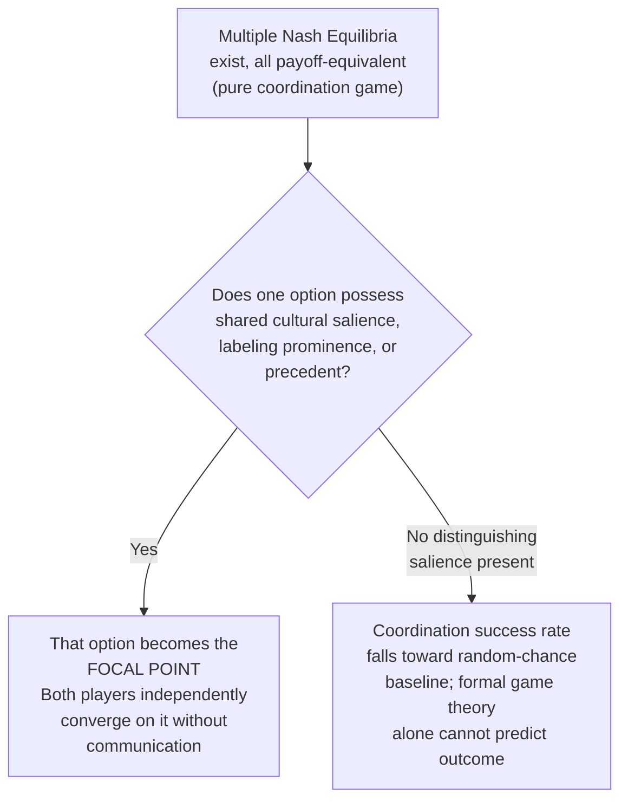

## Focal Points and Coordination Problems

### Definition and Conceptual Overview

Focal points, also known as **Schelling points** after the economist Thomas Schelling who introduced the concept (1960), refer to solutions that people converge upon in coordination games in the absence of communication, precedent, or formal agreement, driven by shared salience, cultural convention, or prominence rather than by any payoff-based or game-theoretic distinguishing feature. Focal point theory addresses a fundamental gap left open by standard game theory: **pure coordination games** frequently possess multiple, payoff-equivalent Nash equilibria, and standard equilibrium concepts alone provide no principled basis for predicting which equilibrium players will actually select — Schelling's insight was that real people successfully coordinate at rates far exceeding random chance by exploiting shared, non-strategic features of the decision environment.

### The Pure Coordination Game Problem

**Key Points**

- A **pure coordination game** is a strategic setting in which multiple Nash equilibria exist, each yielding **identical or near-identical payoffs** to both players, such that standard payoff-dominance or risk-dominance refinements provide little or no guidance for equilibrium selection (unlike games with a clear payoff-dominant equilibrium, where a Pareto-superior focal point exists on purely payoff grounds).
- **Formal indeterminacy**: Standard non-cooperative game theory, based purely on payoff structures and common knowledge of rationality, is formally **silent** on which of several payoff-equivalent equilibria rational players will select, since the equilibrium concept itself provides no tie-breaking criterion beyond the payoffs specified in the game.
- **The empirical puzzle Schelling identified**: Despite this formal indeterminacy, human subjects placed in genuine pure coordination games (with no communication permitted) achieve successful coordination at rates dramatically exceeding what random, uniform strategy selection would predict — implying that some non-payoff-based feature of the decision environment is being used systematically by most players to select among the formally equivalent equilibria.

### Schelling's Classic Demonstrations

**Example**

In Schelling's original "meeting in New York City" thought experiment, two people are told they must meet somewhere in New York City on a specific day, with no ability to communicate beforehand, and are asked where and when they would go. A large majority of respondents converge on a small number of highly salient answers (Schelling's own studies found strong convergence on locations such as the information booth at Grand Central Terminal at 12:00 noon), despite the objectively vast number of possible meeting locations and times being formally payoff-equivalent from a pure game-theoretic standpoint — demonstrating that shared cultural salience, not payoff structure, resolves the coordination problem. [Unverified: specific historical response percentages from Schelling's original informal surveys are not rigorously documented to modern experimental standards and are better treated as an illustrative historical demonstration than a precisely replicated statistic]

- **Splitting-a-sum experiments**: When two players must independently propose how to split a sum of money with no communication, and both must state proposals that sum to exactly the total to "win," a large majority of respondents converge on the salient 50/50 even split, despite countless other technically feasible and payoff-equivalent splits being available.
- **Number and pattern selection experiments**: When asked to independently select an item from an arbitrary list (e.g., pick a number, pick a card) with a monetary reward for successful coordination with an anonymous partner, participants disproportionately select items possessing some distinguishing salient feature (the first item listed, a round number, an item with unique visual or descriptive prominence) even when the experimenter has deliberately ensured no substantive payoff difference across options.

### Sources of Salience: What Makes a Point "Focal"

**Key Points**

- **Cultural convention and shared prior experience**: Solutions consistent with widely shared cultural norms, historical precedent, or common social convention (e.g., driving on a particular side of the road, meeting at a landmark) become focal because both players can reasonably expect the *other* player to also recognize and select that same convention.
- **Linguistic and labeling salience**: The specific labels or descriptions attached to formally identical options can create asymmetric salience — an option labeled "A" versus an unlabeled or differently-labeled option, or an option described first in a list, frequently becomes focal purely due to its linguistic prominence, independent of any underlying payoff difference (directly relevant to the labeling and menu-design literature and to order-effects research).
- **Mathematical or perceptual uniqueness/extremity**: Options that are uniquely "extreme" or mathematically distinguished within an otherwise homogeneous set (the largest number, the first or last item, a round number like 100 rather than 97) tend to become focal due to their perceptual distinctiveness, even absent any explicit payoff-based reason for their prominence.
- **Precedent and history-dependence**: Prior successful coordination on a particular solution (even if initially arbitrary) tends to become self-reinforcing as a focal point for future interactions among the same or overlapping populations, a mechanism closely related to the economics of standards, conventions, and path dependence.

### Distinction from Payoff-Dominant and Risk-Dominant Equilibrium Selection

**Key Points**

- **Payoff dominance**: In coordination games where one equilibrium yields strictly higher payoffs to *both* players than an alternative equilibrium, standard equilibrium refinement theory (Harsanyi and Selten) predicts rational players should coordinate on the Pareto-superior (payoff-dominant) equilibrium — this is a payoff-based selection criterion, formally distinct from Schelling's salience-based focal point concept, though the two can coincide in practice.
- **Risk dominance**: An alternative refinement criterion selecting the equilibrium that is "safer" in the sense of yielding a higher payoff under uncertainty about the opponent's strategy (typically formalized via the product of deviation losses) — risk dominance and payoff dominance can select **different** equilibria in some games (a well-known tension in coordination game theory, exemplified by the Stag Hunt game), and neither criterion is purely a Schelling-style salience-based mechanism.
- **Focal points as a genuinely distinct, non-payoff-based mechanism**: Schelling's key theoretical contribution is that focal point selection operates through channels (cultural salience, labeling, precedent) that are **entirely independent of the payoff structure itself**, providing a coordination mechanism in the many real-world and experimental settings where payoff-dominance and risk-dominance refinements are inapplicable because all relevant equilibria are strictly payoff-equivalent.

### Illustrative Diagram: Focal Point Selection Logic

### Experimental and Field Evidence

**Key Points**

- **Laboratory coordination game replications**: Numerous controlled laboratory studies since Schelling's original informal demonstrations have confirmed that manipulating purely cosmetic, payoff-irrelevant features of otherwise identical coordination games (labeling, framing, presentation order) produces systematic and statistically significant shifts in which equilibrium subjects coordinate upon, providing rigorous experimental support for the focal point mechanism beyond Schelling's original informal observations.
- **Cross-cultural variation in focal point selection**: Because focal points depend on shared cultural convention, the *specific* solution selected as focal for a given coordination problem often varies systematically across different national, linguistic, or cultural populations, even when the underlying formal game structure is held constant — an important limitation on the universality of any specific focal point prediction, though the general *mechanism* (salience-driven convergence) appears to generalize across cultures. [Inference: the degree of cross-cultural generalizability of the focal-point mechanism itself, as opposed to the specific focal points selected in a given culture, is better supported than precise quantitative claims about the relative strength of the effect across specific cultural comparisons]

### Applications in Economics, Law, and Institutional Design

- **Legal default rules and contract interpretation**: Legal scholars have applied focal point theory to explain why certain default contractual terms, once established by convention or precedent, become self-reinforcing "obvious" choices that both contracting parties expect the other to anticipate, reducing negotiation costs even when alternative terms would be formally equivalent absent the established convention.
- **Monetary and exchange-rate coordination**: Focal point reasoning has been applied to currency and monetary policy contexts, including the historical role of salient, "round-number" exchange rate targets or policy thresholds (e.g., a central bank's inflation target) as self-reinforcing coordination devices for market expectations, distinct from any claim that the specific numerical target is objectively payoff-optimal.
- **Standard-setting and technology adoption**: Network-effect industries (technology standards, protocols, file formats) frequently exhibit path-dependent convergence on a particular standard that, once established as focal through early adoption momentum or salience, becomes self-reinforcing even absent clear technical superiority over rejected alternatives — directly related to but formally distinct from pure network-externality economic models.
- **Traffic, safety, and social-convention regulation**: Real-world conventions such as driving on a specified side of the road, standardized units of measurement, and other physical/behavioral coordination norms are frequently cited as real-world instances of focal-point-like convergence that formal regulation subsequently codifies and reinforces, though the ultimate degree to which historical adoption reflects genuine Schelling-style unaided coordination versus early formal regulation is a matter of historical rather than purely game-theoretic inquiry.

### Comparison Table: Equilibrium Selection Mechanisms in Coordination Games

| Mechanism | Basis for Selection | Requires Payoff Asymmetry Across Equilibria? | Requires Communication? |
| --- | --- | --- | --- |
| Payoff dominance | Pareto superiority of one equilibrium | Yes | No |
| Risk dominance | Safety under strategic uncertainty | Yes (typically) | No |
| Focal points (Schelling) | Cultural salience, labeling, precedent | No (applies even under strict payoff equivalence) | No |
| Cheap-talk / pre-play communication | Explicit, non-binding signaling | No | Yes |

### Conclusion

Focal point theory addresses a fundamental gap in standard non-cooperative game theory by identifying a genuinely distinct, non-payoff-based mechanism — shared salience arising from cultural convention, labeling, or precedent — through which real decision-makers successfully resolve the formal indeterminacy of pure coordination games with multiple, payoff-equivalent Nash equilibria. Schelling's foundational insight, subsequently validated through extensive laboratory experimentation, remains directly relevant to applied domains ranging from legal default-rule design and technology standard-setting to monetary policy communication and everyday social coordination, wherever multiple formally equivalent solutions to a coordination problem exist and effective convergence depends on shared, salience-driven expectations rather than payoff calculation alone.

**Related Topics**

- Payoff Dominance and Risk Dominance in Equilibrium Refinement
- The Stag Hunt Game and Coordination Failure
- Cheap Talk and Pre-Play Communication in Strategic Settings
- Network Effects and Technology Standard-Setting
- Default Rules and Coordination in Contract Law
- Cross-Cultural Variation in Coordination Game Behavior
- Level-k and Cognitive Hierarchy Models: Complementary Framework for Novel Games
- Path Dependence and Self-Reinforcing Conventions in Institutional Economics