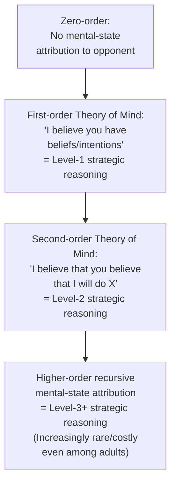

## Theory of Mind in Strategic Settings

### Definition and Conceptual Overview

Theory of mind (ToM) refers to the cognitive capacity to attribute mental states — beliefs, desires, intentions, and knowledge — to oneself and to others, and, critically for strategic contexts, to recognize that other agents' mental states may **differ from one's own** and from objective reality. In strategic settings, theory of mind is the cognitive substrate underlying a player's ability to model an opponent's beliefs about the game, their beliefs about the player's own beliefs, and so on recursively — providing the psychological micro-foundation for the recursive belief structures that level-$k$, cognitive hierarchy, and related bounded-rationality models formalize at a behavioral level. This topic bridges developmental and cognitive psychology's theory-of-mind research with behavioral game theory's iterated-reasoning frameworks, addressing the underlying cognitive capacity and its limitations, rather than solely the resulting strategic behavior patterns.

### Levels of Recursive Belief and the Cognitive Hierarchy Connection

**Key Points**

- **First-order theory of mind**: The basic capacity to recognize that another agent holds beliefs, and that those beliefs may differ from one's own or from objective reality — classically tested via false-belief tasks in developmental psychology (e.g., the Sally-Anne task), in which a child must recognize that another person will act based on an outdated, false belief rather than on the child's own current knowledge of reality.
- **Second-order and higher-order theory of mind**: The capacity to reason about what one agent believes *another agent believes* ("I think that you think that..."), and further iterations thereof — directly mirroring the recursive belief structure formalized in level-$k$ models (a level-2 player's belief about a level-1 opponent's belief about a level-0 baseline is, in effect, a second-order strategic belief).
- **Direct theoretical parallel to level-$k$/cognitive hierarchy models**: The level-$k$ framework discussed elsewhere in this chapter can be understood as a formal, game-theoretic operationalization of bounded recursive theory of mind — a level-$k$ player is, in cognitive terms, a player capable of exactly $k$ orders of recursive mental-state attribution about their opponent, with level-0 representing the (cognitively minimal) absence of any strategic mental-state modeling of the opponent at all.
- **Empirical convergence of findings**: The well-documented finding in behavioral game theory that most experimental subjects reason at low iterated levels (commonly estimated around levels 1 to 3) is consistent with, and arguably explained at a cognitive-mechanistic level by, independent developmental and cognitive-psychology findings that even cognitively mature adults face measurable processing costs and increasing error rates when required to sustain higher-order recursive mental-state reasoning, particularly under time pressure or cognitive load.

### Cognitive and Neuroscientific Correlates

**Key Points**

- **Individual variation in theory-of-mind capacity and strategic sophistication**: Research combining cognitive psychology measures of theory-of-mind ability (e.g., standard false-belief and higher-order mental-state reasoning tasks) with behavioral game theory measures of strategic sophistication (e.g., estimated level-$k$ type in a Beauty Contest game) has found a positive association between independently-measured theory-of-mind capacity and observed strategic sophistication in game play, providing convergent cross-disciplinary evidence for the proposed cognitive linkage. [Inference: while a positive association between ToM measures and strategic sophistication is a reasonably consistent finding across several studies, the precise strength of this relationship, and the degree to which it reflects a shared underlying cognitive mechanism versus correlated but distinct capacities, remains an active area of research rather than a fully settled quantitative finding]
- **Neuroimaging correlates**: Neuroeconomic research using fMRI has associated strategic reasoning tasks requiring mental-state attribution about an opponent (as opposed to non-strategic decision tasks with formally identical payoff structures) with activation in brain regions independently associated with theory-of-mind processing in the broader social-cognitive neuroscience literature (including the temporoparietal junction and medial prefrontal cortex), providing neurobiological convergence with the behavioral and developmental evidence. [Inference: as with other neuroeconomic findings referenced elsewhere in this material, overlapping neural activation is suggestive of shared cognitive machinery but does not on its own establish a precise causal or quantitative relationship between theory-of-mind capacity and specific strategic behavior parameters]
- **Autism spectrum and clinical population studies**: Some research has examined strategic game behavior in populations with documented differences in theory-of-mind processing, motivated by the hypothesis that reduced or atypical theory-of-mind capacity might predict systematically different patterns of strategic sophistication or belief formation in economic games. [Unverified: findings in this specific clinical sub-literature are more limited in scope and replication than the broader neurotypical adult strategic-sophistication research, and should be treated with appropriate caution regarding generalizability]

### Developmental Trajectory and Strategic Sophistication

**Key Points**

- **Emergence of first-order theory of mind**: Standard developmental psychology findings place the typical emergence of robust first-order false-belief understanding at approximately ages 4 to 5, though the developmental trajectory for higher-order (second-order and beyond) recursive mental-state reasoning extends considerably further into middle childhood and adolescence.
- **Developmental economics game studies**: Experimental economics research applying simplified versions of standard strategic games (simplified Beauty Contest variants, basic sender-receiver signaling games) to child and adolescent populations has generally found that measured strategic sophistication (willingness and ability to model an opponent's likely behavior and best-respond to it) increases with age across childhood and adolescence, broadly consistent with the parallel developmental trajectory documented for higher-order theory-of-mind capacity in cognitive psychology. [Inference: the precise quantitative mapping between developmental stage and estimated strategic "level" in economic games is an emerging and less extensively replicated research area compared to the adult strategic sophistication literature]

### Illustrative Diagram: Theory of Mind and Strategic Reasoning Correspondence

### Theory of Mind Failures and Strategic Errors

**Key Points**

- **The "curse of knowledge" in strategic settings**: A well-documented cognitive bias in which an agent who possesses certain information has systematic difficulty accurately modeling the mental state of another agent who lacks that same information, frequently leading to overestimation of what an opponent, counterparty, or audience actually knows or can infer — directly relevant to strategic settings such as negotiation, signaling games, and disclosure decisions, where accurately modeling a counterparty's more limited information state is essential for optimal strategic behavior.
- **Egocentric bias in belief attribution**: A related and well-documented tendency for individuals to anchor their beliefs about others' likely behavior or knowledge too heavily on their own private information, preferences, or behavior, rather than fully adjusting for the possibility that the other party's mental state differs substantially — this bias provides an additional, complementary cognitive-level explanation (alongside pure limited-reasoning-depth accounts) for systematic errors in level-$k$-consistent experimental behavior, where a player's assumed "level-0" or lower-level opponent belief may itself be distorted by egocentric projection rather than reflecting a genuinely neutral baseline assumption.
- **Failures of theory of mind in negotiation and bargaining**: Applied negotiation research has documented systematic failures of accurate perspective-taking (a practical application of theory-of-mind capacity) as a contributor to suboptimal or failed negotiated agreements, even in settings where a mutually beneficial agreement is objectively available, motivating "perspective-taking" training interventions in applied negotiation and conflict-resolution practice.

### Comparison Table: Theory of Mind Concepts vs. Behavioral Game Theory Constructs

| Cognitive Psychology Concept | Behavioral Game Theory Analogue | Relationship |
| --- | --- | --- |
| First-order false-belief understanding | Level-1 strategic reasoning | Direct conceptual parallel |
| Higher-order recursive mental-state attribution | Level-$k$ for $k \geq 2$ | Direct conceptual parallel |
| Egocentric bias in belief attribution | Level-0 anchor distortion / anchoring in level-$k$ models | Complementary explanatory mechanism |
| Curse of knowledge | Overestimation of opponent sophistication or shared information in signaling games | Complementary explanatory mechanism |

### Applications in Applied Strategic Contexts

- **Negotiation and mediation practice**: Applied negotiation training increasingly incorporates explicit perspective-taking exercises directly informed by theory-of-mind research, aimed at improving negotiators' ability to accurately model counterparties' interests, constraints, and likely responses, distinct from purely tactical or positional bargaining training.
- **Marketing and consumer psychology**: Understanding sellers' and marketers' own limitations in accurately modeling consumer mental states (and vice versa) informs applied research on advertising effectiveness, disclosure design, and the "curse of knowledge" problem in technical or expert-to-novice communication (e.g., a firm's engineers overestimating how easily consumers will understand a new product's interface or documentation).
- **Artificial intelligence and multi-agent systems**: Computational theory-of-mind modeling (sometimes termed "machine theory of mind") is an active area of AI research directly motivated by the goal of building artificial agents capable of the same recursive mental-state reasoning about human or other artificial counterparts that underlies human strategic sophistication in games — an area of substantial cross-disciplinary interest between cognitive science, behavioral game theory, and computer science. [Inference: the current technical maturity and real-world deployment of explicit machine theory-of-mind systems, as distinct from implicit pattern-matching approaches that may produce superficially similar outputs, remains an actively developing area of computer science research]
- **Auditing and expert-novice communication design**: Recognizing systematic curse-of-knowledge and egocentric-bias failures informs the design of financial disclosure documents, medical informed-consent materials, and other expert-to-layperson communication where the communicating party's own superior information state can lead to systematic underestimation of the recipient's actual comprehension.

### Conclusion

Theory of mind provides the cognitive-psychological foundation underlying the recursive belief structures that behavioral game theory's level-$k$ and cognitive hierarchy models formalize at the level of observed strategic behavior, with convergent evidence from developmental psychology, individual-difference studies, and neuroimaging research supporting a genuine cognitive-mechanistic link between theory-of-mind capacity and strategic sophistication. Beyond its role in explaining bounded iterated reasoning, theory-of-mind research also illuminates specific, systematic failure modes in strategic settings — the curse of knowledge and egocentric bias in belief attribution — that carry direct applied relevance to negotiation practice, disclosure design, and the emerging computer science research program on machine theory of mind.

**Next Steps**

- Level-k and Cognitive Hierarchy Models: Formal Correspondence to Theory of Mind
- The Curse of Knowledge in Communication and Disclosure Design
- Egocentric Bias and Anchoring in Belief Formation
- Developmental Economics: Strategic Sophistication Across Childhood and Adolescence
- Perspective-Taking Training in Applied Negotiation Practice
- Machine Theory of Mind in Multi-Agent Artificial Intelligence Systems
- Neuroeconomics of Social Cognition and Strategic Reasoning
- Signaling Games and Information Asymmetry in Strategic Communication