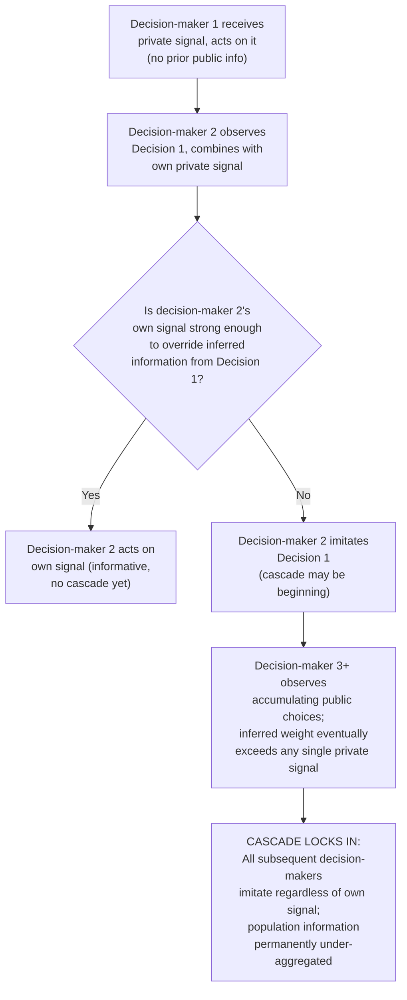

## Herding and Informational Cascades

### Definition and Conceptual Overview

Herding and informational cascades describe a class of strategic phenomena in which individuals, acting rationally on the basis of limited private information, sequentially disregard their own private signals in favor of imitating the observed decisions of preceding individuals — producing convergent, path-dependent collective behavior that can be either informationally efficient or, more strikingly, systematically wrong at the population level. This topic is theoretically distinct from herding driven by purely psychological conformity pressure or social preferences (though both mechanisms can operate simultaneously in real-world settings); the canonical **informational cascade** model, developed by Bikhchandani, Hirshleifer, and Welch (1992), demonstrates that cascades can arise from **fully rational** Bayesian updating alone, given a specific informational structure, without requiring any social-preference or conformity-utility assumption.

### The Formal Informational Cascade Model

**Key Points**

- **Setup**: A sequence of decision-makers must each choose between two options (e.g., adopt or reject a technology, buy or not buy an asset), where there is an underlying, unknown true state of the world (which option is objectively better), and each decision-maker receives a private, noisy signal about that true state before making their public choice, observed by all subsequent decision-makers.
- **Sequential Bayesian updating**: Each decision-maker rationally combines their own private signal with the **inferred information content** of all preceding decision-makers' observed public choices (which reveal something, though imperfectly, about those individuals' private signals), and chooses the option that maximizes expected value given this combined information.
- **Cascade condition**: A cascade begins at the point where the **accumulated weight of inferred information from preceding public choices becomes so strong** that a rational decision-maker's optimal choice no longer depends on their own private signal — even if their own private signal contradicts the emerging consensus, the inferred weight of prior public choices outweighs it, and the rational decision-maker discards their own information and imitates the preceding choice.
- **Critical implication — information is not aggregated efficiently once a cascade begins**: Once a cascade starts, subsequent decision-makers' private signals are never publicly revealed (since those decision-makers rationally choose to imitate rather than act on their own information), meaning the **market or population as a whole permanently loses access to that information** — this is the central and counterintuitive result of the model: a fully rational cascade can lock in on an **incorrect** collective decision and never self-correct, even though the aggregate private information held by the full population, if it could somehow be pooled, would have revealed the correct state of the world.

### Illustrative Numerical Example

**Example**

Consider a simplified sequential cascade setup with two possible true states ("Urn A" or "Urn B") and a sequence of individuals, each receiving one private, imperfect signal about the true urn before publicly guessing which urn is correct. If the first individual's private signal favors "A," they rationally guess "A." If the second individual's private signal favors "B," they face a dilemma: they know the first individual guessed "A" based on some private signal favoring "A," but their own signal favors "B" — under the standard cascade model's signal-strength assumptions, a single contrary signal from one predecessor is often insufficient to overturn the second individual's own signal, so the second individual guesses according to their own private information, and if it also happens to favor "A," a cascade toward "A" can begin as early as the third individual, who now observes two prior "A" guesses (a stronger inferred signal) and rationally guesses "A" regardless of their own private signal, even if that private signal actually favors "B." From that point forward, every subsequent individual, observing an unbroken sequence of "A" guesses, also rationally guesses "A" regardless of their own signal, and the cascade is permanently locked in — even though, if all individuals' true private signals could have been pooled, "B" might have been the objectively correct answer with higher probability. [This is a stylized illustrative example of the model's core logic, not a literal transcription of any single specific published experimental dataset]

### Cascade Fragility and the Reversibility Property

**Key Points**

- **Cascades are informationally fragile, not merely behaviorally persistent**: A key theoretical property of the rational cascade model is that cascades, once formed, can in principle be **overturned by sufficiently strong new public information** — since a cascade reflects an *inference* about underlying signals rather than a fixed commitment, a single piece of sufficiently strong and credible new public information (e.g., a highly informative, verifiable signal, rather than merely another individual's ordinary private-signal-based choice) can rationally reverse an established cascade.
- **This fragility distinguishes rational informational cascades from pure conformity-driven herding**: A cascade based purely on social-conformity utility (valuing matching others' behavior for its own sake, independent of informational content) would not necessarily exhibit this same theoretically predicted fragility to strong contrary evidence, since conformity-based motives are not fundamentally information-processing mechanisms — the reversibility property is a specific, testable empirical signature that can help distinguish the rational informational-cascade mechanism from alternative conformity-based or purely psychological herding explanations in applied and experimental settings.

### Related but Distinct Phenomenon: Herd Behavior in Financial Markets

**Key Points**

- **Rational herding in financial markets**: Building directly on the informational cascade framework, financial economics research has applied the cascade logic to explain herd behavior among investors and, notably, among **professional fund managers and analysts**, who may rationally choose to imitate prevailing market sentiment or the trades/recommendations of other analysts, particularly when their own compensation or reputation depends on relative performance evaluation rather than purely on absolute investment accuracy.
- **Reputational herding (Scharfstein-Stein model)**: A distinct but related formal model demonstrates that fund managers or forecasters concerned about their **reputation for skill** (as inferred by outside observers from the correlation of their choices with other managers') may rationally choose to imitate the prevailing consensus forecast or trade even when their own private information suggests a different action, since being wrong "along with everyone else" carries less reputational damage than being wrong alone — a distinct rational mechanism from the pure Bikhchandani-Hirshleifer-Welch informational cascade logic, since it depends on career-concern/reputational payoffs rather than purely on Bayesian inference about the underlying asset value.
- **Empirical evidence in asset markets**: Documented patterns consistent with herding-like behavior have been identified in various financial market contexts (analyst earnings forecasts clustering, institutional investor trade correlation, IPO subscription patterns), though disentangling genuine rational informational-cascade or reputational herding from independently-correlated responses to shared public information (which can produce superficially similar clustering patterns without any true cascade mechanism) is a well-recognized and significant empirical identification challenge in this literature. [Inference: precise quantitative estimates of the share of observed market clustering attributable specifically to cascade/herding mechanisms, as opposed to shared response to common information, vary substantially across studies and remain a genuinely contested empirical question]

### Illustrative Diagram: Informational Cascade Formation Process

### Experimental Evidence

**Key Points**

- **Laboratory cascade experiments**: Controlled experimental replications of the Bikhchandani-Hirshleifer-Welch urn-based cascade setup have generally found that human subjects do form cascades at rates and under conditions broadly consistent with the rational Bayesian model's qualitative predictions, providing meaningful experimental support for the theoretical framework, though with some systematic deviations from precise Bayesian-optimal cascade-formation thresholds. [Inference: the precise degree of quantitative fit between observed human cascade behavior and the exact Bayesian-optimal predictions varies across specific experimental studies and parameter settings, with some research documenting both "cascades" that form later than the Bayesian-optimal prediction and cases of apparent overreaction relative to pure Bayesian updating]
- **Distinguishing rational cascades from behavioral/conformity-based herding in the lab**: Experimental designs incorporating cascade-reversal tests (introducing new, strong public information after an apparent cascade has formed) are used specifically to test the reversibility property distinguishing rational informational cascades from pure social-conformity-driven imitation, since only the former predicts a systematic and prompt behavioral reversal in response to sufficiently strong new evidence.

### Comparison Table: Distinct Herding-Related Mechanisms

| Mechanism | Rational (Bayesian) Basis? | Fragile to Strong New Public Info? | Primary Driver |
| --- | --- | --- | --- |
| Informational cascade (Bikhchandani-Hirshleifer-Welch) | Yes | Yes | Inference about others' private signals from observed choices |
| Reputational herding (Scharfstein-Stein) | Yes | Partially (depends on career-concern structure) | Manager's concern for reputation/relative performance evaluation |
| Pure social-conformity herding | No (utility-based, not inference-based) | Not necessarily | Direct utility from matching others' behavior |
| Correlated response to shared public information | Yes, but not a true cascade | Yes (trivially, since it's just updating on new information) | Common information shock, not sequential inference about others' private signals |

### Applications in Economics, Finance, and Policy

- **Financial market bubbles and crashes**: Informational cascade and reputational herding models are frequently applied in behavioral finance research to help explain asset price bubbles (rational or reputationally-driven imitation of prevailing bullish sentiment) and subsequent rapid crashes (cascade reversal upon arrival of sufficiently strong contrary public information), complementing purely psychological overconfidence- and sentiment-based bubble theories.
- **Technology adoption and product diffusion**: Cascade models are applied to explain sequential adoption patterns for new products, technologies, and platforms, where early adopters' visible choices convey informational signals to subsequent potential adopters, potentially generating rapid, self-reinforcing adoption cascades (or, conversely, cascade-driven rejection of an objectively superior product that happened to receive unfavorable early public signals).
- **Regulatory and policy design for financial stability**: Recognition of reputational herding among fund managers and analysts has informed policy and regulatory discussions regarding disclosure requirements, analyst independence rules, and compensation structure reform aimed at reducing incentives for reputationally-motivated (rather than purely informationally-motivated) correlated behavior among financial market professionals.
- **Public health and vaccine adoption**: Cascade-style models have been applied to understand sequential, observationally-influenced decisions regarding vaccine uptake and other health behaviors, where early, visible adoption or refusal decisions by prominent or proximate individuals can generate self-reinforcing cascades that may not accurately reflect the underlying aggregate evidence on health outcomes. [Inference: application of the formal cascade model specifically to public health behavior, as distinct from more general social-influence and conformity-based explanations in that domain, is a less extensively and rigorously validated research area compared to the model's original financial and technology-adoption applications]

### Conclusion

Herding and informational cascades demonstrate that fully rational, Bayesian-updating individuals can, under specific sequential decision-making conditions, generate collectively convergent behavior that permanently fails to aggregate the population's dispersed private information — a striking and counterintuitive result distinct from, though sometimes empirically difficult to disentangle from, herding driven by reputational career concerns or purely psychological social-conformity preferences. The model's theoretically predicted fragility to strong new public information provides a key diagnostic feature for distinguishing genuine rational cascades from other herding mechanisms, and the framework has found substantial applied relevance in behavioral finance, technology diffusion research, and financial stability policy design.

**Next Steps**

- Reputational Herding and the Scharfstein-Stein Career-Concerns Model
- Financial Market Bubbles and Behavioral Finance Foundations
- Bayesian Updating and Sequential Decision-Making Under Uncertainty
- Technology Adoption Cascades and Network Effects
- Distinguishing Herding from Correlated Response to Public Information: Identification Challenges
- Social Conformity and Psychological Bases of Imitation
- Analyst Forecast Clustering and Financial Market Regulation
- Theory of Mind and Belief Inference in Sequential Games