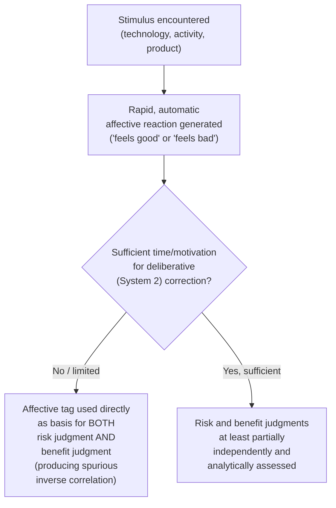

## The Affect Heuristic

### Definition and Conceptual Overview

The affect heuristic refers to the mental shortcut by which individuals rely on rapid, automatic affective responses — feelings of "goodness" or "badness" attached to a stimulus — as a primary input into judgment and decision-making, particularly under conditions of uncertainty, complexity, or time pressure, rather than engaging in more effortful, deliberative evaluation of risks and benefits. Formalized primarily by Paul Slovic and colleagues (2002, 2007), the affect heuristic proposes that affect functions as an efficient, evolutionarily adaptive information-processing shortcut, but one that systematically distorts judgment in specific, well-documented ways when the automatic affective tag attached to a stimulus diverges from its actual statistical risk or objective value.

### Theoretical Foundation: Dual-Process Framework

**Key Points**

- The affect heuristic is typically situated within a **dual-process** framework of cognition, distinguishing a fast, automatic, affect-laden mode of processing (frequently labeled "System 1" following Kahneman's popularization) from a slower, effortful, deliberative mode ("System 2") capable of more analytically correcting or overriding initial affective impressions.
- **Affect as information**: The core theoretical claim is that people implicitly treat their immediate affective reaction to a stimulus as a legitimate and efficient source of *information* about that stimulus's risk or value — functioning analogously to how perceptual heuristics provide rapid, generally-useful-but-sometimes-misleading shortcuts in other cognitive domains.
- **Distinction from pure emotion research**: The affect heuristic is specifically concerned with how a general, valenced "goodness/badness" affective tag is used as a *heuristic input into judgment*, distinguishing it from the broader psychological study of discrete emotions (fear, anger, disgust) and their more differentiated effects on cognition and behavior, though the two research areas are closely related and often studied together.

### The Inverse Relationship Between Perceived Risk and Perceived Benefit

**Example**

In Slovic and colleagues' classic demonstration studies, participants were asked to rate the perceived risks and perceived benefits of various technologies and activities (e.g., nuclear power, chemical pesticides, food preservatives). A key and counterintuitive empirical finding was a robust **negative correlation** between perceived risk and perceived benefit ratings across items and across individuals — items rated as high-benefit were simultaneously rated as low-risk, and vice versa, even though from a purely analytical standpoint, risk and benefit are logically independent dimensions of any given technology or activity (a technology could plausibly be both high-risk and high-benefit, or low-risk and low-benefit). This negative correlation is interpreted as direct evidence that a single, undifferentiated overall affective evaluation ("I feel good/bad about this") is driving *both* the risk and benefit judgments, rather than each judgment being formed through independent, dimension-specific analytical assessment. [Unverified: while the general negative-correlation finding has been widely replicated across various risk-perception studies, the precise magnitude of the correlation varies by study, item set, and population, and should not be treated as a fixed universal statistic]

- **Information-manipulation demonstrations**: In follow-up experimental designs, providing participants with information designed to increase the perceived *benefit* of a technology (with no new information provided about its risk) was found to also produce a corresponding *decrease* in the same participants' perceived *risk* ratings for that same technology — and the reverse manipulation (providing risk-increasing information) produced a corresponding decrease in perceived benefit ratings — demonstrating that the two judgments are not independently updated based on the specific new information provided, but rather move together in a manner consistent with a single, shared underlying affective evaluation being updated and then projected onto both judgment dimensions.
- **Time-pressure amplification**: Studies manipulating time pressure and cognitive load during risk-benefit judgment tasks have generally found that the inverse risk-benefit correlation becomes stronger under conditions that limit deliberative processing capacity, consistent with the theoretical prediction that affect-heuristic reliance increases when analytical (System 2) correction is constrained.

### Illustrative Diagram: The Affect Heuristic's Risk-Benefit Judgment Process

### The Affect Heuristic and Numeracy: The "Affect and Numbers" Research Program

**Key Points**

- **Proportion dominance / ratio bias**: A closely associated finding is that people respond more strongly (with greater perceived risk or greater willingness to act) to statistically identical probabilities when they are expressed as a **larger-numerator ratio** (e.g., "1,286 out of 10,000 people will be affected") relative to a mathematically equivalent but smaller-numerator percentage (e.g., "12.86%" or "a 12.86% chance"), attributed to the larger raw numerator generating a more vivid, affect-triggering mental image relative to an equivalent but more abstract percentage figure.
- **Insensitivity to probability variation for affect-rich outcomes**: A related and well-documented finding (connecting the affect heuristic to prospect theory's probability weighting function) is that for outcomes carrying strong emotional/affective charge (e.g., a vivid, feared health outcome), stated willingness-to-pay for risk reduction or perceived concern often shows **relative insensitivity to variation in the actual underlying probability** across a wide range, since the affective response to the *outcome itself* dominates the analytical processing of the probability magnitude — this "probability neglect" pattern is a specific manifestation of the affect heuristic with direct relevance to risk communication design.

### Applications in Risk Communication and Public Policy

**Key Points**

- **Risk communication design**: Understanding the affect heuristic directly informs public health, environmental, and financial risk communication strategy, since presenting purely statistical, non-vivid probability information (without addressing the audience's likely automatic affective response to the underlying hazard) may fail to correct systematically biased risk perceptions, or may be processed very differently depending on whether numbers are framed as larger-numerator frequencies or smaller-numerator percentages.
- **Nuclear power, vaccine, and biotechnology risk perception**: The affect heuristic has been extensively applied to explain persistent gaps between expert-assessed statistical risk levels and lay public risk perception for technologies carrying strong pre-existing affective associations (dread, unfamiliarity, perceived lack of control), complementing the related psychometric risk-perception paradigm's "dread" and "unknown risk" dimensions.
- **Financial decision-making and investment behavior**: Applied behavioral finance research has used affect-heuristic reasoning to explain patterns such as investors' preference for stocks of companies with more positively-regarded brand reputations or more "likeable" characteristics, independent of, or even in the face of, objectively inferior risk-adjusted financial performance data. [Inference: the specific magnitude of affect-driven mispricing attributable to brand likability versus other confounding investor-behavior explanations in real financial markets is a genuinely contested and actively researched empirical question, rather than a settled quantitative finding]
- **Product and brand marketing**: Marketing practice has long implicitly (and increasingly explicitly, following the formalization of the affect heuristic) leveraged the finding that a positive overall affective impression of a brand or product tends to generalize into more favorable evaluations of that product's specific attributes (perceived safety, quality, value), even when such attribute-specific claims are not independently substantiated by the marketing content itself.

### Boundary Conditions and Individual Differences

**Key Points**

- **Expertise and domain knowledge as a moderator**: Individuals with greater domain-specific expertise (e.g., toxicologists evaluating chemical risk, financial analysts evaluating investment risk) generally show reduced (though not eliminated) reliance on the undifferentiated affect heuristic relative to lay judgments in the same domain, consistent with the broader finding that expertise supports more effective deliberative override of automatic affective judgment. [Inference: the degree of attenuation of affect-heuristic reliance attributable specifically to domain expertise, as opposed to other correlated factors such as general numeracy or analytical disposition, varies across studies and is not a fully isolated or precisely quantified effect]
- **Individual differences in "Need for Affect" and "Need for Cognition"**: Psychological trait measures capturing individuals' general disposition toward relying on affective versus analytical/deliberative processing modes have been found to moderate the strength of affect-heuristic-consistent judgment patterns, providing an individual-differences complement to the situational (time-pressure, numeracy) moderators discussed above.
- **Mood-congruent judgment as a related but distinct phenomenon**: The affect heuristic (a stimulus-specific automatic affective tag) should be distinguished from the broader **incidental mood** literature (where a person's general, pre-existing mood state, unrelated to the specific stimulus being judged, colors unrelated judgments) — both are affect-based judgment phenomena, but the affect heuristic concerns affect generated by and attached to the specific object of judgment itself, whereas incidental mood effects concern the "spillover" of an unrelated prior emotional state.

### Comparison Table: Affect Heuristic vs. Related Constructs

| Construct | Source of Affect | Primary Judgment Distortion |
| --- | --- | --- |
| Affect heuristic | Stimulus-specific automatic affective tag | Inverse risk-benefit correlation; probability neglect for affect-rich outcomes |
| Incidental mood effects | Pre-existing, unrelated general mood state | Mood-congruent bias in unrelated judgments |
| Psychometric risk perception (dread/unknown risk) | Specific qualitative hazard characteristics (dread, catastrophic potential, unfamiliarity) | Systematic gaps between lay and expert risk rankings |
| Prospect theory probability weighting | Structural feature of the probability-weighting function itself | Overweighting of small probabilities, underweighting of large/certain probabilities |

### Conclusion

The affect heuristic identifies a fundamental and well-evidenced mechanism by which rapid, automatic affective reactions to a stimulus serve as an efficient but systematically distorting input into risk and benefit judgment, most strikingly demonstrated through the robust empirical finding of a spurious inverse correlation between perceived risk and perceived benefit across a wide range of technologies and activities. This mechanism carries substantial and well-established applied relevance for risk communication design, public understanding of technological and health risks, marketing and brand perception research, and behavioral finance, while remaining subject to important moderating factors including domain expertise, numeracy, time pressure, and individual differences in affective versus analytical processing disposition.

**Related Topics**

- Prospect Theory and the Probability Weighting Function
- Psychometric Paradigm of Risk Perception (Dread and Unknown Risk Dimensions)
- Dual-Process Theory: System 1 and System 2 Cognition
- Risk Communication Strategy in Public Health and Environmental Policy
- Numeracy, Ratio Bias, and Frequency Framing in Judgment
- Incidental Mood Effects and Mood-Congruent Judgment
- Brand Perception and Affect-Driven Investment Behavior
- Probability Neglect in Emotionally-Charged Decision Contexts