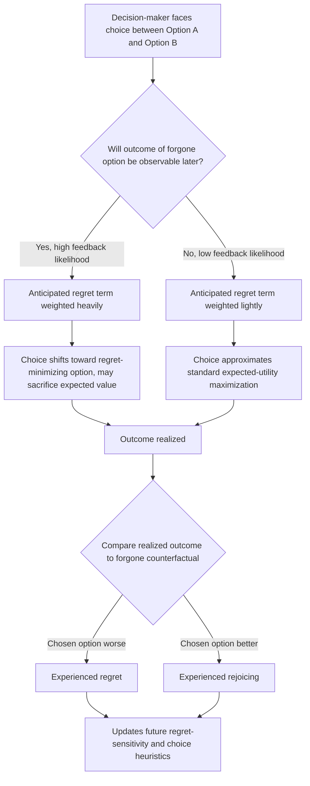

## Regret Theory and Anticipated Regret

### Overview

Regret theory is a model of decision-making under uncertainty that incorporates the anticipated emotional consequence of comparing an obtained outcome to the outcome that would have resulted from a forgone alternative. It was developed independently by Graham Loomes and Robert Sugden (1982) and by David Bell (1982) as a direct challenge to expected utility theory's assumption that choice depends only on the probability-weighted utility of outcomes in isolation, without reference to what might have been.

The core claim is that people do not merely evaluate outcomes; they evaluate outcomes relative to a comparison outcome, and they anticipate the regret or rejoicing that comparison will produce. Because this anticipation occurs *before* the choice is made, it feeds back into the decision itself. A decision-maker may choose an option specifically to minimize expected future regret, even at the cost of expected monetary value.

### Theoretical Foundations

**Definitions**

- **Regret**: The negative emotion experienced when a chosen option yields a worse outcome than a forgone alternative would have yielded, given the same realized state of the world.
- **Rejoicing (or elation)**: The positive emotion experienced when the chosen option outperforms the forgone alternative under the same realized state.
- **Anticipated regret**: The prospective, pre-decisional expectation of future regret, which is factored into the current choice.
- **Counterfactual comparison**: The mental construction of "what would have happened if I had chosen differently," which regret theory treats as a real input to utility rather than an irrelevant hypothetical.

**Formal Structure**

Standard expected utility theory evaluates an act $A$ over states $s_i$ with probabilities $p_i$ as:

$$EU(A) = \sum_i p_i \, u(x_{Ai})$$

where $u(x_{Ai})$ is the utility of the outcome of act $A$ in state $s_i$, independent of any other act under consideration.

Regret theory (Loomes & Sugden, 1982) modifies this by making utility a function of both the chosen act's outcome and the outcome of a comparison act $B$ in the same state:

$$U(A) = \sum_i p_i \, \left[ u(x_{Ai}) + r\big(u(x_{Ai}) - u(x_{Bi})\big) \right]$$

Here, $r(\cdot)$ is a **regret-rejoice function**: it is increasing, convex for gains (rejoicing) and concave for losses (regret) in most formulations, and $r(0) = 0$ (no regret/rejoicing when both acts yield the same outcome). The convexity/concavity split gives regret theory a structure reminiscent of the value function in Prospect Theory, but here the reference point is the *forgone outcome under the same state*, not a fixed status-quo.

**[Inference] Interpretation note**: Because $r$ is state-contingent and pairwise (comparing exactly two acts at a time in the original formulation), regret theory does not always produce a transitive preference ordering across more than two options — this is a known and often-cited property of the model, not a flaw introduced by later critics.

### Distinguishing Anticipated Regret from Related Constructs

| Construct | Timing | Core Mechanism |
| --- | --- | --- |
| Anticipated regret | Pre-decision | Forecasting future counterfactual comparison; drives choice to avoid it |
| Experienced regret | Post-decision | Actual affective response to a realized bad outcome vs. forgone alternative |
| Loss aversion (Prospect Theory) | Pre-decision | Asymmetric sensitivity to losses vs. gains relative to a status-quo reference point |
| Disappointment | Post-decision | Outcome falls short of *expectation*, not of a forgone alternative's outcome |
| Cognitive dissonance | Post-decision | Discomfort from holding conflicting beliefs about a decision already made |

The key distinction from loss aversion: regret is inherently *comparative across options*, whereas loss aversion is comparative *across states relative to a reference point* for a single option. Regret requires a forgone alternative to exist and its outcome (or a plausible estimate of it) to become knowable or imaginable.

### Anticipated Regret as a Decision Driver

Because regret theory treats anticipated regret as an input to the choice function itself, it generates several behavioral predictions that expected utility theory does not:

1. **Regret aversion**: Decision-makers systematically favor options that minimize the *maximum possible regret*, sometimes overriding expected-value-maximizing choices. This connects to the **minimax regret** criterion in decision theory under uncertainty (Savage, 1951), a distinct but related framework.
2. **Feedback-sensitivity**: The magnitude of anticipated regret depends on whether the outcome of the forgone option will be *known* after the fact. If a decision-maker will never learn what the alternative would have yielded, anticipated regret should theoretically play little role. Empirical work (e.g., Zeelenberg et al., 1996) generally supports this: people take more risk-averse, regret-minimizing positions when feedback on the forgone option is expected.
3. **Action vs. inaction asymmetry**: Regret is typically felt more intensely for negative outcomes resulting from an *action* than from an equivalent negative outcome resulting from *inaction* (the "action effect"), especially in the short term — though some studies (Gilovich & Medvedec, 1994) find the reverse for regrets over the life course, where inaction regrets ("things I didn't do") dominate in retrospective, long-horizon reports. **[Unverified]** The precise conditions under which the short-term action effect reverses into a long-term inaction effect are still debated in the literature and are not fully resolved by a single unifying model.
4. **Regret and risk attitude**: Anticipated regret can push behavior in *either* direction depending on framing. In choices between a certain outcome and a gamble, high anticipated regret from a bad gamble outcome tends to increase risk aversion (buying insurance, choosing the "safe" option). But in comparative-feedback settings (e.g., lotteries where you'll see what the unchosen numbers were), anticipated regret can increase risk-seeking toward the "conventional" or "popular" choice, since deviating and losing produces more regret than losing along with everyone else.

### Worked Example

**Scenario**: An investor is choosing between two funds for a fixed period.

- Fund A (chosen): index fund, expected return 7%, low variance.
- Fund B (forgone): actively managed tech-heavy fund, expected return 9%, high variance.

Suppose the market has a strong year and Fund B would have returned 22%, while Fund A actually returned 7%.

Under expected utility theory, evaluated in isolation, the investor's satisfaction with Fund A's 7% return should be unaffected by Fund B's performance, since Fund B's outcome is irrelevant to the utility of the chosen option.

Under regret theory, the investor experiences:

$$U(\text{A in this state}) = u(7\%) + r\big(u(7\%) - u(22\%)\big)$$

Since $u(7\%) - u(22\%) < 0$, the regret term $r(\cdot)$ is negative (using the concave-for-losses branch), reducing total realized utility below $u(7\%)$ alone. If the investor could anticipate that fund performance would be publicly visible and comparable (a near-certainty for major index vs. active fund comparisons), this anticipated regret term would have been factored into the *original* choice — potentially pushing the investor toward a blended allocation (some exposure to both) specifically to cap the maximum possible regret, rather than to maximize expected return.

**Key Points**

- The regret term only activates because the forgone outcome becomes knowable; an investor in an opaque, non-comparable investment vehicle would face structurally lower anticipated regret.
- The asymmetry of $r(\cdot)$ (steeper for regret than the corresponding rejoicing) means a symmetric probability of "beating" vs. "losing to" the alternative does not translate into a symmetric emotional or decision-weight effect.

### Diagram: Anticipated Regret Feedback Loop

### Applications

**Consumer and Financial Behavior**

- Purchase of extended warranties and insurance products beyond their actuarially fair value, driven by anticipated regret over a low-probability catastrophic loss becoming known and salient.
- The disposition effect in investing (holding losing stocks too long, selling winning stocks too early) has been partly attributed to anticipated regret: selling a loser locks in the regret of having bought it, whereas holding preserves the hope of avoiding that regret.

**Medical Decision-Making**

- Patients and physicians weighing treatment vs. watchful waiting frequently show regret-avoidant patterns, particularly favoring action when inaction-caused-harm is anticipated to be more regrettable than action-caused-harm of similar or even greater magnitude, and vice versa depending on the clinical context and patient's own framing. **[Inference]** This literature is heterogeneous across specific decision contexts (e.g., prenatal screening vs. cancer treatment), and effect direction should not be assumed to generalize without checking the specific study population.

**Consumer Choice and Marketing**

- "Feedback design" in choice architecture: e-commerce interfaces that show what other options a user *could have* chosen (e.g., "customers who bought X also considered Y") can amplify anticipated regret and shift purchase behavior toward socially validated or lower-variance options.

**Voting and Public Policy**

- Regret-minimization has been proposed as a decision heuristic in voting behavior, particularly in tactical voting contexts where a voter anticipates regretting a "wasted" vote if their preferred candidate loses badly.

### Distinguishing Feature vs. Prospect Theory

Regret theory and Prospect Theory (Kahneman & Tversky, 1979) both depart from expected utility theory, but through different mechanisms:

- Prospect Theory anchors utility to a **single reference point** (typically the status quo or an expectation) and applies asymmetric loss aversion around it, independent of any specific forgone alternative's *realized* outcome.
- Regret theory anchors utility to the **realized outcome of a specific forgone alternative**, which may or may not coincide with the status quo, and which requires state-by-state comparison.

**[Inference]** In practice, many observed behaviors (e.g., the disposition effect, insurance overpurchasing) are consistent with *both* frameworks, and disentangling which mechanism is doing the explanatory work typically requires experimental designs that vary feedback availability (a regret-theory-specific lever) while holding loss-aversion-relevant reference points constant.

### Empirical Support and Critiques

**Supporting evidence**

- Zeelenberg, van Dijk, Manstead & van der Pligt (2000) and related work document that people explicitly report anticipating and trying to minimize regret in laboratory choice tasks, and that manipulating feedback visibility changes choice patterns in the direction regret theory predicts.
- Larrick and Boles (1995) find that anticipated regret over competitive comparison affects negotiation behavior, including willingness to accept lower joint outcomes to avoid a socially visible "loss" to a counterpart.

**Critiques**

- **Intransitivity**: Because the regret-rejoice function is pairwise and state-dependent, regret theory can generate cyclical preferences (A preferred to B, B preferred to C, C preferred to A) under certain parameterizations, which some regard as a serious normative weakness, though descriptively it may still capture real behavior.
- **Parameter identifiability**: The regret-rejoice function $r(\cdot)$ is difficult to estimate independently of the utility function $u(\cdot)$ in field data, since both shape the same observed choices. **[Unverified]** The degree to which this identification problem has been fully resolved in more recent structural estimation approaches is an active methodological question rather than settled fact.
- **Scope conditions**: Regret theory is most predictive in decisions with clear, salient, comparably-scaled alternatives (e.g., two investment funds, two job offers). Its applicability to decisions with vague or non-comparable alternatives is less established.

### Measurement Approaches

- **Regret scales**: Self-report instruments such as the Regret Elasticity or general Regret Scale (Schwartz et al., 2002, in the context of maximizing/satisficing research) measure trait-level regret proneness, which correlates with maximizing tendencies (see the related topic of maximizers vs. satisficers).
- **Behavioral/revealed-preference designs**: Manipulating whether participants receive "forgone-option feedback" after a choice and measuring subsequent choice-switching or self-reported affect.
- **Neuroeconomic approaches**: fMRI studies (e.g., Coricelli et al., 2005) associate regret processing with activity in the orbitofrontal cortex and amygdala, and show that patients with orbitofrontal damage exhibit reduced regret-avoidant behavior relative to healthy controls. **[Unverified]** Specific activation coordinates and effect sizes should be checked against the primary source rather than treated as fixed facts, as neuroimaging findings in this literature have shown variable replication.

### Practical Implications for Choice Architecture

- Reducing forced comparison feedback (e.g., not showing "you could have earned X with the alternative fund") can lower regret-driven risk aversion and align choices more closely with expected-value maximization, where that is the design goal.
- Conversely, deliberately surfacing counterfactual comparisons is a technique used to *increase* desired behaviors (e.g., showing energy users what "efficient neighbors" saved, engineering anticipated regret over inaction).
- Decision aids that explicitly walk users through "how would you feel if this choice went the worse way, compared to the alternative" can externalize the regret calculation, making it a deliberate part of the decision rather than an unconscious driver.

**Next Steps**

- Minimax Regret Criterion and Savage's Decision Theory Under Uncertainty
- Prospect Theory and Loss Aversion
- Disposition Effect in Behavioral Finance
- Maximizing vs. Satisficing (Schwartz)
- Counterfactual Thinking and the Simulation Heuristic (Kahneman & Miller)
- Affective Forecasting and Impact Bias
- Action vs. Inaction Regret Asymmetry
- Neuroeconomics of Emotion in Decision-Making