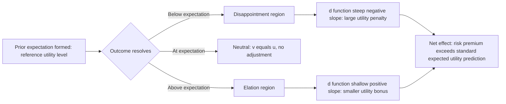

## Disappointment Aversion

### Overview

Disappointment aversion is a model of decision-making under risk in which utility depends not only on the outcome received, but on the discrepancy between that outcome and the decision-maker's prior *expectation* of what would occur. When the realized outcome falls short of the expectation formed before the resolution of uncertainty, the decision-maker experiences disappointment; when it exceeds the expectation, elation results. Because this comparison is asymmetric — disappointment is weighted more heavily than elation of equal magnitude — the theory generates risk-averse behavior beyond what standard expected utility theory predicts, without requiring the state-by-state, pairwise comparison to a specific forgone alternative that regret theory requires.

The foundational formal treatments are Bell (1985) and Loomes and Sugden (1986), with Gul (1991) providing an axiomatic, disappointment-aversion-specific generalization of expected utility theory that has become the standard reference in the theoretical literature.

### Distinguishing Disappointment from Regret

This is the central conceptual distinction to hold onto, since the two are frequently conflated:

| Feature | Disappointment Aversion | Regret Theory |
| --- | --- | --- |
| Comparison basis | Realized outcome vs. own prior expectation for the *same* chosen option | Realized outcome vs. outcome of a *specific forgone alternative* in the same state |
| Requires a forgone option? | No — disappointment can occur even with only one option ever considered | Yes — regret is inherently comparative across options |
| Requires counterfactual knowledge? | No — expectation is self-generated before the gamble resolves | Yes (or at least imagined) — requires knowing or estimating what the alternative would have yielded |
| Typical trigger | Any single risky prospect with a distribution of outcomes | Choice between two or more distinguishable acts |
| Reference point | The expected value or certainty-equivalent of the *chosen* prospect itself | The outcome of the *other* option |

A useful test case: a person plays a single lottery with no alternative ever offered. Regret theory has nothing to say about this case, because there is no forgone option to compare against. Disappointment theory still applies fully, because the person formed an expectation about the lottery's outcome and can be disappointed relative to it.

### Formal Structure

**Bell / Loomes-Sugden formulation**

For a prospect with outcomes $x_i$ occurring with probability $p_i$, let $\bar{u}$ denote the expected utility of the prospect (the "reference level" or expectation):

$$\bar{u} = \sum_i p_i \, u(x_i)$$

The disappointment-adjusted utility of a realized outcome $x_i$ is:

$$v(x_i) = u(x_i) + d\big(u(x_i) - \bar{u}\big)$$

where $d(\cdot)$ is a disappointment-elation function: increasing, with $d(0) = 0$, and typically **steeper for negative arguments (disappointment) than for positive arguments (elation) of equal magnitude** — the direct analogue of loss aversion in Prospect Theory, but applied to deviations from an expectation rather than from a fixed status-quo wealth level.

**Gul's (1991) axiomatic disappointment aversion**

Gul provides a cleaner, more tractable model widely used in applied theory (particularly asset pricing). For a binary lottery with a better outcome $x$ (probability $p$) and worse outcome $y$ (probability $1-p$), the certainty equivalent is defined implicitly using a disappointment-aversion coefficient $\beta \geq 0$:

$$u(CE) = \frac{p \, u(x) + \beta (1-p) \, u(y)}{p + \beta(1-p)}$$

When $\beta = 1$, this collapses to standard expected utility. When $\beta > 1$, below-expectation outcomes ($y$) receive extra negative weight relative to above-expectation outcomes ($x$), producing disappointment-averse behavior. **[Inference]** The appeal of Gul's formulation in applied finance work is largely due to this reduction to a single extra parameter ($\beta$) layered on top of a standard utility function, making it far more estimable than the original Bell/Loomes-Sugden functional form, which requires specifying an entire disappointment function $d(\cdot)$.

### Behavioral Predictions

1. **Excess risk aversion relative to expected utility**: Because negative deviations from expectation are weighted more heavily, disappointment-averse agents require a larger risk premium to accept a given gamble than a standard expected-utility maximizer with the same underlying utility function $u(\cdot)$.
2. **Preference for early resolution of uncertainty is *not* implied by simple static disappointment aversion** — this is a common confusion. Static disappointment aversion (as in Gul's model) is about the *shape* of the response to outcomes relative to expectation within a single resolution event; preference over the *timing* of resolution is a separate dimension studied in models of anticipatory utility and information-timing preferences (e.g., Kreps & Porteus, 1978), which are related but formally distinct.
3. **Skewness preference**: Disappointment-averse agents show an aversion to negatively-skewed prospects (a small chance of a very bad outcome relative to expectation) even when mean and variance are held constant, because the "bad tail" generates disproportionately weighted disappointment.
4. **Expectation-dependence of satisfaction**: Two people who receive the *identical* outcome can experience different levels of satisfaction if they held different prior expectations — a well-documented phenomenon in subjective well-being research (e.g., Olympic athletes: bronze medalists sometimes report higher satisfaction than silver medalists, attributed to differing counterfactual/expectation reference points — this specific finding is from Medvec, Madey & Gilovich, 1995, and sits at the intersection of disappointment theory and counterfactual thinking).

### Worked Example

**Scenario**: A salesperson forms an expectation about their annual bonus based on the company's historical payout pattern: 60% chance of a $10,000 bonus, 40% chance of a $2,000 bonus.

Expected value (reference level):

$$\bar{x} = 0.6(10{,}000) + 0.4(2{,}000) = 6{,}000 + 800 = 6{,}800$$

Under standard expected utility theory, the salesperson's satisfaction with a $2,000 outcome depends only on $u(2{,}000)$, evaluated the same way regardless of what was expected.

Under disappointment aversion:

$$v(2{,}000) = u(2{,}000) + d\big(u(2{,}000) - u(6{,}800)_{\text{implied}}\big)$$

Since $u(2{,}000) - \bar{u} < 0$, and $d(\cdot)$ is steeper on the negative side, the realized dissatisfaction from receiving $2,000 is *disproportionately larger* than the elation would have been from receiving $10,000 (a symmetric positive deviation in raw dollar terms would produce a smaller utility gain than the equivalent-magnitude negative deviation's utility loss).

**Key Points**

- This generates a testable prediction distinct from ordinary diminishing marginal utility: even after controlling for the concavity of $u(\cdot)$, the *marginal* disappointment from falling short is steeper than the marginal elation from exceeding, purely due to the $d(\cdot)$ term.
- Firms exploit this asymmetry directly in compensation design: anchoring expectations low (e.g., conservative bonus guidance) reduces the probability and magnitude of disappointment events, independent of the actual payout distribution.

### Diagram: Disappointment vs. Elation Around an Expectation

### Applications

**Asset Pricing and the Equity Premium Puzzle**

- Disappointment aversion (particularly the Gul formulation) has been used to help explain the equity premium puzzle: the historically observed equity risk premium is larger than standard expected-utility models with plausible risk-aversion parameters can justify. Adding a disappointment-aversion coefficient $\beta$ allows models to match observed premia with more moderate, empirically defensible risk-aversion assumptions. **[Unverified]** The degree to which disappointment aversion alone (versus combined with habit formation or other mechanisms) resolves the puzzle quantitatively remains an active modeling question in the asset-pricing literature, and different calibration studies report different contributions.

**Consumer Expectations and Satisfaction**

- The expectation-disconfirmation model in consumer satisfaction research (Oliver, 1980) is structurally parallel to disappointment aversion: satisfaction is modeled as a function of the gap between expected and perceived product performance, with negative disconfirmation (performance below expectation) weighted more heavily in driving dissatisfaction and churn than positive disconfirmation drives loyalty.

**Managing Expectations in Organizations**

- Performance review systems, project timeline communication, and product launch messaging are frequently designed around disappointment-minimization: under-promising and over-delivering exploits the same asymmetry, since a given positive surprise generates less elation-utility than an equivalent negative surprise would generate disappointment-utility, making the *expected utility cost of overpromising* higher than the *expected utility gain of matching a lower promise*.

**Sports and Competitive Outcomes**

- Reference-dependent satisfaction from rankings (e.g., the silver/bronze medal effect noted above) demonstrates that the *objective* rank and reward can be held constant while satisfaction varies purely by which counterfactual/expectation frame is most salient (a near-miss for gold vs. a near-miss for no medal at all).

### Relationship to Prospect Theory

Disappointment aversion and Prospect Theory share the asymmetric, loss-steeper-than-gain functional shape, but differ in what defines the reference point:

- **Prospect Theory**: reference point is typically the status quo, an endowed position, or a salient anchor — largely independent of the probability distribution of the current choice.
- **Disappointment aversion**: reference point is the expected value (or certainty equivalent) *of the very prospect being evaluated*, meaning the reference point is endogenous to the gamble itself and shifts whenever the probability distribution changes.

**[Inference]** This endogeneity is why disappointment aversion is generally preferred in formal asset-pricing and single-prospect risk models, whereas Prospect Theory's exogenous reference point is more suited to modeling choices framed relative to a fixed starting wealth or status-quo position (e.g., insurance, negotiations, endowment effects).

### Empirical Support and Critiques

**Supporting evidence**

- Mellers, Schwartz, Ho & Ritov (1997) find that anticipated satisfaction with gambling outcomes is well predicted by a combination of outcome valence and the probability of the outcome relative to the full distribution — consistent with disappointment/elation weighting rather than outcome value alone.
- Sports psychology and Olympic-medal studies consistently replicate expectation-dependent satisfaction effects distinct from the objective outcome.

**Critiques**

- **Reference point instability**: Because the reference level $\bar{u}$ is itself computed from the probability distribution, disappointment models can become circular or computationally demanding for complex, multi-outcome prospects, and different specifications (Bell/Loomes-Sugden vs. Gul) can yield different predicted certainty equivalents for the same lottery.
- **Empirical disentanglement from loss aversion**: In many real-world single-shot decisions, the expectation-based reference point and a status-quo-based reference point coincide or are highly correlated, making it difficult to determine from field data which mechanism (disappointment vs. loss aversion) is generating observed risk aversion. **[Unverified]** Clean identification typically requires laboratory manipulation of expectations independent of endowments, and the generalizability of lab findings to naturalistic financial or consumer settings should be treated as an open question rather than settled.
- **Dynamic consistency concerns**: Some disappointment-aversion formulations, when extended to sequential or dynamic choice settings, can violate dynamic consistency (the agent's plan at time 0 is not one they wish to follow through on at time 1), a technical issue that has generated a separate literature on recursive non-expected-utility preferences.

### Measurement Approaches

- **Elicited certainty equivalents**: Comparing an individual's stated certainty equivalent for a lottery against the prediction of standard expected utility (given an independently estimated $u(\cdot)$) to back out an implied disappointment-aversion parameter (commonly $\beta$ in the Gul framework).
- **Self-reported affect post-outcome**: Surveys measuring reported satisfaction/disappointment intensity as a function of pre-registered expectations, used heavily in consumer satisfaction and sports psychology research.
- **Physiological and neural correlates**: Studies using skin conductance and fMRI to measure affective response magnitude when outcomes are revealed as better or worse than a pre-stated expectation, though **[Unverified]** this sub-literature is smaller and less standardized than the corresponding neuroeconomic literature on regret.

### Practical Implications for Choice Architecture and Communication

- Calibrating stated expectations downward (conservative forecasts, "under-promise") systematically reduces exposure to the steep disappointment branch of $d(\cdot)$, independent of any change to the actual outcome distribution.
- In risk communication (e.g., medical prognoses, financial projections), presenting a *range* with an appropriately anchored central expectation can shape how strongly a given realized outcome is experienced, separate from the outcome's objective severity.
- Recognizing that disappointment aversion does not require a forgone alternative distinguishes it from regret-based interventions: reducing comparative feedback (the regret-theory lever) does *not* address disappointment, since disappointment can arise purely from a single prospect's own expectation.

**Next Steps**

- Regret Theory and Anticipated Regret
- Prospect Theory and Loss Aversion
- Kreps-Porteus Preferences and Timing of Uncertainty Resolution
- Expectation-Disconfirmation Model of Consumer Satisfaction
- Equity Premium Puzzle in Behavioral Asset Pricing
- Counterfactual Thinking and the Simulation Heuristic
- Reference-Dependent Preferences (general framework)
- Adaptive Expectations and Hedonic Adaptation