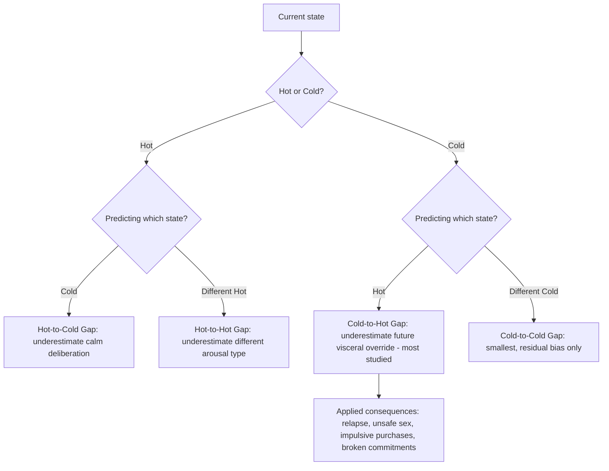

## Visceral Factors and the Hot-Cold Empathy Gap

### Overview

This topic addresses how transient physiological and emotional states — visceral factors — systematically distort judgment, decision-making, and self-prediction, and why people are structurally poor at forecasting behavior across states different from the one they currently occupy. The framework was developed primarily by George Loewenstein (1996, visceral factors) and extended by Loewenstein, Nordgren, and colleagues (the "hot-cold empathy gap," early 2000s). Together these constructs explain a wide range of self-control failures, addiction relapse, sexual risk-taking, and mispredictions of one's own future behavior that expected-utility and even standard behavioral-economic models (which typically assume stable preferences within a decision) do not capture well.

### Visceral Factors: Core Definition

**Visceral factors** are defined by Loewenstein (1996) as a class of transient drive states — including hunger, thirst, sexual arousal, physical pain, craving (e.g., for a drug), anger, fear, and other intense emotions — that have the following properties:

1. **Direct hedonic impact**: They are aversive or appetitive in themselves, independent of their instrumental consequences.
2. **Attention-narrowing**: They focus attention and cognitive resources on activities and stimuli associated with satisfying the visceral state, crowding out consideration of other goals, values, and long-term consequences.
3. **Directly influence the desirability of goal-relevant behaviors**: A visceral state does not just change what you *want* the outcome to be — it changes what you're willing to *do* to obtain it, sometimes leading to behavior that a person would (in a cooler state) explicitly disavow.
4. **Underweighted when absent, overweighted when present**: This asymmetry is the crux of the model. In a "cold" state, people underestimate how much a future visceral state (hunger, arousal, drug craving) will alter their preferences and behavior. In a "hot" state, they overweight the current visceral drive relative to other considerations.

**[Confirmed]** This is distinct from Prospect Theory's probability-weighting or loss-aversion mechanisms: visceral factors operate on the *within-decision weighting of goals and consequences* driven by current physiological/affective state, not on how probabilities or gains/losses are perceived in the abstract.

### The Hot-Cold Empathy Gap

Loewenstein (2005) and Van Boven & Loewenstein extended visceral-factors theory into a formal taxonomy of **empathy gaps**: systematic failures to accurately predict, remember, or empathize with decisions and preferences made in a different visceral state than one's current state.

**Four canonical types of empathy gaps:**

| Gap Type | Direction | Description |
| --- | --- | --- |
| Hot-to-cold empathy gap | Currently hot, predicting/judging cold state | Underestimating how much a calm, deliberative state will differ from the current aroused/craving state |
| Cold-to-hot empathy gap | Currently cold, predicting/judging hot state | Underestimating how much a future visceral state will override current intentions and values (most studied and most consequential in practice) |
| Hot-to-hot empathy gap | Currently in one hot state, predicting a different hot state | Underestimating how a different type of visceral arousal (e.g., anger vs. fear) will alter behavior |
| Cold-to-cold empathy gap | Currently cold, predicting a different cold state | Generally smallest gap, since neither state involves visceral distortion, though residual misprediction can still occur from other biases |

**[Confirmed]** The cold-to-hot gap is the most extensively documented and carries the greatest applied significance, because it explains why people in a cold state (e.g., planning a diet, committing to safe-sex practices, setting a savings goal) systematically underprepare for, or make commitments incompatible with, the hot state they will later find themselves in.

### Formal / Conceptual Structure

There is no single canonical equation for the empathy gap in the way regret theory or disappointment aversion have formal utility functions; the model is typically expressed conceptually and tested via elicited-preference or willingness-to-pay paradigms. A commonly used representation:

$$\text{Predicted behavior}_{\text{cold}}(\text{hot state}) \neq \text{Actual behavior}_{\text{hot}}$$

with the gap magnitude:

$$G = \big|\, B_{\text{actual, hot}} - B_{\text{predicted, cold}} \,\big|$$

where $B$ denotes a behavioral or preference measure (e.g., stated willingness to pay, risk tolerance, or a binary choice). **[Inference]** Because the underlying construct (the internal visceral state itself) is not directly observable or perfectly quantifiable across individuals, most empirical work operationalizes $G$ via between- or within-subject comparisons of stated preferences elicited in induced hot vs. cold states, rather than via a fitted parametric model — this is a methodological, not merely notational, distinction from regret and disappointment theory.

### Classic Empirical Demonstrations

1. **Loewenstein, Nagin & Paternoster (1997) / sexual arousal and risk-taking**: Studies inducing sexual arousal in male participants found that aroused subjects reported substantially higher willingness to engage in ethically questionable or risky sexual behavior, and lower likelihood of using protection, compared to their own predictions made in a non-aroused state — a within-subject demonstration of the cold-to-hot gap.
2. **Read & van Leeuwen (1998) grocery shopping study**: Participants asked to choose a snack for pickup a week later chose healthier options when currently full (cold state), but shifted toward less healthy options when currently hungry — despite the future consumption context being identical. This demonstrates that even *predictions about a future state* are contaminated by the *current* visceral state (a hot-to-cold or cold-to-hot misprediction depending on framing), not just decisions made in the moment.
3. **Nordgren, van der Pligt & van Harreveld (2006) on addiction relapse**: Former smokers/addicts in a "cold" (non-craving) state consistently underestimated their vulnerability to relapse when later confronted with a "hot" craving state, and this underestimation itself predicted higher relapse rates — suggesting the empathy gap is not just a measurement curiosity but has real consequences for self-control failure and relapse-prevention planning.
4. **Pain and effort**: Cold-state individuals underestimate the motivational pull of pain-avoidance and physical discomfort, which is relevant to medical decision-making (e.g., underestimating how much labor pain will affect a birth plan, or how post-surgical pain will affect adherence to a pre-committed rehabilitation schedule).

### Diagram: Empathy Gap Quadrants

### Relationship to Self-Control and Precommitment Literature

Visceral factors and the empathy gap provide the psychological micro-foundation for a large body of self-control research that otherwise treats "temptation" as a black box:

- **Thaler & Shefrin's (1981) planner-doer model** and **hyperbolic discounting** (Laibson, 1997) explain *why* future selves are discounted more heavily as immediacy increases, but do not fully explain the *mechanism* by which immediate temptation overrides stated long-term preference. Visceral-factors theory supplies that mechanism: the hot state doesn't just discount the future more steeply — it actively reweights what outcomes are perceived as desirable *in the moment*.
- **Precommitment devices** (locking away credit cards, Ulysses contracts, mandatory cooling-off periods) are direct applied responses to the cold-to-hot empathy gap: since a cold-state self cannot accurately simulate the hot-state self's preferences, the rational response is to restrict the hot-state self's *option set* in advance, rather than relying on hot-state self-control.
- **[Inference]** This is a key theoretical distinction: hyperbolic discounting models generally still assume the decision-maker has *accurate* information about their future utility function, just weights it wrongly over time; the empathy gap framework instead posits that the decision-maker's *forecast of their own future utility function is itself wrong*, which is a distinct and, in some contexts, more severe failure mode.

### Applications

**Public Health and Risk Behavior**

- Comprehensive sex education and HIV/STI prevention programs increasingly incorporate empathy-gap-aware design (e.g., practicing negotiation scripts *in* simulated arousal-adjacent contexts) rather than relying solely on cold-state knowledge transmission, since knowledge acquired cold does not reliably transfer to hot-state behavior.
- Addiction treatment and relapse-prevention protocols (e.g., cue-exposure therapy) are explicitly designed around the recognition that a patient's cold-state commitment to abstinence will not predict their hot-state (craving-triggered) behavior, and that exposure-based practice under controlled hot states may generalize better than purely cold-state counseling.

**Medical Decision-Making and Informed Consent**

- Advance directives and birth plans are known to be vulnerable to the empathy gap: preferences stated in a calm, cold state (e.g., "no epidural") are frequently reversed under the hot state of acute pain, raising both clinical and ethical questions about how much weight to give cold-state precommitments versus in-the-moment hot-state requests.

**Consumer and Marketing Behavior**

- Point-of-sale impulse purchases, limited-time urgency framing, and scarcity tactics are designed to induce a hot (often anxiety- or excitement-driven) state at the moment of purchase, exploiting the fact that a consumer's cold-state budget plan does not accurately anticipate their hot-state willingness to pay.
- "Cooling-off periods" mandated by consumer protection law (e.g., for door-to-door sales, timeshare purchases) are a direct policy response to the empathy gap, giving the consumer's cold-state self a chance to override a hot-state purchase decision.

**Negotiation and Conflict**

- Anger and other hot-to-hot gaps are relevant in negotiation contexts: a negotiator in a calm state routinely underestimates how much their own behavior (concessions, threats, walk-away decisions) will shift once genuinely provoked or anxious during live negotiation, which is part of the rationale behind structured negotiation protocols and mandatory cooling-off breaks in high-stakes talks.

### Critiques and Boundary Conditions

- **Measurement difficulty**: Visceral states are difficult to induce ethically and consistently in laboratory settings (particularly for factors like real drug craving, extreme fear, or sustained hunger), which limits the range and intensity of experimental manipulations relative to real-world visceral experiences. **[Unverified]** The degree to which laboratory-induced "hot" states of mild-to-moderate intensity generalize to real-world hot states of much greater intensity (e.g., genuine substance withdrawal, acute panic) is a recognized external-validity concern rather than a resolved matter.
- **Individual differences**: Susceptibility to visceral override and the magnitude of empathy gaps likely vary substantially across individuals (e.g., trait self-control, prior experience with a given visceral state, clinical conditions), and the base theory does not, on its own, provide a fully developed account of this heterogeneity. **[Inference]** Some of this heterogeneity is addressed in adjacent literatures (e.g., dual-process/System 1–System 2 models, ego-depletion research — noting that ego-depletion's replication has itself been heavily contested in recent years), but integrating these into a unified predictive model of empathy-gap magnitude remains an open area.
- **Overextension risk**: Not all in-the-moment deviations from stated intentions are attributable to visceral/empathy-gap mechanisms; some are better explained by simple preference change, new information, or standard present-bias/hyperbolic discounting without invoking a distinct visceral-override mechanism. Care should be taken not to invoke the empathy gap as a catch-all explanation for any observed preference reversal.

### Measurement Approaches

- **State-induction paradigms**: Experimentally inducing a hot state (arousal, hunger, mild pain, anger) via validated manipulation methods and comparing elicited preferences/behavior to a cold-state control or to the same participants' own cold-state predictions.
- **Within-subject prediction-then-experience designs**: Asking participants to predict their hot-state behavior while cold, then measuring actual hot-state behavior later, with the gap itself as the dependent variable (used in the Loewenstein/Nordgren relapse studies).
- **Retrospective vs. prospective comparison**: Some designs also test a "hot-to-cold" memory gap — whether people accurately *recall* how intensely they felt and behaved during a past hot state once they've returned to cold, which is relevant to relapse-prevention counseling that relies on patients accurately recalling craving intensity.

### Practical Implications for Choice Architecture

- Design decisions that will be executed in a hot state (e.g., addiction triggers, purchase decisions, safety-critical choices under stress) should not rely on cold-state instructions or willpower alone; structural precommitment (restricting options, defaults, delays) is more robust to the empathy gap than informational interventions.
- Wherever possible, eliciting decisions or practicing responses *in* a context that approximates the relevant hot state (simulation, role-play, cue exposure) produces more externally valid self-predictions than eliciting them in a purely cold, deliberative context.
- Policymakers and clinicians relying on cold-state stated preferences (advance directives, cooling-off contracts, treatment plans) should build in explicit mechanisms for revisiting or overriding those preferences under defined hot-state conditions, rather than treating the cold-state statement as automatically authoritative or automatically suspect — this is a design trade-off rather than a settled resolution.

**Next Steps**

- Hyperbolic Discounting and Present Bias
- Thaler & Shefrin's Planner-Doer Model
- Precommitment Devices and Ulysses Contracts
- Dual-Process Theory (System 1 / System 2 Decision-Making)
- Affective Forecasting and the Impact Bias
- Cue-Reactivity and Craving in Addiction Models
- Regret Theory and Anticipated Regret
- Ego Depletion and Self-Control Resource Models (including replication debates)