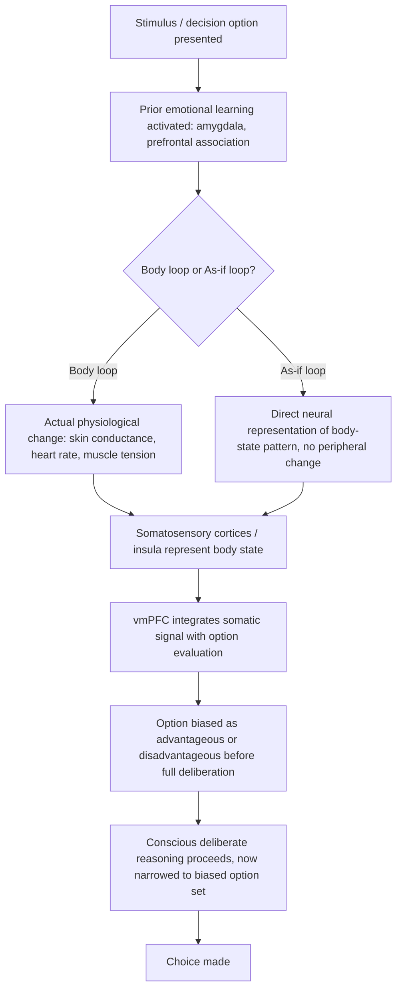

## Somatic Markers and Emotion in Choice

### Overview

The somatic marker hypothesis (SMH), developed by neuroscientist Antonio Damasio (1994, 1996), proposes that emotion and bodily feeling are not merely disruptive noise in rational decision-making but are a necessary computational component of it. According to the hypothesis, decision-making relies on **somatic markers**: physiological signals (bodily sensations, autonomic responses such as changes in heart rate, skin conductance, or muscle tension) that become associated, through experience, with the anticipated outcomes of a given option. These markers act as an automatic, largely non-conscious biasing signal that narrows the decision space *before* deliberate cost-benefit reasoning takes over, effectively flagging options as "good" or "bad" based on the affective residue of past similar experiences.

This directly challenges the classical rationalist view — traceable to Descartes and formalized in neoclassical economics — that reason and emotion are separable systems, with emotion functioning only as a contaminant of otherwise rational choice. Damasio's clinical work, and later behavioral-economic and neuroeconomic research building on it, instead positions emotion as a load-bearing component of functional decision-making, such that its absence or disruption produces *worse*, not better, decisions.

### Theoretical Foundations

**Core Claim**

Decisions, especially those made under uncertainty or with delayed, hard-to-calculate consequences, cannot be resolved by pure cost-benefit deliberation alone within realistic time and cognitive constraints. Somatic markers provide a shortcut: bodily states triggered by prior emotional learning bias attention and evaluation toward advantageous options and away from disadvantageous ones, often before the person can articulate *why*.

**Two Pathways of Somatic Marker Activation**

1. **Body loop (primary/genuine somatic marker)**: An actual physiological change occurs (e.g., increased skin conductance, elevated heart rate) in response to a stimulus associated with past reward or punishment, and this bodily state is then represented in the brain (notably the somatosensory cortices and insula) and fed into the decision process.
2. **As-if loop**: The brain represents the *pattern* of the bodily state directly, without the actual peripheral physiological change occurring — a faster, more efficient route that Damasio proposed as a way the system can produce marker-like biasing signals without waiting for a full bodily response cycle. **[Unverified]** The relative contribution and independent verifiability of the as-if loop versus the body loop remains one of the more contested and harder-to-empirically-isolate components of the theory, since it is defined partly by the *absence* of a measurable peripheral signal.

**Key Neural Structures**

- **Ventromedial prefrontal cortex (vmPFC)**: The central structure implicated in SMH. Damage here is associated with intact intellectual/IQ performance but severely impaired real-world decision-making, especially in socially and emotionally complex or ambiguous situations.
- **Amygdala**: Involved in the initial emotional learning and evaluation of stimuli, particularly for fear and reward association.
- **Insula**: Implicated in interoception — the representation of internal bodily states — providing the substrate through which somatic signals are represented and made available to decision processes.
- **Somatosensory cortices**: Hypothesized to hold the mapped representation of body states used in both the body loop and as-if loop.

### The Iowa Gambling Task (IGT)

The IGT (Bechara, Damasio, Damasio & Anderson, 1994) is the principal experimental paradigm used to test SMH and remains the most widely cited empirical anchor for the theory.

**Task structure**

- Participants choose cards from four decks (A, B, C, D), each with different, initially unknown reward and penalty structures.
- Decks A and B ("bad decks") offer high immediate rewards but larger intermittent penalties, producing a *net loss* over many draws.
- Decks C and D ("good decks") offer smaller immediate rewards but smaller penalties, producing a *net gain* over many draws.
- Participants must learn the advantageous strategy through experience, without being told the underlying structure.

**Key findings**

- Healthy participants develop anticipatory skin-conductance responses (SCRs) *before* selecting from a bad deck, even before they can consciously articulate that the deck is disadvantageous — interpreted as the somatic marker biasing behavior in advance of explicit knowledge.
- Patients with vmPFC damage fail to develop these anticipatory SCRs and continue selecting from the disadvantageous decks even after (in some cases) being able to verbally identify which decks are worse — a dissociation between explicit knowledge and behavior that is central to the SMH argument that somatic signals, not just declarative reasoning, drive advantageous choice.
- **[Inference]** This dissociation is the strongest single piece of evidence cited for SMH, because it demonstrates that impaired affective signaling, not impaired general intelligence or explicit reasoning, is sufficient to produce poor real-world decision-making.

### Diagram: Somatic Marker Decision Loop

### Clinical Evidence Beyond the IGT

- **vmPFC lesion patients** (real-world cases studied by Damasio's group, building on the classic Phineas Gage case) consistently show preserved logical reasoning, working memory, and IQ, alongside profound impairment in personal and professional decision-making, financial planning, and social judgment — the signature dissociation that motivated the theory.
- **Reduced physiological reactivity** in these patients (measured via skin conductance to emotionally salient or personally consequential stimuli) correlates with the severity of their real-world decision-making impairment, supporting the claim that the deficit is affective/somatic rather than purely cognitive.
- Studies of individuals with other conditions affecting interoceptive or emotional processing (e.g., certain presentations of alexithymia — difficulty identifying and describing one's own emotions) have also been examined for IGT performance deficits, though **[Unverified]** findings across different clinical populations are more mixed than the core vmPFC-lesion literature, and alexithymia-IGT associations should not be treated as uniformly established.

### Relationship to Dual-Process and Affect Heuristic Models

Somatic marker theory sits alongside, and partially overlaps with, several related frameworks in the emotion-and-decision-making literature:

| Framework | Relationship to SMH |
| --- | --- |
| Affect Heuristic (Slovic, Finucane, Peters & MacGregor) | Closely related: both propose that a rapid, affect-based evaluative tag ("good"/"bad") precedes and biases more deliberate judgment. The affect heuristic is framed more generally in terms of a "goodness/badness" pool of associations, while SMH is specifically grounded in bodily/physiological signaling and vmPFC-mediated integration. |
| Dual-Process Theory (System 1 / System 2) | SMH can be read as a neuroscientific account of *why* System 1 (fast, automatic, affect-laden) processing is not merely a shortcut to be overridden, but often provides information (accumulated experiential value) that System 2 lacks direct access to. |
| Risk-as-Feelings (Loewenstein, Weber, Hsee & Welch, 2001) | Explicitly builds on and extends SMH-adjacent reasoning: argues that feelings at the moment of decision (including anticipatory emotion) often diverge from, and can override, cognitive risk assessments, particularly under time pressure or high emotional salience. |
| Visceral Factors (Loewenstein, 1996) | Distinguishable from SMH: visceral factors are *transient drive states* (hunger, craving, arousal) that distort weighting of goals, whereas somatic markers are proposed as a *general-purpose, largely stable learned signaling mechanism* that operates across many decision types, not tied to a specific drive state. |

**[Inference]** A useful way to keep these distinct: somatic markers are a proposed *mechanism* for how affect gets encoded and retrieved during choice; the affect heuristic and risk-as-feelings are more *descriptive, judgment-level* frameworks about the resulting behavior, largely agnostic to the specific underlying neural implementation.

### Applications

**Behavioral Finance**

- Investor decision-making under the SMH lens suggests that experienced financial losses leave a lasting somatic/affective imprint that biases future risk-taking (e.g., excessive caution after a market crash) independent of updated rational risk assessment — a candidate explanation, alongside loss aversion and disappointment aversion, for persistent under-diversification and pro-cyclical trading behavior.
- Neuroeconomic studies using skin-conductance and fMRI measures during simulated trading tasks have examined whether anticipatory somatic signals predict risk-avoidant trading behavior before conscious risk evaluation is reported. **[Unverified]** This specific application area is more exploratory than the core clinical IGT literature and results should be treated as suggestive rather than firmly established.

**Marketing and Brand Affect**

- Brand experience design often aims to build positive somatic/affective associations (through consistent positive experiential pairing) that bias future purchase decisions at a pre-deliberative level, consistent with the general SMH mechanism of experience-linked affective tagging of options.

**Clinical and Rehabilitative Contexts**

- Understanding vmPFC-related decision deficits has informed rehabilitation and guardianship/capacity assessments for patients with frontal lobe injury, since standard IQ and cognitive-reasoning tests can fail to detect the specific real-world decision-making impairment that SMH identifies and the IGT is designed to probe.

**Public Health and Risk Communication**

- Risk communication campaigns increasingly incorporate affective/experiential elements (vivid narratives, emotionally resonant imagery) rather than purely statistical framing, informed by the broader SMH-adjacent view that decisions responsive only to abstract probability information may fail to engage the affective mechanisms that actually drive behavior change.

### Critiques and Methodological Limitations

- **IGT interpretability concerns**: Some researchers (e.g., Dunn, Dalgleish & Lawrence, 2006, in a widely cited critical review) argue that IGT performance can be explained by working-memory and executive-function differences rather than a specifically *somatic/affective* mechanism, and that the task's structure makes it difficult to cleanly isolate an emotional-signaling deficit from a general learning or reversal-learning deficit.
- **Reverse causality and correlational limits**: Correlations between skin-conductance responses and advantageous choice in the IGT are consistent with SMH but do not, on their own, establish that the somatic signal is *causally necessary* for the choice, as opposed to being a downstream correlate of some other more fundamental process.
- **The as-if loop's testability**: As noted above, the as-if loop is defined in part by the absence of a peripherally measurable signal, which makes it inherently difficult to falsify or independently verify, a point raised by critics as a structural weakness of the broader theory rather than a specific empirical failure.
- **Overgeneralization risk**: SMH is sometimes invoked loosely in applied/popular contexts as a blanket justification for "trusting your gut" in decision-making generally. **[Inference]** The clinical and experimental evidence base most strongly supports the theory in the specific context of ambiguous, experience-based, personally consequential decisions (as in the IGT and real-world vmPFC patient behavior) — extending it uncritically to all forms of intuitive judgment (e.g., unrelated perceptual or purely probabilistic judgments) goes beyond what the core evidence directly supports.

### Measurement Approaches

- **Skin conductance response (SCR)**: The primary physiological measure used in IGT-based SMH research, capturing anticipatory autonomic arousal before a choice is made.
- **Heart rate variability and other autonomic measures**: Used as supplementary or alternative somatic indices in some studies, though **[Unverified]** with less standardization across the literature than SCR.
- **fMRI and lesion-mapping studies**: Used to localize and confirm the involvement of vmPFC, amygdala, and insula in somatic-marker-related processing, and to compare lesion patients against healthy controls or patients with damage to other brain regions (dissociation designs).
- **Behavioral IGT performance metrics**: Net score (advantageous minus disadvantageous deck selections over time), often analyzed block-by-block to track the learning curve and its divergence between patient and control groups.

### Practical Implications for Choice Architecture

- Decision environments intended to support good real-world judgment (e.g., financial advising, medical decision-making) may benefit from incorporating experiential or affectively engaging elements (case narratives, simulations) rather than relying solely on abstract statistical presentation, on the reasoning that purely propositional information may under-engage the somatic-marker mechanisms that normally guide advantageous choice.
- Recognizing that impaired affective signaling (not impaired logic) can be the root cause of poor real-world decisions has direct implications for capacity assessment: standard cognitive/IQ testing alone may be insufficient to detect this specific vulnerability, particularly in populations with frontal lobe injury or certain neuropsychiatric conditions.
- Caution is warranted against over-relying on "gut feeling" framings in decision-support design without an evidentiary basis specific to the decision type in question, given the overgeneralization critique noted above.

**Next Steps**

- Affect Heuristic (Slovic, Finucane, Peters & MacGregor)
- Risk-as-Feelings Hypothesis (Loewenstein, Weber, Hsee & Welch)
- Iowa Gambling Task: Methodology and Critiques
- Visceral Factors and the Hot-Cold Empathy Gap
- Ventromedial Prefrontal Cortex and Real-World Decision-Making Deficits
- Dual-Process Theory (System 1 / System 2 Decision-Making)
- Interoception and Decision-Making
- Neuroeconomics: Methods and Core Findings