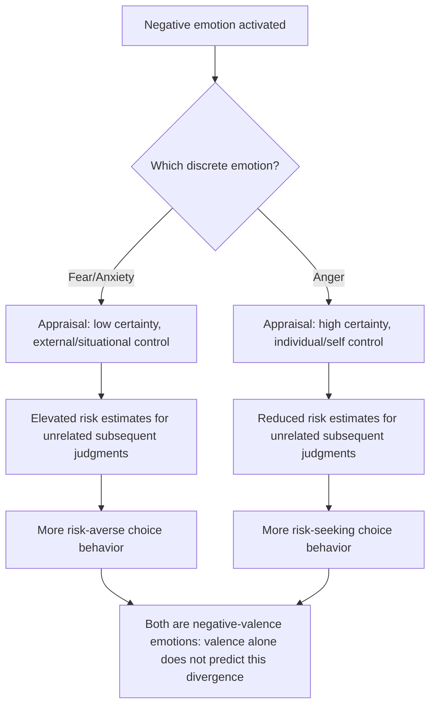

## Fear, Anxiety, and Risk Perception

### Overview

Fear and anxiety are discrete-but-related affective states that systematically distort how people perceive, weight, and respond to risk, in ways that diverge from both objective probability estimates and from the predictions of purely cognitive risk-assessment models. This body of work sits at the intersection of affective science, judgment and decision-making research, and behavioral economics, and draws heavily on the **Appraisal-Tendency Framework** (Lerner & Keltner, 2000, 2001), the **Risk-as-Feelings hypothesis** (Loewenstein, Weber, Hsee & Welch, 2001), and earlier **availability/affect heuristic** work (Slovic and colleagues). Unlike the somatic marker and visceral-factors literatures, which are largely mechanism-focused, this area places particular emphasis on how *specific emotions* (not just generic positive/negative affect or generic arousal) produce *emotion-specific, directionally distinct* biases in risk judgment.

### Distinguishing Fear from Anxiety

Although often used interchangeably in lay discourse, the discrete-emotion literature treats fear and anxiety as related but separable constructs:

| Feature | Fear | Anxiety |
| --- | --- | --- |
| Object | Typically has a specific, identifiable object or threat | Often diffuse, anticipatory, and object-less or object-uncertain |
| Certainty appraisal | Associated with high situational control appraisal in some models, or an identifiable proximate threat | Associated with low certainty and low perceived control over the future |
| Temporal orientation | Often present-oriented (immediate threat) | Often future-oriented (anticipated, uncertain threat) |
| Typical behavioral output | Fight/flight, avoidance of the specific threat | Vigilance, worry, information-seeking, generalized risk aversion |

**[Inference]** In practice, much of the applied judgment-and-decision-making literature (e.g., post-9/11 risk perception studies, financial anxiety research) does not always cleanly separate fear from anxiety experimentally, and many findings attributed to "fear" in earlier papers would, under the stricter appraisal-tendency taxonomy, be more precisely characterized as anxiety given their diffuse, uncertainty-laden character. This terminological slippage should be kept in mind when comparing across studies.

### The Appraisal-Tendency Framework (ATF)

Lerner and Keltner's ATF is the dominant theoretical framework for explaining *why* different negative emotions produce different, sometimes opposite, effects on risk perception, despite all being negatively valenced.

**Core mechanism**: Each discrete emotion is associated with a specific set of cognitive appraisals along dimensions such as certainty, control, and responsibility/agency. Once activated, an emotion triggers an implicit "appraisal tendency" that persists and colors judgments of *unrelated*, subsequent situations, not just the situation that triggered the emotion.

**Fear and Anxiety's characteristic appraisals**:

- **Low certainty**: Fear/anxiety are associated with the appraisal that the situation is unpredictable and outside personal control.
- **Situational/external control**: The threat is perceived as controlled by external circumstances rather than the self.

**The central empirical finding**: Fear increases risk estimates and promotes risk-averse choices, whereas **anger** — despite also being a negative emotion — is associated with *high* certainty and *individual* control appraisals, and correspondingly produces *lower* risk estimates and more risk-seeking behavior. This fear/anger dissociation (Lerner & Keltner, 2001) is the single most cited demonstration that valence alone (positive/negative) is insufficient to predict an emotion's effect on judgment; the specific appraisal profile of the emotion matters.

**[Confirmed]** This is a critical point of technical precision: a simplistic "negative mood = more risk averse" model is empirically wrong. Fear and anger are both negative, but they push risk perception and risk-taking in opposite directions.

### The Risk-as-Feelings Hypothesis

Loewenstein, Weber, Hsee & Welch (2001) propose a complementary but distinct model: that **feelings experienced at the moment of decision** (anticipatory emotions, including fear/anxiety about the decision itself) often diverge from, and can override, the decision-maker's own cognitive evaluations of probability and outcome severity.

**Key propositions**:

1. Cognitive evaluations (probability judgments, expected-value calculations) and emotional reactions to risk are produced by **partially separate processes**, and can generate divergent, sometimes conflicting outputs for the same risky situation.
2. When cognitive evaluation and emotional reaction diverge, **behavior more often tracks the feeling, not the cognitive evaluation** — particularly for vivid, proximate, or personally relevant risks.
3. Emotional reactions to risk are disproportionately driven by **the vividness and imaginability of the outcome**, and the **immediacy of exposure to the risk**, rather than by its statistical probability — closely related to Kahneman & Tversky's availability heuristic but framed explicitly in affective, not purely cognitive-retrieval, terms.

**Worked illustration**: A person may correctly *state* that flying is statistically safer per mile traveled than driving, while still experiencing substantially more fear before a flight than before an equivalent-risk drive. Under risk-as-feelings, the behaviorally relevant driver of decisions like flight avoidance, insurance purchase, or route choice is frequently the felt fear, not the cognitively endorsed probability estimate — a dissociation the theory treats as a robust, general property of risk-relevant choice rather than an occasional anomaly.

### The Affect Heuristic and Risk Perception

Slovic, Finucane, Peters & MacGregor's affect heuristic provides a related mechanism specifically relevant to how fear/anxiety shape *probability judgments themselves*, not just downstream choices:

- People consult an affective "pool" of good/bad tags associated with a stimulus and use that pooled affect as a proxy for a more effortful risk/benefit analysis.
- This produces the well-documented **inverse relationship between perceived risk and perceived benefit** across many hazards (e.g., nuclear power, chemical additives): activities that feel more dreadful are judged both riskier *and* less beneficial, even when the two dimensions are, in principle, independent. Fear-inducing framing of a hazard tends to simultaneously inflate perceived risk and deflate perceived benefit, more than a purely rational updating process would predict.

### Diagram: Appraisal-Tendency Divergence — Fear vs. Anger

### Empirical Evidence

1. **Lerner, Gonzalez, Small & Fischhoff (2003), post-9/11 risk perception**: In a large national field experiment following the September 11 attacks, participants induced to feel fear (via media clips) gave higher estimates of future terrorism risk and personal vulnerability, while those induced to feel anger gave lower risk estimates — despite both groups being exposed to the same underlying event, directly replicating the fear/anger dissociation outside the lab in a naturalistic, high-stakes context.
2. **Johnson & Tversky (1983)**: Earlier foundational work showing that mood induced by reading about a negative unrelated event (e.g., a tragic news story) increased participants' probability estimates for a wide range of unrelated negative events (a general "mood congruency" effect), which the later ATF work refined by showing the effect is *emotion-specific*, not simply "bad mood," once discrete emotions are properly separated.
3. **Financial risk-taking under induced fear**: Experimental finance and lab studies have found that fear induction (e.g., via markets framed around loss-laden or crash-associated cues) tends to reduce risk-taking in subsequent investment tasks, consistent with the ATF prediction, though **[Unverified]** the durability of lab-induced fear effects and their generalization to real trading behavior under genuine financial stakes remains a topic where field-validity evidence is thinner than lab evidence.
4. **Health risk communication studies**: Fear-appeal messaging in public health campaigns (e.g., anti-smoking, vaccination promotion) has decades of mixed empirical support: strong fear appeals can increase perceived risk and, under some conditions (particularly when paired with clear, high-efficacy behavioral guidance), increase protective behavior, but can also backfire into defensive avoidance or message rejection when perceived efficacy of the recommended action is low (the **Extended Parallel Process Model**, Witte, 1992, formalizes this efficacy-contingent split). **[Inference]** This conditional, efficacy-dependent effectiveness is why blanket claims that "fear appeals work" or "fear appeals backfire" are both oversimplifications relative to the actual conditional evidence base.

### Anxiety, Ambiguity, and Uncertainty

Anxiety's association with diffuse, uncertain threat connects it closely to the separate literature on **ambiguity aversion** (Ellsberg, 1961) — the preference for known probabilities over unknown ("ambiguous") ones, even when expected values are equated.

- **[Inference]** While ambiguity aversion is typically modeled as a preference-structure phenomenon (à la Ellsberg's urn paradox) rather than an explicitly affective one, the appraisal-tendency and risk-as-feelings frameworks suggest anxiety may be a proximate *affective mediator* of ambiguity aversion: the diffuse, low-certainty appraisal characteristic of anxiety plausibly tracks closely with the subjective experience of facing an ambiguous, poorly specified probability distribution. This connection is theoretically plausible and discussed in the literature but should not be treated as a fully established causal pathway; it is an area of ongoing synthesis rather than settled consensus.

### Applications

**Public Health and Risk Communication**

- Efficacy-paired fear appeals (per the Extended Parallel Process Model) are the standard evidence-based design principle: fear-inducing risk information should be paired with clear, actionable, perceived-as-effective behavioral guidance, since high fear with low perceived efficacy tends to produce defensive avoidance rather than protective action.

**Financial Advising and Market Behavior**

- Recognizing that fear (not necessarily updated probability beliefs) drives panic-selling and excessive risk aversion during market downturns has informed behavioral-finance-based advising practices, including structured decision protocols and cooling-off defaults designed to decouple the felt fear of the moment from immediate portfolio action.

**Terrorism and Security Policy Communication**

- The post-9/11 field evidence on fear vs. anger has direct policy relevance: political rhetoric and media framing that emphasizes fear versus anger in response to a security threat can be expected, per ATF, to shift public risk perception and support for different policy responses (protective/risk-averse policies under fear framing vs. more aggressive/risk-tolerant responses under anger framing).

**Insurance and Precautionary Behavior**

- Purchase of insurance products, security systems, and other precautionary goods is disproportionately responsive to vivid, fear-inducing recent events (e.g., a nearby natural disaster) relative to statistically equivalent but less vivid risk information — consistent with risk-as-feelings' emphasis on vividness and imaginability over abstract probability in driving actual purchase behavior.

**Workplace and Organizational Risk-Taking**

- Anxiety induced by job insecurity, organizational uncertainty, or high-stakes evaluation contexts has been examined as a driver of excessive risk aversion in employee decision-making (e.g., reluctance to propose innovative but uncertain projects), consistent with the low-certainty/low-control appraisal profile of anxiety.

### Critiques and Boundary Conditions

- **Incidental vs. integral emotion conflation**: Much of the foundational ATF work relies on *incidental* emotions (induced by an unrelated prior event) carrying over to bias *unrelated* subsequent judgments. Critics note that real-world risk decisions often involve *integral* emotions (felt in direct response to the risk itself), and the degree to which incidental-emotion lab findings generalize to integral-emotion real-world decisions requires care in interpretation. **[Unverified]** Both incidental and integral emotion effects are documented in the literature, but they are not always cleanly distinguished across studies, complicating direct comparison.
- **Individual differences in trait anxiety**: Most ATF and risk-as-feelings studies focus on state-induced fear/anxiety; the interaction between trait-level anxiety (a stable individual-difference variable, distinct from the transient states this topic focuses on) and state-induced fear effects is a more complex and less fully mapped area, and findings from state-induction paradigms should not be assumed to generalize uniformly across individuals with different trait anxiety baselines.
- **Fear-appeal effectiveness heterogeneity**: As noted, decades of health-communication research show fear appeals have inconsistent net effects across contexts, and meta-analytic estimates of effect size and moderating conditions have themselves varied across reviews; the Extended Parallel Process Model provides a useful conditional framework but is not a fully deterministic predictor of any given campaign's real-world outcome.

### Measurement Approaches

- **Discrete emotion induction paradigms**: Film clips, autobiographical recall tasks, or vignettes designed to induce a specific target emotion (fear vs. anger vs. sadness, etc.) followed by unrelated risk-judgment or choice tasks — the standard ATF experimental design.
- **Self-reported risk perception scales**: Likert-type probability and severity estimates for target hazards, often collected alongside manipulation-check measures of induced emotional state.
- **Field/natural-experiment designs**: Leveraging naturally occurring fear-inducing events (e.g., terrorist attacks, disease outbreaks) to measure risk perception shifts in representative samples, as in the Lerner et al. (2003) post-9/11 study.
- **Physiological correlates**: Skin conductance, heart rate, and cortisol measures used as converging or manipulation-check evidence in some fear/anxiety risk-perception studies, though **[Unverified]** these are used less consistently in this specific literature than in the closely related somatic-marker research program.

### Practical Implications for Choice Architecture and Communication

- Risk communicators should treat "negative emotion" as insufficiently precise for predicting audience response; distinguishing whether a message is more likely to induce fear/anxiety versus anger matters for predicting the direction of resulting risk perception and behavior.
- Fear-based messaging intended to produce protective behavior should be paired with clear, credible, high-efficacy action steps, per the Extended Parallel Process Model, rather than relying on fear intensity alone.
- Financial and health decision-support systems operating in moments of likely fear/anxiety activation (market crashes, medical diagnosis delivery) may benefit from structural delays or decision-support scaffolding that reduces the likelihood that immediate felt fear, rather than considered judgment, drives high-stakes action — mirroring the precommitment logic used against visceral-factor and empathy-gap effects, though applied to a distinct emotional mechanism.

**Next Steps**

- Appraisal-Tendency Framework: Full Emotion Taxonomy (Beyond Fear and Anger)
- Risk-as-Feelings Hypothesis and Its Relationship to Somatic Markers
- Affect Heuristic and the Risk-Benefit Inverse Relationship
- Ambiguity Aversion and the Ellsberg Paradox
- Extended Parallel Process Model in Health Risk Communication
- Availability Heuristic and Vividness in Probability Judgment
- Visceral Factors and the Hot-Cold Empathy Gap
- Affective Forecasting and the Impact Bias