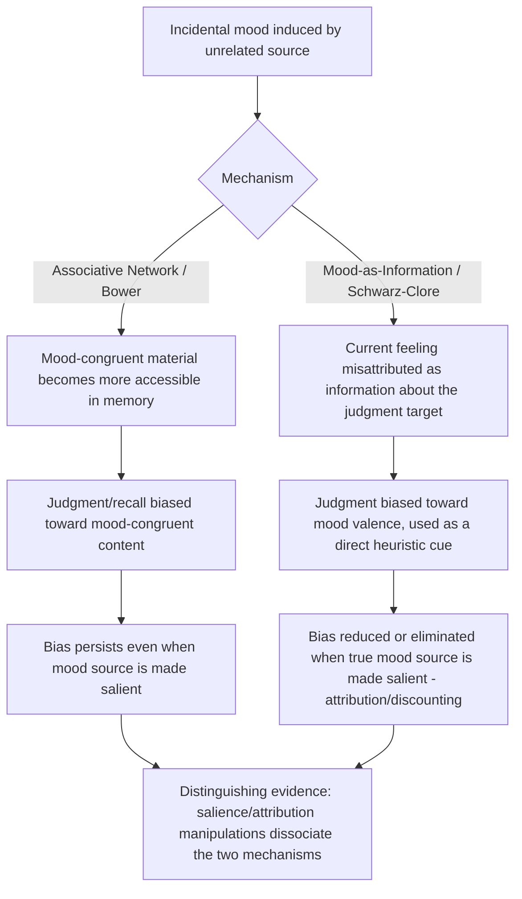

## Incidental Mood and Its Effects on Choice

### Overview

Incidental mood refers to a diffuse affective state — happy, sad, anxious, irritable — that is unrelated in origin to the decision currently being made, yet nonetheless carries over and systematically biases judgment and choice. This is the conceptual counterpart to **integral affect** (emotion generated by and directly relevant to the decision at hand, as in risk-as-feelings or somatic-marker research). The incidental mood literature asks a distinct question: if a person is simply in a good or bad mood for reasons entirely disconnected from the choice in front of them — weather, a prior unrelated event, background music, time of day — how, and through what mechanism, does that mood leak into unrelated judgments and decisions?

The foundational theoretical mechanisms are **mood-congruent judgment** (Bower, 1981, associative network theory) and the **mood-as-information hypothesis** (Schwarz & Clore, 1983, 1988), with substantial applied extension into consumer behavior, financial markets, and legal/organizational decision-making.

### Distinguishing Incidental Mood from Related Constructs

| Construct | Origin Relative to Decision | Specificity |
| --- | --- | --- |
| Incidental mood (this topic) | Unrelated to the decision; carried over from an external, prior source | Diffuse valence (good/bad), not a discrete emotion tied to a specific appraisal |
| Integral affect (risk-as-feelings) | Generated by, and directly about, the decision itself | Can be diffuse or discrete, but is decision-relevant |
| Discrete incidental emotion (Appraisal-Tendency Framework) | Unrelated to the decision, like incidental mood | Specific emotion (fear, anger, sadness) with a distinct appraisal profile, not just generic valence |
| Visceral factors | Can be either integral or incidental in origin, but defined by physiological drive-state character | Drive-specific (hunger, arousal, craving), not primarily valence-based |

**[Inference]** The key technical distinction from the Appraisal-Tendency Framework (covered under Fear, Anxiety, and Risk Perception) is granularity: classic incidental-mood research (Bower, Schwarz & Clore) generally treats mood along a single good/bad valence dimension, whereas ATF insists that discrete emotions of the *same valence* (e.g., fear vs. anger) diverge in their effects. Much of the earlier incidental-mood literature predates, and is in some respects superseded or refined by, the discrete-emotion appraisal work — though the valence-level "mood-congruent judgment" effect remains well replicated in its own right for many outcome measures.

### Mood-Congruent Judgment (Associative Network Theory)

Bower's (1981) associative network model proposes that emotions are represented as nodes in an associative memory network, linked to congruently-valenced concepts, memories, and interpretations. Activating a mood node increases the accessibility of connected material of the same valence, which then biases:

- **Recall**: People in a happy mood recall more positive autobiographical memories and material; people in a sad mood recall more negative material (mood-state-dependent memory).
- **Interpretation of ambiguous stimuli**: Ambiguous social or situational information is more likely interpreted in a mood-congruent direction (e.g., a neutral comment interpreted as friendly when happy, as hostile or dismissive when in a bad mood).
- **Judgment and evaluation**: Product evaluations, self-assessments, and probability judgments for unrelated future events shift in the direction of current mood valence.

### Mood-as-Information Hypothesis

Schwarz and Clore's (1983) mood-as-information (or "how-do-I-feel-about-it" heuristic) hypothesis offers a distinct, competing/complementary mechanism: rather than (or in addition to) biasing memory accessibility, current mood is used **directly as information** about the object of judgment itself, on the implicit (and often mistaken) inference "if I feel good/bad right now, it must be because of [the thing I'm currently evaluating]."

**Classic demonstration — the weather-and-life-satisfaction study** (Schwarz & Clore, 1983): Participants surveyed about general life satisfaction reported higher satisfaction on sunny days than rainy days. Critically, when participants were first asked about the current weather (making the true, irrelevant source of their mood salient), the weather-mood-congruence effect on life satisfaction disappeared — because participants could now correctly attribute their mood to the weather rather than misattributing it to their life circumstances. This **attribution/discounting manipulation** is the signature experimental design used to distinguish mood-as-information from a pure associative-priming account, since associative network theory does not straightforwardly predict that simply *labeling the mood's true source* would eliminate the bias.

**[Confirmed]** This misattribution mechanism is what most sharply differentiates mood-as-information from Bower's associative account: mood-as-information predicts the bias is highly sensitive to whether the true source of the mood is salient or has been "used up" as an explanation, while a pure spreading-activation account predicts the bias should persist regardless of whether the mood's source is made salient.

### Diagram: Two Mechanisms of Incidental Mood Influence

### Mood and Information-Processing Style

Beyond content-specific biasing, incidental mood is also associated with systematic shifts in **processing style**, independent of judgment content:

- **Positive mood** is associated with more heuristic, top-down, schema-driven, and holistic processing — useful for creative tasks and rapid categorization, but more susceptible to certain judgment errors (e.g., increased susceptibility to persuasive but weak arguments, greater reliance on stereotypes).
- **Negative mood** (particularly sadness) is associated with more systematic, bottom-up, detail-oriented processing — often producing *more* accurate judgments on tasks requiring careful, effortful evaluation (e.g., detecting deception, resisting certain heuristic-based judgment errors, more careful eyewitness-style scrutiny of persuasive messages).

This asymmetry is sometimes summarized as the **mood-and-processing-style hypothesis** (associated with Forgas's Affect Infusion Model, 1995), which proposes that affect's influence on judgment depends on the processing strategy the task calls for, not just on content-congruent biasing. **[Inference]** This is a genuinely distinct claim from mood-congruent judgment: mood-congruent judgment concerns the *direction* (positive/negative valence) of biased content, whereas the processing-style claim concerns *how carefully or heuristically* information is processed, and the two can interact (e.g., a happy mood might both bias content positively *and* reduce the depth of scrutiny applied to that content).

### Empirical Evidence in Applied Choice Domains

1. **Consumer product evaluation**: Numerous studies find that positive incidental mood (e.g., induced via pleasant background music, a small unexpected gift, sunny weather) increases product evaluations, willingness to pay, and purchase intentions for unrelated products, consistent with mood-congruent judgment operating in a commercial evaluation context.
2. **Financial markets and the weather effect**: A body of finance research (e.g., Saunders, 1993; Hirshleifer & Shumway, 2003) finds correlations between local weather conditions (particularly sunshine) at stock exchange locations and same-day market returns, interpreted as an incidental-mood effect on aggregate investor risk-taking and sentiment. **[Unverified]** This literature has faced replication and robustness challenges in later re-analyses using longer samples and alternative specifications, and the effect size and even the direction found in some follow-up studies have been contested; it should be presented as a debated, not settled, empirical finding.
3. **Legal and organizational judgment**: Incidental mood has been examined as a factor in judicial decision-making (e.g., studies on the relationship between local outcomes such as sports results and judicial or parole-board severity), and in workplace performance evaluations, where evaluators in incidentally negative moods have been found in some studies to give harsher, more critical ratings independent of the ratee's actual performance. **[Unverified]** As with the market-weather literature, findings in this domain (particularly high-profile sports-outcome-and-judicial-decision studies) have drawn methodological critique and replication concern in subsequent work, and effect sizes reported in original studies should not be assumed to hold at the same magnitude in independent replications.
4. **Negotiation behavior**: Positive incidental mood has been associated with more cooperative, integrative negotiation strategies and higher joint outcomes in some experimental negotiation studies, consistent with the broader finding that positive mood promotes more expansive, less adversarial framing of ambiguous interpersonal situations.

### Applications

**Retail and Marketing Environment Design**

- Store atmospherics (music, lighting, scent, layout) are deliberately designed to induce positive incidental mood, on the well-supported premise that mood-congruent judgment will translate into more favorable product evaluation and increased purchase likelihood, independent of any change to the products themselves.

**Survey Methodology and Measurement**

- Awareness of mood-as-information effects has shaped best practices in survey design (e.g., life-satisfaction surveys, customer satisfaction measurement), including recommendations to control for or measure incidental mood/context (time of day, immediately preceding events) to avoid contaminating substantive judgment measures with irrelevant mood-driven variance.

**Financial Decision Support**

- Recognition of possible incidental-mood effects on trading behavior (even given the contested robustness of specific weather-market findings) has informed general behavioral-finance advice around avoiding major financial decisions during periods of strong incidental mood (whether from personal events or ambient environmental factors), similar in spirit to precommitment strategies used against visceral-factor and fear-driven decision distortions, though grounded in a different underlying mechanism.

**Workplace Evaluation Design**

- Structured, criteria-based performance evaluation protocols (as opposed to global, holistic impression-based ratings) are partly motivated by the goal of reducing the influence of an evaluator's incidental mood at the time of the review, consistent with findings that global/holistic judgments are more susceptible to mood-congruent and mood-as-information biasing than itemized, criterion-anchored assessments.

### Critiques and Boundary Conditions

- **Attribution-dependence limits generalizability**: Because mood-as-information effects are highly sensitive to whether the mood's true source is salient, real-world incidental-mood effects may be smaller or more variable than lab-induced effects, since real-world contexts often provide more (or different) attributional cues than tightly controlled lab manipulations.
- **Replication concerns in high-profile applied findings**: As noted, several widely cited applied demonstrations (market-weather effects, sports-outcome-and-judicial-severity effects) have faced substantive replication and methodological challenges in follow-up work, including concerns about researcher degrees of freedom, sample-selection issues, and effect-size inflation in original small-sample studies. These should be treated as illustrative of the *type* of effect the theory predicts, not as uncontested, settled facts.
- **Task-dependence of processing-style effects**: The claim that positive mood promotes heuristic processing and negative mood promotes systematic processing is itself moderated by task demands, individual differences, and mood intensity; it is not a universal law that negative mood always improves accuracy or that positive mood always degrades it. **[Inference]** Forgas's Affect Infusion Model explicitly builds in this task-dependence, but simplified popular summaries of the mood-processing-style literature sometimes state the relationship more absolutely than the underlying evidence supports.
- **Valence vs. discrete-emotion granularity**: As discussed above, much foundational incidental-mood work operates at the valence level (good/bad) and may miss the discrete-emotion-specific effects documented in the Appraisal-Tendency Framework; a finding attributed to "negative mood" in an older study could, under closer examination, be driven by a specific discrete emotion (e.g., sadness vs. anxiety vs. disgust) with its own distinct appraisal profile and behavioral signature.

### Measurement Approaches

- **Mood induction procedures (MIPs)**: Standardized methods for inducing incidental mood in the lab, including film clips, autobiographical recall tasks, music, weather/ambient manipulation, and false feedback on unrelated tasks (e.g., a rigged "creativity test").
- **Attribution/discounting manipulations**: The signature methodological tool for distinguishing mood-as-information from associative-network accounts, typically achieved by making the mood's true (irrelevant) source salient just before the judgment task.
- **Self-report mood scales**: Standardized instruments (e.g., PANAS — Positive and Negative Affect Schedule) used as manipulation checks to confirm the intended mood state was induced.
- **Naturalistic/archival designs**: Using naturally occurring variation (weather records, sports outcomes, time-of-day) paired with archival decision or judgment data (financial returns, judicial rulings, survey responses) — the design used in the more contested applied literature noted above, which trades experimental control for ecological validity and is correspondingly more vulnerable to confounding and replication challenges.

### Practical Implications for Choice Architecture

- Environments and processes involving consequential, unrelated-to-mood judgments (hiring decisions, judicial rulings, major purchases, medical decisions) can benefit from structural safeguards — standardized criteria, checklists, delayed decision windows, or explicit mood-attribution prompts — that reduce the likelihood that an evaluator's or decision-maker's incidental mood contaminates the judgment.
- Marketers and service-environment designers can reasonably leverage well-replicated mood-congruent judgment effects (ambiance, music, scent) to improve evaluation of their own offerings, while being aware that such effects are more securely established for direct evaluation/purchase-intention outcomes than for some of the more contested high-stakes applied findings (market returns, judicial severity).
- When citing incidental-mood effects in applied or policy contexts, particularly the market-weather and sports-judicial-severity findings, the contested replication status of these specific studies should be flagged rather than presented as settled, well-established fact.

**Next Steps**

- Mood-Congruent Judgment and Associative Network Theory (Bower)
- Mood-as-Information Hypothesis and Attribution/Discounting Effects
- Affect Infusion Model (Forgas) and Processing-Style Effects
- Appraisal-Tendency Framework: Discrete Emotions vs. Generic Mood Valence
- Fear, Anxiety, and Risk Perception
- Behavioral Finance: Sentiment and Market Anomalies
- Survey Methodology and Measurement of Subjective Well-Being
- Replication Challenges in Applied Judgment-and-Decision-Making Research