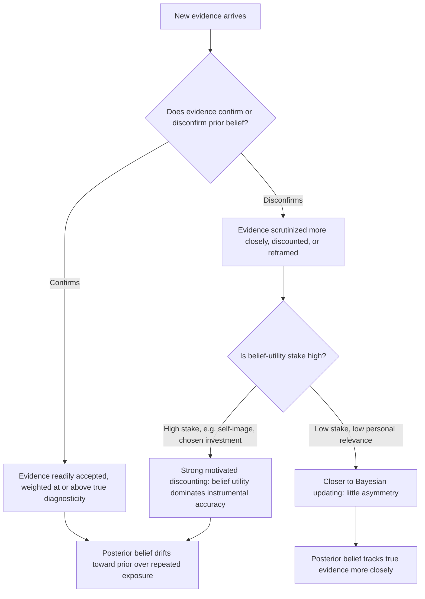

## Confirmation Bias and Motivated Belief Updating

### Overview

Confirmation bias is the tendency to search for, interpret, favor, and recall information in ways that support pre-existing beliefs or hypotheses, while under-weighting, dismissing, or failing to seek out disconfirming evidence. **Motivated belief updating** is the broader, more formally developed framework within behavioral economics that treats this tendency not merely as a cognitive processing error but as the product of a genuine *motivational* pressure: people derive utility directly from holding certain beliefs (e.g., that they are skilled, that a chosen investment was wise, that a valued political position is correct), and this "belief utility" distorts how new information is processed, sometimes in economically costly ways. This topic bridges classical cognitive-psychology work (Wason, Nickerson) with the more recent formal economic modeling of motivated reasoning (Bénabou & Tirole; Golman, Loewenstein, and colleagues), and connects directly to Bayesian updating as the normative benchmark against which the bias is defined.

### Foundational Cognitive Psychology

**Wason's Confirmation Bias (1960, 1968)**

Peter Wason's card-selection task remains the canonical demonstration. Participants are shown four cards (e.g., displaying "3," "8," "red," "brown") and given a rule to test (e.g., "if a card shows an even number, the opposite face is red"). Given the option to select cards to check the rule, the large majority of participants select cards that could *confirm* the rule (turning the "8" and "red" cards) rather than the logically necessary card that could *falsify* it (the "brown" card, which would disconfirm the rule if its opposite face were even). This demonstrated a systematic preference for confirming rather than falsifying test strategies, in direct tension with Popperian falsificationist norms of good hypothesis testing.

**Nickerson's Synthesis (1998)**

Raymond Nickerson's influential review consolidated confirmation bias into several distinguishable sub-phenomena:

- **Biased search**: Preferentially seeking evidence consistent with a prior hypothesis.
- **Biased interpretation**: Interpreting ambiguous or mixed evidence as more supportive of a prior belief than a neutral observer would.
- **Biased memory**: Better recall of belief-consistent information than belief-inconsistent information.
- **Belief perseverance**: Continuing to hold a belief even after the original evidentiary basis for it has been discredited.

**[Confirmed]** These four sub-mechanisms are not mutually exclusive and frequently co-occur within a single reasoning episode; distinguishing which mechanism is operative in a given empirical demonstration is a recurring methodological challenge in the literature.

### The Bayesian Benchmark

To formally characterize confirmation bias as a *bias* (a deviation from a normative standard), the literature typically anchors comparisons to Bayesian updating. Given a prior belief $P(H)$ and new evidence $E$, Bayes' rule specifies the normatively correct posterior:

$$P(H \mid E) = \frac{P(E \mid H) \, P(H)}{P(E)}$$

A rational Bayesian updater weighs evidence according to its diagnostic value (the likelihood ratio $P(E\mid H) / P(E \mid \neg H)$) regardless of whether that evidence confirms or disconfirms the prior. Confirmation bias, in this framework, manifests as **asymmetric updating**: overweighting evidence with a likelihood ratio favoring $H$ (confirmatory evidence) and underweighting or discounting evidence with a likelihood ratio favoring $\neg H$ (disconfirmatory evidence), relative to what the evidence's true diagnosticity warrants.

**Rabin and Schrag's (1999) formal model of confirmatory bias** operationalizes this directly: a decision-maker who receives an ambiguous signal has some probability of misclassifying a disconfirming signal as confirming (but never the reverse), producing systematically overconfident beliefs that can persist indefinitely even under continued information flow — a formal demonstration that a small, one-directional processing asymmetry, iterated over many observations, can produce large and stable belief distortion.

### Motivated Reasoning and Belief Utility

The economic contribution to this topic, distinct from the classical cognitive-bias framing, is to model belief formation itself as subject to a utility trade-off, not merely a processing limitation.

**Bénabou and Tirole's framework (2002, 2016)** treats beliefs as serving multiple functions beyond pure prediction accuracy:

1. **Instrumental/decision-relevant value**: Accurate beliefs improve the quality of future decisions.
2. **Direct hedonic/belief utility**: Certain beliefs (self-confidence, optimism about a chosen course of action, moral self-image) are directly pleasant or unpleasant to hold, independent of their instrumental value.
3. **Signaling value**: Beliefs and their public expression can serve as signals to others (or to one's future self) about one's identity, competence, or values.

**The core trade-off**: A decision-maker who could process new information accurately does not always want to, because doing so risks updating toward an unwelcome conclusion. The economically interesting result is that this trade-off produces *equilibrium* motivated distortion — not simply "people are bad at statistics," but "people rationally (in a second-order sense) choose to be worse at statistics" when the informational cost of accuracy exceeds its instrumental benefit.

**Formal sketch** (following Bénabou & Tirole and later formalizations, e.g., Golman, Hagmann & Loewenstein, 2017): Let $V(b)$ denote the direct utility of holding belief $b$, and $D(b)$ denote the instrumental cost of decision-making under a possibly inaccurate belief $b$ relative to the true state. An agent's information-processing strategy (how much to attend to, seek, or discount incoming signals) is chosen to maximize:

$$\mathbb{E}\big[V(b) - D(b)\big]$$

rather than to simply maximize the accuracy of $b$ per se. When $V(\cdot)$ is strongly increasing in a self-serving direction (e.g., belief in one's own competence) and $D(\cdot)$'s cost of inaccuracy is small or diffuse, the optimal strategy involves systematic, self-serving information distortion — this is the formal economic signature of motivated reasoning, distinguishing it from a pure information-processing-capacity limitation.

**[Inference]** This formalization is what allows motivated-belief-updating models to generate testable comparative-statics predictions (e.g., distortion should increase when $V(\cdot)$'s stakes rise, or when $D(\cdot)$'s decision-relevance falls) that a purely descriptive "confirmation bias" label does not, by itself, produce.

### Diagram: Confirmation Bias vs. Motivated Belief Updating as a Utility Trade-off

### Asymmetric Updating: Good News vs. Bad News

A substantial experimental literature (Eil & Rao, 2011; Möbius, Niederle, Niehaus & Rosenblat, 2011; Sharot, Korn & Dolan, 2011 in a neuroscience context) documents a specific, well-replicated pattern: individuals updating beliefs about their own ability, attractiveness, or future outcomes **update more strongly in response to favorable ("good news") signals than unfavorable ("bad news") signals of equal objective diagnosticity.**

- Eil and Rao (2011) find that participants receiving feedback about their own relative IQ or attractiveness ranking update close to Bayesian benchmarks for good news but show significantly attenuated, sometimes near-zero, updating for bad news — and some evidence of active belief distortion (convincing themselves bad news is less informative than it is).
- This "good-news/bad-news asymmetry" is now a standard, well-replicated finding distinguished from generic confirmation bias by its focus specifically on **self-relevant, ego-relevant belief domains** (ability, health prognosis, relationship quality) rather than abstract or impersonal hypothesis testing (as in the Wason task), where analogous asymmetries are far weaker or absent.

**[Confirmed]** This is a genuinely distinct empirical regularity from generic confirmation bias: confirmation bias (as in Wason) is about the *direction consistent with a prior hypothesis*, whereas the good-news/bad-news asymmetry is specifically about *valence relative to the self*, and the two can point in different directions depending on what the person's prior self-belief happens to be.

### Related and Overlapping Constructs

| Construct | Relationship to Confirmation Bias / Motivated Updating |
| --- | --- |
| Belief perseverance | A downstream consequence: beliefs, once formed (possibly via confirmatory search), persist even after their evidentiary basis is undermined. |
| Cognitive dissonance (Festinger) | An earlier, broader theory of motivated cognition; confirmation bias and motivated belief updating can be seen as specific, more formally modeled instances of dissonance-avoidance applied to information processing. |
| Overconfidence | A frequent *outcome* of asymmetric, self-serving belief updating, particularly the good-news/bad-news asymmetry applied to self-assessed ability. |
| Motivated skepticism (Taber & Lodge, 2006) | The specific application of motivated reasoning to politically or ideologically charged information, where counter-attitudinal evidence is scrutinized far more critically than attitude-consistent evidence of equal quality. |
| Echo chambers / selective exposure | The behavioral/media-consumption manifestation of biased search: choosing information sources and social networks that preferentially supply confirmatory content. |

### Empirical Evidence in Applied Domains

1. **Political belief polarization**: Taber and Lodge (2006) find that politically engaged participants evaluating arguments on contested issues (gun control, affirmative action) spend more time and generate more counter-arguments against attitude-*incongruent* evidence than attitude-congruent evidence of matched quality, and report *increased* confidence in their original position after exposure to mixed evidence — a polarization effect directly at odds with normative Bayesian updating, which should move beliefs of a well-calibrated updater toward consensus given the same shared evidence pool.
2. **Financial and investment decision-making**: Investors have been documented seeking out and overweighting information confirming a stock they already own (post-purchase confirmatory search), consistent with cognitive-dissonance-avoidance predictions and connecting to the disposition effect (see also Regret Theory and Disappointment Aversion) as a related self-serving-belief phenomenon in the same applied domain.
3. **Medical self-diagnosis and health behavior**: Patients researching symptoms online show documented patterns of preferentially engaging with information consistent with a preferred (often less alarming) self-diagnosis, and discounting sources suggesting a more serious condition — an applied health-communication concern connected to this literature. **[Unverified]** The magnitude and consistency of this specific pattern across different health contexts and patient populations is less uniformly established than the political-belief and self-ability-assessment literatures, and should be treated as a plausible extension rather than an equally well-replicated core finding.
4. **Organizational and managerial decision-making**: Escalation of commitment to a failing project or strategy has been linked to motivated, confirmatory processing of ambiguous project-performance signals by the decision-makers who originally championed the project, connecting this topic to the broader sunk-cost and commitment literature.

### Critiques and Boundary Conditions

- **Overuse as a catch-all explanation**: Confirmation bias is one of the most popularly invoked cognitive biases in non-academic discourse, and is frequently applied loosely to any instance of belief persistence or disagreement, without verifying that the specific sub-mechanism (biased search, biased interpretation, biased memory, or self-serving motivated updating) is actually operative in the case at hand. **[Inference]** Careful use of this topic requires specifying *which* sub-mechanism and, where relevant, *which* formal motivated-reasoning trade-off is being invoked, rather than treating "confirmation bias" as an undifferentiated single phenomenon.
- **Rational-inattention alternative explanations**: Some belief-updating asymmetries that look like motivated reasoning can alternatively be explained by rational inattention or costly information-processing models that do not require positing a direct "belief utility" term — under these models, agents optimally under-process low-stakes disconfirming signals purely due to attention costs, without any self-serving motivational component. Distinguishing rational inattention from genuinely motivated (self-serving-valence) updating empirically requires careful experimental design (e.g., varying whether the belief domain is self-relevant/ego-relevant vs. neutral), and this identification challenge is acknowledged directly in the Bénabou-Tirole and Golman-Loewenstein research programs.
- **Replication and effect-size variability**: While the core Wason-task confirmation-bias finding and the good-news/bad-news asymmetry are both well-replicated, **[Unverified]** effect sizes vary considerably across specific experimental paradigms, belief domains, and populations, and some politically-charged applied findings (e.g., specific polarization studies) have faced replication and generalizability scrutiny typical of politically sensitive social-psychology research more broadly.

### Measurement Approaches

- **Bayesian-updating deviation designs**: Comparing participants' stated posterior beliefs after receiving a signal of known objective diagnosticity against the Bayesian-rational posterior, with the good-news/bad-news paradigm (Eil & Rao; Möbius et al.) as the standard modern design for self-relevant belief domains.
- **Information-search paradigms**: Measuring which sources, arguments, or evidence types participants actively choose to view when given a choice, used to isolate the "biased search" sub-mechanism specifically (as distinct from biased interpretation of a fixed evidence set).
- **Argument-evaluation and counter-arguing tasks**: Measuring time spent and counter-arguments generated in response to congruent vs. incongruent evidence (the Taber & Lodge design), used primarily in political and ideological belief contexts.
- **Willingness-to-pay for information**: Some newer designs measure whether participants are willing to pay to *avoid* receiving informative but potentially unwelcome signals (e.g., genetic test results, ability feedback) — a direct behavioral revealed-preference measure of belief-utility-driven information avoidance, connecting to the broader "ostrich effect" / information-avoidance literature.

### Practical Implications for Choice Architecture and Institutional Design

- Structured, adversarial-review processes (red-teaming, devil's-advocate roles, pre-registered falsification criteria) are institutional responses specifically designed to counteract confirmatory search and interpretation in high-stakes group decision-making (e.g., intelligence analysis, medical diagnosis review, investment committee decisions).
- Recognizing the good-news/bad-news asymmetry has direct implications for feedback design: performance feedback, medical risk communication, and financial statements intended to correct a self-serving overconfident belief may need to be structured (framing, repetition, third-party delivery) to overcome the documented tendency to discount unfavorable self-relevant information more than favorable information of equal diagnostic value.
- Given the belief-utility trade-off framework, interventions aimed purely at *providing more information* may be insufficient where the underlying barrier is motivational (a desire to avoid an unwelcome belief) rather than a pure information deficit — this has direct relevance for the design of health, financial, and political information campaigns, where "just give people the facts" strategies frequently underperform expectations when motivated reasoning, rather than mere ignorance, is the operative barrier.

**Next Steps**

- Bayesian Updating as a Normative Benchmark in Judgment Research
- Cognitive Dissonance Theory (Festinger)
- Overconfidence and Self-Serving Bias
- Motivated Skepticism and Political Belief Polarization
- Information Avoidance and the Ostrich Effect
- Escalation of Commitment and Sunk Cost Fallacy
- Disposition Effect in Behavioral Finance
- Rational Inattention Models of Information Processing