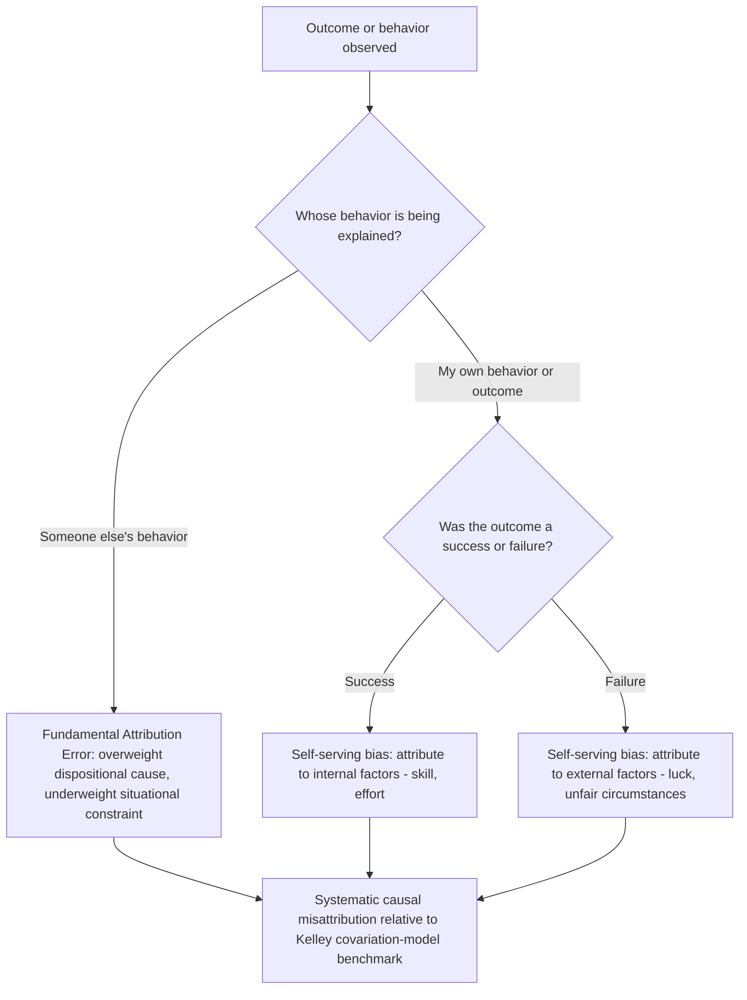

## Attribution Bias

### Overview

Attribution bias refers to systematic distortions in how people explain the causes of their own and others' behavior and outcomes, deviating from what a normatively even-handed, information-complete causal analysis would conclude. The topic originates in social psychology's **attribution theory** (Heider, 1958; Jones & Davis, 1965; Kelley, 1967) and has been substantially incorporated into behavioral economics as a mechanism underlying self-serving belief formation, discrimination in economic decision-making, principal-agent misjudgment, and persistent overconfidence. Where the previous topic (Confirmation Bias and Motivated Belief Updating) concerns *how new evidence is processed relative to a prior*, attribution bias concerns specifically *how the causes of an already-known outcome are assigned* — to the person, the situation, luck, or some other factor — and this causal-assignment process has its own distinct, well-documented systematic distortions.

### Foundational Attribution Theory

**Heider's Naive Psychology (1958)**

Fritz Heider proposed that ordinary people act as intuitive scientists, inferring the causes of behavior by distinguishing **internal (dispositional) causes** — traits, ability, effort, character — from **external (situational) causes** — circumstances, luck, task difficulty, other people's actions.

**Kelley's Covariation Model (1967)**

Harold Kelley formalized how a rational attributor *should* assign causation using three information dimensions:

- **Consensus**: Do other people behave the same way in this situation?
- **Distinctiveness**: Does this person behave this way only in this specific situation, or across many situations?
- **Consistency**: Does this person behave this way every time in this situation, or only occasionally?

Normatively, low consensus + low distinctiveness + high consistency should produce an internal (dispositional) attribution, while high consensus + high distinctiveness + low consistency should produce an external (situational) attribution. Systematic attribution bias is defined, in this framework, as a departure from the causal attribution that this covariation information would objectively warrant.

### The Fundamental Attribution Error

Ross's (1977) **Fundamental Attribution Error (FAE)** — also called the correspondence bias — is the single most cited attribution bias: the general tendency to **overweight dispositional (internal, trait-based) explanations and underweight situational explanations** when interpreting other people's behavior, even in the presence of strong, salient situational constraints.

**Classic demonstration (Jones & Harris, 1967)**: Participants read an essay either supporting or opposing Fidel Castro, and were told the essay writer had been *explicitly assigned* that position (no free choice). Despite this clear situational constraint on the writer's stated position, participants still inferred that the writer's true personal attitude was closer to the position argued in the essay — a dispositional inference persisting even when the situational cause (assignment) was made completely explicit and salient. **[Confirmed]** This "even when told" persistence is the key feature that made this finding so influential: it demonstrated the bias survives direct disconfirming situational information, not merely ambiguous cases where the true cause is genuinely unclear.

**[Inference]** The FAE is specifically about explaining *other people's* behavior; it should be distinguished from the closely related but conceptually separate self-serving attribution bias described below, which concerns explanations of *one's own* outcomes.

### The Self-Serving Attribution Bias

The **self-serving bias** in attribution (Miller & Ross, 1975, among others) is the tendency to attribute one's own **successes to internal, dispositional factors** (skill, effort, intelligence) and one's own **failures to external, situational factors** (bad luck, unfair circumstances, others' errors) — an asymmetric pattern that protects self-esteem and self-image.

**Distinguishing self-serving bias from the FAE**:

| Feature | Fundamental Attribution Error | Self-Serving Attribution Bias |
| --- | --- | --- |
| Target of attribution | Other people's behavior | One's own outcomes |
| Direction of bias | General over-weighting of dispositional causes | Asymmetric: dispositional for success, situational for failure |
| Primary proposed motivation | Perceptual/cognitive (actor is more salient than the surrounding situation to an observer) | Motivational (self-esteem/ego protection) and/or cognitive (differential information access about one's own effort and constraints) |

**[Inference]** The literature has debated the extent to which the self-serving bias is purely motivational (ego-protective) versus partly a rational, information-based artifact — since a person genuinely has better access to information about the situational constraints they personally faced (which a self-serving-bias critic would call legitimate use of private information) than an outside observer does. Careful experimental designs attempt to hold information access constant across the success/failure conditions specifically to isolate the motivational component from this information-asymmetry alternative explanation.

### Actor-Observer Asymmetry

A related and partly explanatory construct: people tend to attribute **their own** behavior more to situational factors, while attributing **others'** identical behavior more to dispositional factors (Jones & Nisbett, 1972) — this is the **actor-observer asymmetry**, and it helps explain why the FAE (an observer-side bias) and certain self-attributions (an actor-side tendency toward situational explanation, except when the outcome is a success, per self-serving bias) can coexist without contradiction.

**[Unverified]** The robustness and universality of the classic actor-observer asymmetry itself has been questioned in later meta-analytic work (e.g., Malle, 2006), which found the effect to be considerably smaller and more context-dependent than originally reported — this specific sub-finding within attribution theory should be flagged as having weaker current empirical standing than the FAE or self-serving bias more broadly.

### Diagram: Attribution Bias Map

### Economic and Applied Manifestations

1. **Overconfidence and performance persistence**: Self-serving attribution directly feeds into overconfidence: repeatedly attributing successes to skill while attributing failures to bad luck produces an inflated, poorly-calibrated sense of one's own ability over time, connecting directly to the asymmetric good-news/bad-news belief updating discussed in the Confirmation Bias topic. Barber and Odean's (2001) work on overconfident trading is frequently discussed alongside this mechanism: traders attributing past gains to their own skill (rather than favorable market conditions) may be led to overtrade and take on excess risk. **[Inference]** This is a plausible and commonly cited connective link in the literature, though isolating attribution bias specifically (versus general overconfidence from other sources) as the mechanism in the trading-overconfidence literature is methodologically difficult, and should be treated as a contributing, not sole, explanation.
2. **Managerial and organizational decision-making**: Executives and managers have been documented attributing firm successes to their own strategic decisions in shareholder letters and public statements, while attributing firm failures to external market conditions or macroeconomic factors — a pattern studied in accounting and management research on the language of corporate disclosures, sometimes termed "attributional self-enhancement" in that literature.
3. **Labor market and hiring discrimination**: Attribution bias has been examined as a contributing mechanism in discriminatory hiring and evaluation, where identical performance or behavior by members of different social groups is attributed differently (e.g., a success by an in-group member attributed to skill, an identical success by an out-group member attributed to luck or easy circumstances) — connecting attribution theory to the broader implicit-bias and statistical-discrimination literatures in labor economics. **[Unverified]** The specific causal contribution of attribution bias, as distinct from other discrimination mechanisms (statistical discrimination, taste-based discrimination, stereotype-driven category-based judgment), is difficult to cleanly isolate in field settings and remains an area where lab evidence is stronger than field-causal evidence.
4. **Principal-agent and performance evaluation contexts**: Managers evaluating subordinates' performance are subject to a version of the FAE when they overweight dispositional explanations ("she's just not a hard worker") for below-target performance without adequately accounting for situational/structural constraints (resource shortages, unclear instructions, external market conditions) — a concern that has motivated more structured, criteria-based performance evaluation systems, paralleling similar structural responses discussed under Incidental Mood.
5. **Political attitudes toward poverty and success**: A substantial applied literature examines how attribution of poverty (situational/structural causes like discrimination and lack of opportunity, versus dispositional causes like poor personal choices or lack of effort) correlates with, and is argued by some researchers to causally shape, support for redistributive social policy — an area where attribution theory directly intersects with political psychology and policy preference formation. **[Inference]** This is a well-established area of study, but the causal direction (do attribution beliefs shape policy preferences, or do prior political ideology and policy preferences shape which attributions people find congenial and adopt) is genuinely contested and likely bidirectional rather than settled in one direction.

### Relationship to Other Biases in This Chapter

| Related Bias | Relationship |
| --- | --- |
| Confirmation Bias / Motivated Belief Updating | Attribution bias can be understood as a special case of motivated reasoning applied specifically to *causal explanation* rather than to general evidence-weighting; self-serving attribution shares the same belief-utility logic as motivated updating (Bénabou-Tirole), applied to the specific question "why did this happen." |
| Overconfidence | Self-serving attribution is a commonly cited *contributing mechanism* to overconfidence, particularly in domains with repeated performance feedback (trading, entrepreneurship, academic self-assessment). |
| Hindsight Bias | Distinct but related: hindsight bias concerns overestimating, after the fact, that an outcome was predictable; attribution bias concerns *why* the outcome happened, not whether it was foreseeable. The two frequently co-occur in retrospective outcome evaluation. |
| Illusion of Control | Related to the internal-attribution-for-success pattern: both involve overestimating the causal role of one's own agency, though illusion of control is typically measured prospectively (belief in influence over future chance events) while self-serving attribution is retrospective (explaining past outcomes). |

### Critiques and Boundary Conditions

- **Cultural variability**: A substantial cross-cultural psychology literature (e.g., Miller, 1984; Choi, Nisbett & Norenzayan, 1999) finds that the strength, and in some cases the direction, of the Fundamental Attribution Error varies across cultures, with some studies finding it markedly weaker or differently patterned in more collectivist cultural contexts compared to the original, largely Western/individualist samples in which it was first documented. **[Unverified]** The precise boundary conditions and the robustness of specific cross-cultural comparative effect sizes remain an area of ongoing research rather than settled consensus, and "the FAE is universal" should not be treated as an established claim.
- **Information-asymmetry alternative explanation**: As noted above for self-serving bias, some or all of the apparent motivational bias in self-attribution may be attributable to genuine, legitimate differences in the actor's private information about situational constraints, rather than pure ego-protective motivation — well-designed studies attempt to control for this but it remains a live methodological concern across the literature.
- **Measurement and operationalization inconsistency**: Different studies operationalize "dispositional" versus "situational" attribution using varying coding schemes and self-report instruments, which can affect comparability of effect sizes across the literature and complicate meta-analytic synthesis.
- **Overuse in applied/popular discourse**: Similar to confirmation bias, "fundamental attribution error" is frequently invoked loosely in popular and organizational discourse to explain any instance of perceived unfairness in judgment, without verifying the specific covariation-information conditions (per Kelley's model) under which the bias is expected to actually manifest.

### Measurement Approaches

- **Attribution rating scales**: Standardized instruments (e.g., the Attributional Style Questionnaire, Peterson et al., 1982) that ask participants to rate the internality, stability, and globality of causes they assign to hypothetical or personally experienced positive and negative events — widely used in both attribution research and its clinical-psychology offshoot (explanatory style and depression research, e.g., Seligman's learned helplessness reformulation).
- **Vignette/scenario manipulation designs**: Systematically varying consensus, distinctiveness, and consistency information (per Kelley's covariation model) and measuring resulting dispositional vs. situational attribution ratings, used to test departures from the normative covariation-model benchmark.
- **Naturalistic text analysis**: Coding real-world attributional language in sources such as sports interviews, shareholder letters, and news coverage for internal/external and success/failure attribution patterns — used particularly in the self-serving-bias-in-organizations literature.
- **Cross-cultural comparative designs**: Replicating classic attribution paradigms (e.g., variants of the Jones & Harris essay paradigm) across culturally distinct samples to test the boundary conditions of the FAE.

### Practical Implications for Choice Architecture and Institutional Design

- Performance evaluation systems that require evaluators to explicitly document situational/structural factors alongside dispositional judgments (structured evaluation forms, mandatory situational-factor checklists) can help counteract FAE-driven over-attribution of poor performance to individual disposition in managerial and HR contexts.
- Recognizing self-serving attribution's role in overconfidence has direct relevance for financial-advising and coaching contexts: structured post-mortem review processes that separate the objective role of luck/market conditions from the individual's actual decision quality can help counteract the self-serving inflation of perceived skill after successful outcomes.
- In policy communication around poverty, health outcomes, or social inequality, awareness that attribution framing (situational/structural vs. dispositional/individual-choice) is likely to interact with pre-existing political priors (per the bidirectional-causality caveat above) suggests that attribution-based messaging strategies should not be assumed to straightforwardly and uniformly shift audience beliefs, and should be tested for the specific audience and context rather than assumed effective by default.

**Next Steps**

- Kelley's Covariation Model of Causal Attribution
- Confirmation Bias and Motivated Belief Updating
- Overconfidence and Self-Serving Bias
- Illusion of Control
- Hindsight Bias
- Cross-Cultural Variation in Cognitive and Attributional Biases
- Explanatory Style and Learned Helplessness (Seligman)
- Statistical vs. Taste-Based Discrimination in Labor Economics